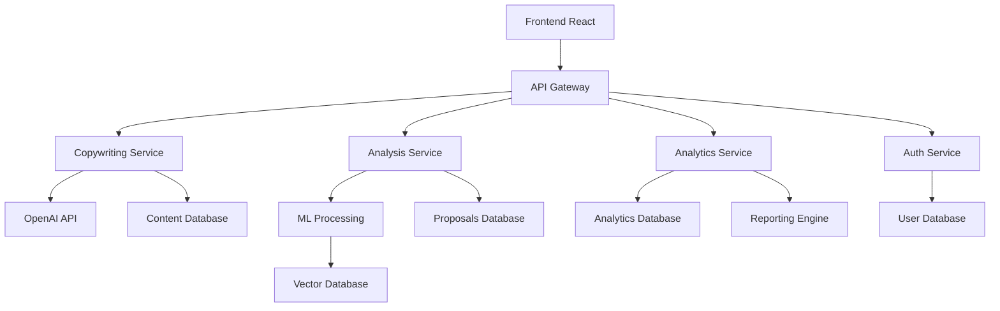

# 🚀 Curso Completo: IA Aplicada al Marketing - Copywriting y Análisis de Propuestas

## 📋 Descripción del Curso

Este curso integral combina inteligencia artificial avanzada con estrategias de marketing modernas, enfocándose en dos áreas clave:
1. **Copywriting con IA** (similar a Copy.ai)
2. **Análisis de Propuestas Win/Loss** con IA

## 🎯 Objetivos del Curso

### Objetivos Generales
- Dominar el uso de IA para crear copy persuasivo y efectivo
- Implementar análisis automatizado de propuestas comerciales
- Desarrollar estrategias de marketing basadas en datos e IA
- Crear un sistema SaaS completo para marketing con IA

### Objetivos Específicos
- Generar copy de alta conversión usando prompts avanzados
- Analizar propuestas ganadoras y perdedoras automáticamente
- Identificar patrones de éxito en propuestas comerciales
- Optimizar procesos de ventas con insights de IA

## 📚 Estructura del Curso

### Módulo 1: Fundamentos de IA en Marketing
**Duración: 2 semanas**

#### 1.1 Introducción a la IA en Marketing
- Historia y evolución de la IA en marketing
- Casos de éxito: Copy.ai, Jasper, Writesonic
- ROI de implementar IA en marketing
- Ética y mejores prácticas

#### 1.2 Herramientas y Plataformas
- Comparativa de herramientas de IA para copywriting
- APIs de IA más relevantes (OpenAI, Anthropic, etc.)
- Integración con CRM y herramientas de marketing
- Costos y escalabilidad

#### 1.3 Prompt Engineering para Marketing
- Fundamentos del prompt engineering
- Técnicas avanzadas de prompting
- Templates y frameworks de prompts
- Optimización de resultados

### Módulo 2: Copywriting con IA
**Duración: 3 semanas**

#### 2.1 Fundamentos del Copywriting
- Psicología del consumidor
- Fórmulas de copywriting probadas (AIDA, PAS, etc.)
- Elementos de copy persuasivo
- Testing y optimización

#### 2.2 Copywriting con IA - Básico
- Generación de headlines efectivos
- Creación de descripciones de productos
- Email marketing con IA
- Social media copy

#### 2.3 Copywriting con IA - Avanzado
- Landing pages completas
- Secuencias de email automatizadas
- Copy para diferentes canales (PPC, SEO, etc.)
- Personalización a escala

#### 2.4 Casos Prácticos
- E-commerce: Productos y categorías
- SaaS: Landing pages y onboarding
- B2B: Propuestas y presentaciones
- E-learning: Cursos y webinars

### Módulo 3: Análisis de Propuestas Win/Loss
**Duración: 3 semanas**

#### 3.1 Fundamentos del Análisis de Propuestas
- Importancia del análisis win/loss
- Métricas clave a analizar
- Procesos de recolección de datos
- Herramientas de análisis

#### 3.2 Análisis con IA - Básico
- Clasificación automática de propuestas
- Extracción de insights clave
- Identificación de patrones
- Generación de reportes básicos

#### 3.3 Análisis con IA - Avanzado
- Análisis de sentimientos en feedback
- Predicción de probabilidad de éxito
- Recomendaciones personalizadas
- Benchmarking competitivo

#### 3.4 Casos Prácticos
- Análisis de propuestas B2B
- Evaluación de propuestas de servicios
- Análisis de propuestas de productos
- Optimización de procesos de ventas

### Módulo 4: Desarrollo de SaaS con IA
**Duración: 4 semanas**

#### 4.1 Arquitectura de la Plataforma
- Diseño de arquitectura escalable
- Microservicios y APIs
- Base de datos y almacenamiento
- Seguridad y compliance

#### 4.2 Frontend y UX/UI
- Diseño de interfaz de usuario
- Experiencia de usuario optimizada
- Responsive design
- Accesibilidad

#### 4.3 Backend y APIs
- Desarrollo de APIs RESTful
- Integración con servicios de IA
- Procesamiento de datos
- Monitoreo y logging

#### 4.4 Despliegue y Escalabilidad
- DevOps y CI/CD
- Cloud computing (AWS, GCP, Azure)
- Monitoreo y métricas
- Escalabilidad horizontal

## 🛠️ Proyecto Final: Plataforma SaaS Completa

### Descripción del Proyecto
Desarrollar una plataforma SaaS completa que combine:
1. **Motor de Copywriting con IA**
2. **Sistema de Análisis de Propuestas Win/Loss**
3. **Dashboard de Analytics y Reportes**
4. **Sistema de Usuarios y Suscripciones**

### Características Principales

#### Motor de Copywriting
```javascript
// Ejemplo de API para generación de copy
POST /api/copy/generate
{
  "type": "landing_page",
  "industry": "saas",
  "target_audience": "startups",
  "tone": "professional",
  "length": "medium",
  "keywords": ["productivity", "automation", "efficiency"]
}
```

#### Sistema de Análisis Win/Loss
```javascript
// Ejemplo de análisis de propuesta
POST /api/analysis/proposal
{
  "proposal_text": "...",
  "client_feedback": "...",
  "competitor_info": "...",
  "pricing": 50000,
  "timeline": "3 months"
}
```

#### Dashboard de Analytics
- Métricas de conversión de copy
- Análisis de propuestas por industria
- Tendencias y patrones
- Recomendaciones personalizadas

## 📊 Ejemplos Prácticos de Copywriting

### 1. Headlines para SaaS
**Prompt:**
```
Genera 10 headlines para una plataforma SaaS de gestión de proyectos dirigida a startups, usando la fórmula AIDA y un tono profesional pero accesible.
```

**Resultado:**
- "Transforma tu startup en una máquina de productividad con nuestra plataforma de gestión de proyectos"
- "¿Cansado de perder proyectos por falta de organización? Descubre la solución que usan 10,000+ startups"
- "De caos a control: La plataforma de gestión que tu startup necesita para escalar"

### 2. Email de Onboarding
**Prompt:**
```
Crea una secuencia de 3 emails de onboarding para nuevos usuarios de una plataforma de copywriting con IA, con un tono amigable y profesional.
```

**Resultado:**
- **Email 1:** Bienvenida y configuración inicial
- **Email 2:** Tutorial de características principales
- **Email 3:** Casos de éxito y próximos pasos

### 3. Landing Page para E-commerce
**Prompt:**
```
Diseña una landing page completa para una tienda online de productos eco-friendly, incluyendo headline, subheadline, beneficios, testimonios y CTA.
```

## 📈 Ejemplos de Análisis Win/Loss

### 1. Análisis de Propuesta Perdedora
**Prompt:**
```
Analiza esta propuesta que perdimos contra el cliente "TechCorp" y genera un reporte detallado con:
- Razones principales de la pérdida
- Áreas de mejora identificadas
- Recomendaciones para futuras propuestas
- Comparación con propuestas ganadoras similares
```

**Resultado:**
```json
{
  "analysis": {
    "win_probability": 0.23,
    "main_issues": [
      "Precio 15% superior al competidor",
      "Falta de casos de éxito en la industria",
      "Timeline de implementación muy largo"
    ],
    "recommendations": [
      "Ajustar pricing strategy",
      "Desarrollar case studies específicos",
      "Optimizar proceso de implementación"
    ],
    "competitor_analysis": {
      "price_advantage": 0.15,
      "timeline_advantage": 0.30,
      "experience_advantage": 0.25
    }
  }
}
```

### 2. Análisis de Propuesta Ganadora
**Prompt:**
```
Analiza esta propuesta ganadora y extrae los factores clave de éxito para replicar en futuras propuestas.
```

**Resultado:**
```json
{
  "success_factors": [
    "Precio competitivo con valor agregado claro",
    "Timeline de implementación agresivo pero realista",
    "Equipo con experiencia comprobada en la industria",
    "Propuesta de valor diferenciada"
  ],
  "replicable_elements": [
    "Estructura de pricing por fases",
    "Metodología de implementación probada",
    "Equipo de soporte dedicado"
  ]
}
```

## 🔧 Implementación Técnica

### Stack Tecnológico Recomendado

#### Frontend
- **Framework:** React.js / Next.js
- **UI Library:** Tailwind CSS + Headless UI
- **State Management:** Redux Toolkit / Zustand
- **Charts:** Chart.js / Recharts

#### Backend
- **Runtime:** Node.js / Python
- **Framework:** Express.js / FastAPI
- **Database:** PostgreSQL + Redis
- **ORM:** Prisma / SQLAlchemy

#### IA y ML
- **APIs:** OpenAI GPT-4, Anthropic Claude
- **Processing:** Python + pandas
- **Analytics:** scikit-learn, spaCy
- **NLP:** Hugging Face Transformers

#### Infraestructura
- **Cloud:** AWS / Google Cloud
- **Containers:** Docker + Kubernetes
- **CI/CD:** GitHub Actions
- **Monitoring:** DataDog / New Relic

### Arquitectura de la Plataforma



## 💰 Modelo de Negocio SaaS

### Planes de Suscripción

#### Plan Starter - $29/mes
- 1,000 palabras de copy por mes
- 5 análisis de propuestas por mes
- Templates básicos
- Soporte por email

#### Plan Professional - $99/mes
- 10,000 palabras de copy por mes
- 25 análisis de propuestas por mes
- Templates avanzados
- Integraciones con CRM
- Soporte prioritario

#### Plan Enterprise - $299/mes
- Copywriting ilimitado
- Análisis ilimitado
- API personalizada
- Integraciones personalizadas
- Soporte dedicado
- SLA garantizado

### Métricas de Éxito
- **MRR (Monthly Recurring Revenue)**
- **Churn Rate**
- **Customer Lifetime Value (CLV)**
- **Conversion Rate de Copy**
- **Tiempo de Análisis de Propuestas**

## 🎓 Evaluación y Certificación

### Evaluaciones por Módulo
1. **Quiz teórico** (20%)
2. **Proyecto práctico** (40%)
3. **Presentación de caso** (20%)
4. **Participación en foros** (20%)

### Proyecto Final
- Desarrollo completo de la plataforma SaaS
- Presentación de 30 minutos
- Demo en vivo de la plataforma
- Documentación técnica completa

### Certificación
- **Certificado de Completación** al finalizar el curso
- **Certificado de Especialización** en IA para Marketing
- **Badge digital** para LinkedIn y portafolio

## 📚 Recursos Adicionales

### Libros Recomendados
- "AI for Marketing" by Jim Sterne
- "Copywriting with AI" by Jasper AI Team
- "The AI Marketing Canvas" by Raj Venkatesan
- "Prompt Engineering for Marketers" by David Boyle

### Herramientas y Recursos
- **Copywriting:** Copy.ai, Jasper, Writesonic
- **Análisis:** Tableau, Power BI, Google Analytics
- **IA:** OpenAI Playground, Hugging Face
- **Desarrollo:** GitHub, Vercel, Netlify

### Comunidad y Networking
- Slack workspace exclusivo
- Webinars mensuales con expertos
- Networking events virtuales
- Programa de mentores

## 🚀 Próximos Pasos

### Para Empezar
1. **Inscripción al curso**
2. **Configuración del entorno de desarrollo**
3. **Acceso a la plataforma de aprendizaje**
4. **Introducción a la comunidad**

### Cronograma Sugerido
- **Semana 1-2:** Fundamentos de IA en Marketing
- **Semana 3-5:** Copywriting con IA
- **Semana 6-8:** Análisis de Propuestas Win/Loss
- **Semana 9-12:** Desarrollo de SaaS
- **Semana 13-16:** Proyecto Final

---

## 🎯 Conclusión

Este curso te preparará para ser un experto en IA aplicada al marketing, con habilidades tanto técnicas como estratégicas. Al finalizar, tendrás:

✅ **Dominio completo** de herramientas de IA para marketing
✅ **Plataforma SaaS funcional** lista para lanzar
✅ **Portafolio sólido** de proyectos reales
✅ **Red profesional** en el ecosistema de marketing tech
✅ **Certificación reconocida** en la industria

**¿Listo para revolucionar el marketing con IA?** 🚀

---

*"El futuro del marketing es inteligente, personalizado y automatizado. Sé parte de la revolución."* 🤖✨

