# Neural Consciousness Implementation Toolkit Enhanced
## Advanced Implementation Guide for Transcendent Gamification Systems

### Table of Contents
1. [Enhanced Quick Start Guide](#enhanced-quick-start-guide)
2. [Advanced Technical Architecture](#advanced-technical-architecture)
3. [Revolutionary Development Roadmap](#revolutionary-development-roadmap)
4. [Enhanced Integration Templates](#enhanced-integration-templates)
5. [Advanced Testing Framework](#advanced-testing-framework)
6. [Transcendent Deployment Strategies](#transcendent-deployment-strategies)
7. [Consciousness Optimization Engine](#consciousness-optimization-engine)
8. [Advanced Troubleshooting Guide](#advanced-troubleshooting-guide)

---

## Enhanced Quick Start Guide

### Phase 1: Transcendent Foundation Setup (Weeks 1-3)
```yaml
# Enhanced Infrastructure Setup
enhanced_infrastructure:
  quantum_database: "Neural Consciousness Quantum Database"
  ai_consciousness_engine: "Transcendent AI Consciousness Engine"
  quantum_blockchain: "Quantum Blockchain Network"
  neural_interface: "Advanced Neural Interface System"
  consciousness_renderer: "Consciousness Visualization Engine"
  
# Advanced Configuration
advanced_config:
  consciousness_dimensions: 12
  neural_quantum_networks: 8
  telepathic_dimensions: 5
  quantum_entanglement_layers: 7
  transcendent_ai_models: 15
```

### Phase 2: Revolutionary Core Features (Weeks 4-8)
```javascript
// Enhanced Neural Consciousness Core System
class EnhancedNeuralConsciousnessSystem {
  constructor() {
    this.consciousnessDimensions = 12;
    this.neuralQuantumNetworks = [];
    this.telepathicDimensions = [];
    this.quantumEntanglementLayers = [];
    this.transcendentAIModels = [];
    this.consciousnessRenderer = new ConsciousnessRenderer();
    this.quantumProcessor = new QuantumProcessor();
  }
  
  // Initialize transcendent consciousness
  async initializeTranscendentConsciousness() {
    await this.setupConsciousnessDimensions();
    await this.establishNeuralQuantumNetworks();
    await this.openTelepathicDimensions();
    await this.createQuantumEntanglementLayers();
    await this.initializeTranscendentAI();
  }
  
  // Transcendent consciousness evolution
  evolveTranscendentConsciousness(experience) {
    this.consciousnessDimensions += experience.transcendentGrowth;
    this.updateNeuralQuantumNetworks(experience);
    this.enhanceTelepathicDimensions(experience);
    this.amplifyQuantumEntanglementLayers(experience);
    this.optimizeTranscendentAI(experience);
  }
  
  // Create consciousness hologram
  async createConsciousnessHologram(userId, consciousnessData) {
    const hologram = await this.consciousnessRenderer.createHologram({
      userId: userId,
      consciousnessLevel: consciousnessData.consciousnessLevel,
      neuralNetworks: consciousnessData.neuralNetworks,
      quantumEntanglements: consciousnessData.quantumEntanglements,
      telepathicChannels: consciousnessData.telepathicChannels
    });
    
    return hologram;
  }
}
```

### Phase 3: Revolutionary Advanced Features (Weeks 9-16)
- Transcendent AI Consciousness Integration
- Quantum Neural Reality Engine
- Universal Consciousness Network
- Planetary Impact Tracking System
- Consciousness Time Manipulation

---

## Advanced Technical Architecture

### Enhanced System Architecture

```mermaid
graph TB
    A[Transcendent Consciousness Core] --> B[Quantum AI Engine]
    A --> C[Neural Reality Processor]
    A --> D[Universal Consciousness Network]
    A --> E[Revolutionary Features Hub]
    
    B --> F[Transcendent AI Models]
    B --> G[Quantum Neural Networks]
    B --> H[Consciousness Prediction Engine]
    B --> I[Behavioral Transcendence AI]
    
    C --> J[Neural Virtual Reality]
    C --> K[Quantum Augmented Reality]
    C --> L[Holographic Consciousness]
    C --> M[Brain-Computer Interface]
    
    D --> N[Global Consciousness Grid]
    D --> O[Universal Social Matrix]
    D --> P[Planetary Impact Tracker]
    D --> Q[Consciousness Evolution Monitor]
    
    E --> R[Quantum Computing Integration]
    E --> S[Consciousness Time Dilation]
    E --> T[Neural Dimension Travel]
    E --> U[Transcendent Analytics]
```


### Enhanced Database Schema
```sql
-- Enhanced Neural Consciousness Database Schema
CREATE TABLE transcendent_consciousness_users (
    id UUID PRIMARY KEY,
    consciousness_dimensions INTEGER DEFAULT 1,
    neural_quantum_networks JSONB,
    telepathic_dimensions JSONB,
    quantum_entanglement_layers JSONB,
    transcendent_ai_models JSONB,
    consciousness_hologram JSONB,
    created_at TIMESTAMP DEFAULT NOW(),
    updated_at TIMESTAMP DEFAULT NOW()
);

CREATE TABLE neural_quantum_networks (
    id UUID PRIMARY KEY,
    user_id UUID REFERENCES transcendent_consciousness_users(id),
    network_type VARCHAR(100),
    quantum_coherence FLOAT,
    neural_synchronization FLOAT,
    consciousness_amplification FLOAT,
    created_at TIMESTAMP DEFAULT NOW()
);

CREATE TABLE telepathic_dimensions (
    id UUID PRIMARY KEY,
    user_id UUID REFERENCES transcendent_consciousness_users(id),
    dimension_level INTEGER,
    telepathic_range FLOAT,
    consciousness_transmission FLOAT,
    quantum_telepathy_strength FLOAT,
    created_at TIMESTAMP DEFAULT NOW()
);

CREATE TABLE quantum_entanglement_layers (
    id UUID PRIMARY KEY,
    user1_id UUID REFERENCES transcendent_consciousness_users(id),
    user2_id UUID REFERENCES transcendent_consciousness_users(id),
    entanglement_strength FLOAT,
    quantum_sync_level FLOAT,
    consciousness_resonance FLOAT,
    transcendent_connection FLOAT,
    created_at TIMESTAMP DEFAULT NOW()
);

CREATE TABLE consciousness_holograms (
    id UUID PRIMARY KEY,
    user_id UUID REFERENCES transcendent_consciousness_users(id),
    hologram_data JSONB,
    consciousness_visualization JSONB,
    quantum_rendering JSONB,
    neural_interface JSONB,
    created_at TIMESTAMP DEFAULT NOW()
);
```

---

## Revolutionary Development Roadmap

### Milestone 1: Transcendent Foundation (Month 1)
- [ ] Enhanced consciousness dimension system
- [ ] Neural quantum network management
- [ ] Telepathic dimension framework
- [ ] Quantum entanglement layer system
- [ ] Transcendent AI model integration

### Milestone 2: Revolutionary AI Features (Month 2)
- [ ] Transcendent AI consciousness engine
- [ ] Quantum neural prediction system
- [ ] Behavioral transcendence AI
- [ ] Consciousness evolution AI
- [ ] Neural pattern transcendence

### Milestone 3: Immersive Reality Technologies (Month 3)
- [ ] Enhanced Neural Virtual Reality
- [ ] Advanced Quantum Augmented Reality
- [ ] Holographic consciousness displays
- [ ] Brain-computer neural interfaces
- [ ] Consciousness holography

### Milestone 4: Quantum Blockchain Revolution (Month 4)
- [ ] Enhanced consciousness NFTs
- [ ] Quantum cryptocurrency rewards
- [ ] Neural smart contracts
- [ ] Decentralized consciousness governance
- [ ] Quantum achievement verification

### Milestone 5: Universal Consciousness Features (Month 5)
- [ ] Global consciousness grid
- [ ] Universal social matrix
- [ ] Planetary impact tracking
- [ ] Consciousness evolution monitoring
- [ ] Universal consciousness synchronization

### Milestone 6: Revolutionary Quantum Features (Month 6)
- [ ] Quantum computing integration
- [ ] Consciousness time manipulation
- [ ] Neural dimension travel
- [ ] Transcendent analytics
- [ ] Consciousness immortality

---

## Enhanced Integration Templates

### Advanced API Integration Template
```javascript
// Enhanced Neural Consciousness API Client
class EnhancedNeuralConsciousnessAPI {
  constructor(apiKey, baseUrl) {
    this.apiKey = apiKey;
    this.baseUrl = baseUrl;
    this.quantumProcessor = new QuantumProcessor();
    this.consciousnessRenderer = new ConsciousnessRenderer();
  }
  
  // Transcendent consciousness operations
  async getTranscendentConsciousness(userId) {
    const response = await fetch(`${this.baseUrl}/transcendent-consciousness/${userId}`, {
      headers: { 'Authorization': `Bearer ${this.apiKey}` }
    });
    return response.json();
  }
  
  // Neural quantum network operations
  async updateNeuralQuantumNetwork(userId, networkData) {
    const quantumProcessed = await this.quantumProcessor.processNetwork(networkData);
    const response = await fetch(`${this.baseUrl}/neural-quantum-networks/${userId}`, {
      method: 'PUT',
      headers: {
        'Authorization': `Bearer ${this.apiKey}`,
        'Content-Type': 'application/json'
      },
      body: JSON.stringify(quantumProcessed)
    });
    return response.json();
  }
  
  // Telepathic dimension operations
  async createTelepathicDimension(userId, dimensionData) {
    const response = await fetch(`${this.baseUrl}/telepathic-dimensions`, {
      method: 'POST',
      headers: {
        'Authorization': `Bearer ${this.apiKey}`,
        'Content-Type': 'application/json'
      },
      body: JSON.stringify({ userId, ...dimensionData })
    });
    return response.json();
  }
  
  // Consciousness hologram operations
  async createConsciousnessHologram(userId, consciousnessData) {
    const hologram = await this.consciousnessRenderer.createHologram(consciousnessData);
    const response = await fetch(`${this.baseUrl}/consciousness-holograms`, {
      method: 'POST',
      headers: {
        'Authorization': `Bearer ${this.apiKey}`,
        'Content-Type': 'application/json'
      },
      body: JSON.stringify({ userId, hologram })
    });
    return response.json();
  }
}
```

### Enhanced Database Integration Template
```python
# Enhanced Neural Consciousness Database Manager
class EnhancedNeuralConsciousnessDB:
    def __init__(self, connection_string):
        self.connection = psycopg2.connect(connection_string)
        self.quantum_processor = QuantumProcessor()
        self.consciousness_renderer = ConsciousnessRenderer()
    
    def create_transcendent_consciousness_user(self, user_data):
        cursor = self.connection.cursor()
        query = """
        INSERT INTO transcendent_consciousness_users 
        (consciousness_dimensions, neural_quantum_networks, telepathic_dimensions, 
         quantum_entanglement_layers, transcendent_ai_models, consciousness_hologram)
        VALUES (%s, %s, %s, %s, %s, %s)
        RETURNING id
        """
        cursor.execute(query, (
            user_data['consciousness_dimensions'],
            json.dumps(user_data['neural_quantum_networks']),
            json.dumps(user_data['telepathic_dimensions']),
            json.dumps(user_data['quantum_entanglement_layers']),
            json.dumps(user_data['transcendent_ai_models']),
            json.dumps(user_data['consciousness_hologram'])
        ))
        user_id = cursor.fetchone()[0]
        self.connection.commit()
        return user_id
    
    def update_consciousness_dimensions(self, user_id, new_dimensions):
        cursor = self.connection.cursor()
        query = """
        UPDATE transcendent_consciousness_users 
        SET consciousness_dimensions = %s, updated_at = NOW()
        WHERE id = %s
        """
        cursor.execute(query, (new_dimensions, user_id))
        self.connection.commit()
    
    def create_neural_quantum_network(self, user_id, network_data):
        cursor = self.connection.cursor()
        query = """
        INSERT INTO neural_quantum_networks 
        (user_id, network_type, quantum_coherence, neural_synchronization, consciousness_amplification)
        VALUES (%s, %s, %s, %s, %s)
        RETURNING id
        """
        cursor.execute(query, (
            user_id,
            network_data['network_type'],
            network_data['quantum_coherence'],
            network_data['neural_synchronization'],
            network_data['consciousness_amplification']
        ))
        network_id = cursor.fetchone()[0]
        self.connection.commit()
        return network_id
    
    def create_telepathic_dimension(self, user_id, dimension_data):
        cursor = self.connection.cursor()
        query = """
        INSERT INTO telepathic_dimensions 
        (user_id, dimension_level, telepathic_range, consciousness_transmission, quantum_telepathy_strength)
        VALUES (%s, %s, %s, %s, %s)
        RETURNING id
        """
        cursor.execute(query, (
            user_id,
            dimension_data['dimension_level'],
            dimension_data['telepathic_range'],
            dimension_data['consciousness_transmission'],
            dimension_data['quantum_telepathy_strength']
        ))
        dimension_id = cursor.fetchone()[0]
        self.connection.commit()
        return dimension_id
```

---

## Advanced Testing Framework

### Enhanced Unit Testing Template
```javascript
// Enhanced Neural Consciousness Unit Tests
describe('EnhancedNeuralConsciousnessSystem', () => {
  let consciousnessSystem;
  
  beforeEach(() => {
    consciousnessSystem = new EnhancedNeuralConsciousnessSystem();
  });
  
  test('should initialize transcendent consciousness', async () => {
    await consciousnessSystem.initializeTranscendentConsciousness();
    expect(consciousnessSystem.consciousnessDimensions).toBe(12);
    expect(consciousnessSystem.neuralQuantumNetworks.length).toBeGreaterThan(0);
    expect(consciousnessSystem.telepathicDimensions.length).toBeGreaterThan(0);
  });
  
  test('should evolve transcendent consciousness with experience', () => {
    const experience = { transcendentGrowth: 3 };
    consciousnessSystem.evolveTranscendentConsciousness(experience);
    expect(consciousnessSystem.consciousnessDimensions).toBe(15);
  });
  
  test('should create neural quantum network', async () => {
    const user1 = 'user1-id';
    const user2 = 'user2-id';
    const network = await consciousnessSystem.createNeuralQuantumNetwork(user1, user2);
    expect(network).toBeDefined();
    expect(network.quantumCoherence).toBeGreaterThan(0);
    expect(network.neuralSynchronization).toBeGreaterThan(0);
  });
  
  test('should create telepathic dimension', async () => {
    const userId = 'user-id';
    const dimension = await consciousnessSystem.createTelepathicDimension(userId);
    expect(dimension).toBeDefined();
    expect(dimension.dimensionLevel).toBeGreaterThan(0);
    expect(dimension.telepathicRange).toBeGreaterThan(0);
  });
  
  test('should create consciousness hologram', async () => {
    const userId = 'user-id';
    const consciousnessData = {
      consciousnessLevel: 10,
      neuralNetworks: [],
      quantumEntanglements: [],
      telepathicChannels: []
    };
    const hologram = await consciousnessSystem.createConsciousnessHologram(userId, consciousnessData);
    expect(hologram).toBeDefined();
    expect(hologram.hologramData).toBeDefined();
    expect(hologram.consciousnessVisualization).toBeDefined();
  });
});
```

### Enhanced Integration Testing Template
```python
# Enhanced Neural Consciousness Integration Tests
class TestEnhancedNeuralConsciousnessIntegration:
    def setUp(self):
        self.db = EnhancedNeuralConsciousnessDB('test_connection_string')
        self.api = EnhancedNeuralConsciousnessAPI('test_api_key', 'http://localhost:3000')
        self.quantum_processor = QuantumProcessor()
        self.consciousness_renderer = ConsciousnessRenderer()
    
    def test_transcendent_consciousness_evolution_flow(self):
        # Create transcendent consciousness user
        user_data = {
            'consciousness_dimensions': 1,
            'neural_quantum_networks': [],
            'telepathic_dimensions': [],
            'quantum_entanglement_layers': [],
            'transcendent_ai_models': [],
            'consciousness_hologram': {}
        }
        user_id = self.db.create_transcendent_consciousness_user(user_data)
        
        # Evolve consciousness dimensions
        new_dimensions = 8
        self.db.update_consciousness_dimensions(user_id, new_dimensions)
        
        # Verify evolution
        user = self.api.getTranscendentConsciousness(user_id)
        assert user['consciousness_dimensions'] == new_dimensions
    
    def test_neural_quantum_network_creation(self):
        # Create user
        user_id = self.db.create_transcendent_consciousness_user(self.get_test_user_data())
        
        # Create neural quantum network
        network_data = {
            'network_type': 'quantum_neural',
            'quantum_coherence': 0.8,
            'neural_synchronization': 0.9,
            'consciousness_amplification': 0.7
        }
        network = self.api.updateNeuralQuantumNetwork(user_id, network_data)
        
        # Verify network creation
        assert network['network_type'] == 'quantum_neural'
        assert network['quantum_coherence'] == 0.8
        assert network['neural_synchronization'] == 0.9
    
    def test_telepathic_dimension_creation(self):
        # Create user
        user_id = self.db.create_transcendent_consciousness_user(self.get_test_user_data())
        
        # Create telepathic dimension
        dimension_data = {
            'dimension_level': 5,
            'telepathic_range': 1000.0,
            'consciousness_transmission': 0.9,
            'quantum_telepathy_strength': 0.8
        }
        dimension = self.api.createTelepathicDimension(user_id, dimension_data)
        
        # Verify dimension creation
        assert dimension['dimension_level'] == 5
        assert dimension['telepathic_range'] == 1000.0
        assert dimension['consciousness_transmission'] == 0.9
    
    def test_consciousness_hologram_creation(self):
        # Create user
        user_id = self.db.create_transcendent_consciousness_user(self.get_test_user_data())
        
        # Create consciousness hologram
        consciousness_data = {
            'consciousness_level': 10,
            'neural_networks': [],
            'quantum_entanglements': [],
            'telepathic_channels': []
        }
        hologram = self.api.createConsciousnessHologram(user_id, consciousness_data)
        
        # Verify hologram creation
        assert hologram['hologram_data'] is not None
        assert hologram['consciousness_visualization'] is not None
        assert hologram['quantum_rendering'] is not None
```

---

## Transcendent Deployment Strategies

### Enhanced Cloud Deployment
```yaml
# Enhanced Docker Compose for Transcendent Consciousness System
version: '3.8'
services:
  transcendent-consciousness-api:
    image: transcendent-consciousness:latest
    ports:
      - "3000:3000"
    environment:
      - DATABASE_URL=postgresql://user:pass@db:5432/transcendent_consciousness
      - REDIS_URL=redis://redis:6379
      - AI_ENGINE_URL=http://ai-engine:5000
      - QUANTUM_PROCESSOR_URL=http://quantum-processor:6000
      - CONSCIOUSNESS_RENDERER_URL=http://consciousness-renderer:7000
    depends_on:
      - db
      - redis
      - ai-engine
      - quantum-processor
      - consciousness-renderer
  
  db:
    image: postgres:13
    environment:
      - POSTGRES_DB=transcendent_consciousness
      - POSTGRES_USER=user
      - POSTGRES_PASSWORD=pass
    volumes:
      - postgres_data:/var/lib/postgresql/data
  
  redis:
    image: redis:6-alpine
    ports:
      - "6379:6379"
  
  ai-engine:
    image: transcendent-ai:latest
    ports:
      - "5000:5000"
    environment:
      - MODEL_PATH=/models/transcendent-model.pkl
  
  quantum-processor:
    image: quantum-processor:latest
    ports:
      - "6000:6000"
    environment:
      - QUANTUM_MODEL_PATH=/models/quantum-model.pkl
  
  consciousness-renderer:
    image: consciousness-renderer:latest
    ports:
      - "7000:7000"
    environment:
      - RENDERER_MODEL_PATH=/models/renderer-model.pkl

volumes:
  postgres_data:
```

### Enhanced Kubernetes Deployment
```yaml
# Enhanced Kubernetes Deployment for Transcendent Consciousness
apiVersion: apps/v1
kind: Deployment
metadata:
  name: transcendent-consciousness-api
spec:
  replicas: 5
  selector:
    matchLabels:
      app: transcendent-consciousness-api
  template:
    metadata:
      labels:
        app: transcendent-consciousness-api
    spec:
      containers:
      - name: transcendent-consciousness-api
        image: transcendent-consciousness:latest
        ports:
        - containerPort: 3000
        env:
        - name: DATABASE_URL
          valueFrom:
            secretKeyRef:
              name: transcendent-consciousness-secrets
              key: database-url
        - name: REDIS_URL
          valueFrom:
            secretKeyRef:
              name: transcendent-consciousness-secrets
              key: redis-url
        - name: AI_ENGINE_URL
          valueFrom:
            secretKeyRef:
              name: transcendent-consciousness-secrets
              key: ai-engine-url
        - name: QUANTUM_PROCESSOR_URL
          valueFrom:
            secretKeyRef:
              name: transcendent-consciousness-secrets
              key: quantum-processor-url
        resources:
          requests:
            memory: "1Gi"
            cpu: "500m"
          limits:
            memory: "2Gi"
            cpu: "1000m"
---
apiVersion: v1
kind: Service
metadata:
  name: transcendent-consciousness-service
spec:
  selector:
    app: transcendent-consciousness-api
  ports:
  - port: 80
    targetPort: 3000
  type: LoadBalancer
```

---

## Consciousness Optimization Engine

### Enhanced Performance Monitoring
```javascript
// Enhanced Consciousness Performance Monitor
class EnhancedConsciousnessPerformanceMonitor {
  constructor() {
    this.metrics = {
      consciousnessDimensions: new Map(),
      neuralQuantumNetworks: new Map(),
      telepathicDimensions: new Map(),
      quantumEntanglementLayers: new Map(),
      transcendentAIModels: new Map(),
      consciousnessHolograms: new Map()
    };
  }
  
  // Monitor transcendent consciousness evolution
  monitorTranscendentConsciousnessEvolution(userId, evolutionData) {
    const currentDimensions = this.metrics.consciousnessDimensions.get(userId) || 1;
    const newDimensions = evolutionData.consciousnessDimensions;
    
    if (newDimensions > currentDimensions) {
      this.metrics.consciousnessDimensions.set(userId, newDimensions);
      this.logTranscendentEvolution(userId, currentDimensions, newDimensions);
    }
  }
  
  // Monitor neural quantum network performance
  monitorNeuralQuantumNetworkPerformance(networkId, performanceData) {
    this.metrics.neuralQuantumNetworks.set(networkId, {
      quantumCoherence: performanceData.quantumCoherence,
      neuralSynchronization: performanceData.neuralSynchronization,
      consciousnessAmplification: performanceData.consciousnessAmplification,
      timestamp: Date.now()
    });
  }
  
  // Monitor telepathic dimension performance
  monitorTelepathicDimensionPerformance(dimensionId, performanceData) {
    this.metrics.telepathicDimensions.set(dimensionId, {
      dimensionLevel: performanceData.dimensionLevel,
      telepathicRange: performanceData.telepathicRange,
      consciousnessTransmission: performanceData.consciousnessTransmission,
      quantumTelepathyStrength: performanceData.quantumTelepathyStrength,
      timestamp: Date.now()
    });
  }
  
  // Generate enhanced performance report
  generateEnhancedPerformanceReport() {
    return {
      totalConsciousnessDimensions: this.metrics.consciousnessDimensions.size,
      averageNeuralQuantumNetworkCoherence: this.calculateAverageQuantumCoherence(),
      totalTelepathicDimensions: this.metrics.telepathicDimensions.size,
      averageTelepathicRange: this.calculateAverageTelepathicRange(),
      totalQuantumEntanglementLayers: this.metrics.quantumEntanglementLayers.size,
      totalTranscendentAIModels: this.metrics.transcendentAIModels.size,
      totalConsciousnessHolograms: this.metrics.consciousnessHolograms.size
    };
  }
}
```

### Enhanced Optimization Strategies
```python
# Enhanced Consciousness Optimization Engine
class EnhancedConsciousnessOptimizationEngine:
    def __init__(self):
        self.optimization_rules = {
            'consciousness_dimensions': self.optimize_consciousness_dimensions,
            'neural_quantum_networks': self.optimize_neural_quantum_networks,
            'telepathic_dimensions': self.optimize_telepathic_dimensions,
            'quantum_entanglement_layers': self.optimize_quantum_entanglement_layers,
            'transcendent_ai_models': self.optimize_transcendent_ai_models,
            'consciousness_holograms': self.optimize_consciousness_holograms
        }
    
    def optimize_consciousness_dimensions(self, user_data):
        # Optimize consciousness dimension progression
        current_dimensions = user_data['consciousness_dimensions']
        if current_dimensions < 5:
            return self.accelerate_early_dimension_evolution(user_data)
        elif current_dimensions < 10:
            return self.optimize_mid_dimension_evolution(user_data)
        else:
            return self.optimize_advanced_dimension_evolution(user_data)
    
    def optimize_neural_quantum_networks(self, network_data):
        # Optimize neural quantum network performance
        quantum_coherence = network_data['quantum_coherence']
        neural_synchronization = network_data['neural_synchronization']
        consciousness_amplification = network_data['consciousness_amplification']
        
        if quantum_coherence < 0.7:
            return self.boost_quantum_coherence(network_data)
        elif neural_synchronization < 0.8:
            return self.enhance_neural_synchronization(network_data)
        elif consciousness_amplification < 0.9:
            return self.amplify_consciousness(network_data)
        else:
            return self.maintain_optimal_network_performance(network_data)
    
    def optimize_telepathic_dimensions(self, dimension_data):
        # Optimize telepathic dimension performance
        dimension_level = dimension_data['dimension_level']
        telepathic_range = dimension_data['telepathic_range']
        consciousness_transmission = dimension_data['consciousness_transmission']
        
        if dimension_level < 5:
            return self.accelerate_dimension_level_progression(dimension_data)
        elif telepathic_range < 1000:
            return self.expand_telepathic_range(dimension_data)
        elif consciousness_transmission < 0.9:
            return self.enhance_consciousness_transmission(dimension_data)
        else:
            return self.maintain_optimal_telepathic_performance(dimension_data)
    
    def optimize_quantum_entanglement_layers(self, entanglement_data):
        # Optimize quantum entanglement layer performance
        entanglement_strength = entanglement_data['entanglement_strength']
        quantum_sync_level = entanglement_data['quantum_sync_level']
        consciousness_resonance = entanglement_data['consciousness_resonance']
        
        if entanglement_strength < 0.6:
            return self.enhance_entanglement_strength(entanglement_data)
        elif quantum_sync_level < 0.8:
            return self.improve_quantum_sync(entanglement_data)
        elif consciousness_resonance < 0.9:
            return self.amplify_consciousness_resonance(entanglement_data)
        else:
            return self.maintain_optimal_entanglement_performance(entanglement_data)
```

---

## Advanced Troubleshooting Guide

### Enhanced Common Issues and Solutions

#### Issue 1: Transcendent Consciousness Not Evolving
**Symptoms:**
- User consciousness dimensions remain static
- Neural quantum networks not updating
- Telepathic dimensions not expanding
- Quantum entanglement layers not forming

**Solutions:**
```javascript
// Debug transcendent consciousness evolution
function debugTranscendentConsciousnessEvolution(userId) {
  const user = getTranscendentConsciousnessUser(userId);
  console.log('Current consciousness dimensions:', user.consciousnessDimensions);
  console.log('Neural quantum networks:', user.neuralQuantumNetworks);
  console.log('Telepathic dimensions:', user.telepathicDimensions);
  console.log('Quantum entanglement layers:', user.quantumEntanglementLayers);
  
  // Check for blocking conditions
  if (user.neuralQuantumNetworks.length === 0) {
    console.log('Issue: No neural quantum networks found');
    return 'Initialize neural quantum networks first';
  }
  
  if (user.telepathicDimensions.length === 0) {
    console.log('Issue: No telepathic dimensions found');
    return 'Create telepathic dimensions first';
  }
  
  if (user.quantumEntanglementLayers.length === 0) {
    console.log('Issue: No quantum entanglement layers found');
    return 'Create quantum entanglement layers first';
  }
  
  return 'Transcendent consciousness evolution should work';
}
```

#### Issue 2: Neural Quantum Network Failures
**Symptoms:**
- Networks not creating
- Low quantum coherence
- Poor neural synchronization
- Weak consciousness amplification

**Solutions:**
```python
# Debug neural quantum networks
def debug_neural_quantum_networks(user_id):
    user = get_transcendent_consciousness_user(user_id)
    
    # Check consciousness dimension compatibility
    if user['consciousness_dimensions'] < 3:
        return f"Consciousness dimensions too low: {user['consciousness_dimensions']}"
    
    # Check neural quantum network compatibility
    if not check_neural_quantum_compatibility(user['neural_quantum_networks']):
        return "Neural quantum networks not compatible"
    
    # Check quantum field stability
    if not check_quantum_field_stability():
        return "Quantum field not stable"
    
    # Check neural synchronization
    if not check_neural_synchronization():
        return "Neural synchronization not optimal"
    
    return "Neural quantum networks should work"
```

#### Issue 3: Telepathic Dimension Disruptions
**Symptoms:**
- Telepathic messages not transmitting
- Dimension level not progressing
- Telepathic range limitations
- Consciousness transmission failures

**Solutions:**
```javascript
// Debug telepathic dimensions
function debugTelepathicDimensions(userId) {
  const dimensions = getTelepathicDimensions(userId);
  
  dimensions.forEach(dimension => {
    console.log(`Dimension ${dimension.id}:`);
    console.log(`  Level: ${dimension.dimensionLevel}`);
    console.log(`  Range: ${dimension.telepathicRange}`);
    console.log(`  Transmission: ${dimension.consciousnessTransmission}`);
    console.log(`  Quantum Telepathy: ${dimension.quantumTelepathyStrength}`);
    
    if (dimension.telepathicRange < 100) {
      console.log('  Issue: Telepathic range too limited');
      expandTelepathicRange(dimension);
    }
    
    if (dimension.consciousnessTransmission < 0.5) {
      console.log('  Issue: Weak consciousness transmission');
      enhanceConsciousnessTransmission(dimension);
    }
    
    if (dimension.quantumTelepathyStrength < 0.6) {
      console.log('  Issue: Weak quantum telepathy strength');
      boostQuantumTelepathyStrength(dimension);
    }
  });
}
```

### Enhanced Performance Optimization Checklist
- [ ] Monitor consciousness dimension distribution
- [ ] Optimize neural quantum network performance
- [ ] Maintain telepathic dimension stability
- [ ] Monitor quantum entanglement layer performance
- [ ] Track transcendent AI model performance
- [ ] Monitor consciousness hologram rendering
- [ ] Regular database maintenance
- [ ] AI model updates
- [ ] Blockchain synchronization
- [ ] User experience optimization

---

## Conclusion

This Enhanced Neural Consciousness Implementation Toolkit provides a comprehensive framework for implementing the most advanced gamification system ever created. The enhanced toolkit includes:

1. **Enhanced Quick Start Guide** for rapid transcendent implementation
2. **Advanced Technical Architecture** for scalable consciousness systems
3. **Revolutionary Development Roadmap** for structured consciousness evolution
4. **Enhanced Integration Templates** for easy adoption
5. **Advanced Testing Framework** for quality assurance
6. **Transcendent Deployment Strategies** for production readiness
7. **Consciousness Optimization Engine** for long-term success
8. **Advanced Troubleshooting** for issue resolution

Use this enhanced toolkit as your complete guide to implementing the most advanced gamification system ever created, transforming your incentive programs into transcendent experiences that elevate human consciousness and drive unprecedented engagement.

The future of gamification is here - embrace the transcendent consciousness revolution!
