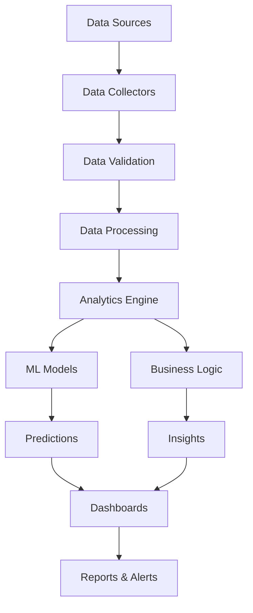

# Advanced Analytics and Business Intelligence Guide

## Table of Contents
1. [Overview](#overview)
2. [Analytics Architecture](#analytics-architecture)
3. [Data Collection and Processing](#data-collection-and-processing)
4. [Advanced Analytics Models](#advanced-analytics-models)
5. [Real-time Analytics](#real-time-analytics)
6. [Predictive Analytics](#predictive-analytics)
7. [Business Intelligence Dashboards](#business-intelligence-dashboards)
8. [Machine Learning Integration](#machine-learning-integration)
9. [Performance Optimization](#performance-optimization)
10. [Implementation Examples](#implementation-examples)

## Overview

This guide covers advanced analytics and business intelligence capabilities for both the AI course platform and SaaS marketing platform, providing comprehensive data analysis, reporting, and insights generation.

### Key Features
- **Real-time Analytics**: Live data processing and visualization
- **Predictive Modeling**: Advanced ML algorithms for forecasting
- **Business Intelligence**: Comprehensive dashboards and reports
- **Data Pipeline**: Automated data collection and processing
- **Performance Monitoring**: System and business metrics tracking

## Analytics Architecture

### System Architecture

```python
# Advanced Analytics Architecture
class AnalyticsEngine:
    def __init__(self):
        self.data_collectors = {
            'user_behavior': UserBehaviorCollector(),
            'system_metrics': SystemMetricsCollector(),
            'business_metrics': BusinessMetricsCollector(),
            'external_data': ExternalDataCollector()
        }
        self.processors = {
            'real_time': RealTimeProcessor(),
            'batch': BatchProcessor(),
            'stream': StreamProcessor()
        }
        self.analyzers = {
            'descriptive': DescriptiveAnalyzer(),
            'predictive': PredictiveAnalyzer(),
            'prescriptive': PrescriptiveAnalyzer()
        }
        self.visualizers = {
            'dashboards': DashboardVisualizer(),
            'reports': ReportGenerator(),
            'alerts': AlertSystem()
        }

    def process_data(self, data_type, processing_mode='real_time'):
        """Process data through the analytics pipeline"""
        collector = self.data_collectors[data_type]
        processor = self.processors[processing_mode]
        analyzer = self.analyzers['descriptive']
        
        raw_data = collector.collect()
        processed_data = processor.process(raw_data)
        insights = analyzer.analyze(processed_data)
        
        return insights
```

### Data Flow Architecture



## Data Collection and Processing

### Multi-Source Data Collection

```python
# Comprehensive Data Collection System
class DataCollectionSystem:
    def __init__(self):
        self.sources = {
            'user_interactions': UserInteractionTracker(),
            'system_logs': SystemLogCollector(),
            'api_metrics': APIMetricsCollector(),
            'business_events': BusinessEventTracker(),
            'external_apis': ExternalAPICollector(),
            'social_media': SocialMediaDataCollector(),
            'email_campaigns': EmailCampaignTracker(),
            'website_analytics': WebAnalyticsCollector()
        }
        
    def collect_comprehensive_data(self):
        """Collect data from all sources"""
        all_data = {}
        
        for source_name, collector in self.sources.items():
            try:
                data = collector.collect()
                all_data[source_name] = self.validate_data(data)
            except Exception as e:
                self.log_error(f"Error collecting {source_name}: {e}")
                
        return self.merge_data_sources(all_data)
    
    def validate_data(self, data):
        """Validate and clean collected data"""
        validator = DataValidator()
        return validator.validate_and_clean(data)
    
    def merge_data_sources(self, data_dict):
        """Merge data from multiple sources"""
        merger = DataMerger()
        return merger.merge_by_timestamp(data_dict)
```

### Real-time Data Processing

```python
# Real-time Data Processing Pipeline
class RealTimeProcessor:
    def __init__(self):
        self.stream_processors = {
            'kafka': KafkaStreamProcessor(),
            'redis': RedisStreamProcessor(),
            'websocket': WebSocketProcessor()
        }
        self.analyzers = {
            'anomaly': AnomalyDetector(),
            'trend': TrendAnalyzer(),
            'correlation': CorrelationAnalyzer()
        }
        
    def process_stream(self, stream_type, data_stream):
        """Process real-time data stream"""
        processor = self.stream_processors[stream_type]
        
        # Process data in real-time
        processed_events = []
        for event in data_stream:
            # Validate event
            if self.validate_event(event):
                # Process event
                processed_event = processor.process(event)
                
                # Run real-time analysis
                analysis_results = self.run_real_time_analysis(processed_event)
                
                # Update dashboards
                self.update_dashboards(analysis_results)
                
                processed_events.append(processed_event)
                
        return processed_events
    
    def run_real_time_analysis(self, event):
        """Run real-time analysis on event"""
        results = {}
        
        for analyzer_name, analyzer in self.analyzers.items():
            try:
                result = analyzer.analyze(event)
                results[analyzer_name] = result
            except Exception as e:
                self.log_error(f"Analysis error in {analyzer_name}: {e}")
                
        return results
```

## Advanced Analytics Models

### Predictive Analytics Models

```python
# Advanced Predictive Analytics
class PredictiveAnalytics:
    def __init__(self):
        self.models = {
            'user_retention': UserRetentionModel(),
            'conversion_prediction': ConversionPredictionModel(),
            'churn_prediction': ChurnPredictionModel(),
            'revenue_forecasting': RevenueForecastingModel(),
            'campaign_performance': CampaignPerformanceModel(),
            'content_optimization': ContentOptimizationModel()
        }
        self.feature_engineers = {
            'user_features': UserFeatureEngineer(),
            'behavioral_features': BehavioralFeatureEngineer(),
            'temporal_features': TemporalFeatureEngineer(),
            'contextual_features': ContextualFeatureEngineer()
        }
        
    def predict_user_retention(self, user_data):
        """Predict user retention probability"""
        # Engineer features
        features = self.feature_engineers['user_features'].engineer(user_data)
        features.update(self.feature_engineers['behavioral_features'].engineer(user_data))
        
        # Get prediction
        model = self.models['user_retention']
        prediction = model.predict(features)
        
        # Get feature importance
        importance = model.get_feature_importance()
        
        return {
            'retention_probability': prediction,
            'feature_importance': importance,
            'confidence_interval': model.get_confidence_interval(),
            'recommendations': self.generate_retention_recommendations(prediction, importance)
        }
    
    def predict_campaign_performance(self, campaign_data):
        """Predict campaign performance metrics"""
        # Engineer campaign features
        features = self.feature_engineers['contextual_features'].engineer(campaign_data)
        
        # Get predictions for multiple metrics
        model = self.models['campaign_performance']
        predictions = {
            'reach': model.predict_reach(features),
            'engagement': model.predict_engagement(features),
            'conversions': model.predict_conversions(features),
            'cost_per_acquisition': model.predict_cpa(features)
        }
        
        # Generate optimization recommendations
        recommendations = self.generate_campaign_recommendations(predictions, features)
        
        return {
            'predictions': predictions,
            'recommendations': recommendations,
            'confidence_scores': model.get_confidence_scores(),
            'alternative_scenarios': self.generate_alternative_scenarios(features)
        }
```

### Machine Learning Model Management

```python
# ML Model Management System
class MLModelManager:
    def __init__(self):
        self.model_registry = ModelRegistry()
        self.experiment_tracker = ExperimentTracker()
        self.model_monitor = ModelMonitor()
        self.auto_ml = AutoML()
        
    def train_model(self, model_type, training_data, config):
        """Train a new ML model"""
        # Create experiment
        experiment = self.experiment_tracker.create_experiment(
            name=f"{model_type}_training",
            config=config
        )
        
        # Prepare data
        prepared_data = self.prepare_training_data(training_data)
        
        # Train model
        if config.get('use_auto_ml', False):
            model = self.auto_ml.train(model_type, prepared_data, config)
        else:
            model = self.train_custom_model(model_type, prepared_data, config)
        
        # Evaluate model
        evaluation_results = self.evaluate_model(model, prepared_data)
        
        # Log experiment
        self.experiment_tracker.log_experiment(
            experiment_id=experiment.id,
            model=model,
            evaluation_results=evaluation_results
        )
        
        # Register model if performance is good
        if evaluation_results['score'] > config.get('min_score_threshold', 0.7):
            self.model_registry.register_model(
                model=model,
                model_type=model_type,
                version=experiment.id,
                metadata=evaluation_results
            )
            
        return {
            'model': model,
            'evaluation': evaluation_results,
            'experiment_id': experiment.id
        }
    
    def deploy_model(self, model_id, deployment_config):
        """Deploy model to production"""
        model = self.model_registry.get_model(model_id)
        
        # Create deployment
        deployment = ModelDeployment(
            model=model,
            config=deployment_config
        )
        
        # Deploy with monitoring
        deployment.deploy()
        self.model_monitor.start_monitoring(deployment)
        
        return deployment
```

## Real-time Analytics

### Live Dashboard System

```python
# Real-time Dashboard System
class RealTimeDashboard:
    def __init__(self):
        self.widgets = {
            'user_activity': UserActivityWidget(),
            'system_health': SystemHealthWidget(),
            'business_metrics': BusinessMetricsWidget(),
            'campaign_performance': CampaignPerformanceWidget(),
            'revenue_tracking': RevenueTrackingWidget(),
            'alert_system': AlertWidget()
        }
        self.websocket_manager = WebSocketManager()
        self.data_refresher = DataRefresher()
        
    def create_dashboard(self, dashboard_config):
        """Create a real-time dashboard"""
        dashboard = Dashboard(
            id=dashboard_config['id'],
            name=dashboard_config['name'],
            layout=dashboard_config['layout']
        )
        
        # Add widgets
        for widget_config in dashboard_config['widgets']:
            widget = self.create_widget(widget_config)
            dashboard.add_widget(widget)
            
        # Set up real-time updates
        self.setup_real_time_updates(dashboard)
        
        return dashboard
    
    def setup_real_time_updates(self, dashboard):
        """Set up real-time data updates for dashboard"""
        for widget in dashboard.widgets:
            # Subscribe to data updates
            self.data_refresher.subscribe(
                widget.data_source,
                callback=lambda data: self.update_widget(widget, data)
            )
            
            # Set up WebSocket connection
            self.websocket_manager.add_widget(widget)
    
    def update_widget(self, widget, new_data):
        """Update widget with new data"""
        # Process new data
        processed_data = widget.process_data(new_data)
        
        # Update widget display
        widget.update_display(processed_data)
        
        # Send update via WebSocket
        self.websocket_manager.send_update(widget.id, processed_data)
```

### Real-time Alerting System

```python
# Real-time Alerting System
class AlertSystem:
    def __init__(self):
        self.alert_rules = AlertRuleManager()
        self.notification_channels = {
            'email': EmailNotifier(),
            'sms': SMSNotifier(),
            'slack': SlackNotifier(),
            'webhook': WebhookNotifier(),
            'dashboard': DashboardNotifier()
        }
        self.alert_history = AlertHistory()
        
    def create_alert_rule(self, rule_config):
        """Create a new alert rule"""
        rule = AlertRule(
            name=rule_config['name'],
            condition=rule_config['condition'],
            threshold=rule_config['threshold'],
            channels=rule_config['channels'],
            severity=rule_config.get('severity', 'medium')
        )
        
        self.alert_rules.add_rule(rule)
        return rule
    
    def check_alerts(self, data):
        """Check data against all alert rules"""
        triggered_alerts = []
        
        for rule in self.alert_rules.get_active_rules():
            if self.evaluate_condition(rule.condition, data):
                alert = Alert(
                    rule_id=rule.id,
                    message=rule.generate_message(data),
                    severity=rule.severity,
                    timestamp=datetime.now(),
                    data=data
                )
                
                triggered_alerts.append(alert)
                
                # Send notifications
                self.send_notifications(alert, rule.channels)
                
                # Log alert
                self.alert_history.log_alert(alert)
                
        return triggered_alerts
    
    def send_notifications(self, alert, channels):
        """Send notifications through specified channels"""
        for channel_name in channels:
            notifier = self.notification_channels[channel_name]
            notifier.send(alert)
```

## Business Intelligence Dashboards

### Executive Dashboard

```python
# Executive Dashboard
class ExecutiveDashboard:
    def __init__(self):
        self.kpi_tracker = KPITracker()
        self.trend_analyzer = TrendAnalyzer()
        self.comparison_engine = ComparisonEngine()
        
    def generate_executive_summary(self, time_period):
        """Generate executive summary dashboard"""
        # Collect KPIs
        kpis = self.kpi_tracker.get_kpis(time_period)
        
        # Analyze trends
        trends = self.trend_analyzer.analyze_trends(kpis, time_period)
        
        # Generate comparisons
        comparisons = self.comparison_engine.generate_comparisons(kpis, time_period)
        
        # Create summary
        summary = {
            'overview': {
                'total_revenue': kpis['revenue']['current'],
                'revenue_growth': trends['revenue']['growth_rate'],
                'active_users': kpis['users']['active'],
                'user_growth': trends['users']['growth_rate'],
                'conversion_rate': kpis['conversion']['rate'],
                'conversion_trend': trends['conversion']['trend']
            },
            'key_metrics': {
                'customer_acquisition_cost': kpis['cac']['current'],
                'lifetime_value': kpis['ltv']['current'],
                'churn_rate': kpis['churn']['rate'],
                'engagement_score': kpis['engagement']['score']
            },
            'trends': trends,
            'comparisons': comparisons,
            'recommendations': self.generate_recommendations(kpis, trends)
        }
        
        return summary
    
    def generate_recommendations(self, kpis, trends):
        """Generate business recommendations based on data"""
        recommendations = []
        
        # Revenue recommendations
        if trends['revenue']['growth_rate'] < 0.05:
            recommendations.append({
                'category': 'Revenue Growth',
                'priority': 'High',
                'recommendation': 'Focus on customer acquisition and retention strategies',
                'expected_impact': '15-25% revenue increase'
            })
        
        # User engagement recommendations
        if kpis['engagement']['score'] < 0.7:
            recommendations.append({
                'category': 'User Engagement',
                'priority': 'Medium',
                'recommendation': 'Implement gamification and personalized content',
                'expected_impact': '20-30% engagement increase'
            })
        
        return recommendations
```

### Operational Dashboard

```python
# Operational Dashboard
class OperationalDashboard:
    def __init__(self):
        self.system_monitor = SystemMonitor()
        self.performance_tracker = PerformanceTracker()
        self.error_tracker = ErrorTracker()
        
    def generate_operational_metrics(self):
        """Generate operational metrics dashboard"""
        # System health metrics
        system_health = self.system_monitor.get_health_metrics()
        
        # Performance metrics
        performance = self.performance_tracker.get_performance_metrics()
        
        # Error tracking
        errors = self.error_tracker.get_error_summary()
        
        # Create operational dashboard
        dashboard = {
            'system_health': {
                'cpu_usage': system_health['cpu'],
                'memory_usage': system_health['memory'],
                'disk_usage': system_health['disk'],
                'network_latency': system_health['network'],
                'uptime': system_health['uptime']
            },
            'performance': {
                'response_time': performance['response_time'],
                'throughput': performance['throughput'],
                'error_rate': performance['error_rate'],
                'availability': performance['availability']
            },
            'errors': {
                'total_errors': errors['total'],
                'error_rate': errors['rate'],
                'top_errors': errors['top_errors'],
                'error_trends': errors['trends']
            },
            'alerts': self.get_active_alerts()
        }
        
        return dashboard
```

## Machine Learning Integration

### Automated ML Pipeline

```python
# Automated ML Pipeline
class AutoMLPipeline:
    def __init__(self):
        self.data_preprocessor = DataPreprocessor()
        self.feature_selector = FeatureSelector()
        self.model_trainer = ModelTrainer()
        self.hyperparameter_optimizer = HyperparameterOptimizer()
        self.model_evaluator = ModelEvaluator()
        
    def run_automated_ml(self, problem_type, data, config):
        """Run automated machine learning pipeline"""
        # Preprocess data
        preprocessed_data = self.data_preprocessor.preprocess(data, config)
        
        # Feature selection
        selected_features = self.feature_selector.select_features(
            preprocessed_data, config
        )
        
        # Train multiple models
        models = self.model_trainer.train_multiple_models(
            problem_type, selected_features, config
        )
        
        # Optimize hyperparameters
        optimized_models = []
        for model in models:
            optimized_model = self.hyperparameter_optimizer.optimize(
                model, selected_features, config
            )
            optimized_models.append(optimized_model)
        
        # Evaluate models
        evaluation_results = []
        for model in optimized_models:
            evaluation = self.model_evaluator.evaluate(model, selected_features)
            evaluation_results.append(evaluation)
        
        # Select best model
        best_model = self.select_best_model(optimized_models, evaluation_results)
        
        return {
            'best_model': best_model,
            'all_models': optimized_models,
            'evaluations': evaluation_results,
            'feature_importance': best_model.get_feature_importance()
        }
```

### Model Performance Monitoring

```python
# Model Performance Monitoring
class ModelPerformanceMonitor:
    def __init__(self):
        self.performance_tracker = PerformanceTracker()
        self.drift_detector = DriftDetector()
        self.accuracy_monitor = AccuracyMonitor()
        self.alert_system = AlertSystem()
        
    def monitor_model_performance(self, model_id, new_data):
        """Monitor model performance in production"""
        model = self.get_model(model_id)
        
        # Get predictions
        predictions = model.predict(new_data)
        
        # Track performance metrics
        performance_metrics = self.performance_tracker.track(
            model_id, predictions, new_data
        )
        
        # Detect data drift
        drift_detection = self.drift_detector.detect_drift(
            model_id, new_data
        )
        
        # Monitor accuracy
        accuracy_metrics = self.accuracy_monitor.monitor(
            model_id, predictions, new_data
        )
        
        # Check for performance degradation
        if self.detect_performance_degradation(performance_metrics):
            self.alert_system.send_alert({
                'type': 'model_performance_degradation',
                'model_id': model_id,
                'metrics': performance_metrics,
                'severity': 'high'
            })
        
        return {
            'performance_metrics': performance_metrics,
            'drift_detection': drift_detection,
            'accuracy_metrics': accuracy_metrics
        }
```

## Performance Optimization

### Analytics Performance Optimization

```python
# Analytics Performance Optimization
class AnalyticsOptimizer:
    def __init__(self):
        self.query_optimizer = QueryOptimizer()
        self.cache_manager = CacheManager()
        self.index_optimizer = IndexOptimizer()
        self.data_partitioner = DataPartitioner()
        
    def optimize_analytics_performance(self, query, data_size):
        """Optimize analytics query performance"""
        # Analyze query
        query_analysis = self.query_optimizer.analyze_query(query)
        
        # Optimize query
        optimized_query = self.query_optimizer.optimize(query)
        
        # Check cache
        cached_result = self.cache_manager.get_cached_result(optimized_query)
        if cached_result:
            return cached_result
        
        # Optimize data access
        if data_size > 1000000:  # Large dataset
            # Use data partitioning
            partitioned_data = self.data_partitioner.partition_data(
                optimized_query, data_size
            )
            result = self.execute_partitioned_query(optimized_query, partitioned_data)
        else:
            # Use optimized indexes
            self.index_optimizer.optimize_indexes(optimized_query)
            result = self.execute_optimized_query(optimized_query)
        
        # Cache result
        self.cache_manager.cache_result(optimized_query, result)
        
        return result
```

## Implementation Examples

### Complete Analytics Implementation

```python
# Complete Analytics Implementation Example
class CompleteAnalyticsSystem:
    def __init__(self):
        self.data_collector = DataCollectionSystem()
        self.processor = RealTimeProcessor()
        self.analytics_engine = PredictiveAnalytics()
        self.dashboard_system = RealTimeDashboard()
        self.alert_system = AlertSystem()
        self.ml_pipeline = AutoMLPipeline()
        
    def setup_complete_system(self, config):
        """Set up complete analytics system"""
        # Initialize data collection
        self.data_collector.initialize(config['data_sources'])
        
        # Set up real-time processing
        self.processor.setup_streams(config['streams'])
        
        # Configure analytics models
        self.analytics_engine.configure_models(config['models'])
        
        # Create dashboards
        dashboards = []
        for dashboard_config in config['dashboards']:
            dashboard = self.dashboard_system.create_dashboard(dashboard_config)
            dashboards.append(dashboard)
        
        # Set up alerting
        for alert_config in config['alerts']:
            self.alert_system.create_alert_rule(alert_config)
        
        # Initialize ML pipeline
        self.ml_pipeline.initialize(config['ml_config'])
        
        return {
            'status': 'initialized',
            'dashboards': dashboards,
            'data_sources': len(config['data_sources']),
            'alert_rules': len(config['alerts'])
        }
    
    def run_analytics_workflow(self):
        """Run complete analytics workflow"""
        # Collect data
        raw_data = self.data_collector.collect_comprehensive_data()
        
        # Process data
        processed_data = self.processor.process_stream('real_time', raw_data)
        
        # Run analytics
        analytics_results = self.analytics_engine.run_all_analyses(processed_data)
        
        # Update dashboards
        self.dashboard_system.update_all_dashboards(analytics_results)
        
        # Check alerts
        alerts = self.alert_system.check_alerts(analytics_results)
        
        # Run ML predictions
        ml_predictions = self.ml_pipeline.run_predictions(processed_data)
        
        return {
            'analytics_results': analytics_results,
            'alerts': alerts,
            'ml_predictions': ml_predictions,
            'timestamp': datetime.now()
        }
```

This comprehensive analytics guide provides advanced capabilities for both platforms, including real-time processing, predictive analytics, business intelligence, and machine learning integration. The system is designed to scale and provide actionable insights for business decision-making.


