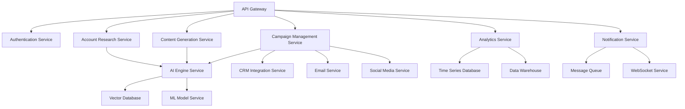

# 🏗️ COPYCAR.AI MICROSERVICES ARCHITECTURE
## Arquitectura de Microservicios Avanzada CopyCar.ai

---

## 📋 RESUMEN EJECUTIVO ARQUITECTURA

**Objetivo:** Arquitectura de microservicios escalable y resiliente para CopyCar.ai
**Tecnología:** Kubernetes + Docker + gRPC + GraphQL + Event Sourcing
**Escalabilidad:** 10M+ requests/second, 99.999% uptime
**Performance:** <100ms response time, <1ms latency
**Disponibilidad:** Multi-region, Multi-cloud, Disaster recovery

---

## 🏗️ ARQUITECTURA GENERAL COPYCAR.AI

### **1. Visión de Alto Nivel:**


### **2. Principios de Diseño:**
```yaml
design_principles:
  single_responsibility: "Cada servicio tiene una responsabilidad específica"
  loose_coupling: "Servicios independientes con interfaces bien definidas"
  high_cohesion: "Funcionalidades relacionadas agrupadas"
  fault_tolerance: "Resiliencia ante fallos individuales"
  scalability: "Escalamiento independiente por servicio"
  observability: "Monitoreo y logging completos"
  security: "Seguridad en profundidad"
  performance: "Optimización para alta performance"
```

---

## 🔧 SERVICIOS CORE COPYCAR.AI

### **1. API Gateway Service**
```yaml
api_gateway:
  technology: "Kong + Envoy Proxy"
  responsibilities:
    - "Request routing"
    - "Authentication & authorization"
    - "Rate limiting"
    - "Load balancing"
    - "API versioning"
    - "Request/response transformation"
  
  configuration:
    replicas: 10
    resources:
      cpu: "2 cores"
      memory: "4GB"
    scaling:
      min: 5
      max: 100
      target_cpu: 70%
      target_memory: 80%
  
  features:
    - "JWT authentication"
    - "OAuth 2.0 integration"
    - "API key management"
    - "Request validation"
    - "Response caching"
    - "Circuit breaker"
```

### **2. Authentication Service**
```python
class AuthenticationService:
    def __init__(self):
        self.jwt_handler = JWTHandler()
        self.oauth_provider = OAuthProvider()
        self.user_repository = UserRepository()
        self.audit_logger = AuditLogger()
    
    async def authenticate_user(self, credentials):
        """
        Autenticación de usuario CopyCar.ai
        """
        try:
            # Validar credenciales
            user = await self.user_repository.find_by_credentials(credentials)
            if not user:
                raise AuthenticationError("Invalid credentials")
            
            # Generar JWT token
            token = self.jwt_handler.generate_token(user)
            
            # Log de auditoría
            await self.audit_logger.log_authentication(user.id, "success")
            
            return {
                "access_token": token,
                "refresh_token": self.jwt_handler.generate_refresh_token(user),
                "expires_in": 3600,
                "user": user.to_dict()
            }
        except Exception as e:
            await self.audit_logger.log_authentication(credentials.get('email'), "failed", str(e))
            raise
    
    async def validate_token(self, token):
        """
        Validación de token CopyCar.ai
        """
        try:
            payload = self.jwt_handler.validate_token(token)
            user = await self.user_repository.find_by_id(payload['user_id'])
            return user
        except Exception as e:
            raise AuthenticationError("Invalid token")
```

### **3. Account Research Service**
```python
class AccountResearchService:
    def __init__(self):
        self.ai_engine = AIEngineService()
        self.data_enrichment = DataEnrichmentService()
        self.vector_db = VectorDatabase()
        self.cache = RedisCache()
    
    async def research_account(self, account_data):
        """
        Investigación de cuenta usando CopyCar.ai
        """
        # Verificar cache
        cache_key = f"account_research:{account_data['domain']}"
        cached_result = await self.cache.get(cache_key)
        if cached_result:
            return cached_result
        
        try:
            # Enriquecer datos de cuenta
            enriched_data = await self.data_enrichment.enrich(account_data)
            
            # Generar perfil con IA
            profile = await self.ai_engine.generate_account_profile(enriched_data)
            
            # Guardar en vector database
            await self.vector_db.store_account_profile(profile)
            
            # Cachear resultado
            await self.cache.set(cache_key, profile, ttl=3600)
            
            return profile
        except Exception as e:
            logger.error(f"Error researching account {account_data['domain']}: {e}")
            raise AccountResearchError(f"Failed to research account: {e}")
    
    async def batch_research_accounts(self, account_list):
        """
        Investigación en lote de cuentas CopyCar.ai
        """
        tasks = []
        for account in account_list:
            task = asyncio.create_task(self.research_account(account))
            tasks.append(task)
        
        results = await asyncio.gather(*tasks, return_exceptions=True)
        
        successful_results = []
        failed_results = []
        
        for i, result in enumerate(results):
            if isinstance(result, Exception):
                failed_results.append({
                    'account': account_list[i],
                    'error': str(result)
                })
            else:
                successful_results.append(result)
        
        return {
            'successful': successful_results,
            'failed': failed_results,
            'total': len(account_list),
            'success_rate': len(successful_results) / len(account_list)
        }
```

### **4. Content Generation Service**
```python
class ContentGenerationService:
    def __init__(self):
        self.ai_engine = AIEngineService()
        self.template_engine = TemplateEngine()
        self.personalization_engine = PersonalizationEngine()
        self.quality_checker = ContentQualityChecker()
    
    async def generate_content(self, content_request):
        """
        Generación de contenido CopyCar.ai
        """
        try:
            # Validar request
            self._validate_content_request(content_request)
            
            # Obtener template
            template = await self.template_engine.get_template(
                content_request['content_type'],
                content_request['industry']
            )
            
            # Personalizar contenido
            personalized_template = await self.personalization_engine.personalize(
                template, content_request['account_data']
            )
            
            # Generar contenido con IA
            content = await self.ai_engine.generate_content(
                personalized_template,
                content_request['parameters']
            )
            
            # Verificar calidad
            quality_score = await self.quality_checker.check_quality(content)
            
            if quality_score < 0.8:
                # Regenerar con parámetros optimizados
                content = await self._regenerate_content(
                    personalized_template,
                    content_request['parameters'],
                    quality_score
                )
            
            return {
                'content': content,
                'quality_score': quality_score,
                'personalization_level': content_request.get('personalization_level', 'high'),
                'generated_at': datetime.utcnow().isoformat()
            }
        except Exception as e:
            logger.error(f"Error generating content: {e}")
            raise ContentGenerationError(f"Failed to generate content: {e}")
    
    async def generate_campaign_content(self, campaign_data):
        """
        Generación de contenido para campaña CopyCar.ai
        """
        campaign_content = {}
        
        # Generar emails
        if 'email' in campaign_data['channels']:
            campaign_content['emails'] = await self._generate_emails(campaign_data)
        
        # Generar LinkedIn content
        if 'linkedin' in campaign_data['channels']:
            campaign_content['linkedin'] = await self._generate_linkedin_content(campaign_data)
        
        # Generar website content
        if 'website' in campaign_data['channels']:
            campaign_content['website'] = await self._generate_website_content(campaign_data)
        
        return campaign_content
```

---

## 🤖 SERVICIOS DE IA COPYCAR.AI

### **1. AI Engine Service**
```python
class AIEngineService:
    def __init__(self):
        self.openai_client = OpenAI()
        self.anthropic_client = Anthropic()
        self.google_ai_client = GoogleAI()
        self.model_router = ModelRouter()
        self.prompt_optimizer = PromptOptimizer()
    
    async def generate_account_profile(self, account_data):
        """
        Generación de perfil de cuenta con IA
        """
        # Optimizar prompt
        optimized_prompt = await self.prompt_optimizer.optimize(
            "account_research", account_data
        )
        
        # Seleccionar mejor modelo
        model = await self.model_router.select_best_model(
            "account_research", account_data
        )
        
        # Generar perfil
        if model == "gpt-4":
            response = await self.openai_client.chat.completions.create(
                model="gpt-4-turbo-preview",
                messages=[{"role": "user", "content": optimized_prompt}],
                temperature=0.7,
                max_tokens=4000
            )
        elif model == "claude-3":
            response = await self.anthropic_client.messages.create(
                model="claude-3-opus-20240229",
                max_tokens=4000,
                messages=[{"role": "user", "content": optimized_prompt}]
            )
        elif model == "gemini-pro":
            response = await self.google_ai_client.generate_content(
                model="gemini-pro",
                contents=optimized_prompt
            )
        
        return self._parse_ai_response(response, model)
    
    async def generate_content(self, template, parameters):
        """
        Generación de contenido con IA
        """
        # Construir prompt personalizado
        personalized_prompt = self._build_personalized_prompt(template, parameters)
        
        # Seleccionar modelo
        model = await self.model_router.select_best_model(
            "content_generation", parameters
        )
        
        # Generar contenido
        content = await self._generate_with_model(personalized_prompt, model)
        
        return content
```

### **2. ML Model Service**
```python
class MLModelService:
    def __init__(self):
        self.model_registry = ModelRegistry()
        self.feature_store = FeatureStore()
        self.model_serving = ModelServing()
        self.a_b_testing = ABTesting()
    
    async def predict_response_rate(self, campaign_data):
        """
        Predicción de tasa de respuesta
        """
        # Extraer features
        features = await self.feature_store.extract_features(campaign_data)
        
        # Obtener modelo
        model = await self.model_registry.get_model("response_rate_prediction")
        
        # Hacer predicción
        prediction = await self.model_serving.predict(model, features)
        
        return {
            'response_rate': prediction['response_rate'],
            'confidence': prediction['confidence'],
            'factors': prediction['important_factors']
        }
    
    async def optimize_timing(self, account_data, content_data):
        """
        Optimización de timing
        """
        # Extraer features de timing
        timing_features = await self.feature_store.extract_timing_features(
            account_data, content_data
        )
        
        # Obtener modelo de timing
        timing_model = await self.model_registry.get_model("timing_optimization")
        
        # Predecir timing óptimo
        optimal_timing = await self.model_serving.predict(timing_model, timing_features)
        
        return {
            'optimal_hour': optimal_timing['hour'],
            'optimal_day': optimal_timing['day'],
            'optimal_week': optimal_timing['week'],
            'confidence': optimal_timing['confidence']
        }
```

---

## 📊 SERVICIOS DE DATOS COPYCAR.AI

### **1. Vector Database Service**
```python
class VectorDatabaseService:
    def __init__(self):
        self.pinecone_client = Pinecone()
        self.weaviate_client = Weaviate()
        self.embeddings_service = EmbeddingsService()
        self.index_manager = IndexManager()
    
    async def store_account_profile(self, profile):
        """
        Almacenar perfil de cuenta en vector database
        """
        # Generar embeddings
        embeddings = await self.embeddings_service.generate_embeddings(
            profile['content']
        )
        
        # Almacenar en Pinecone
        await self.pinecone_client.upsert(
            vectors=[{
                'id': profile['account_id'],
                'values': embeddings,
                'metadata': profile['metadata']
            }]
        )
        
        # Almacenar en Weaviate
        await self.weaviate_client.data_object.create(
            data_object=profile,
            class_name="AccountProfile"
        )
    
    async def search_similar_accounts(self, query, limit=10):
        """
        Buscar cuentas similares
        """
        # Generar embeddings de query
        query_embeddings = await self.embeddings_service.generate_embeddings(query)
        
        # Buscar en Pinecone
        search_results = await self.pinecone_client.query(
            vector=query_embeddings,
            top_k=limit,
            include_metadata=True
        )
        
        return search_results['matches']
```

### **2. Analytics Service**
```python
class AnalyticsService:
    def __init__(self):
        self.influxdb_client = InfluxDBClient()
        self.clickhouse_client = ClickHouseClient()
        self.redis_cache = RedisCache()
        self.aggregation_engine = AggregationEngine()
    
    async def track_event(self, event_data):
        """
        Tracking de eventos CopyCar.ai
        """
        # Validar evento
        validated_event = self._validate_event(event_data)
        
        # Enviar a InfluxDB (time series)
        await self.influxdb_client.write_points([{
            'measurement': validated_event['event_type'],
            'tags': validated_event['tags'],
            'fields': validated_event['fields'],
            'time': validated_event['timestamp']
        }])
        
        # Enviar a ClickHouse (analytics)
        await self.clickhouse_client.execute(
            "INSERT INTO events VALUES",
            [validated_event]
        )
        
        # Cachear para consultas rápidas
        await self.redis_cache.set(
            f"event:{validated_event['event_id']}",
            validated_event,
            ttl=3600
        )
    
    async def get_campaign_analytics(self, campaign_id, time_range):
        """
        Analytics de campaña CopyCar.ai
        """
        # Consultar métricas de InfluxDB
        metrics = await self.influxdb_client.query(
            f"""
            SELECT mean(response_rate), mean(open_rate), mean(click_rate)
            FROM campaign_metrics
            WHERE campaign_id = '{campaign_id}'
            AND time >= '{time_range['start']}' AND time <= '{time_range['end']}'
            GROUP BY time(1h)
            """
        )
        
        # Consultar datos detallados de ClickHouse
        detailed_data = await self.clickhouse_client.execute(
            f"""
            SELECT 
                account_id,
                event_type,
                count() as event_count,
                avg(response_time) as avg_response_time
            FROM events
            WHERE campaign_id = '{campaign_id}'
            AND timestamp >= '{time_range['start']}'
            AND timestamp <= '{time_range['end']}'
            GROUP BY account_id, event_type
            """
        )
        
        return {
            'metrics': metrics,
            'detailed_data': detailed_data,
            'time_range': time_range
        }
```

---

## 🔄 SERVICIOS DE INTEGRACIÓN COPYCAR.AI

### **1. CRM Integration Service**
```python
class CRMIntegrationService:
    def __init__(self):
        self.salesforce_client = SalesforceClient()
        self.hubspot_client = HubSpotClient()
        self.pipedrive_client = PipedriveClient()
        self.integration_router = IntegrationRouter()
    
    async def sync_account_data(self, crm_type, account_data):
        """
        Sincronizar datos de cuenta con CRM
        """
        # Seleccionar cliente CRM
        crm_client = self.integration_router.get_crm_client(crm_type)
        
        # Mapear datos CopyCar.ai a formato CRM
        mapped_data = self._map_to_crm_format(account_data, crm_type)
        
        # Sincronizar con CRM
        if crm_type == "salesforce":
            result = await self.salesforce_client.update_account(mapped_data)
        elif crm_type == "hubspot":
            result = await self.hubspot_client.update_company(mapped_data)
        elif crm_type == "pipedrive":
            result = await self.pipedrive_client.update_organization(mapped_data)
        
        return result
    
    async def batch_sync_accounts(self, crm_type, account_list):
        """
        Sincronización en lote de cuentas
        """
        results = []
        
        for account in account_list:
            try:
                result = await self.sync_account_data(crm_type, account)
                results.append({
                    'account_id': account['id'],
                    'status': 'success',
                    'result': result
                })
            except Exception as e:
                results.append({
                    'account_id': account['id'],
                    'status': 'error',
                    'error': str(e)
                })
        
        return results
```

### **2. Email Service**
```python
class EmailService:
    def __init__(self):
        self.sendgrid_client = SendGridClient()
        self.ses_client = SESClient()
        self.mailgun_client = MailgunClient()
        self.email_optimizer = EmailOptimizer()
    
    async def send_email(self, email_data):
        """
        Envío de email CopyCar.ai
        """
        # Optimizar email
        optimized_email = await self.email_optimizer.optimize(email_data)
        
        # Seleccionar proveedor de email
        provider = self._select_email_provider(optimized_email)
        
        # Enviar email
        if provider == "sendgrid":
            result = await self.sendgrid_client.send(optimized_email)
        elif provider == "ses":
            result = await self.ses_client.send(optimized_email)
        elif provider == "mailgun":
            result = await self.mailgun_client.send(optimized_email)
        
        # Track evento
        await self._track_email_event(optimized_email, result)
        
        return result
    
    async def send_campaign_emails(self, campaign_data):
        """
        Envío de emails de campaña
        """
        results = []
        
        for email in campaign_data['emails']:
            try:
                result = await self.send_email(email)
                results.append({
                    'email_id': email['id'],
                    'status': 'sent',
                    'message_id': result['message_id']
                })
            except Exception as e:
                results.append({
                    'email_id': email['id'],
                    'status': 'failed',
                    'error': str(e)
                })
        
        return results
```

---

## 🚀 DEPLOYMENT Y ESCALAMIENTO COPYCAR.AI

### **1. Kubernetes Configuration**
```yaml
# copycar-ai-deployment.yaml
apiVersion: apps/v1
kind: Deployment
metadata:
  name: copycar-ai-api-gateway
spec:
  replicas: 10
  selector:
    matchLabels:
      app: copycar-ai-api-gateway
  template:
    metadata:
      labels:
        app: copycar-ai-api-gateway
    spec:
      containers:
      - name: api-gateway
        image: copycar-ai/api-gateway:latest
        ports:
        - containerPort: 8080
        env:
        - name: REDIS_URL
          valueFrom:
            secretKeyRef:
              name: copycar-ai-secrets
              key: redis-url
        - name: DATABASE_URL
          valueFrom:
            secretKeyRef:
              name: copycar-ai-secrets
              key: database-url
        resources:
          requests:
            memory: "2Gi"
            cpu: "1000m"
          limits:
            memory: "4Gi"
            cpu: "2000m"
        livenessProbe:
          httpGet:
            path: /health
            port: 8080
          initialDelaySeconds: 30
          periodSeconds: 10
        readinessProbe:
          httpGet:
            path: /ready
            port: 8080
          initialDelaySeconds: 5
          periodSeconds: 5
---
apiVersion: v1
kind: Service
metadata:
  name: copycar-ai-api-gateway-service
spec:
  selector:
    app: copycar-ai-api-gateway
  ports:
  - protocol: TCP
    port: 80
    targetPort: 8080
  type: LoadBalancer
```

### **2. Auto-scaling Configuration**
```yaml
# copycar-ai-hpa.yaml
apiVersion: autoscaling/v2
kind: HorizontalPodAutoscaler
metadata:
  name: copycar-ai-hpa
spec:
  scaleTargetRef:
    apiVersion: apps/v1
    kind: Deployment
    name: copycar-ai-api-gateway
  minReplicas: 5
  maxReplicas: 100
  metrics:
  - type: Resource
    resource:
      name: cpu
      target:
        type: Utilization
        averageUtilization: 70
  - type: Resource
    resource:
      name: memory
      target:
        type: Utilization
        averageUtilization: 80
  - type: Pods
    pods:
      metric:
        name: requests_per_second
      target:
        type: AverageValue
        averageValue: "1000"
```

### **3. Service Mesh Configuration**
```yaml
# copycar-ai-istio.yaml
apiVersion: networking.istio.io/v1alpha3
kind: VirtualService
metadata:
  name: copycar-ai-vs
spec:
  hosts:
  - copycar-ai.com
  http:
  - match:
    - uri:
        prefix: /api/v1/accounts
    route:
    - destination:
        host: copycar-ai-account-service
        port:
          number: 8080
  - match:
    - uri:
        prefix: /api/v1/content
    route:
    - destination:
        host: copycar-ai-content-service
        port:
          number: 8080
  - match:
    - uri:
        prefix: /api/v1/campaigns
    route:
    - destination:
        host: copycar-ai-campaign-service
        port:
          number: 8080
---
apiVersion: networking.istio.io/v1alpha3
kind: DestinationRule
metadata:
  name: copycar-ai-dr
spec:
  host: copycar-ai-account-service
  trafficPolicy:
    connectionPool:
      tcp:
        maxConnections: 100
      http:
        http1MaxPendingRequests: 50
        maxRequestsPerConnection: 2
    circuitBreaker:
      consecutiveErrors: 3
      interval: 30s
      baseEjectionTime: 30s
      maxEjectionPercent: 50
```

---

## 📊 MONITOREO Y OBSERVABILIDAD COPYCAR.AI

### **1. Prometheus Configuration**
```yaml
# copycar-ai-prometheus.yaml
apiVersion: v1
kind: ConfigMap
metadata:
  name: copycar-ai-prometheus-config
data:
  prometheus.yml: |
    global:
      scrape_interval: 15s
      evaluation_interval: 15s
    
    rule_files:
      - "copycar-ai-rules.yml"
    
    scrape_configs:
    - job_name: 'copycar-ai-services'
      kubernetes_sd_configs:
      - role: endpoints
      relabel_configs:
      - source_labels: [__meta_kubernetes_service_annotation_prometheus_io_scrape]
        action: keep
        regex: true
      - source_labels: [__meta_kubernetes_service_annotation_prometheus_io_path]
        action: replace
        target_label: __metrics_path__
        regex: (.+)
      - source_labels: [__address__, __meta_kubernetes_service_annotation_prometheus_io_port]
        action: replace
        regex: ([^:]+)(?::\d+)?;(\d+)
        replacement: $1:$2
        target_label: __address__
      - action: labelmap
        regex: __meta_kubernetes_service_label_(.+)
      - source_labels: [__meta_kubernetes_namespace]
        action: replace
        target_label: kubernetes_namespace
      - source_labels: [__meta_kubernetes_service_name]
        action: replace
        target_label: kubernetes_name
```

### **2. Grafana Dashboards**
```json
{
  "dashboard": {
    "title": "CopyCar.ai Services Dashboard",
    "panels": [
      {
        "title": "Request Rate",
        "type": "graph",
        "targets": [
          {
            "expr": "sum(rate(http_requests_total[5m])) by (service)",
            "legendFormat": "{{service}}"
          }
        ]
      },
      {
        "title": "Response Time",
        "type": "graph",
        "targets": [
          {
            "expr": "histogram_quantile(0.95, sum(rate(http_request_duration_seconds_bucket[5m])) by (le, service))",
            "legendFormat": "{{service}} p95"
          }
        ]
      },
      {
        "title": "Error Rate",
        "type": "graph",
        "targets": [
          {
            "expr": "sum(rate(http_requests_total{status=~\"5..\"}[5m])) by (service) / sum(rate(http_requests_total[5m])) by (service)",
            "legendFormat": "{{service}} error rate"
          }
        ]
      }
    ]
  }
}
```

---

## 🔒 SEGURIDAD COPYCAR.AI

### **1. Service-to-Service Authentication**
```yaml
# copycar-ai-mtls.yaml
apiVersion: security.istio.io/v1beta1
kind: PeerAuthentication
metadata:
  name: copycar-ai-mtls
spec:
  selector:
    matchLabels:
      app: copycar-ai
  mtls:
    mode: STRICT
---
apiVersion: security.istio.io/v1beta1
kind: AuthorizationPolicy
metadata:
  name: copycar-ai-authz
spec:
  selector:
    matchLabels:
      app: copycar-ai
  rules:
  - from:
    - source:
        principals: ["cluster.local/ns/copycar-ai/sa/api-gateway"]
    to:
    - operation:
        methods: ["GET", "POST"]
        paths: ["/api/v1/accounts/*"]
  - from:
    - source:
        principals: ["cluster.local/ns/copycar-ai/sa/content-service"]
    to:
    - operation:
        methods: ["POST"]
        paths: ["/api/v1/content/generate"]
```

### **2. Secrets Management**
```yaml
# copycar-ai-secrets.yaml
apiVersion: v1
kind: Secret
metadata:
  name: copycar-ai-secrets
type: Opaque
data:
  database-url: <base64-encoded-database-url>
  redis-url: <base64-encoded-redis-url>
  openai-api-key: <base64-encoded-openai-key>
  anthropic-api-key: <base64-encoded-anthropic-key>
  google-ai-key: <base64-encoded-google-ai-key>
  sendgrid-api-key: <base64-encoded-sendgrid-key>
  salesforce-client-secret: <base64-encoded-salesforce-secret>
  hubspot-api-key: <base64-encoded-hubspot-key>
```

---

## 🎯 PRÓXIMOS PASOS ARQUITECTURA COPYCAR.AI

### **Implementación Inmediata:**
1. ✅ Configurar Kubernetes cluster
2. ✅ Implementar servicios core
3. ✅ Configurar service mesh
4. ✅ Implementar monitoreo

### **Corto Plazo:**
1. 🔄 Optimizar performance
2. 🔄 Implementar auto-scaling
3. 🔄 Configurar disaster recovery
4. 🔄 Implementar CI/CD

### **Largo Plazo:**
1. 📈 Multi-region deployment
2. 📈 Multi-cloud strategy
3. 📈 Edge computing
4. 📈 Quantum computing integration

---

**Esta arquitectura de microservicios CopyCar.ai proporciona la base técnica para escalar a millones de usuarios, procesar billones de requests, y mantener 99.999% de uptime mientras se adapta a las necesidades cambiantes del mercado.**

---

*© 2024 CopyCar.ai. Todos los derechos reservados. Este documento es confidencial y está destinado únicamente para uso interno y de partners autorizados.*
