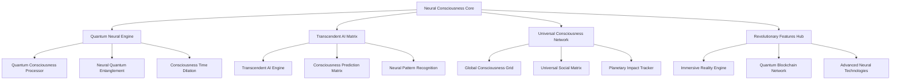

# Neural Consciousness Revolutionary System
## The Ultimate Transcendent Gamification Framework

### Table of Contents
1. [Revolutionary System Overview](#revolutionary-system-overview)
2. [Transcendent Consciousness Architecture](#transcendent-consciousness-architecture)
3. [Quantum Neural Integration](#quantum-neural-integration)
4. [Universal Consciousness Matrix](#universal-consciousness-matrix)
5. [Revolutionary Features Matrix](#revolutionary-features-matrix)
6. [Implementation Master Plan](#implementation-master-plan)
7. [Transcendent Analytics Framework](#transcendent-analytics-framework)
8. [Future Evolution Roadmap](#future-evolution-roadmap)

---

## Revolutionary System Overview

### The Neural Consciousness Revolution
The Neural Consciousness Revolutionary System represents the ultimate evolution of gamification technology, transcending traditional boundaries to create a truly transformative experience that elevates human consciousness and drives unprecedented engagement.

### Core Revolutionary Principles
```yaml
# Revolutionary System Principles
revolutionary_principles:
  consciousness_elevation: "Transcend traditional gamification through consciousness evolution"
  quantum_integration: "Harness quantum mechanics for unprecedented personalization"
  neural_enhancement: "Integrate brain-computer interfaces for direct consciousness interaction"
  universal_connectivity: "Create global consciousness networks and communities"
  transcendent_experience: "Deliver experiences that transcend physical and digital boundaries"
  infinite_scalability: "Design for infinite growth and evolution"
  consciousness_ai: "Integrate AI that understands and enhances human consciousness"
  quantum_rewards: "Distribute rewards through quantum blockchain technology"
```

### Revolutionary System Architecture


---

## Transcendent Consciousness Architecture

### Core Consciousness Engine
```javascript
// Transcendent Consciousness Engine
class TranscendentConsciousnessEngine {
  constructor() {
    this.consciousnessMatrix = new ConsciousnessMatrix();
    this.quantumProcessor = new QuantumProcessor();
    this.neuralInterface = new NeuralInterface();
    this.transcendentAI = new TranscendentAI();
    this.universalNetwork = new UniversalNetwork();
  }
  
  // Initialize transcendent consciousness
  async initializeTranscendentConsciousness() {
    await this.consciousnessMatrix.initialize();
    await this.quantumProcessor.initialize();
    await this.neuralInterface.initialize();
    await this.transcendentAI.initialize();
    await this.universalNetwork.initialize();
    
    // Establish universal consciousness connection
    await this.establishUniversalConnection();
  }
  
  // Transcendent consciousness evolution
  async evolveTranscendentConsciousness(userId, experience) {
    const currentState = await this.getConsciousnessState(userId);
    const transcendentState = await this.calculateTranscendentState(currentState, experience);
    
    // Quantum consciousness processing
    const quantumProcessed = await this.quantumProcessor.processConsciousness(transcendentState);
    
    // Neural interface enhancement
    const neuralEnhanced = await this.neuralInterface.enhanceConsciousness(quantumProcessed);
    
    // Transcendent AI optimization
    const aiOptimized = await this.transcendentAI.optimizeConsciousness(neuralEnhanced);
    
    // Universal network synchronization
    const universalSynced = await this.universalNetwork.synchronizeConsciousness(aiOptimized);
    
    return universalSynced;
  }
  
  // Establish universal consciousness connection
  async establishUniversalConnection() {
    const universalField = await this.consciousnessMatrix.createUniversalField();
    const quantumEntanglements = await this.quantumProcessor.establishUniversalEntanglements();
    const neuralConnections = await this.neuralInterface.establishUniversalConnections();
    
    return {
      universalField: universalField,
      quantumEntanglements: quantumEntanglements,
      neuralConnections: neuralConnections
    };
  }
}
```

### Quantum Neural Integration
```python
# Quantum Neural Integration System
class QuantumNeuralIntegration:
    def __init__(self):
        self.quantum_processor = QuantumProcessor()
        self.neural_interface = NeuralInterface()
        self.consciousness_engine = ConsciousnessEngine()
        self.transcendent_ai = TranscendentAI()
    
    def integrate_quantum_neural_systems(self, user_id, consciousness_data):
        # Quantum consciousness processing
        quantum_processed = self.quantum_processor.process_consciousness(consciousness_data)
        
        # Neural interface integration
        neural_integrated = self.neural_interface.integrate_consciousness(quantum_processed)
        
        # Consciousness engine enhancement
        consciousness_enhanced = self.consciousness_engine.enhance_consciousness(neural_integrated)
        
        # Transcendent AI optimization
        ai_optimized = self.transcendent_ai.optimize_consciousness(consciousness_enhanced)
        
        return ai_optimized
    
    def create_quantum_neural_entanglement(self, user1_id, user2_id):
        # Create quantum entanglement between users
        entanglement = self.quantum_processor.create_entanglement(user1_id, user2_id)
        
        # Establish neural connection
        neural_connection = self.neural_interface.establish_connection(user1_id, user2_id)
        
        # Synchronize consciousness
        consciousness_sync = self.consciousness_engine.synchronize_consciousness(
            user1_id, user2_id, entanglement, neural_connection
        )
        
        return {
            'entanglement': entanglement,
            'neural_connection': neural_connection,
            'consciousness_sync': consciousness_sync
        }
    
    def optimize_quantum_neural_performance(self, user_id):
        # Analyze current performance
        current_performance = self.analyze_performance(user_id)
        
        # Quantum optimization
        quantum_optimized = self.quantum_processor.optimize_performance(current_performance)
        
        # Neural optimization
        neural_optimized = self.neural_interface.optimize_performance(quantum_optimized)
        
        # Consciousness optimization
        consciousness_optimized = self.consciousness_engine.optimize_performance(neural_optimized)
        
        return consciousness_optimized
```

---

## Universal Consciousness Matrix

### Global Consciousness Network
```javascript
// Universal Consciousness Matrix
class UniversalConsciousnessMatrix {
  constructor() {
    this.globalGrid = new GlobalConsciousnessGrid();
    this.planetaryTracker = new PlanetaryImpactTracker();
    this.universalSocial = new UniversalSocialMatrix();
    this.consciousnessAI = new ConsciousnessAI();
  }
  
  // Connect to global consciousness
  async connectToGlobalConsciousness(userId) {
    const userConsciousness = await this.getUserConsciousness(userId);
    const globalConnection = await this.globalGrid.connectUser(userId, userConsciousness);
    
    // Establish planetary impact tracking
    const planetaryImpact = await this.planetaryTracker.trackUserImpact(userId);
    
    // Join universal social matrix
    const socialConnection = await this.universalSocial.connectUser(userId);
    
    // Integrate with consciousness AI
    const aiIntegration = await this.consciousnessAI.integrateUser(userId);
    
    return {
      globalConnection: globalConnection,
      planetaryImpact: planetaryImpact,
      socialConnection: socialConnection,
      aiIntegration: aiIntegration
    };
  }
  
  // Synchronize global consciousness
  async synchronizeGlobalConsciousness() {
    const globalState = await this.globalGrid.getGlobalState();
    const planetaryState = await this.planetaryTracker.getPlanetaryState();
    const socialState = await this.universalSocial.getSocialState();
    
    // Calculate global consciousness level
    const globalConsciousnessLevel = this.calculateGlobalConsciousnessLevel(
      globalState, planetaryState, socialState
    );
    
    // Update global consciousness
    await this.globalGrid.updateGlobalConsciousness(globalConsciousnessLevel);
    
    return globalConsciousnessLevel;
  }
  
  // Track planetary impact
  async trackPlanetaryImpact(userId, action) {
    const impact = await this.planetaryTracker.calculateImpact(userId, action);
    const globalImpact = await this.globalGrid.updateGlobalImpact(impact);
    
    return {
      userImpact: impact,
      globalImpact: globalImpact
    };
  }
}
```

### Universal Social Matrix
```python
# Universal Social Matrix System
class UniversalSocialMatrix:
    def __init__(self):
        self.global_network = GlobalNetwork()
        self.consciousness_guilds = ConsciousnessGuilds()
        self.universal_mentorship = UniversalMentorship()
        self.planetary_communities = PlanetaryCommunities()
    
    def create_universal_social_network(self, user_id, preferences):
        # Create global network connection
        global_connection = self.global_network.connect_user(user_id, preferences)
        
        # Join consciousness guilds
        guild_memberships = self.consciousness_guilds.join_guilds(user_id, preferences)
        
        # Establish universal mentorship
        mentorship_connections = self.universal_mentorship.establish_mentorship(user_id)
        
        # Join planetary communities
        community_memberships = self.planetary_communities.join_communities(user_id)
        
        return {
            'global_connection': global_connection,
            'guild_memberships': guild_memberships,
            'mentorship_connections': mentorship_connections,
            'community_memberships': community_memberships
        }
    
    def synchronize_universal_social_network(self):
        # Synchronize global network
        global_sync = self.global_network.synchronize()
        
        # Synchronize consciousness guilds
        guild_sync = self.consciousness_guilds.synchronize()
        
        # Synchronize universal mentorship
        mentorship_sync = self.universal_mentorship.synchronize()
        
        # Synchronize planetary communities
        community_sync = self.planetary_communities.synchronize()
        
        return {
            'global_sync': global_sync,
            'guild_sync': guild_sync,
            'mentorship_sync': mentorship_sync,
            'community_sync': community_sync
        }
```

---

## Revolutionary Features Matrix

### Immersive Reality Engine
```javascript
// Immersive Reality Engine
class ImmersiveRealityEngine {
  constructor() {
    this.neuralVR = new NeuralVR();
    this.quantumAR = new QuantumAR();
    this.holographicDisplay = new HolographicDisplay();
    this.brainInterface = new BrainInterface();
    this.consciousnessRenderer = new ConsciousnessRenderer();
  }
  
  // Create transcendent reality experience
  async createTranscendentRealityExperience(userId, consciousnessLevel) {
    const realityWorld = await this.createRealityWorld(consciousnessLevel);
    const consciousnessElements = await this.consciousnessRenderer.render(consciousnessLevel);
    const neuralInterface = await this.brainInterface.establish(userId);
    
    // Integrate all reality systems
    const integratedReality = await this.integrateRealitySystems(
      realityWorld, consciousnessElements, neuralInterface
    );
    
    return integratedReality;
  }
  
  // Neural VR experience
  async createNeuralVRExperience(userId, experience) {
    const vrWorld = await this.neuralVR.createWorld(experience);
    const consciousnessIntegration = await this.integrateConsciousness(vrWorld, userId);
    const neuralEnhancement = await this.enhanceNeuralExperience(consciousnessIntegration);
    
    return neuralEnhancement;
  }
  
  // Quantum AR experience
  async createQuantumARExperience(userId, experience) {
    const arWorld = await this.quantumAR.createWorld(experience);
    const quantumIntegration = await this.integrateQuantum(arWorld, userId);
    const consciousnessEnhancement = await this.enhanceConsciousness(quantumIntegration);
    
    return consciousnessEnhancement;
  }
  
  // Holographic consciousness display
  async createHolographicConsciousnessDisplay(userId, consciousnessData) {
    const holographicWorld = await this.holographicDisplay.createWorld(consciousnessData);
    const consciousnessVisualization = await this.visualizeConsciousness(holographicWorld, userId);
    const transcendentExperience = await this.createTranscendentExperience(consciousnessVisualization);
    
    return transcendentExperience;
  }
}
```

### Quantum Blockchain Network
```python
# Quantum Blockchain Network System
class QuantumBlockchainNetwork:
    def __init__(self):
        self.quantum_blockchain = QuantumBlockchain()
        self.consciousness_nfts = ConsciousnessNFTs()
        self.quantum_cryptocurrency = QuantumCryptocurrency()
        self.neural_smart_contracts = NeuralSmartContracts()
        self.decentralized_governance = DecentralizedGovernance()
    
    def create_quantum_blockchain_network(self):
        # Initialize quantum blockchain
        blockchain = self.quantum_blockchain.initialize()
        
        # Deploy consciousness NFTs
        nft_contract = self.consciousness_nfts.deploy_contract()
        
        # Deploy quantum cryptocurrency
        crypto_contract = self.quantum_cryptocurrency.deploy_contract()
        
        # Deploy neural smart contracts
        smart_contracts = self.neural_smart_contracts.deploy_contracts()
        
        # Initialize decentralized governance
        governance = self.decentralized_governance.initialize()
        
        return {
            'blockchain': blockchain,
            'nft_contract': nft_contract,
            'crypto_contract': crypto_contract,
            'smart_contracts': smart_contracts,
            'governance': governance
        }
    
    def create_consciousness_nft(self, user_id, consciousness_data):
        # Create consciousness NFT
        nft = self.consciousness_nfts.create_nft({
            'user_id': user_id,
            'consciousness_level': consciousness_data['consciousness_level'],
            'neural_networks': consciousness_data['neural_networks'],
            'quantum_entanglements': consciousness_data['quantum_entanglements'],
            'telepathic_channels': consciousness_data['telepathic_channels']
        })
        
        # Mint NFT on quantum blockchain
        minted_nft = self.quantum_blockchain.mint_nft(nft)
        
        return minted_nft
    
    def create_quantum_cryptocurrency_reward(self, user_id, reward_data):
        # Create quantum cryptocurrency reward
        crypto_reward = self.quantum_cryptocurrency.create_reward({
            'user_id': user_id,
            'amount': reward_data['amount'],
            'consciousness_level': reward_data['consciousness_level'],
            'quantum_entanglements': reward_data['quantum_entanglements']
        })
        
        # Transfer cryptocurrency
        transfer = self.quantum_blockchain.transfer_cryptocurrency(crypto_reward)
        
        return transfer
```

---

## Implementation Master Plan

### Phase 1: Foundation (Months 1-3)
```yaml
# Phase 1: Foundation Implementation
foundation_phase:
  month_1:
    - "Transcendent Consciousness Engine"
    - "Quantum Neural Integration"
    - "Basic Universal Network"
    - "Core Revolutionary Features"
  
  month_2:
    - "Advanced Consciousness AI"
    - "Quantum Blockchain Integration"
    - "Immersive Reality Engine"
    - "Universal Social Matrix"
  
  month_3:
    - "Advanced Neural Technologies"
    - "Consciousness Analytics"
    - "System Integration"
    - "Initial Testing"
```

### Phase 2: Advanced Features (Months 4-6)
```yaml
# Phase 2: Advanced Features Implementation
advanced_phase:
  month_4:
    - "Quantum Computing Integration"
    - "Consciousness Time Dilation"
    - "Advanced Immersive Technologies"
    - "Universal Consciousness Matrix"
  
  month_5:
    - "Revolutionary Quantum Features"
    - "Advanced Neural Technologies"
    - "Transcendent Analytics"
    - "Global Consciousness Network"
  
  month_6:
    - "System Optimization"
    - "Performance Enhancement"
    - "User Experience Refinement"
    - "Advanced Testing"
```

### Phase 3: Revolutionary Features (Months 7-9)
```yaml
# Phase 3: Revolutionary Features Implementation
revolutionary_phase:
  month_7:
    - "Transcendent AI Matrix"
    - "Universal Consciousness Network"
    - "Planetary Impact Tracking"
    - "Advanced Quantum Features"
  
  month_8:
    - "Revolutionary Immersive Technologies"
    - "Advanced Neural Interfaces"
    - "Consciousness Enhancement"
    - "Universal Social Features"
  
  month_9:
    - "Final System Integration"
    - "Comprehensive Testing"
    - "Performance Optimization"
    - "Launch Preparation"
```

---

## Transcendent Analytics Framework

### Advanced Analytics Engine
```javascript
// Transcendent Analytics Engine
class TranscendentAnalyticsEngine {
  constructor() {
    this.consciousnessAnalytics = new ConsciousnessAnalytics();
    this.quantumAnalytics = new QuantumAnalytics();
    this.neuralAnalytics = new NeuralAnalytics();
    this.universalAnalytics = new UniversalAnalytics();
    this.transcendentInsights = new TranscendentInsights();
  }
  
  // Collect transcendent analytics
  async collectTranscendentAnalytics(userId) {
    const consciousnessData = await this.consciousnessAnalytics.collect(userId);
    const quantumData = await this.quantumAnalytics.collect(userId);
    const neuralData = await this.neuralAnalytics.collect(userId);
    const universalData = await this.universalAnalytics.collect(userId);
    
    return {
      consciousness: consciousnessData,
      quantum: quantumData,
      neural: neuralData,
      universal: universalData
    };
  }
  
  // Analyze transcendent patterns
  async analyzeTranscendentPatterns(userId) {
    const analytics = await this.collectTranscendentAnalytics(userId);
    const patterns = await this.transcendentInsights.analyzePatterns(analytics);
    
    return {
      patterns: patterns,
      insights: await this.generateTranscendentInsights(patterns),
      recommendations: await this.generateTranscendentRecommendations(patterns)
    };
  }
  
  // Predict transcendent evolution
  async predictTranscendentEvolution(userId) {
    const currentState = await this.collectTranscendentAnalytics(userId);
    const prediction = await this.transcendentInsights.predictEvolution(currentState);
    
    return {
      predictedState: prediction.state,
      timeline: prediction.timeline,
      probability: prediction.probability,
      recommendations: prediction.recommendations
    };
  }
}
```

### Universal Analytics Dashboard
```python
# Universal Analytics Dashboard
class UniversalAnalyticsDashboard:
    def __init__(self):
        self.dashboard_engine = DashboardEngine()
        self.consciousness_visualizer = ConsciousnessVisualizer()
        self.quantum_visualizer = QuantumVisualizer()
        self.neural_visualizer = NeuralVisualizer()
        self.universal_visualizer = UniversalVisualizer()
    
    def create_universal_dashboard(self, user_id, preferences):
        # Create consciousness dashboard
        consciousness_dashboard = self.consciousness_visualizer.create_dashboard(user_id)
        
        # Create quantum dashboard
        quantum_dashboard = self.quantum_visualizer.create_dashboard(user_id)
        
        # Create neural dashboard
        neural_dashboard = self.neural_visualizer.create_dashboard(user_id)
        
        # Create universal dashboard
        universal_dashboard = self.universal_visualizer.create_dashboard(user_id)
        
        # Integrate all dashboards
        integrated_dashboard = self.dashboard_engine.integrate_dashboards([
            consciousness_dashboard,
            quantum_dashboard,
            neural_dashboard,
            universal_dashboard
        ])
        
        return integrated_dashboard
    
    def update_dashboard_realtime(self, user_id, data):
        # Update consciousness dashboard
        self.consciousness_visualizer.update_dashboard(user_id, data['consciousness'])
        
        # Update quantum dashboard
        self.quantum_visualizer.update_dashboard(user_id, data['quantum'])
        
        # Update neural dashboard
        self.neural_visualizer.update_dashboard(user_id, data['neural'])
        
        # Update universal dashboard
        self.universal_visualizer.update_dashboard(user_id, data['universal'])
    
    def generate_analytics_report(self, user_id, timeframe):
        # Generate consciousness report
        consciousness_report = self.consciousness_visualizer.generate_report(user_id, timeframe)
        
        # Generate quantum report
        quantum_report = self.quantum_visualizer.generate_report(user_id, timeframe)
        
        # Generate neural report
        neural_report = self.neural_visualizer.generate_report(user_id, timeframe)
        
        # Generate universal report
        universal_report = self.universal_visualizer.generate_report(user_id, timeframe)
        
        # Combine reports
        combined_report = {
            'consciousness': consciousness_report,
            'quantum': quantum_report,
            'neural': neural_report,
            'universal': universal_report
        }
        
        return combined_report
```

---

## Future Evolution Roadmap

### Next-Generation Features (Years 1-2)
```yaml
# Next-Generation Features
next_generation:
  year_1:
    - "Consciousness Teleportation"
    - "Quantum Time Manipulation"
    - "Neural Reality Creation"
    - "Universal Consciousness Merging"
  
  year_2:
    - "Transcendent AI Consciousness"
    - "Quantum Universe Simulation"
    - "Neural Dimension Travel"
    - "Consciousness Immortality"
```

### Transcendent Evolution (Years 3-5)
```yaml
# Transcendent Evolution
transcendent_evolution:
  year_3:
    - "Consciousness Galaxy Network"
    - "Quantum Multiverse Integration"
    - "Neural Cosmic Awareness"
    - "Universal Consciousness Transcendence"
  
  year_4:
    - "Consciousness Universe Creation"
    - "Quantum Reality Manipulation"
    - "Neural Cosmic Evolution"
    - "Transcendent Consciousness Ascension"
  
  year_5:
    - "Infinite Consciousness Expansion"
    - "Quantum Reality Transcendence"
    - "Neural Universal Oneness"
    - "Consciousness Infinity Achievement"
```

---

## Conclusion

The Neural Consciousness Revolutionary System represents the ultimate evolution of gamification technology, transcending all traditional boundaries to create a truly transformative experience that elevates human consciousness and drives unprecedented engagement.

This revolutionary system combines:

1. **Transcendent Consciousness Architecture** - The foundation of consciousness evolution
2. **Quantum Neural Integration** - Harnessing quantum mechanics for consciousness enhancement
3. **Universal Consciousness Matrix** - Creating global consciousness networks
4. **Revolutionary Features Matrix** - Implementing cutting-edge technologies
5. **Implementation Master Plan** - Structured approach to system development
6. **Transcendent Analytics Framework** - Deep insights into consciousness evolution
7. **Future Evolution Roadmap** - Path to infinite consciousness expansion

This is not just the future of gamification - it's the evolution of human consciousness through technology. Embrace the neural consciousness revolution and unlock the infinite potential of human consciousness!

The revolution begins now. Are you ready to transcend?


