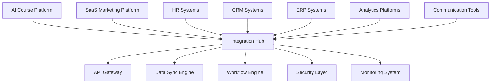

# Enterprise Integration and API Management Guide

## Table of Contents
1. [Overview](#overview)
2. [Enterprise Architecture](#enterprise-architecture)
3. [API Management](#api-management)
4. [Integration Patterns](#integration-patterns)
5. [Security and Authentication](#security-and-authentication)
6. [Data Synchronization](#data-synchronization)
7. [Workflow Automation](#workflow-automation)
8. [Monitoring and Logging](#monitoring-and-logging)
9. [Implementation Examples](#implementation-examples)
10. [Best Practices](#best-practices)

## Overview

This guide covers enterprise-level integration capabilities for both the AI course platform and SaaS marketing platform, providing comprehensive API management, data synchronization, and workflow automation.

### Key Features
- **Enterprise API Management**: Comprehensive API gateway and management
- **Multi-System Integration**: Seamless integration with enterprise systems
- **Data Synchronization**: Real-time and batch data synchronization
- **Workflow Automation**: Automated business process workflows
- **Security Framework**: Enterprise-grade security and compliance
- **Monitoring & Analytics**: Comprehensive integration monitoring

## Enterprise Architecture

### Integration Architecture

```python
# Enterprise Integration Architecture
class EnterpriseIntegrationHub:
    def __init__(self):
        self.api_gateway = APIGateway()
        self.integration_engine = IntegrationEngine()
        self.data_sync_manager = DataSyncManager()
        self.workflow_engine = WorkflowEngine()
        self.security_manager = SecurityManager()
        self.monitoring_system = IntegrationMonitoring()
        
    def initialize_enterprise_system(self, config):
        """Initialize enterprise integration system"""
        # Configure API Gateway
        self.api_gateway.configure(config['api_gateway'])
        
        # Set up integrations
        for integration_config in config['integrations']:
            self.integration_engine.add_integration(integration_config)
        
        # Configure data synchronization
        self.data_sync_manager.configure(config['data_sync'])
        
        # Set up workflows
        for workflow_config in config['workflows']:
            self.workflow_engine.add_workflow(workflow_config)
        
        # Initialize security
        self.security_manager.initialize(config['security'])
        
        # Start monitoring
        self.monitoring_system.start_monitoring()
        
        return {
            'status': 'initialized',
            'integrations': len(config['integrations']),
            'workflows': len(config['workflows']),
            'api_endpoints': self.api_gateway.get_endpoint_count()
        }
```

### System Integration Map



## API Management

### Comprehensive API Gateway

```python
# Enterprise API Gateway
class EnterpriseAPIGateway:
    def __init__(self):
        self.routes = RouteManager()
        self.middleware = MiddlewareManager()
        self.rate_limiter = RateLimiter()
        self.authentication = AuthenticationManager()
        self.authorization = AuthorizationManager()
        self.caching = CacheManager()
        self.logging = APILogging()
        self.metrics = APIMetrics()
        
    def create_api_endpoint(self, endpoint_config):
        """Create a new API endpoint"""
        endpoint = APIEndpoint(
            path=endpoint_config['path'],
            methods=endpoint_config['methods'],
            handler=endpoint_config['handler'],
            middleware=endpoint_config.get('middleware', []),
            rate_limit=endpoint_config.get('rate_limit'),
            authentication=endpoint_config.get('authentication'),
            authorization=endpoint_config.get('authorization'),
            caching=endpoint_config.get('caching')
        )
        
        # Add middleware
        for middleware_name in endpoint.middleware:
            middleware = self.middleware.get_middleware(middleware_name)
            endpoint.add_middleware(middleware)
        
        # Register endpoint
        self.routes.register(endpoint)
        
        # Set up monitoring
        self.metrics.setup_endpoint_monitoring(endpoint)
        
        return endpoint
    
    def handle_request(self, request):
        """Handle incoming API request"""
        # Log request
        self.logging.log_request(request)
        
        # Find route
        route = self.routes.find_route(request.path, request.method)
        if not route:
            return self.create_error_response(404, "Endpoint not found")
        
        # Apply middleware
        for middleware in route.middleware:
            request = middleware.process_request(request)
            if request.error:
                return self.create_error_response(request.error.code, request.error.message)
        
        # Rate limiting
        if not self.rate_limiter.check_limit(request, route.rate_limit):
            return self.create_error_response(429, "Rate limit exceeded")
        
        # Authentication
        if route.authentication:
            auth_result = self.authentication.authenticate(request)
            if not auth_result.success:
                return self.create_error_response(401, "Authentication failed")
            request.user = auth_result.user
        
        # Authorization
        if route.authorization:
            authz_result = self.authorization.authorize(request.user, route)
            if not authz_result.success:
                return self.create_error_response(403, "Authorization failed")
        
        # Check cache
        if route.caching:
            cached_response = self.caching.get_cached_response(request)
            if cached_response:
                return cached_response
        
        # Execute handler
        try:
            response = route.handler(request)
            
            # Cache response if configured
            if route.caching and response.cacheable:
                self.caching.cache_response(request, response)
            
            # Log response
            self.logging.log_response(request, response)
            
            # Update metrics
            self.metrics.record_request(request, response)
            
            return response
            
        except Exception as e:
            self.logging.log_error(request, e)
            return self.create_error_response(500, "Internal server error")
```

### API Documentation and Testing

```python
# API Documentation and Testing System
class APIDocumentationSystem:
    def __init__(self):
        self.documentation_generator = DocumentationGenerator()
        self.test_generator = TestGenerator()
        self.mock_server = MockServer()
        self.schema_validator = SchemaValidator()
        
    def generate_api_documentation(self, api_spec):
        """Generate comprehensive API documentation"""
        documentation = {
            'overview': self.generate_overview(api_spec),
            'endpoints': self.generate_endpoint_docs(api_spec),
            'schemas': self.generate_schema_docs(api_spec),
            'examples': self.generate_examples(api_spec),
            'authentication': self.generate_auth_docs(api_spec),
            'error_codes': self.generate_error_docs(api_spec),
            'sdk_examples': self.generate_sdk_examples(api_spec)
        }
        
        return documentation
    
    def generate_endpoint_docs(self, api_spec):
        """Generate endpoint documentation"""
        endpoint_docs = {}
        
        for endpoint in api_spec['endpoints']:
            doc = {
                'path': endpoint['path'],
                'methods': endpoint['methods'],
                'description': endpoint['description'],
                'parameters': self.document_parameters(endpoint.get('parameters', [])),
                'request_body': self.document_request_body(endpoint.get('request_body')),
                'responses': self.document_responses(endpoint.get('responses', [])),
                'examples': self.generate_endpoint_examples(endpoint),
                'rate_limits': endpoint.get('rate_limits'),
                'authentication': endpoint.get('authentication'),
                'authorization': endpoint.get('authorization')
            }
            endpoint_docs[endpoint['path']] = doc
        
        return endpoint_docs
    
    def create_test_suite(self, api_spec):
        """Create comprehensive test suite for API"""
        test_suite = {
            'unit_tests': self.generate_unit_tests(api_spec),
            'integration_tests': self.generate_integration_tests(api_spec),
            'performance_tests': self.generate_performance_tests(api_spec),
            'security_tests': self.generate_security_tests(api_spec),
            'load_tests': self.generate_load_tests(api_spec)
        }
        
        return test_suite
```

## Integration Patterns

### Enterprise Integration Patterns

```python
# Enterprise Integration Patterns
class IntegrationPatterns:
    def __init__(self):
        self.patterns = {
            'request_reply': RequestReplyPattern(),
            'publish_subscribe': PublishSubscribePattern(),
            'message_router': MessageRouterPattern(),
            'message_translator': MessageTranslatorPattern(),
            'message_filter': MessageFilterPattern(),
            'splitter': SplitterPattern(),
            'aggregator': AggregatorPattern(),
            'resequencer': ResequencerPattern(),
            'composed_processor': ComposedProcessorPattern(),
            'scatter_gather': ScatterGatherPattern()
        }
        
    def implement_pattern(self, pattern_name, config):
        """Implement a specific integration pattern"""
        pattern = self.patterns[pattern_name]
        return pattern.implement(config)
    
    def create_message_flow(self, flow_config):
        """Create a message flow using integration patterns"""
        flow = MessageFlow(flow_config['name'])
        
        for step_config in flow_config['steps']:
            pattern_name = step_config['pattern']
            pattern = self.patterns[pattern_name]
            
            step = pattern.create_step(step_config)
            flow.add_step(step)
        
        return flow
```

### Data Integration Patterns

```python
# Data Integration Patterns
class DataIntegrationPatterns:
    def __init__(self):
        self.patterns = {
            'etl': ETLPattern(),
            'elt': ELTPattern(),
            'streaming': StreamingPattern(),
            'batch': BatchPattern(),
            'cdc': ChangeDataCapturePattern(),
            'event_sourcing': EventSourcingPattern(),
            'cqrs': CQRSPattern()
        }
        
    def implement_etl_pipeline(self, config):
        """Implement ETL (Extract, Transform, Load) pipeline"""
        pipeline = ETLPipeline(config['name'])
        
        # Extract phase
        extractors = []
        for source_config in config['sources']:
            extractor = self.create_extractor(source_config)
            extractors.append(extractor)
        
        # Transform phase
        transformers = []
        for transform_config in config['transforms']:
            transformer = self.create_transformer(transform_config)
            transformers.append(transformer)
        
        # Load phase
        loaders = []
        for target_config in config['targets']:
            loader = self.create_loader(target_config)
            loaders.append(loader)
        
        # Configure pipeline
        pipeline.set_extractors(extractors)
        pipeline.set_transformers(transformers)
        pipeline.set_loaders(loaders)
        
        return pipeline
    
    def implement_streaming_pipeline(self, config):
        """Implement streaming data pipeline"""
        pipeline = StreamingPipeline(config['name'])
        
        # Set up stream sources
        for source_config in config['stream_sources']:
            source = self.create_stream_source(source_config)
            pipeline.add_source(source)
        
        # Set up stream processors
        for processor_config in config['processors']:
            processor = self.create_stream_processor(processor_config)
            pipeline.add_processor(processor)
        
        # Set up stream sinks
        for sink_config in config['sinks']:
            sink = self.create_stream_sink(sink_config)
            pipeline.add_sink(sink)
        
        return pipeline
```

## Security and Authentication

### Enterprise Security Framework

```python
# Enterprise Security Framework
class EnterpriseSecurityFramework:
    def __init__(self):
        self.authentication_providers = {
            'oauth2': OAuth2Provider(),
            'saml': SAMLProvider(),
            'ldap': LDAPProvider(),
            'jwt': JWTProvider(),
            'api_key': APIKeyProvider(),
            'certificate': CertificateProvider()
        }
        self.authorization_engine = AuthorizationEngine()
        self.encryption_manager = EncryptionManager()
        self.audit_logger = AuditLogger()
        self.compliance_manager = ComplianceManager()
        
    def configure_authentication(self, auth_config):
        """Configure authentication for the system"""
        for provider_name, provider_config in auth_config.items():
            provider = self.authentication_providers[provider_name]
            provider.configure(provider_config)
        
        return {
            'status': 'configured',
            'providers': list(auth_config.keys())
        }
    
    def authenticate_request(self, request):
        """Authenticate incoming request"""
        # Try different authentication methods
        for provider_name, provider in self.authentication_providers.items():
            if provider.can_handle(request):
                auth_result = provider.authenticate(request)
                if auth_result.success:
                    # Log authentication
                    self.audit_logger.log_authentication(
                        user=auth_result.user,
                        method=provider_name,
                        success=True,
                        request=request
                    )
                    return auth_result
        
        # Log failed authentication
        self.audit_logger.log_authentication(
            user=None,
            method='unknown',
            success=False,
            request=request
        )
        
        return AuthenticationResult(success=False, error="Authentication failed")
    
    def authorize_action(self, user, resource, action):
        """Authorize user action on resource"""
        # Check permissions
        authz_result = self.authorization_engine.authorize(user, resource, action)
        
        # Log authorization attempt
        self.audit_logger.log_authorization(
            user=user,
            resource=resource,
            action=action,
            success=authz_result.success
        )
        
        return authz_result
```

### Data Encryption and Privacy

```python
# Data Encryption and Privacy Management
class DataPrivacyManager:
    def __init__(self):
        self.encryption_engine = EncryptionEngine()
        self.data_classifier = DataClassifier()
        self.privacy_engine = PrivacyEngine()
        self.compliance_checker = ComplianceChecker()
        
    def classify_data(self, data):
        """Classify data based on sensitivity"""
        classification = self.data_classifier.classify(data)
        
        return {
            'classification': classification.level,
            'categories': classification.categories,
            'retention_period': classification.retention_period,
            'encryption_required': classification.encryption_required,
            'access_restrictions': classification.access_restrictions
        }
    
    def encrypt_sensitive_data(self, data, classification):
        """Encrypt sensitive data based on classification"""
        if classification.encryption_required:
            encryption_config = self.get_encryption_config(classification)
            encrypted_data = self.encryption_engine.encrypt(data, encryption_config)
            
            return {
                'encrypted_data': encrypted_data,
                'encryption_method': encryption_config.method,
                'key_id': encryption_config.key_id,
                'metadata': encryption_config.metadata
            }
        
        return {'encrypted_data': data, 'encryption_applied': False}
    
    def apply_privacy_policies(self, data, user_context):
        """Apply privacy policies to data"""
        policies = self.privacy_engine.get_applicable_policies(data, user_context)
        
        processed_data = data.copy()
        for policy in policies:
            processed_data = policy.apply(processed_data, user_context)
        
        return {
            'processed_data': processed_data,
            'applied_policies': [policy.name for policy in policies],
            'data_retention': self.get_data_retention_info(processed_data)
        }
```

## Data Synchronization

### Real-time Data Synchronization

```python
# Real-time Data Synchronization System
class RealTimeDataSync:
    def __init__(self):
        self.sync_engines = {
            'database': DatabaseSyncEngine(),
            'api': APISyncEngine(),
            'message_queue': MessageQueueSyncEngine(),
            'file_system': FileSystemSyncEngine(),
            'cloud_storage': CloudStorageSyncEngine()
        }
        self.conflict_resolver = ConflictResolver()
        self.sync_monitor = SyncMonitor()
        
    def create_sync_connection(self, connection_config):
        """Create a data synchronization connection"""
        connection = SyncConnection(
            name=connection_config['name'],
            source_type=connection_config['source_type'],
            target_type=connection_config['target_type'],
            sync_mode=connection_config['sync_mode'],
            frequency=connection_config.get('frequency', 'real_time'),
            conflict_resolution=connection_config.get('conflict_resolution', 'source_wins')
        )
        
        # Configure source and target
        source_engine = self.sync_engines[connection.source_type]
        target_engine = self.sync_engines[connection.target_type]
        
        connection.set_source(source_engine.configure(connection_config['source']))
        connection.set_target(target_engine.configure(connection_config['target']))
        
        # Set up conflict resolution
        connection.set_conflict_resolver(
            self.conflict_resolver.get_resolver(connection.conflict_resolution)
        )
        
        # Start monitoring
        self.sync_monitor.monitor_connection(connection)
        
        return connection
    
    def sync_data(self, connection, data_changes):
        """Synchronize data changes"""
        sync_result = {
            'success': True,
            'synced_records': 0,
            'conflicts': [],
            'errors': []
        }
        
        for change in data_changes:
            try:
                # Check for conflicts
                conflict = self.check_for_conflict(connection, change)
                if conflict:
                    # Resolve conflict
                    resolved_change = connection.conflict_resolver.resolve(conflict)
                    sync_result['conflicts'].append({
                        'change': change,
                        'conflict': conflict,
                        'resolution': resolved_change
                    })
                    change = resolved_change
                
                # Apply change to target
                result = connection.target.apply_change(change)
                if result.success:
                    sync_result['synced_records'] += 1
                else:
                    sync_result['errors'].append(result.error)
                    
            except Exception as e:
                sync_result['errors'].append(str(e))
                sync_result['success'] = False
        
        # Update sync status
        self.sync_monitor.update_sync_status(connection, sync_result)
        
        return sync_result
```

### Batch Data Synchronization

```python
# Batch Data Synchronization System
class BatchDataSync:
    def __init__(self):
        self.batch_processors = {
            'full_sync': FullSyncProcessor(),
            'incremental_sync': IncrementalSyncProcessor(),
            'delta_sync': DeltaSyncProcessor()
        }
        self.scheduler = SyncScheduler()
        self.progress_tracker = ProgressTracker()
        
    def schedule_batch_sync(self, sync_config):
        """Schedule a batch synchronization job"""
        job = SyncJob(
            name=sync_config['name'],
            source=sync_config['source'],
            target=sync_config['target'],
            sync_type=sync_config['sync_type'],
            schedule=sync_config['schedule'],
            filters=sync_config.get('filters', {}),
            transformations=sync_config.get('transformations', [])
        )
        
        # Schedule the job
        self.scheduler.schedule_job(job)
        
        return job
    
    def execute_batch_sync(self, job):
        """Execute a batch synchronization job"""
        processor = self.batch_processors[job.sync_type]
        
        # Initialize progress tracking
        self.progress_tracker.initialize_job(job)
        
        try:
            # Execute sync
            result = processor.execute(job)
            
            # Update progress
            self.progress_tracker.complete_job(job, result)
            
            return result
            
        except Exception as e:
            # Update progress with error
            self.progress_tracker.fail_job(job, str(e))
            raise
```

## Workflow Automation

### Business Process Automation

```python
# Business Process Automation Engine
class WorkflowAutomationEngine:
    def __init__(self):
        self.workflow_engine = WorkflowEngine()
        self.task_engine = TaskEngine()
        self.rule_engine = RuleEngine()
        self.notification_engine = NotificationEngine()
        self.approval_engine = ApprovalEngine()
        
    def create_workflow(self, workflow_config):
        """Create a new business workflow"""
        workflow = Workflow(
            name=workflow_config['name'],
            description=workflow_config['description'],
            trigger=workflow_config['trigger'],
            steps=workflow_config['steps']
        )
        
        # Configure workflow steps
        for step_config in workflow_config['steps']:
            step = self.create_workflow_step(step_config)
            workflow.add_step(step)
        
        # Set up workflow rules
        for rule_config in workflow_config.get('rules', []):
            rule = self.rule_engine.create_rule(rule_config)
            workflow.add_rule(rule)
        
        # Register workflow
        self.workflow_engine.register_workflow(workflow)
        
        return workflow
    
    def create_workflow_step(self, step_config):
        """Create a workflow step"""
        step_type = step_config['type']
        
        if step_type == 'task':
            return self.create_task_step(step_config)
        elif step_type == 'approval':
            return self.create_approval_step(step_config)
        elif step_type == 'notification':
            return self.create_notification_step(step_config)
        elif step_type == 'condition':
            return self.create_condition_step(step_config)
        elif step_type == 'integration':
            return self.create_integration_step(step_config)
        else:
            raise ValueError(f"Unknown step type: {step_type}")
    
    def execute_workflow(self, workflow, context):
        """Execute a workflow with given context"""
        execution = WorkflowExecution(
            workflow=workflow,
            context=context,
            status='running'
        )
        
        # Start execution
        self.workflow_engine.start_execution(execution)
        
        try:
            # Execute workflow steps
            for step in workflow.steps:
                step_result = self.execute_workflow_step(step, execution.context)
                execution.add_step_result(step, step_result)
                
                # Check if workflow should continue
                if not step_result.continue_workflow:
                    break
            
            # Complete execution
            execution.status = 'completed'
            self.workflow_engine.complete_execution(execution)
            
        except Exception as e:
            # Handle execution error
            execution.status = 'failed'
            execution.error = str(e)
            self.workflow_engine.fail_execution(execution)
            raise
        
        return execution
```

### Integration Workflows

```python
# Integration Workflow System
class IntegrationWorkflowSystem:
    def __init__(self):
        self.workflow_orchestrator = WorkflowOrchestrator()
        self.integration_templates = IntegrationTemplateManager()
        self.error_handler = IntegrationErrorHandler()
        self.retry_manager = RetryManager()
        
    def create_integration_workflow(self, integration_config):
        """Create an integration workflow"""
        workflow = IntegrationWorkflow(
            name=integration_config['name'],
            source_system=integration_config['source_system'],
            target_system=integration_config['target_system'],
            data_mapping=integration_config['data_mapping'],
            transformation_rules=integration_config.get('transformation_rules', []),
            error_handling=integration_config.get('error_handling', {}),
            retry_policy=integration_config.get('retry_policy', {})
        )
        
        # Configure error handling
        if workflow.error_handling:
            self.error_handler.configure_workflow_error_handling(workflow)
        
        # Configure retry policy
        if workflow.retry_policy:
            self.retry_manager.configure_retry_policy(workflow)
        
        return workflow
    
    def execute_integration_workflow(self, workflow, data):
        """Execute an integration workflow"""
        execution_context = IntegrationExecutionContext(
            workflow=workflow,
            input_data=data,
            start_time=datetime.now()
        )
        
        try:
            # Extract data from source
            source_data = self.extract_from_source(workflow.source_system, data)
            execution_context.source_data = source_data
            
            # Transform data
            transformed_data = self.transform_data(
                source_data, 
                workflow.transformation_rules
            )
            execution_context.transformed_data = transformed_data
            
            # Load data to target
            load_result = self.load_to_target(
                workflow.target_system, 
                transformed_data
            )
            execution_context.load_result = load_result
            
            # Complete execution
            execution_context.status = 'completed'
            execution_context.end_time = datetime.now()
            
        except Exception as e:
            # Handle integration error
            execution_context.status = 'failed'
            execution_context.error = str(e)
            execution_context.end_time = datetime.now()
            
            # Apply error handling
            self.error_handler.handle_integration_error(execution_context)
            
            # Apply retry logic if configured
            if workflow.retry_policy:
                self.retry_manager.schedule_retry(execution_context)
        
        return execution_context
```

## Monitoring and Logging

### Integration Monitoring System

```python
# Integration Monitoring System
class IntegrationMonitoringSystem:
    def __init__(self):
        self.metrics_collector = MetricsCollector()
        self.health_checker = HealthChecker()
        self.performance_monitor = PerformanceMonitor()
        self.alert_manager = AlertManager()
        self.dashboard_generator = DashboardGenerator()
        
    def monitor_integration_health(self, integration_id):
        """Monitor health of an integration"""
        health_metrics = {
            'status': 'unknown',
            'response_time': 0,
            'error_rate': 0,
            'throughput': 0,
            'availability': 0,
            'last_successful_sync': None,
            'last_error': None
        }
        
        try:
            # Check integration status
            status = self.health_checker.check_integration_status(integration_id)
            health_metrics['status'] = status.status
            
            # Get performance metrics
            performance = self.performance_monitor.get_integration_metrics(integration_id)
            health_metrics.update(performance)
            
            # Check for alerts
            alerts = self.alert_manager.check_integration_alerts(integration_id, health_metrics)
            health_metrics['alerts'] = alerts
            
        except Exception as e:
            health_metrics['status'] = 'error'
            health_metrics['last_error'] = str(e)
        
        return health_metrics
    
    def generate_integration_dashboard(self, integration_id):
        """Generate dashboard for integration monitoring"""
        dashboard_data = {
            'integration_info': self.get_integration_info(integration_id),
            'health_metrics': self.monitor_integration_health(integration_id),
            'performance_trends': self.get_performance_trends(integration_id),
            'error_analysis': self.get_error_analysis(integration_id),
            'sync_history': self.get_sync_history(integration_id),
            'alerts': self.get_active_alerts(integration_id)
        }
        
        return self.dashboard_generator.generate_dashboard(dashboard_data)
```

## Implementation Examples

### Complete Enterprise Integration Setup

```python
# Complete Enterprise Integration Setup
class CompleteEnterpriseIntegration:
    def __init__(self):
        self.integration_hub = EnterpriseIntegrationHub()
        self.api_gateway = EnterpriseAPIGateway()
        self.security_framework = EnterpriseSecurityFramework()
        self.data_sync = RealTimeDataSync()
        self.workflow_engine = WorkflowAutomationEngine()
        self.monitoring = IntegrationMonitoringSystem()
        
    def setup_enterprise_integration(self, config):
        """Set up complete enterprise integration"""
        setup_result = {
            'status': 'initializing',
            'components': {},
            'errors': []
        }
        
        try:
            # Initialize integration hub
            hub_result = self.integration_hub.initialize_enterprise_system(config['hub'])
            setup_result['components']['integration_hub'] = hub_result
            
            # Configure API gateway
            gateway_result = self.api_gateway.configure_gateway(config['api_gateway'])
            setup_result['components']['api_gateway'] = gateway_result
            
            # Set up security
            security_result = self.security_framework.configure_authentication(config['security'])
            setup_result['components']['security'] = security_result
            
            # Configure data synchronization
            sync_result = self.data_sync.configure_sync(config['data_sync'])
            setup_result['components']['data_sync'] = sync_result
            
            # Set up workflows
            workflow_result = self.workflow_engine.configure_workflows(config['workflows'])
            setup_result['components']['workflows'] = workflow_result
            
            # Start monitoring
            monitoring_result = self.monitoring.start_monitoring(config['monitoring'])
            setup_result['components']['monitoring'] = monitoring_result
            
            setup_result['status'] = 'completed'
            
        except Exception as e:
            setup_result['status'] = 'failed'
            setup_result['errors'].append(str(e))
        
        return setup_result
    
    def run_integration_tests(self):
        """Run comprehensive integration tests"""
        test_results = {
            'api_tests': self.run_api_tests(),
            'data_sync_tests': self.run_data_sync_tests(),
            'workflow_tests': self.run_workflow_tests(),
            'security_tests': self.run_security_tests(),
            'performance_tests': self.run_performance_tests()
        }
        
        return test_results
```

## Best Practices

### Enterprise Integration Best Practices

```python
# Enterprise Integration Best Practices
class IntegrationBestPractices:
    def __init__(self):
        self.practices = {
            'api_design': APIDesignBestPractices(),
            'security': SecurityBestPractices(),
            'performance': PerformanceBestPractices(),
            'monitoring': MonitoringBestPractices(),
            'error_handling': ErrorHandlingBestPractices(),
            'data_management': DataManagementBestPractices()
        }
        
    def validate_integration_design(self, integration_config):
        """Validate integration design against best practices"""
        validation_results = {
            'overall_score': 0,
            'recommendations': [],
            'warnings': [],
            'errors': []
        }
        
        # Validate API design
        api_validation = self.practices['api_design'].validate(integration_config.get('api', {}))
        validation_results['recommendations'].extend(api_validation['recommendations'])
        validation_results['warnings'].extend(api_validation['warnings'])
        
        # Validate security
        security_validation = self.practices['security'].validate(integration_config.get('security', {}))
        validation_results['recommendations'].extend(security_validation['recommendations'])
        validation_results['errors'].extend(security_validation['errors'])
        
        # Validate performance
        performance_validation = self.practices['performance'].validate(integration_config.get('performance', {}))
        validation_results['recommendations'].extend(performance_validation['recommendations'])
        validation_results['warnings'].extend(performance_validation['warnings'])
        
        # Calculate overall score
        validation_results['overall_score'] = self.calculate_overall_score(validation_results)
        
        return validation_results
    
    def generate_implementation_guide(self, integration_type):
        """Generate implementation guide for specific integration type"""
        guide = {
            'overview': f"Implementation guide for {integration_type} integration",
            'prerequisites': self.get_prerequisites(integration_type),
            'step_by_step': self.get_implementation_steps(integration_type),
            'configuration': self.get_configuration_template(integration_type),
            'testing': self.get_testing_guidelines(integration_type),
            'troubleshooting': self.get_troubleshooting_guide(integration_type),
            'best_practices': self.get_best_practices(integration_type)
        }
        
        return guide
```

This comprehensive enterprise integration guide provides advanced capabilities for integrating both platforms with enterprise systems, including API management, data synchronization, workflow automation, and comprehensive monitoring. The system is designed to meet enterprise requirements for security, scalability, and reliability.


