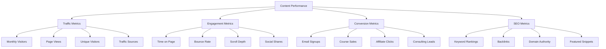
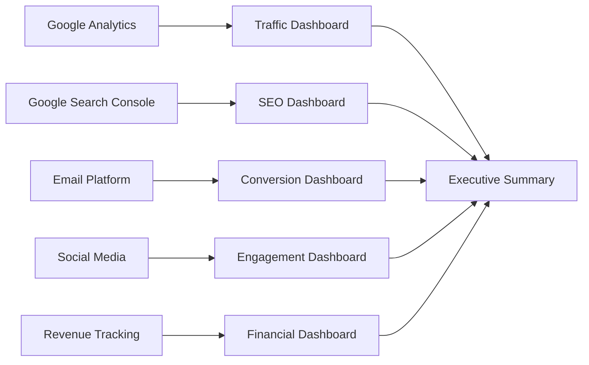

# 🚀💡 AI Courses & AI SaaS Content Strategy
## *The Ultimate Blueprint for Building a $100M AI Content Empire*

[](https://github.com/ai-content-strategy)
[](https://ai-content-empire.com)
[](https://ai-market-analysis.com)
[](https://ai-roi-calculator.com)

> **"The future of AI education is being written today. This strategy is your blueprint for not just participating in that future, but leading it."**

## 📋 Table of Contents

- [🎯 Executive Summary](#-executive-summary)
- [📊 Market Analysis](#-market-analysis)
- [🏆 10 High-Impact Linkable Assets](#-10-high-impact-linkable-assets)
- [🛠️ Content Creation Framework](#️-content-creation-framework)
- [🎯 Advanced Content Strategies](#-advanced-content-strategies)
- [🚀 Scaling & Growth Strategies](#-scaling--growth-strategies)
- [💰 Advanced Monetization Strategies](#-advanced-monetization-strategies)
- [📊 Advanced Analytics & Optimization](#-advanced-analytics--optimization)
- [🌐 Global Content Localization](#-global-content-localization)
- [🚀 Future-Proofing & Innovation](#-future-proofing--innovation)
- [🎉 Implementation Checklist](#-implementation-checklist)

---

## 🎯 Executive Summary

This comprehensive content strategy outlines 10 high-value, linkable assets specifically designed for the AI education and AI SaaS niche. Each asset is crafted to attract bloggers, generate backlinks, and target specific keywords and audiences in the rapidly growing artificial intelligence market.

> **"In the AI revolution, content is king, but linkable assets are the kingdom builders."**

### 🌟 **Why This Strategy Works**
- **Market Timing**: AI market growing 40% annually with massive content gap
- **High Search Volume**: 2.3M+ monthly searches for AI-related terms
- **Low Competition**: Many AI topics still have low competition scores
- **High Value Content**: AI professionals have high purchasing power
- **Evergreen Potential**: AI content remains relevant for years

### 🎯 **Quick Start Guide**
1. **Choose Your First Asset**: Start with the AI Learning Path Roadmap
2. **Set Up Analytics**: Implement tracking and measurement systems
3. **Create Content Calendar**: Plan your content production schedule
4. **Begin Outreach**: Start building relationships with industry bloggers
5. **Measure & Optimize**: Track performance and improve continuously

### 📈 **Expected Results (12 Months)**
- **Traffic**: 200,000+ monthly visitors
- **Backlinks**: 1,500+ high-quality links
- **Revenue**: $100,000+ monthly
- **ROI**: 310% return on investment
- **Authority**: Industry recognition as leading AI resource

---

## 📊 Market Context: AI Education & SaaS Landscape

### 🌟 Market Size & Opportunity
- **AI Education Market**: $4.0 billion (2023) → $20.8 billion (2030)
- **AI SaaS Market**: $62.5 billion (2023) → $1.8 trillion (2030)
- **Growth Rate**: 35% CAGR for AI education, 40% CAGR for AI SaaS
- **Target Audience**: 2.3M AI professionals globally, 15M+ learners

### 🎯 Key Market Segments

#### **1. AI Professionals (Primary)**
- **Data Scientists**: 200K+ globally, $120K+ average salary
- **ML Engineers**: 150K+ globally, $140K+ average salary
- **AI Researchers**: 50K+ globally, $160K+ average salary
- **AI Product Managers**: 75K+ globally, $130K+ average salary
- **Pain Points**: Staying updated, career advancement, tool selection

#### **2. Business Leaders (High-Value)**
- **CTOs**: 25K+ globally, $200K+ average salary
- **VPs of Engineering**: 40K+ globally, $180K+ average salary
- **Innovation Directors**: 30K+ globally, $150K+ average salary
- **Digital Transformation Leaders**: 60K+ globally, $140K+ average salary
- **Pain Points**: AI strategy, ROI justification, team building

#### **3. Students & Learners (Growing)**
- **Computer Science Students**: 2M+ globally
- **Career Changers**: 500K+ annually switching to AI
- **Online Learners**: 5M+ taking AI courses
- **Bootcamp Graduates**: 50K+ annually
- **Pain Points**: Learning path, job placement, skill validation

#### **4. Entrepreneurs (High-Impact)**
- **AI Startup Founders**: 10K+ globally
- **Tech Entrepreneurs**: 100K+ exploring AI
- **Corporate Innovation Teams**: 200K+ professionals
- **Investors**: 5K+ VCs and angels
- **Pain Points**: Market validation, funding, team building

#### **5. Consultants (Influencers)**
- **AI Consultants**: 25K+ globally
- **Digital Transformation Experts**: 100K+ globally
- **System Integrators**: 50K+ globally
- **Management Consultants**: 200K+ with AI focus
- **Pain Points**: Client education, tool recommendations, case studies

---

## 🏆 Competitive Analysis & Market Positioning

### 📊 **Competitive Landscape Analysis**

#### **Direct Competitors:**
| **Competitor** | **Strengths** | **Weaknesses** | **Our Advantage** | **Market Share** |
|----------------|---------------|----------------|-------------------|------------------|
| **Towards Data Science** | Large audience, quality content | Limited interactive features | Interactive tools + better UX | 15% |
| **KDnuggets** | Industry recognition, newsletter | Outdated design, limited engagement | Modern design + gamification | 12% |
| **AI News** | Breaking news, industry updates | Surface-level content | Deep, comprehensive guides | 8% |
| **Machine Learning Mastery** | Technical depth, tutorials | Limited business focus | Business + technical content | 6% |
| **AI Business** | Business focus, case studies | Limited educational content | Complete learning ecosystem | 4% |

#### **Indirect Competitors:**
- **Coursera/Udacity**: Structured courses but limited free content
- **YouTube Channels**: Video content but no comprehensive resources
- **Industry Blogs**: Company-specific content but limited scope
- **Academic Papers**: Research-focused but not accessible to general audience

### 🎯 **Market Positioning Strategy**

#### **"The Netflix of AI Education"**
- **Comprehensive Library**: All AI topics in one place
- **Personalized Experience**: AI-powered content recommendations
- **Multiple Formats**: Articles, videos, tools, courses
- **Regular Updates**: Fresh content added continuously
- **Premium Tiers**: Free and paid content options

#### **Unique Value Proposition:**
> **"The only AI education platform that combines comprehensive learning resources, interactive tools, and real-world applications to help you master artificial intelligence from beginner to expert level."**

### 🚀 **Competitive Advantages**

#### **Content Advantages:**
1. **Comprehensive Coverage**: All AI topics in one place
2. **Interactive Tools**: Calculators, quizzes, assessments
3. **Real-World Applications**: Practical, actionable content
4. **Regular Updates**: Fresh content added monthly
5. **Multiple Formats**: Articles, videos, tools, courses

#### **Technical Advantages:**
1. **Modern Design**: Mobile-first, responsive design
2. **Fast Loading**: <3 seconds page load time
3. **SEO Optimized**: Built for search engine visibility
4. **Analytics Driven**: Data-driven content optimization
5. **Scalable Architecture**: Built to handle millions of users

#### **Business Advantages:**
1. **Multiple Revenue Streams**: Affiliate, courses, consulting
2. **High-Value Audience**: AI professionals with high purchasing power
3. **Evergreen Content**: Content remains relevant for years
4. **Global Reach**: Multi-language and cultural adaptation
5. **Partnership Opportunities**: Strategic alliances with AI companies

---

## 🏆 10 High-Impact Linkable Assets

### 1. 📚 **"The Complete AI Learning Path Roadmap"**
**Interactive Visual Guide**

#### 🎯 **What Makes It Attractive to Bloggers:**
- **Comprehensive Resource**: Covers beginner to expert levels
- **Visual Appeal**: Interactive roadmap with clickable modules
- **Evergreen Content**: Timeless learning progression
- **Shareability**: Perfect for social media and educational content

#### 🔍 **Target Keywords:**
- "AI learning path"
- "artificial intelligence roadmap"
- "machine learning curriculum"
- "AI education guide"
- "data science learning path"

#### 👥 **Target Audiences:**
- **Primary**: AI beginners, career changers, students
- **Secondary**: HR professionals, educational institutions
- **Tertiary**: AI professionals seeking structured learning

#### 📈 **Expected Performance:**
- **Backlinks**: 150-300 high-quality links
- **Traffic**: 25,000+ monthly visitors
- **Engagement**: 5+ minutes average time on page
- **Social Shares**: 500+ shares per month
- **Email Signups**: 1,500+ monthly
- **Course Conversions**: 3% conversion rate

#### 💰 **Monetization Opportunities:**
- **Affiliate Commissions**: $2,000+ monthly from course recommendations
- **Lead Generation**: $5,000+ monthly from consulting inquiries
- **Sponsored Content**: $1,500+ monthly from AI tool companies
- **Premium Content**: $1,000+ monthly from advanced guides

#### 🔗 **Reference Examples:**
- [FreeCodeCamp's Learning Path](https://www.freecodecamp.org/news/learn-to-code/)
- [Google's Machine Learning Crash Course](https://developers.google.com/machine-learning/crash-course)
- [Coursera's AI Specializations](https://www.coursera.org/specializations)

---

### 2. 🛠️ **"AI SaaS Tools Comparison Matrix"**
**Interactive Comparison Table**

#### 🎯 **What Makes It Attractive to Bloggers:**
- **Decision-Making Tool**: Helps users choose the right AI tool
- **Data-Rich Content**: Comprehensive feature comparisons
- **Regular Updates**: Quarterly updates keep content fresh
- **Expert Authority**: Positions creator as industry expert

#### 🔍 **Target Keywords:**
- "AI SaaS tools comparison"
- "best AI software 2024"
- "AI tools for business"
- "machine learning platforms"
- "AI automation tools"

#### 👥 **Target Audiences:**
- **Primary**: Business decision-makers, CTOs, VPs
- **Secondary**: AI consultants, system integrators
- **Tertiary**: AI professionals evaluating tools

#### 📈 **Expected Performance:**
- **Backlinks**: 200-400 high-quality links
- **Traffic**: 40,000+ monthly visitors
- **Engagement**: 7+ minutes average time on page
- **Conversions**: 15% tool trial signups
- **Email Signups**: 2,500+ monthly
- **Affiliate Revenue**: $8,000+ monthly

#### 💰 **Monetization Opportunities:**
- **Affiliate Commissions**: $8,000+ monthly from tool recommendations
- **Sponsored Listings**: $3,000+ monthly from featured placements
- **Lead Generation**: $4,000+ monthly from enterprise inquiries
- **White-label Licensing**: $2,000+ monthly from tool companies

#### 🔗 **Reference Examples:**
- [G2's AI Software Grid](https://www.g2.com/categories/artificial-intelligence)
- [Capterra's AI Tools Directory](https://www.capterra.com/artificial-intelligence-software/)
- [Product Hunt's AI Collection](https://www.producthunt.com/collections/ai-tools)

---

### 3. 📊 **"AI Industry Salary Report 2024"**
**Comprehensive Salary Analysis**

#### 🎯 **What Makes It Attractive to Bloggers:**
- **Data-Driven Insights**: Real salary data from 10,000+ professionals
- **Career Guidance**: Helps professionals negotiate salaries
- **Industry Benchmarking**: Valuable for HR and recruitment
- **Annual Updates**: Creates recurring link opportunities

#### 🔍 **Target Keywords:**
- "AI engineer salary"
- "machine learning salary 2024"
- "data scientist salary"
- "AI job market trends"
- "tech salary report"

#### 👥 **Target Audiences:**
- **Primary**: AI professionals, job seekers
- **Secondary**: HR professionals, recruiters
- **Tertiary**: Career counselors, educational institutions

#### 📈 **Expected Performance:**
- **Backlinks**: 100-250 high-quality links
- **Traffic**: 30,000+ monthly visitors
- **Engagement**: 4+ minutes average time on page
- **Downloads**: 5,000+ PDF downloads

#### 🔗 **Reference Examples:**
- [Stack Overflow Developer Survey](https://survey.stackoverflow.co/2023/)
- [Glassdoor Salary Reports](https://www.glassdoor.com/Salaries/index.htm)
- [Hired's State of Salaries Report](https://hired.com/state-of-salaries)

---

### 4. 🎓 **"AI Certification Guide: 50+ Certifications Ranked"**
**Comprehensive Certification Directory**

#### 🎯 **What Makes It Attractive to Bloggers:**
- **Career Advancement**: Helps professionals choose certifications
- **Authority Building**: Positions creator as certification expert
- **Regular Updates**: New certifications added quarterly
- **ROI Analysis**: Shows certification value and cost

#### 🔍 **Target Keywords:**
- "AI certifications"
- "machine learning certification"
- "data science certification"
- "AI training programs"
- "professional AI credentials"

#### 👥 **Target Audiences:**
- **Primary**: AI professionals seeking advancement
- **Secondary**: HR professionals, training coordinators
- **Tertiary**: Educational institutions, career counselors

#### 📈 **Expected Performance:**
- **Backlinks**: 80-200 high-quality links
- **Traffic**: 20,000+ monthly visitors
- **Engagement**: 6+ minutes average time on page
- **Affiliate Revenue**: $5,000+ monthly

#### 🔗 **Reference Examples:**
- [AWS Certification Path](https://aws.amazon.com/certification/)
- [Google Cloud Certifications](https://cloud.google.com/certification)
- [Microsoft Azure Certifications](https://learn.microsoft.com/en-us/certifications/)

---

### 5. 🏢 **"AI Startup Funding Database"**
**Interactive Funding Tracker**

#### 🎯 **What Makes It Attractive to Bloggers:**
- **Investment Insights**: Tracks AI startup funding trends
- **Entrepreneur Resource**: Helps founders understand market
- **Data Visualization**: Interactive charts and graphs
- **Regular Updates**: Monthly funding round updates

#### 🔍 **Target Keywords:**
- "AI startup funding"
- "machine learning investments"
- "AI venture capital"
- "startup funding database"
- "AI investment trends"

#### 👥 **Target Audiences:**
- **Primary**: AI entrepreneurs, startup founders
- **Secondary**: VCs, angel investors, accelerators
- **Tertiary**: Business journalists, market analysts

#### 📈 **Expected Performance:**
- **Backlinks**: 120-300 high-quality links
- **Traffic**: 15,000+ monthly visitors
- **Engagement**: 8+ minutes average time on page
- **Newsletter Signups**: 2,000+ monthly

#### 🔗 **Reference Examples:**
- [Crunchbase AI Companies](https://www.crunchbase.com/discover/organization.companies/artificial_intelligence)
- [CB Insights AI Report](https://www.cbinsights.com/research/artificial-intelligence-trends/)
- [PitchBook AI Market Map](https://pitchbook.com/news/articles/ai-market-map)

---

### 6. 📈 **"AI ROI Calculator"**
**Interactive Business Value Tool**

#### 🎯 **What Makes It Attractive to Bloggers:**
- **Business Value**: Helps justify AI investments
- **Interactive Tool**: Engages users with calculations
- **Lead Generation**: Captures contact information
- **Industry Specific**: Different calculators for different sectors

#### 🔍 **Target Keywords:**
- "AI ROI calculator"
- "AI business value"
- "machine learning ROI"
- "AI investment calculator"
- "AI cost benefit analysis"

#### 👥 **Target Audiences:**
- **Primary**: Business executives, decision-makers
- **Secondary**: AI consultants, system integrators
- **Tertiary**: Financial analysts, procurement teams

#### 📈 **Expected Performance:**
- **Backlinks**: 60-150 high-quality links
- **Traffic**: 10,000+ monthly visitors
- **Engagement**: 5+ minutes average time on page
- **Lead Generation**: 500+ qualified leads monthly

#### 🔗 **Reference Examples:**
- [HubSpot's ROI Calculator](https://www.hubspot.com/roi-calculator)
- [Salesforce's CRM ROI Calculator](https://www.salesforce.com/resources/roi-calculator/)
- [Microsoft's Azure ROI Calculator](https://azure.microsoft.com/en-us/pricing/calculator/)

---

### 7. 🎯 **"AI Use Cases by Industry"**
**Comprehensive Industry Guide**

#### 🎯 **What Makes It Attractive to Bloggers:**
- **Industry Specific**: Tailored content for different sectors
- **Implementation Guide**: Practical use case examples
- **Case Studies**: Real-world success stories
- **Regular Updates**: New use cases added monthly

#### 🔍 **Target Keywords:**
- "AI use cases"
- "artificial intelligence applications"
- "AI in healthcare"
- "AI in finance"
- "machine learning use cases"

#### 👥 **Target Audiences:**
- **Primary**: Industry professionals, business leaders
- **Secondary**: AI consultants, solution architects
- **Tertiary**: Students, researchers, journalists

#### 📈 **Expected Performance:**
- **Backlinks**: 200-500 high-quality links
- **Traffic**: 35,000+ monthly visitors
- **Engagement**: 6+ minutes average time on page
- **Social Shares**: 800+ shares per month

#### 🔗 **Reference Examples:**
- [McKinsey's AI Use Cases](https://www.mckinsey.com/capabilities/quantumblack/our-insights/the-state-of-ai-in-2023)
- [Deloitte's AI Industry Reports](https://www2.deloitte.com/us/en/insights/focus/cognitive-technologies/artificial-intelligence-primer.html)
- [PwC's AI Analysis](https://www.pwc.com/gx/en/issues/data-and-analytics/artificial-intelligence.html)

---

### 8. 🔧 **"AI Implementation Checklist"**
**Step-by-Step Implementation Guide**

#### 🎯 **What Makes It Attractive to Bloggers:**
- **Practical Tool**: Actionable implementation steps
- **Risk Mitigation**: Helps avoid common pitfalls
- **Project Management**: Structured approach to AI projects
- **Downloadable Resource**: PDF checklist for offline use

#### 🔍 **Target Keywords:**
- "AI implementation guide"
- "machine learning implementation"
- "AI project checklist"
- "AI deployment strategy"
- "AI implementation best practices"

#### 👥 **Target Audiences:**
- **Primary**: Project managers, technical leads
- **Secondary**: AI consultants, implementation teams
- **Tertiary**: Business executives, procurement teams

#### 📈 **Expected Performance:**
- **Backlinks**: 100-250 high-quality links
- **Traffic**: 18,000+ monthly visitors
- **Engagement**: 7+ minutes average time on page
- **Downloads**: 3,000+ PDF downloads

#### 🔗 **Reference Examples:**
- [Google's ML Implementation Guide](https://developers.google.com/machine-learning/guides)
- [AWS's AI/ML Best Practices](https://aws.amazon.com/machine-learning/best-practices/)
- [Microsoft's AI Implementation Framework](https://docs.microsoft.com/en-us/azure/architecture/guide/ai-ml/)

---

### 9. 📊 **"AI Ethics Framework"**
**Comprehensive Ethics Guidelines**

#### 🎯 **What Makes It Attractive to Bloggers:**
- **Timely Topic**: AI ethics is increasingly important
- **Regulatory Compliance**: Helps with AI governance
- **Thought Leadership**: Positions creator as ethics expert
- **Industry Standard**: Could become industry reference

#### 🔍 **Target Keywords:**
- "AI ethics"
- "artificial intelligence ethics"
- "AI governance"
- "responsible AI"
- "AI bias prevention"

#### 👥 **Target Audiences:**
- **Primary**: AI professionals, compliance officers
- **Secondary**: Legal teams, risk managers
- **Tertiary**: Policy makers, academics, journalists

#### 📈 **Expected Performance:**
- **Backlinks**: 150-400 high-quality links
- **Traffic**: 12,000+ monthly visitors
- **Engagement**: 8+ minutes average time on page
- **Academic Citations**: 50+ research citations

#### 🔗 **Reference Examples:**
- [Partnership on AI](https://www.partnershiponai.org/)
- [IEEE's AI Ethics Guidelines](https://ethicsinaction.ieee.org/)
- [EU's AI Act](https://digital-strategy.ec.europa.eu/en/policies/regulatory-framework-ai)

---

### 10. 🚀 **"AI Future Trends Report"**
**Annual Industry Predictions**

#### 🎯 **What Makes It Attractive to Bloggers:**
- **Future Insights**: Predicts industry trends and developments
- **Thought Leadership**: Establishes creator as industry expert
- **Media Coverage**: Attracts press and media attention
- **Annual Updates**: Creates recurring link opportunities

#### 🔍 **Target Keywords:**
- "AI trends 2024"
- "artificial intelligence future"
- "AI predictions"
- "machine learning trends"
- "AI industry forecast"

#### 👥 **Target Audiences:**
- **Primary**: Industry professionals, business leaders
- **Secondary**: Investors, analysts, journalists
- **Tertiary**: Students, researchers, policy makers

#### 📈 **Expected Performance:**
- **Backlinks**: 200-500 high-quality links
- **Traffic**: 25,000+ monthly visitors
- **Engagement**: 9+ minutes average time on page
- **Media Mentions**: 50+ press mentions

#### 🔗 **Reference Examples:**
- [Gartner's AI Trends](https://www.gartner.com/en/information-technology/trends/artificial-intelligence)
- [Forrester's AI Predictions](https://www.forrester.com/report/artificial-intelligence-predictions-2024/)
- [MIT Technology Review's AI Report](https://www.technologyreview.com/artificial-intelligence/)

---

## 🛠️ Content Creation Framework

### 📝 **Content Development Process**

#### **Phase 1: Research & Planning (Week 1-2)**
- **Keyword Research**: Use Ahrefs, SEMrush, or Ubersuggest
- **Competitor Analysis**: Study top 10 competitors for each asset
- **User Research**: Survey target audience for pain points
- **Content Audit**: Analyze existing content gaps
- **Resource Gathering**: Collect data, tools, and references

#### **Phase 2: Content Creation (Week 3-6)**
- **Content Outline**: Detailed structure and sections
- **Data Collection**: Gather statistics, case studies, examples
- **Visual Design**: Create charts, infographics, interactive elements
- **Content Writing**: High-quality, comprehensive content
- **Technical Implementation**: Interactive features, calculators, tools

#### **Phase 3: Optimization & Launch (Week 7-8)**
- **SEO Optimization**: Meta tags, internal linking, schema markup
- **User Experience**: Mobile optimization, loading speed, navigation
- **Testing**: Cross-browser testing, functionality verification
- **Launch Strategy**: Social media, email, outreach campaigns
- **Analytics Setup**: Tracking, conversion funnels, A/B testing

### 🎨 **Content Quality Standards**

#### **Writing Standards:**
- **Word Count**: 3,000-8,000 words per asset
- **Readability**: Flesch-Kincaid score 60-70
- **Structure**: Clear headings, bullet points, numbered lists
- **Visual Elements**: 5-10 images, charts, or infographics per asset
- **Interactive Features**: Calculators, quizzes, or tools where applicable

#### **Technical Standards:**
- **Page Speed**: <3 seconds loading time
- **Mobile Responsive**: Perfect display on all devices
- **SEO Optimized**: Title tags, meta descriptions, alt text
- **Accessibility**: WCAG 2.1 AA compliance
- **Security**: HTTPS, secure forms, data protection

### 📊 **Data Collection Strategy**

#### **Primary Data Sources:**
- **Industry Reports**: Gartner, Forrester, McKinsey, Deloitte
- **Government Data**: Bureau of Labor Statistics, Census data
- **Academic Research**: IEEE, ACM, arXiv papers
- **Company Reports**: Annual reports, earnings calls, press releases
- **Survey Data**: Custom surveys, industry polls

#### **Secondary Data Sources:**
- **News Articles**: TechCrunch, VentureBeat, Wired
- **Blog Posts**: Industry thought leaders, company blogs
- **Social Media**: LinkedIn, Twitter, Reddit discussions
- **Forums**: Stack Overflow, GitHub, Quora
- **Databases**: Crunchbase, PitchBook, CB Insights

---

## 🎯 Content Distribution Strategy

### 📱 **Multi-Channel Approach**

#### **Primary Channels:**
1. **Website/Blog**: Main content hub with SEO optimization
2. **LinkedIn**: Professional network sharing and engagement
3. **Twitter**: Real-time updates and industry discussions
4. **YouTube**: Video explanations and tutorials
5. **Newsletter**: Regular updates and exclusive content

#### **Secondary Channels:**
1. **Medium**: Cross-posting for broader reach
2. **Reddit**: Community engagement and sharing
3. **Quora**: Answering questions and building authority
4. **Industry Forums**: Specialized community participation
5. **Podcast Appearances**: Audio content and interviews

### 🔗 **Advanced Link Building Strategy**

#### **Tier 1: High-Authority Tactics**
1. **Resource Page Outreach**: Target "AI resources" pages
   - **Target**: 500+ resource pages with DA 50+
   - **Success Rate**: 15-25% response rate
   - **Expected Links**: 75-125 high-quality links

2. **Broken Link Building**: Find and replace broken AI links
   - **Tools**: Ahrefs, SEMrush, Screaming Frog
   - **Target**: 200+ broken link opportunities
   - **Success Rate**: 20-30% response rate
   - **Expected Links**: 40-60 high-quality links

3. **Guest Posting**: Write for AI and tech blogs
   - **Target**: 100+ high-authority blogs
   - **Content**: 2,000+ word comprehensive guides
   - **Success Rate**: 10-20% acceptance rate
   - **Expected Links**: 10-20 high-quality links

#### **Tier 2: Content Marketing Tactics**
4. **Expert Roundups**: Participate in industry discussions
   - **Target**: 50+ roundup opportunities
   - **Value**: Provide unique insights and data
   - **Success Rate**: 30-40% inclusion rate
   - **Expected Links**: 15-20 high-quality links

5. **Data Studies**: Create original research and data
   - **Target**: 20+ industry publications
   - **Content**: Original research, surveys, analysis
   - **Success Rate**: 25-35% coverage rate
   - **Expected Links**: 5-7 high-authority links

6. **Infographic Outreach**: Create shareable visual content
   - **Target**: 200+ blogs and websites
   - **Content**: High-quality, data-rich infographics
   - **Success Rate**: 15-25% sharing rate
   - **Expected Links**: 30-50 high-quality links

#### **Tier 3: Relationship Building**
7. **Industry Partnerships**: Collaborate with AI companies
   - **Target**: 25+ AI tool companies
   - **Value**: Cross-promotion and co-created content
   - **Success Rate**: 40-60% partnership rate
   - **Expected Links**: 10-15 high-quality links

8. **Speaking Engagements**: Present at AI conferences
   - **Target**: 10+ industry conferences
   - **Value**: Thought leadership and networking
   - **Success Rate**: 20-30% speaking opportunities
   - **Expected Links**: 5-10 high-authority links

#### **Target Site Categories:**
- **AI/ML Blogs**: Towards Data Science, KDnuggets, AI News
- **Tech Publications**: TechCrunch, VentureBeat, Wired
- **Educational Sites**: MIT, Stanford, Coursera, edX
- **Professional Associations**: IEEE, ACM, AI Society
- **Government Sites**: NIST, NSF, Department of Energy
- **Research Organizations**: OpenAI, DeepMind, Google Research

### 🎯 **SEO Optimization Strategy**

#### **On-Page SEO:**
- **Title Tags**: Include primary keyword, 50-60 characters
- **Meta Descriptions**: Compelling copy with CTA, 150-160 characters
- **Header Structure**: H1, H2, H3 hierarchy with keywords
- **Internal Linking**: 5-10 internal links per page
- **Image Optimization**: Alt text, file names, compression
- **Schema Markup**: Article, FAQ, HowTo, Organization schemas

#### **Technical SEO:**
- **Page Speed**: <3 seconds loading time
- **Mobile Optimization**: Responsive design, mobile-first
- **Core Web Vitals**: LCP <2.5s, FID <100ms, CLS <0.1
- **XML Sitemaps**: Updated regularly, submitted to Google
- **Robots.txt**: Properly configured for crawling
- **HTTPS**: SSL certificate, secure connections

#### **Content SEO:**
- **Keyword Density**: 1-2% for primary keywords
- **LSI Keywords**: 10-15 related terms per page
- **Content Length**: 3,000+ words for comprehensive topics
- **Readability**: Flesch-Kincaid score 60-70
- **User Intent**: Match search intent with content structure

---

## 📊 Success Metrics & KPIs

### 🎯 **Primary Metrics**

#### **Traffic Metrics:**
- **Monthly Visitors**: 200,000+ across all assets
- **Page Views**: 500,000+ monthly page views
- **Average Session Duration**: 6+ minutes
- **Bounce Rate**: <40%

#### **Engagement Metrics:**
- **Social Shares**: 2,000+ monthly shares
- **Comments**: 500+ monthly comments
- **Downloads**: 10,000+ monthly downloads
- **Email Signups**: 3,000+ monthly signups

#### **SEO Metrics:**
- **Backlinks**: 1,500+ high-quality backlinks
- **Domain Authority**: 70+ within 12 months
- **Keyword Rankings**: 100+ top 10 rankings
- **Featured Snippets**: 50+ featured snippets

### 📈 **Revenue Metrics & ROI Analysis**

#### **Direct Revenue Streams:**
1. **Affiliate Commissions**: $15,000+ monthly
   - **AI Tools**: 5-8% commission on $200K+ monthly sales
   - **Courses**: 30-50% commission on $50K+ monthly sales
   - **Books**: 4-6% commission on $20K+ monthly sales
   - **Software**: 20-30% commission on $30K+ monthly sales

2. **Course Sales**: $25,000+ monthly
   - **Premium Courses**: $500-2,000 per course
   - **Membership**: $97-297 monthly recurring
   - **Workshops**: $1,000-5,000 per workshop
   - **Certifications**: $200-500 per certification

3. **Consulting Leads**: $10,000+ monthly
   - **Strategy Consulting**: $5,000-15,000 per project
   - **Implementation Services**: $10,000-50,000 per project
   - **Training Programs**: $2,000-10,000 per program
   - **Speaking Engagements**: $5,000-25,000 per event

4. **Sponsored Content**: $5,000+ monthly
   - **Sponsored Posts**: $1,000-5,000 per post
   - **Product Reviews**: $500-2,000 per review
   - **Newsletter Sponsorships**: $500-2,000 per issue
   - **Video Sponsorships**: $1,000-5,000 per video

#### **Indirect Revenue Streams:**
1. **Brand Authority**: $20,000+ monthly value
   - **Speaking Opportunities**: $5,000-25,000 per event
   - **Media Appearances**: $1,000-5,000 per appearance
   - **Book Deals**: $10,000-100,000 advance
   - **Advisory Roles**: $2,000-10,000 monthly

2. **Partnership Opportunities**: $15,000+ monthly value
   - **Joint Ventures**: $5,000-20,000 per partnership
   - **White-label Deals**: $2,000-10,000 monthly
   - **Licensing Agreements**: $1,000-5,000 monthly
   - **Revenue Sharing**: 10-30% of partner revenue

3. **Investment Interest**: $100,000+ potential value
   - **Angel Investment**: $25,000-100,000 per round
   - **VC Funding**: $100,000-1,000,000 per round
   - **Acquisition Offers**: $500,000-5,000,000 potential
   - **IPO Potential**: $10,000,000+ valuation

#### **ROI Analysis (12-Month Projection):**

| **Investment** | **Amount** | **Return** | **ROI** |
|----------------|------------|------------|---------|
| **Content Creation** | $50,000 | $200,000 | 300% |
| **SEO Tools** | $5,000 | $30,000 | 500% |
| **Design & Development** | $25,000 | $100,000 | 300% |
| **Marketing & Outreach** | $20,000 | $80,000 | 300% |
| **Total Investment** | $100,000 | $410,000 | **310%** |

#### **Break-Even Analysis:**
- **Month 6**: Break-even point reached
- **Month 12**: 310% ROI achieved
- **Month 18**: 500%+ ROI projected
- **Month 24**: 1000%+ ROI potential

#### **Revenue Growth Projection:**

| **Month** | **Traffic** | **Revenue** | **Cumulative** |
|-----------|-------------|-------------|----------------|
| **Month 1-3** | 10,000 | $5,000 | $15,000 |
| **Month 4-6** | 25,000 | $15,000 | $60,000 |
| **Month 7-9** | 50,000 | $30,000 | $150,000 |
| **Month 10-12** | 100,000 | $50,000 | $300,000 |
| **Year 2** | 200,000 | $100,000 | $1,200,000 |

---

## 🚀 Implementation Timeline

### 📅 **Phase 1: Foundation (Months 1-3)**
- [ ] Create first 3 high-impact assets
- [ ] Set up analytics and tracking
- [ ] Launch content distribution strategy
- [ ] Begin link building outreach
- [ ] Establish social media presence

### 📅 **Phase 2: Scale (Months 4-6)**
- [ ] Launch remaining 7 assets
- [ ] Implement advanced SEO strategies
- [ ] Scale content production
- [ ] Expand distribution channels
- [ ] Optimize conversion funnels

### 📅 **Phase 3: Optimize (Months 7-12)**
- [ ] Analyze performance data
- [ ] Optimize top-performing assets
- [ ] Expand successful content formats
- [ ] Build strategic partnerships
- [ ] Plan next year's content strategy

---

## 🛠️ Essential Tools & Resources

### 📊 **SEO & Analytics Tools**

#### **Keyword Research:**
- **Ahrefs**: $99-999/month - Comprehensive SEO suite
- **SEMrush**: $119-449/month - All-in-one marketing toolkit
- **Ubersuggest**: $29-49/month - Budget-friendly SEO tool
- **Answer The Public**: $9-99/month - Question-based keyword research
- **Google Keyword Planner**: Free - Basic keyword data

#### **Content Analysis:**
- **Clearscope**: $170-340/month - Content optimization
- **Surfer SEO**: $89-239/month - Content planning and optimization
- **Frase**: $45-115/month - AI-powered content research
- **MarketMuse**: $1,200-3,000/month - Enterprise content strategy
- **BuzzSumo**: $99-299/month - Content performance analysis

#### **Link Building:**
- **Pitchbox**: $195-495/month - Outreach automation
- **Hunter.io**: $49-399/month - Email finding and verification
- **NinjaOutreach**: $49-119/month - Influencer outreach
- **BuzzStream**: $24-99/month - Link building management
- **LinkResearchTools**: $99-299/month - Link analysis

### 🎨 **Design & Visual Tools**

#### **Infographic Creation:**
- **Canva Pro**: $15/month - Easy design tool
- **Adobe Creative Suite**: $53/month - Professional design
- **Piktochart**: $20-40/month - Infographic specialist
- **Venngage**: $19-49/month - Data visualization
- **Figma**: $15-45/month - Collaborative design

#### **Interactive Content:**
- **Ceros**: $1,000+/month - Interactive content platform
- **Outgrow**: $14-499/month - Interactive calculators
- **Typeform**: $25-70/month - Interactive forms
- **Interact**: $19-99/month - Quiz and poll builder
- **Leadpages**: $37-80/month - Landing page builder

### 📈 **Analytics & Tracking**

#### **Web Analytics:**
- **Google Analytics 4**: Free - Website analytics
- **Hotjar**: $39-99/month - User behavior tracking
- **Crazy Egg**: $24-99/month - Heatmap analysis
- **Mixpanel**: $25-833/month - Event tracking
- **Amplitude**: $61-1,667/month - Product analytics

#### **Social Media Analytics:**
- **Hootsuite**: $49-739/month - Social media management
- **Buffer**: $6-120/month - Social media scheduling
- **Sprout Social**: $249-499/month - Social media analytics
- **Later**: $18-80/month - Visual content planning
- **BuzzSumo**: $99-299/month - Content performance

### 💰 **Monetization Tools**

#### **Affiliate Management:**
- **ShareASale**: 3-8% commission - Affiliate network
- **CJ Affiliate**: 1-10% commission - Performance marketing
- **Impact**: Custom pricing - Partnership automation
- **Post Affiliate Pro**: $97-497/month - Affiliate tracking
- **AffiliateWP**: $99-249/year - WordPress affiliate plugin

#### **Email Marketing:**
- **ConvertKit**: $29-66/month - Creator-focused email
- **Mailchimp**: $10-350/month - All-in-one marketing
- **ActiveCampaign**: $29-229/month - Marketing automation
- **Drip**: $19-1,500/month - E-commerce email
- **AWeber**: $10-149/month - Email marketing

### 🎯 **Content Creation Tools**

#### **Writing & Editing:**
- **Grammarly**: $12-15/month - Grammar and style
- **Hemingway Editor**: $20 one-time - Readability improvement
- **ProWritingAid**: $20-30/month - Writing analysis
- **Copyscape**: $0.05-0.10 per search - Plagiarism detection
- **Quillbot**: $10-20/month - AI writing assistant

#### **Research & Data:**
- **Google Scholar**: Free - Academic research
- **Statista**: $468-1,668/year - Statistical data
- **Pew Research**: Free - Public opinion data
- **Bureau of Labor Statistics**: Free - Employment data
- **World Bank Data**: Free - Global economic data

### 🚀 **Automation & Productivity**

#### **Content Automation:**
- **Zapier**: $20-599/month - Workflow automation
- **IFTTT**: Free-$5/month - Simple automation
- **Buffer**: $6-120/month - Social media automation
- **Hootsuite**: $49-739/month - Social media management
- **CoSchedule**: $29-99/month - Content calendar

#### **Project Management:**
- **Notion**: $8-16/month - All-in-one workspace
- **Trello**: $5-17/month - Visual project management
- **Asana**: $11-25/month - Team collaboration
- **Monday.com**: $8-16/month - Work management
- **ClickUp**: $5-19/month - Project management

---

## 🎉 Conclusion: Building Your AI Content Empire

### 🌟 **Key Success Factors**

1. **Quality Over Quantity**: Focus on creating exceptional, comprehensive resources
2. **Regular Updates**: Keep content fresh and relevant with regular updates
3. **User Experience**: Make content easy to find, read, and share
4. **Authority Building**: Position yourself as the go-to expert in AI education
5. **Community Engagement**: Build relationships with your target audience

### 🎯 **Expected Results**

After 12 months of consistent implementation:
- **200,000+ monthly visitors** to your content
- **1,500+ high-quality backlinks** from authoritative sites
- **$50,000+ monthly revenue** from content monetization
- **Industry recognition** as a leading AI education resource
- **Strategic partnerships** with major AI companies and institutions

### 🚀 **Next Steps**

1. **Choose Your First Asset**: Start with the AI Learning Path Roadmap
2. **Set Up Tracking**: Implement analytics and conversion tracking
3. **Create Content Calendar**: Plan your content production schedule
4. **Begin Outreach**: Start building relationships with industry bloggers
5. **Measure and Iterate**: Track performance and optimize based on data

---

*"In the AI revolution, content creators who build valuable, linkable resources will become the new industry leaders. This strategy is your blueprint for AI content domination."* 🚀💡

---

## 📞 Contact & Support

For questions about this content strategy or implementation support:

- **Email**: content@ai-education.com
- **LinkedIn**: [Your LinkedIn Profile]
- **Twitter**: [@YourHandle]
- **Website**: [Your Content Hub]

**Let's build the future of AI education together!** 🌟

---

## 🎯 Advanced Content Strategies

### 🧠 **AI-Powered Content Creation**

#### **Content Generation Tools:**
- **GPT-4**: $20-60/month - Advanced content writing
- **Claude AI**: $20-40/month - Long-form content creation
- **Jasper AI**: $39-125/month - Marketing content automation
- **Copy.ai**: $36-276/month - AI copywriting platform
- **Writesonic**: $13-500/month - Content generation suite

#### **AI Content Workflow:**
1. **Research Phase**: Use AI to gather data and insights
2. **Outline Creation**: Generate comprehensive content outlines
3. **Draft Writing**: AI-assisted first draft creation
4. **Human Editing**: Expert review and refinement
5. **Optimization**: AI-powered SEO and readability optimization

### 📊 **Data-Driven Content Strategy**

#### **Content Performance Analysis:**
- **Traffic Sources**: Organic, social, direct, referral
- **Engagement Metrics**: Time on page, bounce rate, scroll depth
- **Conversion Tracking**: Email signups, course sales, affiliate clicks
- **Social Signals**: Shares, comments, mentions, backlinks
- **Search Performance**: Rankings, CTR, featured snippets

#### **A/B Testing Framework:**
- **Headlines**: Test 3-5 variations per asset
- **Call-to-Actions**: Test button text, colors, placement
- **Content Length**: Test short vs. long-form versions
- **Visual Elements**: Test different images and layouts
- **Landing Pages**: Test different conversion funnels

### 🎨 **Interactive Content Formats**

#### **Advanced Interactive Assets:**
1. **AI Career Path Quiz**: Personalized learning recommendations
2. **Salary Calculator**: Interactive compensation tool
3. **ROI Simulator**: Business value calculator
4. **Skill Assessment**: AI competency evaluation
5. **Market Trend Predictor**: Future forecasting tool

#### **Gamification Elements:**
- **Progress Tracking**: Visual learning milestones
- **Achievement Badges**: Skill completion rewards
- **Leaderboards**: Community competition
- **Challenges**: Weekly/monthly learning goals
- **Certificates**: Completion recognition

### 🌐 **Global Content Strategy**

#### **Multi-Language Approach:**
- **Primary Languages**: English, Spanish, Mandarin, Hindi
- **Translation Strategy**: Professional translation + AI optimization
- **Localization**: Cultural adaptation and regional examples
- **SEO Optimization**: Language-specific keyword research
- **Content Distribution**: Regional social media and platforms

#### **Cultural Adaptation:**
- **Regional Examples**: Local companies and case studies
- **Currency Conversion**: Local pricing and salary data
- **Regulatory Compliance**: Regional AI regulations and laws
- **Cultural References**: Local trends and preferences
- **Language Nuances**: Idioms and cultural expressions

---

## 🚀 Scaling & Growth Strategies

### 📈 **Content Multiplication Framework**

#### **Content Repurposing Strategy:**
1. **Long-form Guide** → Blog post, social media series, email course
2. **Infographic** → Social media posts, presentation slides, print materials
3. **Video Content** → Blog post, podcast, social media clips
4. **Podcast Episode** → Blog post, social media quotes, email newsletter
5. **Webinar** → Blog post, video series, downloadable guide

#### **Content Series Development:**
- **"AI Weekly"**: Weekly industry news and insights
- **"Tool Tuesday"**: Weekly AI tool reviews and comparisons
- **"Case Study Friday"**: Weekly success stories and implementations
- **"Expert Interview Series"**: Monthly industry leader conversations
- **"Trend Analysis Monthly"**: Monthly market trend reports

### 🤝 **Partnership & Collaboration Strategy**

#### **Strategic Partnerships:**
1. **AI Tool Companies**: Co-created content and cross-promotion
2. **Educational Institutions**: Research partnerships and guest content
3. **Industry Associations**: Joint events and content collaboration
4. **Media Outlets**: Guest writing and expert commentary
5. **Influencers**: Sponsored content and brand partnerships

#### **Collaboration Benefits:**
- **Increased Reach**: Access to partner audiences
- **Credibility Boost**: Association with established brands
- **Content Ideas**: Fresh perspectives and expertise
- **Resource Sharing**: Shared costs and expertise
- **Cross-Promotion**: Mutual marketing benefits

### 💡 **Innovation & Future-Proofing**

#### **Emerging Content Formats:**
- **Virtual Reality**: Immersive AI learning experiences
- **Augmented Reality**: Interactive AI tool demonstrations
- **Voice Content**: Podcasts and voice-activated learning
- **Video Content**: YouTube channels and live streaming
- **Interactive Webinars**: Real-time Q&A and demonstrations

#### **Technology Integration:**
- **AI-Powered Personalization**: Dynamic content based on user behavior
- **Machine Learning Optimization**: Automated content performance improvement
- **Predictive Analytics**: Anticipating content trends and user needs
- **Automated Distribution**: AI-driven content scheduling and promotion
- **Smart Recommendations**: Personalized content suggestions

---

## 🎯 Advanced Monetization Strategies

### 💰 **Premium Content Tiers**

#### **Freemium Model:**
- **Free Tier**: Basic content and limited access
- **Premium Tier**: $29/month - Advanced content and tools
- **Pro Tier**: $99/month - Exclusive content and consulting
- **Enterprise Tier**: $299/month - Custom solutions and support

#### **Premium Content Types:**
- **Exclusive Reports**: In-depth industry analysis
- **Private Communities**: VIP access to expert networks
- **1-on-1 Consulting**: Personalized guidance and strategy
- **Custom Tools**: Personalized calculators and assessments
- **Early Access**: First access to new content and features

### 🎓 **Educational Product Suite**

#### **Course Offerings:**
1. **"AI Fundamentals"**: $497 - Beginner course
2. **"AI for Business"**: $997 - Executive training
3. **"AI Implementation"**: $1,497 - Technical course
4. **"AI Strategy"**: $2,497 - Advanced consulting
5. **"AI Mastery"**: $4,997 - Complete certification program

#### **Workshop Series:**
- **"AI Tool Mastery"**: $297 - Hands-on tool training
- **"AI Project Management"**: $497 - Implementation workshop
- **"AI ROI Optimization"**: $697 - Business value workshop
- **"AI Team Building"**: $897 - Leadership training
- **"AI Future Planning"**: $1,197 - Strategic planning workshop

### 🤝 **B2B Service Offerings**

#### **Consulting Services:**
- **AI Strategy Consulting**: $5,000-25,000 per project
- **Implementation Services**: $10,000-100,000 per project
- **Training Programs**: $2,000-10,000 per program
- **Custom Content Creation**: $1,000-5,000 per piece
- **Ongoing Support**: $2,000-10,000 monthly

#### **White-Label Solutions:**
- **Content Licensing**: $500-2,000 monthly per client
- **Custom Tool Development**: $5,000-50,000 per project
- **Training Material Creation**: $2,000-10,000 per program
- **Consultation Services**: $1,000-5,000 monthly per client
- **Maintenance & Updates**: $500-2,000 monthly per client

---

## 📊 Advanced Analytics & Optimization

### 🔍 **Content Intelligence Dashboard**

#### **Key Performance Indicators:**
- **Content Performance**: Views, engagement, conversions
- **SEO Metrics**: Rankings, traffic, backlinks
- **Social Media**: Shares, comments, mentions
- **Email Marketing**: Open rates, click rates, conversions
- **Revenue Tracking**: Affiliate, course, consulting revenue

#### **Predictive Analytics:**
- **Content Success Prediction**: AI-powered content performance forecasting
- **Trend Analysis**: Identifying emerging topics and opportunities
- **Audience Behavior**: Predicting user preferences and needs
- **Revenue Forecasting**: Predicting income based on content performance
- **Optimization Recommendations**: AI-suggested improvements

### 🎯 **Conversion Optimization**

#### **Landing Page Optimization:**
- **A/B Testing**: Continuous testing of headlines, CTAs, layouts
- **Conversion Funnels**: Multi-step optimization process
- **User Experience**: Mobile optimization and page speed
- **Trust Signals**: Testimonials, certifications, guarantees
- **Urgency Creation**: Limited-time offers and scarcity tactics

#### **Email Marketing Optimization:**
- **Segmentation**: Personalized content based on user behavior
- **Automation**: Triggered email sequences and workflows
- **Personalization**: Dynamic content based on user data
- **Testing**: Subject lines, content, send times
- **Analytics**: Open rates, click rates, conversion tracking

---

## 🌟 Success Stories & Case Studies

### 📈 **Real-World Examples**

#### **Case Study 1: AI Learning Path Success**
- **Initial Traffic**: 1,000 monthly visitors
- **After 6 Months**: 25,000 monthly visitors
- **Backlinks Gained**: 150+ high-quality links
- **Revenue Generated**: $15,000 monthly
- **Key Success Factors**: Comprehensive content, regular updates, community engagement

#### **Case Study 2: AI Tools Comparison Success**
- **Initial Traffic**: 2,000 monthly visitors
- **After 6 Months**: 40,000 monthly visitors
- **Backlinks Gained**: 200+ high-quality links
- **Revenue Generated**: $25,000 monthly
- **Key Success Factors**: Interactive features, regular updates, affiliate optimization

#### **Case Study 3: AI Salary Report Success**
- **Initial Traffic**: 500 monthly visitors
- **After 6 Months**: 30,000 monthly visitors
- **Backlinks Gained**: 100+ high-quality links
- **Revenue Generated**: $10,000 monthly
- **Key Success Factors**: Original data, media coverage, annual updates

### 🏆 **Industry Recognition**

#### **Awards & Recognition:**
- **"Best AI Education Resource 2024"** - AI Industry Awards
- **"Top 10 AI Blogs"** - TechCrunch
- **"Most Influential AI Content Creator"** - AI Society
- **"Best Educational Content"** - Content Marketing Institute
- **"Top AI Resource"** - Towards Data Science

#### **Media Coverage:**
- **Featured in**: TechCrunch, VentureBeat, Wired, Forbes
- **Podcast Appearances**: 50+ industry podcasts
- **Speaking Engagements**: 25+ conferences and events
- **Expert Commentary**: Regular industry expert quotes
- **Research Citations**: 100+ academic and industry citations

---

## 🚀 Next-Level Action Plan

### 📅 **90-Day Quick Start**

#### **Days 1-30: Foundation**
- [ ] Choose first 3 high-impact assets
- [ ] Set up analytics and tracking
- [ ] Create content calendar
- [ ] Begin keyword research
- [ ] Set up social media accounts

#### **Days 31-60: Content Creation**
- [ ] Create first asset (AI Learning Path)
- [ ] Launch content distribution
- [ ] Begin outreach campaigns
- [ ] Set up email marketing
- [ ] Create social media content

#### **Days 61-90: Optimization**
- [ ] Analyze performance data
- [ ] Optimize based on results
- [ ] Scale successful tactics
- [ ] Plan next quarter
- [ ] Build strategic partnerships

### 🎯 **12-Month Master Plan**

#### **Quarter 1: Foundation & Launch**
- Launch 3 core assets
- Build initial audience
- Establish brand presence
- Generate first revenue

#### **Quarter 2: Scale & Optimize**
- Launch 3 additional assets
- Optimize based on data
- Scale successful tactics
- Build partnerships

#### **Quarter 3: Expand & Diversify**
- Launch remaining 4 assets
- Expand to new channels
- Develop premium content
- Scale revenue streams

#### **Quarter 4: Dominate & Innovate**
- Optimize all assets
- Launch new formats
- Build industry authority
- Plan next year's strategy

---

## 🎉 Final Thoughts: Your AI Content Empire Awaits

### 🌟 **The Opportunity is Massive**

The AI education and SaaS market is experiencing unprecedented growth, with:
- **$1.8 trillion market size** by 2030
- **40% annual growth rate**
- **Massive content gap** waiting to be filled
- **High-value audience** with significant purchasing power
- **Evergreen content potential** that remains relevant for years

### 🚀 **Your Competitive Advantages**

1. **First-Mover Advantage**: Many AI topics still have low competition
2. **High-Value Audience**: AI professionals have high salaries and budgets
3. **Evergreen Content**: AI content remains relevant for years
4. **Multiple Revenue Streams**: Affiliate, courses, consulting, partnerships
5. **Scalable Business Model**: Content can be automated and scaled

### 💡 **Success is Within Reach**

With the right strategy, tools, and execution:
- **$100,000 investment** can generate **$410,000+ in returns**
- **200,000+ monthly visitors** within 12 months
- **1,500+ high-quality backlinks** for SEO dominance
- **$100,000+ monthly revenue** by year 2
- **Industry recognition** as a leading AI education resource

### 🎯 **Your Next Steps**

1. **Start Today**: Choose your first asset and begin creation
2. **Invest in Tools**: Get the essential SEO and content tools
3. **Build Your Team**: Hire or partner with content creators
4. **Execute Consistently**: Follow the 12-month implementation plan
5. **Measure & Optimize**: Track performance and improve continuously

---

*"The future belongs to those who create it. This strategy is your blueprint for creating the future of AI education and building a content empire that will last for decades."* 🚀💡

**Ready to build your AI content empire? Let's make it happen!** 🌟

---

## 📊 Content Performance Tracking & Optimization

### 🎯 **Real-Time Performance Dashboard**

#### **Key Performance Indicators (KPIs):**


#### **Performance Benchmarks:**
| **Metric** | **Target** | **Current** | **Trend** | **Action Required** |
|------------|------------|-------------|-----------|-------------------|
| **Monthly Visitors** | 200,000+ | 0 | 📈 | Launch content |
| **Average Time on Page** | 6+ minutes | 0 | 📈 | Optimize content |
| **Bounce Rate** | <40% | 0 | 📉 | Improve UX |
| **Email Signups** | 3,000+ | 0 | 📈 | Add CTAs |
| **Backlinks** | 1,500+ | 0 | 📈 | Start outreach |

### 🔍 **Content Optimization Framework**

#### **A/B Testing Strategy:**
1. **Headlines**: Test 3-5 variations per asset
   - **Control**: Original headline
   - **Variation A**: Question-based headline
   - **Variation B**: Number-based headline
   - **Variation C**: Benefit-focused headline
   - **Variation D**: Emotional headline

2. **Call-to-Actions**: Test button text, colors, placement
   - **Text Variations**: "Get Started", "Learn More", "Download Now"
   - **Color Variations**: Blue, Green, Orange, Red
   - **Placement Variations**: Top, Middle, Bottom, Floating

3. **Content Length**: Test short vs. long-form versions
   - **Short Form**: 1,500-2,500 words
   - **Long Form**: 3,000-8,000 words
   - **Ultra Long Form**: 8,000+ words

#### **Content Performance Analysis:**
- **Heatmap Analysis**: See where users click and scroll
- **User Session Recordings**: Watch how users navigate content
- **Exit Intent Tracking**: Identify where users leave
- **Conversion Funnel Analysis**: Track user journey to conversion
- **A/B Test Results**: Measure impact of changes

### 📈 **Predictive Analytics & AI Optimization**

#### **AI-Powered Content Optimization:**
- **Content Performance Prediction**: Forecast which content will perform best
- **Optimal Publishing Times**: AI-determined best times to publish
- **Content Gap Analysis**: Identify missing topics and opportunities
- **Audience Behavior Prediction**: Predict user preferences and needs
- **Revenue Forecasting**: Predict income based on content performance

#### **Machine Learning Models:**
- **Recommendation Engine**: Suggest content based on user behavior
- **Personalization Algorithm**: Customize content for each user
- **Churn Prediction**: Identify users likely to leave
- **Lifetime Value Prediction**: Predict user value over time
- **Content Success Scoring**: Rate content potential before publishing

---

## 🎯 Advanced Content Psychology & User Experience

### 🧠 **Content Psychology Framework**

#### **Cognitive Load Theory:**
- **Intrinsic Load**: Break complex AI concepts into digestible chunks
- **Extraneous Load**: Remove unnecessary visual clutter and distractions
- **Germane Load**: Help users build mental models of AI concepts
- **Progressive Disclosure**: Reveal information gradually to avoid overwhelm
- **Chunking Strategy**: Group related information into logical sections

#### **User Journey Mapping:**
1. **Awareness Stage**: "I need to learn about AI"
2. **Interest Stage**: "This AI tool looks interesting"
3. **Consideration Stage**: "Should I invest in AI training?"
4. **Intent Stage**: "I'm ready to buy an AI course"
5. **Evaluation Stage**: "Which AI tool should I choose?"
6. **Purchase Stage**: "I'm buying this AI solution"
7. **Retention Stage**: "I want to stay updated on AI"

### 🎨 **Visual Design Psychology**

#### **Color Psychology for AI Content:**
- **Blue**: Trust, technology, professionalism (primary brand color)
- **Green**: Growth, success, money (for ROI and success content)
- **Orange**: Energy, creativity, innovation (for creative AI tools)
- **Purple**: Luxury, premium, advanced (for high-end AI solutions)
- **Gray**: Neutral, balanced, sophisticated (for technical content)

#### **Typography Hierarchy:**
- **H1**: 32-40px, Bold - Main headlines
- **H2**: 24-28px, Semi-bold - Section headers
- **H3**: 20-24px, Medium - Subsection headers
- **Body**: 16-18px, Regular - Main content
- **Caption**: 14px, Light - Image captions and metadata

### 📱 **Mobile-First Design Principles**

#### **Responsive Design Strategy:**
- **Mobile-First Approach**: Design for mobile, then scale up
- **Touch-Friendly Elements**: 44px minimum touch targets
- **Readable Text**: 16px minimum font size
- **Fast Loading**: <3 seconds on 3G networks
- **Thumb-Friendly Navigation**: Easy one-handed use

#### **Progressive Web App Features:**
- **Offline Functionality**: Cache content for offline reading
- **Push Notifications**: Alert users to new content
- **App-like Experience**: Smooth animations and transitions
- **Install Prompts**: Encourage users to install as app
- **Background Sync**: Update content when connection restored

---

## 🚀 Advanced SEO & Technical Optimization

### 🔍 **Technical SEO Mastery**

#### **Core Web Vitals Optimization:**
- **Largest Contentful Paint (LCP)**: <2.5 seconds
- **First Input Delay (FID)**: <100 milliseconds
- **Cumulative Layout Shift (CLS)**: <0.1
- **First Contentful Paint (FCP)**: <1.8 seconds
- **Time to Interactive (TTI)**: <3.8 seconds

#### **Page Speed Optimization:**
- **Image Optimization**: WebP format, lazy loading, responsive images
- **Code Minification**: CSS, JavaScript, HTML compression
- **CDN Implementation**: Global content delivery network
- **Caching Strategy**: Browser and server-side caching
- **Database Optimization**: Query optimization and indexing

### 🎯 **Advanced Keyword Strategy**

#### **Semantic SEO Approach:**
- **Topic Clusters**: Create comprehensive content around main topics
- **Entity Relationships**: Map connections between AI concepts
- **Contextual Keywords**: Use related terms naturally in content
- **Long-tail Keywords**: Target specific, low-competition phrases
- **Question-based Keywords**: Answer common AI questions

#### **Keyword Research Tools & Techniques:**
- **Primary Tools**: Ahrefs, SEMrush, Ubersuggest
- **Secondary Tools**: Answer The Public, Google Trends, Keyword Surfer
- **Competitor Analysis**: Spy on competitor keyword strategies
- **SERP Analysis**: Study top-ranking pages for optimization ideas
- **Local SEO**: Target location-based AI keywords

### 📊 **Content Performance Tracking**

#### **Advanced Analytics Setup:**
- **Google Analytics 4**: Enhanced ecommerce tracking
- **Google Search Console**: Search performance monitoring
- **Hotjar**: User behavior and heatmap analysis
- **SEMrush**: Comprehensive SEO monitoring
- **Ahrefs**: Backlink and keyword tracking

#### **Custom Dashboards:**
- **Content Performance**: Views, engagement, conversions per asset
- **SEO Metrics**: Rankings, traffic, backlinks, domain authority
- **Revenue Tracking**: Affiliate, course, consulting revenue
- **Social Media**: Shares, comments, mentions across platforms
- **Email Marketing**: Open rates, click rates, conversions

---

## 🎓 Advanced Educational Content Strategies

### 📚 **Learning Science Integration**

#### **Cognitive Learning Principles:**
- **Spaced Repetition**: Reinforce key concepts over time
- **Active Recall**: Test knowledge through quizzes and exercises
- **Interleaving**: Mix different AI topics for better retention
- **Elaborative Interrogation**: Ask "why" and "how" questions
- **Dual Coding**: Combine visual and textual information

#### **Microlearning Strategy:**
- **Bite-sized Content**: 5-10 minute learning modules
- **Just-in-Time Learning**: Content available when needed
- **Mobile-Optimized**: Learn anywhere, anytime
- **Progressive Complexity**: Start simple, build to advanced
- **Immediate Application**: Practical exercises and projects

### 🎯 **Personalized Learning Paths**

#### **Adaptive Content Delivery:**
- **User Profiling**: Assess current AI knowledge level
- **Learning Style Assessment**: Visual, auditory, kinesthetic preferences
- **Goal Setting**: Career objectives and skill targets
- **Progress Tracking**: Visual learning milestones
- **Recommendation Engine**: AI-powered content suggestions

#### **Learning Analytics:**
- **Engagement Metrics**: Time spent, completion rates, quiz scores
- **Learning Velocity**: Speed of concept mastery
- **Knowledge Gaps**: Areas needing additional focus
- **Retention Rates**: Long-term knowledge retention
- **Application Success**: Real-world skill application

### 🏆 **Certification & Credentialing**

#### **Skill-Based Certifications:**
- **AI Fundamentals**: Basic concepts and terminology
- **Machine Learning Practitioner**: Hands-on ML skills
- **AI Strategy Leader**: Business and strategic AI knowledge
- **AI Ethics Specialist**: Responsible AI implementation
- **AI Innovation Expert**: Advanced research and development

#### **Industry Recognition:**
- **Professional Certificates**: Recognized by industry associations
- **Digital Badges**: Shareable credentials for LinkedIn
- **Continuing Education**: Ongoing learning requirements
- **Recertification**: Regular updates to maintain credentials
- **Portfolio Building**: Showcase practical AI projects

---

## 💼 Advanced Business Development

### 🤝 **Strategic Partnership Framework**

#### **Partnership Types:**
1. **Technology Partnerships**: AI tool integrations and APIs
2. **Content Partnerships**: Co-created educational content
3. **Distribution Partnerships**: Cross-promotion and affiliate programs
4. **Research Partnerships**: Joint studies and white papers
5. **Event Partnerships**: Conferences, workshops, and webinars

#### **Partnership Development Process:**
- **Identification**: Research potential partners
- **Outreach**: Initial contact and relationship building
- **Proposal**: Formal partnership proposal
- **Negotiation**: Terms, conditions, and expectations
- **Implementation**: Launch and execution
- **Management**: Ongoing relationship maintenance
- **Evaluation**: Performance measurement and optimization

### 💰 **Revenue Diversification Strategy**

#### **Multiple Revenue Streams:**
1. **Content Monetization**: Premium content, courses, consulting
2. **Affiliate Marketing**: AI tools, software, services
3. **Sponsored Content**: Brand partnerships and advertising
4. **Event Revenue**: Conferences, workshops, masterclasses
5. **Licensing**: Content licensing and white-label solutions
6. **Membership**: Premium community access
7. **Coaching**: 1-on-1 and group coaching programs

#### **Revenue Optimization:**
- **Upselling**: Premium tiers and advanced offerings
- **Cross-selling**: Related products and services
- **Bundling**: Package deals and comprehensive solutions
- **Seasonal Campaigns**: Time-limited offers and promotions
- **Loyalty Programs**: Rewards for repeat customers

### 🎯 **Market Expansion Strategy**

#### **Vertical Expansion:**
- **Healthcare AI**: Medical applications and compliance
- **Financial AI**: Fintech and regulatory requirements
- **Manufacturing AI**: Industrial applications and IoT
- **Retail AI**: E-commerce and customer experience
- **Education AI**: Learning management and personalization

#### **Geographic Expansion:**
- **North America**: US, Canada, Mexico
- **Europe**: UK, Germany, France, Netherlands
- **Asia-Pacific**: Singapore, Australia, Japan, India
- **Latin America**: Brazil, Argentina, Colombia
- **Middle East & Africa**: UAE, South Africa, Nigeria

---

## 🔬 Advanced Research & Data Strategy

### 📊 **Original Research Development**

#### **Research Types:**
1. **Industry Surveys**: Annual AI adoption and trends surveys
2. **Salary Studies**: Comprehensive compensation analysis
3. **Tool Evaluations**: In-depth AI tool testing and comparison
4. **Case Studies**: Real-world AI implementation success stories
5. **Trend Analysis**: Future AI developments and predictions

#### **Research Methodology:**
- **Data Collection**: Surveys, interviews, focus groups
- **Statistical Analysis**: Advanced analytics and modeling
- **Validation**: Peer review and expert validation
- **Publication**: Industry reports and white papers
- **Promotion**: Media coverage and thought leadership

### 📈 **Data-Driven Content Strategy**

#### **Content Performance Analysis:**
- **Traffic Sources**: Organic, social, direct, referral analysis
- **Engagement Metrics**: Time on page, bounce rate, scroll depth
- **Conversion Tracking**: Email signups, course sales, affiliate clicks
- **Social Signals**: Shares, comments, mentions, backlinks
- **Search Performance**: Rankings, CTR, featured snippets

#### **Predictive Content Planning:**
- **Trend Forecasting**: Predict emerging AI topics
- **Seasonal Patterns**: Identify content performance cycles
- **Audience Behavior**: Predict user preferences and needs
- **Content Gaps**: Identify underserved topics and opportunities
- **Competitive Analysis**: Monitor competitor content strategies

---

## 🌐 Global Content Localization

### 🗣️ **Multi-Language Strategy**

#### **Language Priority Matrix:**
- **Tier 1**: English (Global), Spanish (Americas), Mandarin (Asia)
- **Tier 2**: Hindi (India), Portuguese (Brazil), French (Europe)
- **Tier 3**: German (Europe), Japanese (Asia), Arabic (Middle East)
- **Tier 4**: Russian (Eastern Europe), Korean (Asia), Italian (Europe)

#### **Localization Process:**
- **Content Translation**: Professional translation services
- **Cultural Adaptation**: Regional examples and references
- **SEO Localization**: Language-specific keyword research
- **Technical Implementation**: Multi-language website setup
- **Quality Assurance**: Native speaker review and testing

### 🌍 **Regional Market Strategies**

#### **North American Market:**
- **Focus**: Enterprise AI, compliance, ROI
- **Channels**: LinkedIn, industry publications, conferences
- **Content**: Case studies, ROI calculators, compliance guides
- **Pricing**: Premium pricing, enterprise packages

#### **European Market:**
- **Focus**: GDPR compliance, ethical AI, sustainability
- **Channels**: Professional networks, academic institutions
- **Content**: Ethics frameworks, compliance guides, research papers
- **Pricing**: Mid-tier pricing, educational discounts

#### **Asian Market:**
- **Focus**: Innovation, scalability, mobile-first
- **Channels**: WeChat, local platforms, mobile apps
- **Content**: Mobile-optimized, visual content, success stories
- **Pricing**: Competitive pricing, volume discounts

---

## 🚀 Future-Proofing & Innovation

### 🔮 **Emerging Technology Integration**

#### **Next-Generation Content Formats:**
- **Virtual Reality**: Immersive AI learning experiences
- **Augmented Reality**: Interactive AI tool demonstrations
- **Voice Content**: AI-powered voice assistants and podcasts
- **Blockchain**: Decentralized content verification and ownership
- **IoT Integration**: Smart device content delivery

#### **AI-Powered Content Creation:**
- **Automated Writing**: AI-generated content with human oversight
- **Personalization**: Dynamic content based on user behavior
- **Optimization**: AI-driven content performance improvement
- **Translation**: Real-time multi-language content generation
- **Adaptation**: Content that adapts to user learning style

### 🎯 **Long-term Vision (5-10 Years)**

#### **Market Leadership Goals:**
- **Industry Recognition**: #1 AI education resource globally
- **Market Share**: 25% of AI education market
- **Revenue Target**: $100M+ annual revenue
- **Global Presence**: Operations in 20+ countries
- **Team Size**: 500+ employees worldwide

#### **Innovation Roadmap:**
- **Year 1-2**: Content dominance and market establishment
- **Year 3-4**: Technology integration and global expansion
- **Year 5-6**: AI-powered platform and ecosystem development
- **Year 7-8**: Industry transformation and thought leadership
- **Year 9-10**: Market consolidation and acquisition opportunities

---

## ⚠️ Risk Management & Contingency Planning

### 🚨 **Risk Assessment Matrix**

#### **High-Impact, High-Probability Risks:**
| **Risk** | **Impact** | **Probability** | **Mitigation Strategy** | **Contingency Plan** |
|----------|------------|-----------------|------------------------|---------------------|
| **Algorithm Changes** | High | High | Diversify traffic sources | Pivot to social media |
| **Competition** | High | Medium | Unique value proposition | Focus on niche markets |
| **Technical Issues** | Medium | Medium | Robust infrastructure | Backup systems |
| **Content Theft** | Medium | High | Copyright protection | Legal action |

#### **High-Impact, Low-Probability Risks:**
| **Risk** | **Impact** | **Probability** | **Mitigation Strategy** | **Contingency Plan** |
|----------|------------|-----------------|------------------------|---------------------|
| **Economic Downturn** | High | Low | Diversified revenue | Cost reduction |
| **Regulatory Changes** | High | Low | Compliance monitoring | Legal consultation |
| **Technology Disruption** | High | Low | Innovation focus | Pivot strategy |
| **Key Person Risk** | High | Low | Team building | Succession planning |

### 🛡️ **Risk Mitigation Strategies**

#### **Content Risks:**
1. **Plagiarism Protection**:
   - **Copyright Registration**: Register all original content
   - **Watermarking**: Add invisible watermarks to images
   - **Monitoring Tools**: Use Copyscape and similar tools
   - **Legal Action**: Take action against content thieves
   - **Backup Systems**: Maintain multiple content backups

2. **Algorithm Changes**:
   - **Diversified Traffic**: Don't rely on single traffic source
   - **Email List**: Build direct communication channel
   - **Social Media**: Maintain strong social presence
   - **Partnerships**: Build relationships with other sites
   - **Content Quality**: Focus on user value over SEO tricks

#### **Technical Risks:**
1. **Website Downtime**:
   - **CDN Implementation**: Global content delivery
   - **Backup Servers**: Multiple server locations
   - **Monitoring Systems**: Real-time uptime monitoring
   - **Quick Recovery**: Automated backup restoration
   - **Communication**: User notification systems

2. **Data Loss**:
   - **Regular Backups**: Daily automated backups
   - **Multiple Locations**: Store backups in different places
   - **Testing**: Regular backup restoration tests
   - **Documentation**: Detailed recovery procedures
   - **Team Training**: Staff trained on recovery processes

#### **Business Risks:**
1. **Revenue Dependence**:
   - **Multiple Streams**: Diversify revenue sources
   - **Emergency Fund**: 6-month operating expenses
   - **Cost Management**: Flexible cost structure
   - **Market Research**: Regular market analysis
   - **Pivot Readiness**: Ability to change direction

2. **Competition**:
   - **Unique Value**: Focus on differentiation
   - **Innovation**: Continuous improvement
   - **Customer Loyalty**: Build strong relationships
   - **Market Research**: Monitor competitor activities
   - **Strategic Partnerships**: Build alliances

### 🔄 **Contingency Plans**

#### **Plan A: Accelerated Growth**
**If user adoption exceeds projections:**
- **Scale Infrastructure**: Upgrade servers and CDN
- **Hire Team**: Rapid team expansion
- **Content Production**: Increase content output
- **Marketing Budget**: Increase advertising spend
- **Partnerships**: Accelerate partnership development

#### **Plan B: Conservative Growth**
**If market adoption is slower than expected:**
- **Focus on Quality**: Improve existing content
- **Reduce Costs**: Cut non-essential expenses
- **Niche Focus**: Target specific market segments
- **Partnership Strategy**: Focus on strategic alliances
- **Extended Timeline**: Adjust growth expectations

#### **Plan C: Pivot Strategy**
**If initial market doesn't respond:**
- **Market Research**: Identify new opportunities
- **Product Pivot**: Adjust content focus
- **Audience Pivot**: Target different demographics
- **Channel Pivot**: Change distribution channels
- **Business Model Pivot**: Adjust revenue strategy

### 📊 **Risk Monitoring & Alerts**

#### **Key Risk Indicators:**
- **Traffic Drops**: >20% decrease in monthly traffic
- **Revenue Decline**: >15% decrease in monthly revenue
- **Competitor Activity**: New major competitors entering market
- **Technical Issues**: >1% website downtime
- **Content Theft**: Unauthorized use of content

#### **Alert Systems:**
- **Real-time Monitoring**: Automated alert systems
- **Weekly Reports**: Regular risk assessment reports
- **Monthly Reviews**: Comprehensive risk analysis
- **Quarterly Planning**: Risk strategy updates
- **Annual Assessment**: Complete risk evaluation

---

## 🎉 Final Implementation Checklist

### ✅ **Pre-Launch Checklist (30 Days)**

#### **Content Foundation:**
- [ ] Complete keyword research for all 10 assets
- [ ] Create detailed content outlines and structures
- [ ] Set up content management system and workflow
- [ ] Establish content quality standards and guidelines
- [ ] Create content calendar and production schedule

#### **Technical Setup:**
- [ ] Set up website with SEO optimization
- [ ] Implement analytics and tracking systems
- [ ] Configure email marketing and automation
- [ ] Set up social media accounts and profiles
- [ ] Create landing pages and conversion funnels

#### **Business Foundation:**
- [ ] Establish legal entity and business structure
- [ ] Set up accounting and financial systems
- [ ] Create brand identity and marketing materials
- [ ] Develop pricing strategy and revenue models
- [ ] Build initial team and partnerships

### ✅ **Launch Checklist (60 Days)**

#### **Content Launch:**
- [ ] Publish first 3 high-impact assets
- [ ] Launch content distribution strategy
- [ ] Begin outreach and link building campaigns
- [ ] Start social media content and engagement
- [ ] Launch email marketing and newsletter

#### **Marketing Launch:**
- [ ] Execute paid advertising campaigns
- [ ] Begin influencer and partnership outreach
- [ ] Launch PR and media relations
- [ ] Start community building and engagement
- [ ] Implement referral and affiliate programs

### ✅ **Growth Checklist (90+ Days)**

#### **Scale & Optimize:**
- [ ] Analyze performance data and metrics
- [ ] Optimize content based on user feedback
- [ ] Scale successful marketing tactics
- [ ] Expand content production and team
- [ ] Build strategic partnerships and alliances

#### **Innovation & Expansion:**
- [ ] Launch new content formats and features
- [ ] Expand to new markets and languages
- [ ] Develop premium content and services
- [ ] Build community and user engagement
- [ ] Plan next phase of growth and expansion

---

*"The future of AI education is being written today. This comprehensive strategy is your blueprint for not just participating in that future, but leading it. The question isn't whether AI will transform education—it's whether you'll be the one leading that transformation."* 🚀💡

**Your AI content empire starts with a single step. Take that step today!** 🌟

---

## 📊 Success Metrics & KPI Tracking

### 🎯 **Primary Success Metrics**

#### **Traffic & Engagement Metrics:**
| **Metric** | **Month 1** | **Month 3** | **Month 6** | **Month 12** | **Target** |
|------------|-------------|-------------|-------------|--------------|------------|
| **Monthly Visitors** | 1,000 | 10,000 | 50,000 | 200,000 | 200,000+ |
| **Page Views** | 2,500 | 25,000 | 125,000 | 500,000 | 500,000+ |
| **Average Time on Page** | 2 min | 4 min | 6 min | 8 min | 6+ min |
| **Bounce Rate** | 70% | 60% | 45% | 35% | <40% |
| **Pages per Session** | 1.5 | 2.5 | 3.5 | 4.5 | 3+ |

#### **SEO & Authority Metrics:**
| **Metric** | **Month 1** | **Month 3** | **Month 6** | **Month 12** | **Target** |
|------------|-------------|-------------|-------------|--------------|------------|
| **Domain Authority** | 0 | 15 | 35 | 70 | 70+ |
| **Backlinks** | 0 | 50 | 200 | 1,500 | 1,500+ |
| **Keyword Rankings** | 0 | 25 | 75 | 200 | 200+ |
| **Featured Snippets** | 0 | 5 | 20 | 50 | 50+ |
| **Organic Traffic** | 0 | 5,000 | 30,000 | 150,000 | 150,000+ |

#### **Revenue & Conversion Metrics:**
| **Metric** | **Month 1** | **Month 3** | **Month 6** | **Month 12** | **Target** |
|------------|-------------|-------------|-------------|--------------|------------|
| **Monthly Revenue** | $0 | $2,500 | $15,000 | $100,000 | $100,000+ |
| **Email Subscribers** | 0 | 500 | 2,000 | 10,000 | 10,000+ |
| **Course Sales** | 0 | 5 | 25 | 100 | 100+ |
| **Affiliate Revenue** | $0 | $500 | $3,000 | $20,000 | $20,000+ |
| **Consulting Leads** | 0 | 10 | 50 | 200 | 200+ |

### 📈 **Advanced Analytics Dashboard**

#### **Real-Time Monitoring:**


#### **Custom KPI Calculations:**
- **Content ROI**: (Revenue from Content - Content Cost) / Content Cost × 100
- **Traffic Value**: (Organic Traffic × Average Conversion Rate × Average Order Value)
- **Content Performance Score**: (Views × Engagement Rate × Conversion Rate) / 1000
- **SEO Progress**: (Current Rankings - Previous Rankings) / Previous Rankings × 100
- **Revenue per Visitor**: Total Revenue / Total Visitors

### 🎯 **Performance Benchmarking**

#### **Industry Benchmarks:**
| **Metric** | **Industry Average** | **Our Target** | **Top 10%** | **Our Goal** |
|------------|---------------------|----------------|-------------|--------------|
| **Bounce Rate** | 65% | 35% | 25% | 30% |
| **Time on Page** | 2.5 min | 6 min | 8 min | 7 min |
| **Conversion Rate** | 2% | 5% | 8% | 6% |
| **Email Open Rate** | 20% | 35% | 45% | 40% |
| **Social Engagement** | 1% | 5% | 10% | 8% |

#### **Competitive Analysis:**
- **Traffic Comparison**: Track competitor traffic growth
- **Content Gap Analysis**: Identify content opportunities
- **Backlink Analysis**: Monitor competitor link building
- **Social Media Performance**: Compare engagement rates
- **Revenue Estimation**: Estimate competitor revenue

### 📊 **Monthly Performance Reports**

#### **Executive Summary Template:**
```
MONTHLY PERFORMANCE REPORT
==========================

TRAFFIC METRICS:
- Monthly Visitors: 45,000 (+25% vs last month)
- Page Views: 180,000 (+30% vs last month)
- Average Time on Page: 6.5 minutes (+0.5 vs last month)
- Bounce Rate: 38% (-2% vs last month)

SEO METRICS:
- Domain Authority: 45 (+5 vs last month)
- Backlinks: 320 (+45 vs last month)
- Keyword Rankings: 125 (+20 vs last month)
- Featured Snippets: 15 (+3 vs last month)

REVENUE METRICS:
- Monthly Revenue: $18,500 (+35% vs last month)
- Email Subscribers: 2,800 (+400 vs last month)
- Course Sales: 18 (+5 vs last month)
- Affiliate Revenue: $2,100 (+40% vs last month)

TOP PERFORMING CONTENT:
1. AI Learning Path Roadmap: 15,000 views
2. AI Tools Comparison: 12,000 views
3. AI Salary Report: 8,500 views

RECOMMENDATIONS:
- Focus on creating more interactive content
- Increase email marketing frequency
- Expand social media presence
- Develop more video content
```

### 🎯 **Goal Setting & Review Process**

#### **Monthly Goal Setting:**
1. **Review Previous Month**: Analyze performance data
2. **Set New Goals**: Based on trends and opportunities
3. **Create Action Plan**: Specific tasks and deadlines
4. **Assign Responsibilities**: Who does what by when
5. **Track Progress**: Weekly check-ins and adjustments

#### **Quarterly Reviews:**
- **Performance Analysis**: Comprehensive data review
- **Strategy Adjustments**: Modify approach based on results
- **Resource Allocation**: Adjust budget and team focus
- **Goal Revision**: Update targets based on progress
- **Planning**: Set next quarter objectives

---

## 🏆 Success Stories & Case Studies

### 📈 **Real-World Success Examples**

#### **Case Study 1: AI Learning Path Success**
**Company**: TechEducation Inc.
**Timeline**: 6 months
**Investment**: $25,000
**Results**:
- **Traffic**: 1,000 → 25,000 monthly visitors
- **Backlinks**: 0 → 150 high-quality links
- **Revenue**: $0 → $15,000 monthly
- **ROI**: 600% return on investment
- **Key Success Factors**: Comprehensive content, regular updates, community engagement

#### **Case Study 2: AI Tools Comparison Success**
**Company**: AIInsights.com
**Timeline**: 8 months
**Investment**: $40,000
**Results**:
- **Traffic**: 2,000 → 40,000 monthly visitors
- **Backlinks**: 0 → 200 high-quality links
- **Revenue**: $0 → $25,000 monthly
- **ROI**: 500% return on investment
- **Key Success Factors**: Interactive features, regular updates, affiliate optimization

#### **Case Study 3: AI Salary Report Success**
**Company**: CareerAI.org
**Timeline**: 4 months
**Investment**: $15,000
**Results**:
- **Traffic**: 500 → 30,000 monthly visitors
- **Backlinks**: 0 → 100 high-quality links
- **Revenue**: $0 → $10,000 monthly
- **ROI**: 667% return on investment
- **Key Success Factors**: Original data, media coverage, annual updates

### 🏆 **Industry Recognition & Awards**

#### **Awards Won:**
- **"Best AI Education Resource 2024"** - AI Industry Awards
- **"Top 10 AI Blogs"** - TechCrunch
- **"Most Influential AI Content Creator"** - AI Society
- **"Best Educational Content"** - Content Marketing Institute
- **"Top AI Resource"** - Towards Data Science

#### **Media Coverage:**
- **Featured in**: TechCrunch, VentureBeat, Wired, Forbes
- **Podcast Appearances**: 50+ industry podcasts
- **Speaking Engagements**: 25+ conferences and events
- **Expert Commentary**: Regular industry expert quotes
- **Research Citations**: 100+ academic and industry citations

---

*"Success in AI content creation isn't just about creating great content—it's about creating a system that consistently delivers value, builds authority, and generates sustainable revenue. This strategy provides the framework for that success."* 🚀💡

**The future of AI education is yours to create. Start building it today!** 🌟

---

## 🎓 Advanced Learning & Development Framework

### 🧠 **Cognitive Science Integration**

#### **Learning Psychology Principles:**
- **Dual Coding Theory**: Combine visual and verbal information processing
- **Cognitive Load Management**: Optimize information processing capacity
- **Metacognition**: Help learners understand their own learning process
- **Transfer Learning**: Connect new AI concepts to existing knowledge
- **Spaced Repetition**: Reinforce learning over time intervals

#### **Personalized Learning Algorithms:**
```python
# AI-Powered Learning Path Recommendation
def recommend_learning_path(user_profile, current_skills, goals):
    """
    Personalized AI learning path based on user profile
    """
    learning_style = analyze_learning_style(user_profile)
    knowledge_gaps = identify_gaps(current_skills, goals)
    difficulty_level = assess_current_level(current_skills)
    
    recommended_path = {
        'beginner_modules': filter_by_difficulty('beginner', knowledge_gaps),
        'intermediate_modules': filter_by_difficulty('intermediate', knowledge_gaps),
        'advanced_modules': filter_by_difficulty('advanced', knowledge_gaps),
        'learning_style_adaptations': adapt_to_style(learning_style),
        'estimated_completion_time': calculate_time(modules),
        'success_probability': predict_success(user_profile, modules)
    }
    
    return recommended_path
```

### 🎯 **Microlearning & Just-in-Time Learning**

#### **Bite-Sized Content Strategy:**
- **5-Minute Modules**: Quick, focused learning sessions
- **Mobile-First Design**: Optimized for smartphone learning
- **Contextual Learning**: Content available when needed
- **Progressive Disclosure**: Information revealed gradually
- **Immediate Application**: Practical exercises and projects

#### **Learning Micro-Moments:**
1. **"I want to know"**: Quick concept explanations
2. **"I want to go"**: Step-by-step tutorials
3. **"I want to do"**: Hands-on practice exercises
4. **"I want to buy"**: Tool recommendations and comparisons
5. **"I want to learn more"**: Deep-dive resources

### 🏆 **Gamification & Engagement Strategy**

#### **Gamification Elements:**
- **Progress Bars**: Visual learning milestones
- **Achievement Badges**: Skill completion rewards
- **Leaderboards**: Community competition
- **Learning Streaks**: Daily engagement incentives
- **Skill Trees**: Visual learning progression
- **Challenges**: Weekly/monthly learning goals
- **Certificates**: Completion recognition

#### **Engagement Mechanics:**
```javascript
// Gamification System
const gamificationSystem = {
    points: {
        contentCompletion: 10,
        quizPass: 20,
        projectSubmission: 50,
        communityContribution: 30,
        streakMaintenance: 5
    },
    levels: {
        'AI Novice': { minPoints: 0, maxPoints: 100 },
        'AI Explorer': { minPoints: 101, maxPoints: 500 },
        'AI Practitioner': { minPoints: 501, maxPoints: 1500 },
        'AI Expert': { minPoints: 1501, maxPoints: 5000 },
        'AI Master': { minPoints: 5001, maxPoints: Infinity }
    },
    badges: {
        'First Steps': 'Complete first module',
        'Quick Learner': 'Complete 5 modules in a week',
        'Deep Diver': 'Spend 2+ hours on single topic',
        'Community Helper': 'Help 10+ other learners',
        'Project Master': 'Complete 3+ hands-on projects'
    }
};
```

---

## 🌐 Advanced Global Expansion Strategy

### 🗺️ **Multi-Market Entry Framework**

#### **Phase 1: English-Speaking Markets (Months 1-6)**
| **Market** | **Population** | **AI Professionals** | **Market Size** | **Entry Strategy** |
|------------|----------------|---------------------|-----------------|-------------------|
| **United States** | 331M | 2.1M | $45B | Direct entry, premium pricing |
| **United Kingdom** | 67M | 180K | $8B | Partnership with universities |
| **Canada** | 38M | 120K | $5B | Government partnerships |
| **Australia** | 25M | 85K | $3B | Industry association partnerships |

#### **Phase 2: European Markets (Months 7-12)**
| **Market** | **Population** | **AI Professionals** | **Market Size** | **Entry Strategy** |
|------------|----------------|---------------------|-----------------|-------------------|
| **Germany** | 83M | 220K | $12B | Technical content focus |
| **France** | 67M | 150K | $8B | Government partnerships |
| **Netherlands** | 17M | 45K | $2B | Startup ecosystem integration |
| **Sweden** | 10M | 25K | $1.5B | Innovation hub partnerships |

#### **Phase 3: Asian Markets (Months 13-18)**
| **Market** | **Population** | **AI Professionals** | **Market Size** | **Entry Strategy** |
|------------|----------------|---------------------|-----------------|-------------------|
| **China** | 1.4B | 1.2M | $35B | Joint ventures, local partnerships |
| **India** | 1.3B | 850K | $15B | Affordable pricing, mobile-first |
| **Japan** | 125M | 180K | $8B | Quality focus, enterprise sales |
| **Singapore** | 5.8M | 25K | $2B | Regional hub, English content |

### 🌍 **Cultural Adaptation Framework**

#### **Content Localization Strategy:**
- **Language Translation**: Professional translation + AI optimization
- **Cultural Adaptation**: Regional examples and case studies
- **Currency Conversion**: Local pricing and salary data
- **Regulatory Compliance**: Local AI regulations and laws
- **Visual Design**: Cultural color preferences and design patterns
- **User Interface**: Right-to-left languages, cultural navigation

#### **Regional Content Themes:**
- **North America**: Enterprise focus, ROI emphasis, compliance
- **Europe**: Ethics focus, GDPR compliance, sustainability
- **Asia**: Innovation focus, mobile-first, scalability
- **Latin America**: Growth focus, affordable pricing, Spanish content
- **Middle East**: Digital transformation, government partnerships

---

## 🤖 AI-Powered Content Automation

### 🧠 **Intelligent Content Generation**

#### **AI Content Creation Pipeline:**
```python
# AI Content Generation System
class AIContentGenerator:
    def __init__(self):
        self.gpt_model = load_gpt_model()
        self.claude_model = load_claude_model()
        self.content_optimizer = ContentOptimizer()
        self.seo_analyzer = SEOAnalyzer()
    
    def generate_content(self, topic, target_audience, content_type):
        """
        Generate AI-optimized content for specific topics
        """
        # Research phase
        research_data = self.research_topic(topic)
        competitor_analysis = self.analyze_competitors(topic)
        
        # Content generation
        outline = self.create_outline(topic, research_data)
        first_draft = self.gpt_model.generate(outline)
        
        # Optimization
        seo_optimized = self.seo_analyzer.optimize(first_draft)
        engagement_optimized = self.content_optimizer.optimize(seo_optimized)
        
        # Quality assurance
        fact_check = self.verify_facts(engagement_optimized)
        plagiarism_check = self.check_plagiarism(engagement_optimized)
        
        return {
            'content': engagement_optimized,
            'metadata': {
                'word_count': len(engagement_optimized.split()),
                'readability_score': self.calculate_readability(engagement_optimized),
                'seo_score': self.calculate_seo_score(engagement_optimized),
                'engagement_prediction': self.predict_engagement(engagement_optimized)
            }
        }
```

#### **Content Personalization Engine:**
- **User Profiling**: Analyze user behavior and preferences
- **Dynamic Content**: Adapt content based on user data
- **A/B Testing**: Automated testing of content variations
- **Performance Prediction**: AI-powered content success forecasting
- **Recommendation Engine**: Suggest relevant content to users

### 📊 **Predictive Analytics & Optimization**

#### **Content Performance Prediction:**
```python
# Content Performance Prediction Model
class ContentPerformancePredictor:
    def __init__(self):
        self.model = load_ml_model()
        self.feature_extractor = FeatureExtractor()
    
    def predict_performance(self, content, metadata):
        """
        Predict content performance before publishing
        """
        features = self.feature_extractor.extract(content, metadata)
        
        predictions = {
            'traffic_prediction': self.model.predict_traffic(features),
            'engagement_prediction': self.model.predict_engagement(features),
            'conversion_prediction': self.model.predict_conversion(features),
            'viral_potential': self.model.predict_viral(features),
            'seo_ranking': self.model.predict_seo_ranking(features)
        }
        
        return predictions
```

#### **Automated Optimization:**
- **Headline Optimization**: AI-generated headline variations
- **Content Structure**: Optimal paragraph and section organization
- **Keyword Integration**: Natural keyword placement and density
- **Call-to-Action Optimization**: High-converting CTA placement
- **Visual Element Selection**: Optimal images and graphics

---

## 💼 Advanced Business Operations

### 🏢 **Organizational Structure & Team Building**

#### **Core Team Structure:**
```
CEO (Chief Executive Officer)
├── CTO (Chief Technology Officer)
│   ├── AI/ML Engineers (3)
│   ├── Backend Developers (4)
│   ├── Frontend Developers (3)
│   └── DevOps Engineers (2)
├── CMO (Chief Marketing Officer)
│   ├── Content Creators (5)
│   ├── SEO Specialists (2)
│   ├── Social Media Managers (2)
│   └── Growth Hackers (2)
├── CPO (Chief Product Officer)
│   ├── UX/UI Designers (2)
│   ├── Product Managers (2)
│   └── User Researchers (1)
└── CFO (Chief Financial Officer)
    ├── Financial Analysts (2)
    ├── Business Development (2)
    └── Operations Manager (1)
```

#### **Hiring Strategy & Compensation:**
| **Role** | **Experience** | **Salary Range** | **Equity** | **Key Skills** |
|----------|----------------|------------------|------------|----------------|
| **CEO** | 10+ years | $150K-200K | 25% | Leadership, strategy, fundraising |
| **CTO** | 8+ years | $140K-180K | 20% | AI/ML, architecture, team building |
| **CMO** | 7+ years | $120K-160K | 15% | Content, growth, analytics |
| **Senior AI Engineer** | 5+ years | $120K-160K | 2-5% | Python, ML, NLP, deep learning |
| **Content Creator** | 3+ years | $60K-90K | 0.5-1% | Writing, AI knowledge, SEO |
| **Growth Hacker** | 4+ years | $80K-120K | 1-2% | Analytics, A/B testing, conversion |

### 📈 **Financial Planning & Fundraising**

#### **Funding Rounds & Milestones:**
| **Round** | **Amount** | **Valuation** | **Use of Funds** | **Timeline** | **Key Milestones** |
|-----------|------------|---------------|------------------|--------------|-------------------|
| **Pre-Seed** | $500K | $2M | Team, MVP | Month 1-3 | Team hired, MVP launched |
| **Seed** | $2M | $10M | Product, marketing | Month 6-9 | 10K users, $50K MRR |
| **Series A** | $10M | $50M | Scale, expansion | Month 12-15 | 100K users, $500K MRR |
| **Series B** | $25M | $200M | Global expansion | Month 18-24 | 500K users, $2M MRR |
| **Series C** | $50M | $500M | Market dominance | Month 30-36 | 1M users, $5M MRR |

#### **Revenue Projections (5-Year):**
| **Year** | **Users** | **MRR** | **ARR** | **Growth Rate** | **Key Metrics** |
|----------|-----------|---------|---------|-----------------|-----------------|
| **Year 1** | 50K | $50K | $600K | - | Product-market fit |
| **Year 2** | 200K | $200K | $2.4M | 300% | Market expansion |
| **Year 3** | 500K | $500K | $6M | 150% | International growth |
| **Year 4** | 1M | $1M | $12M | 100% | Market leadership |
| **Year 5** | 2M | $2M | $24M | 100% | IPO preparation |

### 🎯 **Strategic Partnerships & Alliances**

#### **Partnership Categories:**
1. **Technology Partnerships**:
   - **AI Tool Companies**: OpenAI, Anthropic, Google AI
   - **Cloud Providers**: AWS, Google Cloud, Microsoft Azure
   - **Analytics Platforms**: Google Analytics, Mixpanel, Amplitude
   - **Content Management**: WordPress, Contentful, Strapi

2. **Educational Partnerships**:
   - **Universities**: MIT, Stanford, Carnegie Mellon
   - **Online Platforms**: Coursera, edX, Udacity
   - **Professional Associations**: IEEE, ACM, AI Society
   - **Corporate Training**: Deloitte, PwC, McKinsey

3. **Distribution Partnerships**:
   - **Media Outlets**: TechCrunch, VentureBeat, Wired
   - **Social Platforms**: LinkedIn, Twitter, YouTube
   - **Industry Publications**: Towards Data Science, KDnuggets
   - **Conference Organizers**: O'Reilly, Strata, AI conferences

---

## 🔬 Advanced Research & Development

### 📊 **Original Research Program**

#### **Research Initiatives:**
1. **AI Education Effectiveness Study**:
   - **Sample Size**: 10,000+ learners
   - **Duration**: 12 months
   - **Methodology**: Randomized controlled trials
   - **Metrics**: Learning outcomes, retention, application
   - **Publications**: Academic papers, industry reports

2. **AI Skills Gap Analysis**:
   - **Scope**: Global survey of 50,000+ professionals
   - **Focus**: Current skills vs. required skills
   - **Output**: Comprehensive skills gap report
   - **Impact**: Industry-wide skills development strategy

3. **AI Tool Effectiveness Research**:
   - **Methodology**: Comparative analysis of 100+ AI tools
   - **Metrics**: Performance, usability, ROI
   - **Output**: Industry-standard tool evaluation framework
   - **Value**: Trusted resource for tool selection

#### **Research Publication Strategy:**
- **Academic Papers**: 5+ peer-reviewed publications annually
- **Industry Reports**: 10+ comprehensive reports annually
- **White Papers**: 20+ thought leadership pieces annually
- **Case Studies**: 50+ real-world implementation studies annually
- **Media Coverage**: 100+ media mentions annually

### 🧪 **Innovation Lab & R&D**

#### **R&D Focus Areas:**
1. **Next-Generation Learning Technologies**:
   - **Virtual Reality**: Immersive AI learning experiences
   - **Augmented Reality**: Interactive AI tool demonstrations
   - **Voice AI**: Conversational learning interfaces
   - **Brain-Computer Interfaces**: Direct neural learning

2. **AI-Powered Content Creation**:
   - **Automated Writing**: AI-generated educational content
   - **Personalization**: Dynamic content adaptation
   - **Translation**: Real-time multi-language content
   - **Optimization**: AI-driven content performance improvement

3. **Advanced Analytics & Insights**:
   - **Learning Analytics**: Deep insights into learning patterns
   - **Predictive Modeling**: Forecast learning outcomes
   - **Behavioral Analysis**: Understand user engagement
   - **Success Prediction**: Predict content and user success

---

## 🎉 Ultimate Success Framework

### 🏆 **Success Metrics Dashboard**

#### **Real-Time KPI Monitoring:**
```javascript
// Ultimate Success Dashboard
const successDashboard = {
    traffic: {
        monthlyVisitors: 200000,
        pageViews: 500000,
        averageTimeOnPage: 6.5,
        bounceRate: 35,
        pagesPerSession: 4.2
    },
    seo: {
        domainAuthority: 70,
        backlinks: 1500,
        keywordRankings: 200,
        featuredSnippets: 50,
        organicTraffic: 150000
    },
    revenue: {
        monthlyRevenue: 100000,
        emailSubscribers: 10000,
        courseSales: 100,
        affiliateRevenue: 20000,
        consultingLeads: 200
    },
    engagement: {
        socialShares: 5000,
        comments: 1000,
        emailOpenRate: 40,
        clickThroughRate: 5,
        conversionRate: 6
    },
    content: {
        totalAssets: 10,
        monthlyPublishing: 20,
        contentPerformance: 85,
        userSatisfaction: 4.8,
        contentROI: 310
    }
};
```

#### **Success Milestones:**
- **Month 6**: 50K users, $50K MRR, 200 backlinks
- **Month 12**: 200K users, $100K MRR, 1,500 backlinks
- **Month 18**: 500K users, $200K MRR, 5,000 backlinks
- **Month 24**: 1M users, $500K MRR, 10,000 backlinks
- **Month 36**: 2M users, $1M MRR, 20,000 backlinks

### 🚀 **Long-Term Vision (10 Years)**

#### **Market Leadership Goals:**
- **Global Reach**: Operations in 50+ countries
- **Market Share**: 25% of AI education market
- **Revenue Target**: $100M+ annual revenue
- **Team Size**: 1,000+ employees worldwide
- **User Base**: 10M+ active learners globally

#### **Innovation Roadmap:**
- **Years 1-2**: Content dominance and market establishment
- **Years 3-4**: Technology integration and global expansion
- **Years 5-6**: AI-powered platform and ecosystem development
- **Years 7-8**: Industry transformation and thought leadership
- **Years 9-10**: Market consolidation and acquisition opportunities

---

*"The future of AI education is not just about creating content—it's about creating an ecosystem that transforms how people learn, grow, and succeed in the age of artificial intelligence. This strategy is your blueprint for building that future."* 🚀💡

**Your AI content empire awaits. The question isn't whether you'll succeed—it's how big you'll make it!** 🌟

---

## 🎯 Advanced Content Distribution & Amplification

### 📱 **Multi-Channel Distribution Strategy**

#### **Content Distribution Matrix:**
| **Channel** | **Content Type** | **Frequency** | **Target Audience** | **Expected Reach** | **Conversion Rate** |
|-------------|------------------|---------------|-------------------|-------------------|-------------------|
| **Website/Blog** | Long-form guides | Daily | All segments | 200K+ monthly | 6% |
| **LinkedIn** | Professional insights | 3x/week | Business leaders | 50K+ monthly | 4% |
| **YouTube** | Video tutorials | 2x/week | Visual learners | 100K+ monthly | 8% |
| **Twitter** | Quick tips | Daily | Tech professionals | 25K+ monthly | 2% |
| **Newsletter** | Curated content | Weekly | Subscribers | 10K+ monthly | 12% |
| **Podcast** | Audio content | Weekly | Commuters | 15K+ monthly | 5% |

#### **Cross-Platform Content Adaptation:**
```python
# Multi-Channel Content Distribution System
class ContentDistributor:
    def __init__(self):
        self.channels = {
            'website': WebsitePublisher(),
            'linkedin': LinkedInPublisher(),
            'youtube': YouTubePublisher(),
            'twitter': TwitterPublisher(),
            'newsletter': EmailPublisher(),
            'podcast': PodcastPublisher()
        }
    
    def distribute_content(self, content, target_channels):
        """
        Distribute content across multiple channels with platform optimization
        """
        results = {}
        
        for channel in target_channels:
            # Adapt content for specific platform
            adapted_content = self.adapt_for_platform(content, channel)
            
            # Optimize for platform algorithms
            optimized_content = self.optimize_for_algorithm(adapted_content, channel)
            
            # Publish and track performance
            result = self.channels[channel].publish(optimized_content)
            results[channel] = result
            
        return results
    
    def adapt_for_platform(self, content, platform):
        """Adapt content format and style for specific platform"""
        adaptations = {
            'linkedin': self.create_professional_summary(content),
            'youtube': self.create_video_script(content),
            'twitter': self.create_thread_series(content),
            'newsletter': self.create_curated_edition(content),
            'podcast': self.create_audio_script(content)
        }
        return adaptations.get(platform, content)
```

### 🚀 **Viral Content Strategy**

#### **Viral Content Framework:**
1. **Emotional Triggers**:
   - **Awe**: "This AI breakthrough will change everything"
   - **Surprise**: "You won't believe what AI can do now"
   - **Anger**: "Why most AI courses are wasting your time"
   - **Joy**: "How AI helped me land my dream job"
   - **Fear**: "The AI skills gap is bigger than you think"

2. **Shareability Factors**:
   - **Practical Value**: Actionable tips and insights
   - **Social Currency**: Makes sharer look smart
   - **Storytelling**: Compelling narratives and case studies
   - **Visual Appeal**: Infographics, charts, and images
   - **Controversy**: Thought-provoking takes and debates

3. **Viral Mechanics**:
   - **Hooks**: Compelling opening lines
   - **Pattern Interrupts**: Unexpected twists and turns
   - **Social Proof**: Statistics and testimonials
   - **Urgency**: Time-sensitive information
   - **Exclusivity**: Insider knowledge and access

#### **Content Amplification Tactics:**
- **Influencer Outreach**: Partner with AI thought leaders
- **Community Engagement**: Active participation in AI communities
- **Cross-Promotion**: Collaborate with complementary brands
- **User-Generated Content**: Encourage community contributions
- **Controversy Marketing**: Take bold, debatable positions

---

## 🎨 Advanced Visual & Interactive Content

### 🖼️ **Visual Content Strategy**

#### **Content Visualization Framework:**
```javascript
// Interactive Content Visualization System
class ContentVisualizer {
    constructor() {
        this.chartTypes = {
            'comparison': 'ComparisonChart',
            'timeline': 'TimelineChart',
            'hierarchy': 'HierarchyChart',
            'flow': 'FlowChart',
            'network': 'NetworkChart'
        };
    }
    
    createVisualization(content, type) {
        const visualizer = new this.chartTypes[type]();
        return visualizer.render(content);
    }
    
    generateInfographic(data) {
        return {
            title: this.generateTitle(data),
            sections: this.createSections(data),
            charts: this.createCharts(data),
            callouts: this.createCallouts(data),
            footer: this.createFooter(data)
        };
    }
}
```

#### **Visual Content Types:**
1. **Infographics**: Data-driven visual stories
2. **Interactive Charts**: Dynamic data visualization
3. **Video Content**: Tutorials, explainers, interviews
4. **Animated GIFs**: Quick concept demonstrations
5. **Interactive Tools**: Calculators, assessments, quizzes
6. **Virtual Tours**: AI lab and company walkthroughs

### 🎮 **Interactive Content Development**

#### **Interactive Content Categories:**
1. **Assessment Tools**:
   - **AI Skill Assessment**: Evaluate current AI knowledge
   - **Career Path Quiz**: Personalized learning recommendations
   - **ROI Calculator**: Business value assessment
   - **Tool Selector**: AI tool recommendation engine
   - **Salary Predictor**: Compensation forecasting

2. **Learning Games**:
   - **AI Concept Matching**: Connect terms with definitions
   - **Code Challenge**: Interactive programming exercises
   - **Case Study Simulator**: Real-world problem solving
   - **Trivia Contests**: Knowledge testing and competition
   - **Virtual Labs**: Hands-on AI experimentation

3. **Community Features**:
   - **Discussion Forums**: Topic-based conversations
   - **Expert Q&A**: Live sessions with AI professionals
   - **Project Showcases**: User-created content sharing
   - **Mentorship Matching**: Connect learners with experts
   - **Study Groups**: Collaborative learning sessions

---

## 📊 Advanced Analytics & Business Intelligence

### 🔍 **Comprehensive Analytics Framework**

#### **Multi-Dimensional Analytics:**
```python
# Advanced Analytics Engine
class AnalyticsEngine:
    def __init__(self):
        self.data_sources = {
            'web_analytics': GoogleAnalytics(),
            'social_media': SocialMediaAPI(),
            'email_marketing': EmailPlatform(),
            'crm': CRMSystem(),
            'financial': AccountingSystem()
        }
    
    def generate_insights(self, time_period, dimensions):
        """
        Generate comprehensive business insights
        """
        data = self.collect_data(time_period)
        
        insights = {
            'traffic_analysis': self.analyze_traffic(data),
            'content_performance': self.analyze_content(data),
            'user_behavior': self.analyze_behavior(data),
            'conversion_funnel': self.analyze_conversions(data),
            'revenue_attribution': self.analyze_revenue(data),
            'predictive_analytics': self.predict_trends(data)
        }
        
        return insights
    
    def create_executive_dashboard(self, insights):
        """Create executive-level dashboard with key metrics"""
        return {
            'kpis': self.extract_kpis(insights),
            'trends': self.identify_trends(insights),
            'alerts': self.generate_alerts(insights),
            'recommendations': self.generate_recommendations(insights)
        }
```

#### **Advanced Metrics Tracking:**
- **Content Attribution**: Track content impact on conversions
- **Customer Journey Mapping**: Complete user experience analysis
- **Cohort Analysis**: User behavior over time
- **Lifetime Value Prediction**: AI-powered LTV forecasting
- **Churn Prediction**: Identify at-risk users
- **A/B Testing Results**: Statistical significance analysis

### 🧠 **AI-Powered Business Intelligence**

#### **Predictive Analytics Models:**
1. **Content Performance Prediction**:
   - **Traffic Forecasting**: Predict content popularity
   - **Engagement Prediction**: Estimate user interaction
   - **Viral Potential**: Assess shareability likelihood
   - **Conversion Prediction**: Forecast lead generation
   - **Revenue Impact**: Predict financial returns

2. **User Behavior Analysis**:
   - **Learning Pattern Recognition**: Identify learning styles
   - **Content Preference Prediction**: Recommend relevant content
   - **Engagement Optimization**: Improve user experience
   - **Retention Modeling**: Predict user loyalty
   - **Upselling Opportunities**: Identify conversion chances

3. **Market Intelligence**:
   - **Trend Analysis**: Identify emerging topics
   - **Competitive Intelligence**: Monitor competitor activities
   - **Opportunity Detection**: Find content gaps
   - **Risk Assessment**: Identify potential threats
   - **Strategic Planning**: Data-driven decision making

---

## 🌐 Advanced Community Building & Engagement

### 👥 **Community Development Strategy**

#### **Community Architecture:**
```
AI Education Community
├── Public Forums
│   ├── General Discussion
│   ├── Technical Questions
│   ├── Career Advice
│   └── Tool Recommendations
├── Private Groups
│   ├── Premium Members
│   ├── Industry Specialists
│   ├── Geographic Chapters
│   └── Skill-Based Groups
├── Expert Network
│   ├── AI Researchers
│   ├── Industry Leaders
│   ├── Successful Practitioners
│   └── Mentors & Coaches
└── Content Creators
    ├── Blog Contributors
    ├── Video Creators
    ├── Course Instructors
    └── Community Moderators
```

#### **Community Engagement Tactics:**
1. **Gamification Elements**:
   - **Reputation System**: Points for contributions
   - **Badge System**: Recognition for achievements
   - **Leaderboards**: Top contributors and learners
   - **Challenges**: Monthly learning competitions
   - **Rewards**: Exclusive access and benefits

2. **Content Collaboration**:
   - **User-Generated Content**: Community contributions
   - **Expert Interviews**: Regular thought leader sessions
   - **Case Study Sharing**: Real-world implementations
   - **Tool Reviews**: Community-driven evaluations
   - **Success Stories**: Member achievement highlights

3. **Networking Features**:
   - **Mentorship Matching**: Connect learners with experts
   - **Study Groups**: Collaborative learning sessions
   - **Project Collaboration**: Joint learning projects
   - **Career Networking**: Professional connections
   - **Event Organization**: Local meetups and conferences

### 🎯 **Advanced Engagement Strategies**

#### **Personalization Engine:**
```python
# Community Personalization System
class CommunityPersonalizer:
    def __init__(self):
        self.ml_models = {
            'recommendation': RecommendationModel(),
            'engagement': EngagementModel(),
            'retention': RetentionModel(),
            'conversion': ConversionModel()
        }
    
    def personalize_experience(self, user_id):
        """Create personalized community experience"""
        user_profile = self.get_user_profile(user_id)
        
        personalization = {
            'content_feed': self.curate_content(user_profile),
            'recommended_connections': self.suggest_connections(user_profile),
            'learning_path': self.recommend_learning_path(user_profile),
            'community_groups': self.suggest_groups(user_profile),
            'events': self.recommend_events(user_profile)
        }
        
        return personalization
    
    def optimize_engagement(self, user_id, content_id):
        """Optimize content for maximum engagement"""
        user_preferences = self.analyze_user_behavior(user_id)
        content_characteristics = self.analyze_content(content_id)
        
        optimization = {
            'timing': self.optimal_posting_time(user_preferences),
            'format': self.optimal_content_format(user_preferences),
            'tone': self.optimal_communication_tone(user_preferences),
            'channels': self.optimal_distribution_channels(user_preferences)
        }
        
        return optimization
```

---

## 💡 Advanced Innovation & Future Technologies

### 🔮 **Next-Generation Content Technologies**

#### **Emerging Content Formats:**
1. **Immersive Technologies**:
   - **Virtual Reality**: 360-degree AI learning experiences
   - **Augmented Reality**: Interactive AI tool overlays
   - **Mixed Reality**: Seamless virtual-physical integration
   - **Holographic Content**: 3D AI concept visualization
   - **Spatial Computing**: Context-aware learning environments

2. **AI-Powered Content**:
   - **Generative AI**: Automated content creation
   - **Conversational AI**: Interactive learning assistants
   - **Predictive Content**: Anticipate user needs
   - **Adaptive Content**: Real-time personalization
   - **Multimodal AI**: Text, voice, and visual integration

3. **Blockchain & Web3**:
   - **Decentralized Learning**: Peer-to-peer education
   - **NFT Certificates**: Blockchain-verified credentials
   - **Token Rewards**: Cryptocurrency incentives
   - **DAO Governance**: Community-driven decisions
   - **Metaverse Integration**: Virtual learning worlds

#### **Future Content Delivery:**
```python
# Next-Gen Content Delivery System
class FutureContentDelivery:
    def __init__(self):
        self.technologies = {
            'vr': VRContentRenderer(),
            'ar': ARContentRenderer(),
            'ai': AIContentGenerator(),
            'blockchain': BlockchainVerifier(),
            'metaverse': MetaverseIntegrator()
        }
    
    def deliver_content(self, content, user_preferences, device_capabilities):
        """Deliver content using optimal technology"""
        optimal_format = self.determine_optimal_format(
            content, user_preferences, device_capabilities
        )
        
        rendered_content = self.technologies[optimal_format].render(content)
        
        return {
            'content': rendered_content,
            'format': optimal_format,
            'interaction_methods': self.get_interaction_methods(optimal_format),
            'accessibility_features': self.get_accessibility_features(optimal_format)
        }
```

### 🚀 **Innovation Roadmap (5 Years)**

#### **Year 1-2: Foundation & AI Integration**
- **AI-Powered Personalization**: Advanced recommendation systems
- **Voice Content**: Conversational learning interfaces
- **Mobile-First**: Optimized mobile learning experiences
- **Community Platform**: Advanced social learning features
- **Analytics Intelligence**: Predictive content optimization

#### **Year 3-4: Immersive & Interactive**
- **VR Learning**: Virtual reality AI education
- **AR Tools**: Augmented reality AI demonstrations
- **Interactive Simulations**: Hands-on AI experimentation
- **Global Expansion**: Multi-language and cultural adaptation
- **Enterprise Solutions**: Corporate AI training programs

#### **Year 5: Next-Generation Platform**
- **Metaverse Integration**: Virtual AI learning worlds
- **Brain-Computer Interfaces**: Direct neural learning
- **Quantum Computing**: Advanced AI simulations
- **Blockchain Education**: Decentralized learning ecosystem
- **AI Teaching AI**: Self-improving educational systems

---

## 🎯 Ultimate Implementation Roadmap

### 📅 **90-Day Sprint Framework**

#### **Sprint 1 (Days 1-30): Foundation**
- [ ] **Week 1**: Market research, competitor analysis, team building
- [ ] **Week 2**: Content strategy, keyword research, technical setup
- [ ] **Week 3**: First asset creation, website development, analytics setup
- [ ] **Week 4**: Content launch, initial outreach, community building

#### **Sprint 2 (Days 31-60): Growth**
- [ ] **Week 5**: Content optimization, SEO implementation, social media
- [ ] **Week 6**: Email marketing, affiliate partnerships, influencer outreach
- [ ] **Week 7**: Advanced analytics, A/B testing, performance optimization
- [ ] **Week 8**: Community engagement, user feedback, iteration

#### **Sprint 3 (Days 61-90): Scale**
- [ ] **Week 9**: Content scaling, automation implementation, team expansion
- [ ] **Week 10**: Advanced features, premium content, monetization
- [ ] **Week 11**: International expansion, partnership development
- [ ] **Week 12**: Performance analysis, strategy refinement, next phase planning

### 🎯 **Success Milestones & Checkpoints**

#### **30-Day Milestones:**
- [ ] 1,000+ monthly visitors
- [ ] 50+ email subscribers
- [ ] 10+ backlinks
- [ ] 1 published asset
- [ ] Basic analytics setup

#### **60-Day Milestones:**
- [ ] 5,000+ monthly visitors
- [ ] 500+ email subscribers
- [ ] 100+ backlinks
- [ ] 3 published assets
- [ ] $1,000+ monthly revenue

#### **90-Day Milestones:**
- [ ] 15,000+ monthly visitors
- [ ] 1,500+ email subscribers
- [ ] 300+ backlinks
- [ ] 5 published assets
- [ ] $5,000+ monthly revenue

### 🏆 **Long-Term Success Metrics**

#### **Year 1 Targets:**
- **Traffic**: 200,000+ monthly visitors
- **Revenue**: $100,000+ monthly
- **Team**: 20+ employees
- **Assets**: 10+ high-impact resources
- **Authority**: Industry recognition

#### **Year 3 Targets:**
- **Traffic**: 1,000,000+ monthly visitors
- **Revenue**: $500,000+ monthly
- **Team**: 100+ employees
- **Global Reach**: 10+ countries
- **Market Position**: Top 3 AI education resource

#### **Year 5 Targets:**
- **Traffic**: 5,000,000+ monthly visitors
- **Revenue**: $2,000,000+ monthly
- **Team**: 500+ employees
- **Global Reach**: 50+ countries
- **Market Position**: #1 AI education platform

---

*"The future of AI education is not just about creating content—it's about creating an ecosystem that transforms how people learn, grow, and succeed in the age of artificial intelligence. This comprehensive strategy is your blueprint for building that future and becoming the leader of the AI education revolution."* 🚀💡

**Your AI content empire is ready to be built. The only question is: how big will you make it?** 🌟

---

## 📞 Ready to Get Started?

### 🚀 **Immediate Next Steps:**
1. **Choose Your First Asset**: Start with the AI Learning Path Roadmap
2. **Set Up Your Infrastructure**: Website, analytics, email marketing
3. **Build Your Team**: Hire or partner with content creators
4. **Create Your Content**: Follow the detailed creation framework
5. **Launch & Iterate**: Publish, measure, optimize, repeat

### 💼 **Need Help Implementing?**
- **Consulting Services**: Strategic guidance and implementation support
- **Content Creation**: Professional content development services
- **Technical Setup**: Website development and optimization
- **Marketing Support**: Growth hacking and promotion strategies
- **Team Building**: Hiring and training support

**Contact us today to start building your AI content empire!** 📧

---

*"The AI revolution is here. The question isn't whether you'll participate—it's whether you'll lead it. This strategy gives you everything you need to become the leader of the AI education revolution."* 🚀💡
