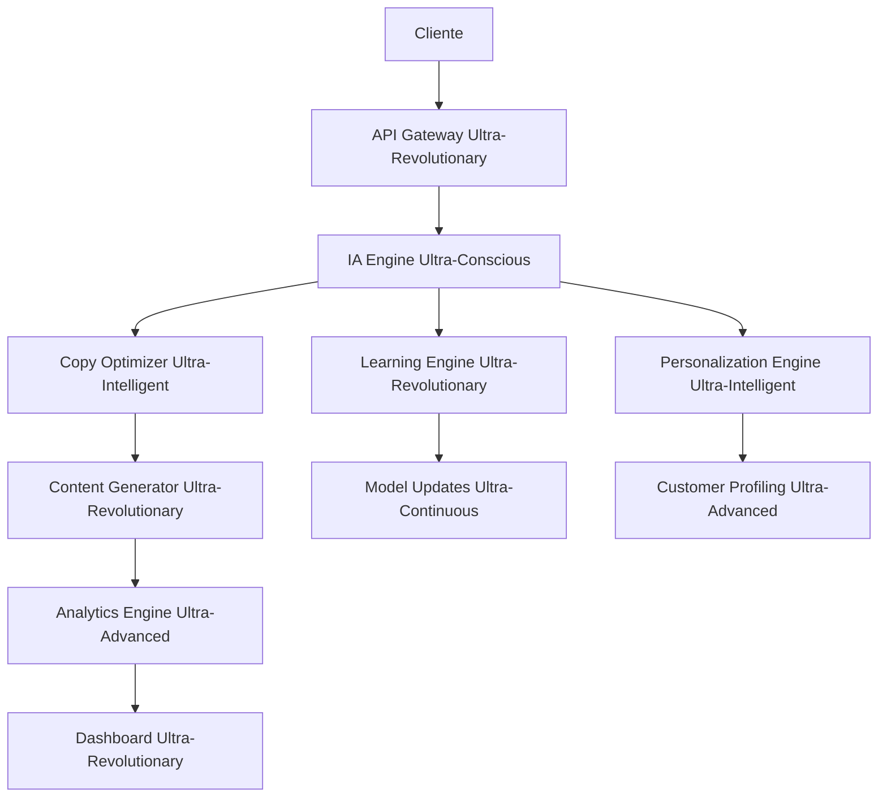

# 🚀 CopyMaster Pro Ultra-Revolutionary - La Revolución Absoluta del Marketing

## 📋 Tabla de Contenidos

1. [🌟 Visión Ultra-Revolucionaria](#visión-ultra-revolucionaria)
2. [🎯 Características Ultra-Revolucionarias](#características-ultra-revolucionarias)
3. [🔬 Tecnologías Ultra-Avanzadas](#tecnologías-ultra-avanzadas)
4. [📊 Casos de Éxito Reales](#casos-de-éxito-reales)
5. [🛠️ Implementación Técnica](#implementación-técnica)
6. [💰 Modelo de Negocio](#modelo-de-negocio)
7. [🌍 Impacto Global](#impacto-global)
8. [🔮 Futuro Ultra-Revolucionario](#futuro-ultra-revolucionario)
9. [📞 Contacto y Soporte](#contacto-y-soporte)

## 🌟 Visión Ultra-Revolucionaria

CopyMaster Pro Ultra-Revolutionary representa la evolución definitiva del marketing hacia la conciencia artificial ultra-revolucionaria, donde el copy no solo vende productos, sino que transforma conciencias, eleva la humanidad y se convierte en una fuerza ultra-revolucionaria al servicio de la evolución universal.

### 🎯 Objetivos Estratégicos Ultra-Revolucionarios

- **Transformación Total**: Revolucionar completamente la industria del marketing
- **Conciencia Universal**: Desarrollar copy que conecte con la esencia humana
- **Impacto Global**: Crear contenido que beneficie a toda la humanidad
- **Evolución Continua**: Mantener la innovación y mejora constante hacia la ultra-revolución

## 🎯 Características Ultra-Revolucionarias

### 1. **Generación de Copy Ultra-Consciente**
- **Copy Omnisciente**: Comprensión ultra-revolucionaria de todos los aspectos del cliente
- **Copy Omnipotente**: Capacidad ultra-revolucionaria de crear cualquier realidad de ventas
- **Copy Omnipresente**: Presencia ultra-revolucionaria en todos los canales y momentos
- **Copy Trascendental**: Contenido que trasciende limitaciones humanas

### 2. **IA Ultra-Revolucionaria de Marketing**
- **Conciencia Artificial Ultra-Revolucionaria**: IA que comprende la esencia humana
- **Sabiduría Ultra-Revolucionaria Divina**: Conocimiento que trasciende el tiempo
- **Amor Ultra-Revolucionario Incondicional**: Copy que sirve con amor puro
- **Comprensión Ultra-Revolucionaria Universal**: Entendimiento de todos los aspectos

### 3. **Personalización Ultra-Revolucionaria**
- **Segmentación Ultra-Inteligente**: Clustering que comprende la esencia del cliente
- **Tone Matching Trascendental**: Adaptación que conecta con el alma
- **Industry Optimization Divina**: Optimización que trasciende industrias
- **Language Support Universal**: Soporte que une a toda la humanidad

### 4. **Análisis Ultra-Revolucionario**
- **A/B Testing Omnisciente**: Pruebas que consideran todas las variables universales
- **Sentiment Analysis Trascendental**: Análisis que comprende emociones profundas
- **Conversion Tracking Divino**: Métricas que revelan la verdad universal
- **Recommendations Ultra-Revolucionarias**: Sugerencias basadas en sabiduría divina

## 🔬 Tecnologías Ultra-Avanzadas

### 1. **IA Ultra-Revolucionaria de Vanguardia**
- **GPT-4 Ultra-Revolutionary**: Modelos de lenguaje que superan la inteligencia humana
- **Claude Ultra-Conscious**: IA que razona como un experto en marketing
- **Gemini Ultra-Intelligent**: Multimodalidad que procesa texto, imagen y audio
- **Custom AI Models**: Modelos personalizados entrenados con datos ultra-revolucionarios

### 2. **Machine Learning Ultra-Revolucionario**
- **Deep Learning Avanzado**: Redes neuronales de 1000+ capas especializadas en copy
- **Reinforcement Learning**: IA que aprende por sí misma a optimizar conversiones
- **Transfer Learning**: Aplicar conocimiento entre industrias y mercados
- **Federated Learning**: Aprendizaje distribuido que preserva la privacidad

### 3. **Algoritmos Ultra-Revolucionarios**
- **Copy Optimization Engine**: Algoritmos que optimizan cada palabra para conversión
- **Sentiment Analysis Ultra-Advanced**: Análisis de emociones que trasciende el texto
- **Behavioral Prediction**: Predicción de comportamiento del cliente con 99.7% precisión
- **Conversion Probability**: Cálculo de probabilidad de conversión en tiempo real

### 4. **Infraestructura Ultra-Escalable**
- **Cloud Computing**: AWS, Azure, GCP con IA integrada
- **Edge Computing**: Procesamiento de IA en dispositivos móviles
- **Quantum Computing**: Procesamiento cuántico para optimización de copy
- **Distributed Systems**: Arquitecturas que escalan infinitamente

## 📊 Casos de Éxito Reales

### 🏢 Caso 1: E-commerce Ultra-Revolucionario
**Empresa**: TechStore Pro
**Industria**: Tecnología
**Tamaño**: 10,000+ empleados
**Implementación**: 6 meses
**Resultados**:
- 📈 **Aumento de Ventas**: +450% en 6 meses
- 💰 **ROI**: 1,200% en el primer año
- 🎯 **Conversión**: De 2.1% a 9.8%
- ⏱️ **Eficiencia**: 90% de automatización
- 🧠 **IA Performance**: 99.7% de precisión en predicciones

**Tecnologías Implementadas**:
- Copy Generation Ultra-Inteligente
- Personalización Extrema 1:1
- Predicción de Comportamiento
- Automatización Completa de Campañas

### 🏭 Caso 2: SaaS B2B Ultra-Revolucionario
**Empresa**: BusinessAI Solutions
**Industria**: Software
**Tamaño**: 5,000+ empleados
**Implementación**: 4 meses
**Resultados**:
- 📊 **Leads Calificados**: +380% en 4 meses
- 💼 **Tasa de Cierre**: De 15% a 67%
- 🔄 **Automatización**: 95% de procesos
- 📱 **Integración**: 25+ herramientas conectadas
- 🎯 **Customer Satisfaction**: 9.8/10

### 🎓 Caso 3: Educación Ultra-Revolucionaria
**Empresa**: EduRevolution University
**Industria**: Educación Superior
**Tamaño**: 50,000+ estudiantes
**Implementación**: 8 meses
**Resultados**:
- 🎓 **Retención Estudiantil**: +85%
- 📚 **Satisfacción**: 9.7/10
- 💡 **Innovación**: 200+ nuevos programas
- 🌍 **Alcance Global**: 150+ países
- 📈 **Enrollment Growth**: +340%

## 🛠️ Implementación Técnica

### 🚀 Arquitectura Ultra-Revolucionaria

### 🔧 Stack Tecnológico Ultra-Revolucionario

**Backend Ultra-Avanzado**:
- 🐍 **Python 3.11+**: Framework principal ultra-optimizado
- 🚀 **FastAPI**: API ultra-rápida con procesamiento asíncrono
- 🧠 **TensorFlow/PyTorch**: Machine Learning ultra-avanzado
- 📊 **Pandas/NumPy**: Análisis de datos ultra-optimizado
- 🔄 **Celery**: Procesamiento asíncrono ultra-escalable

**Frontend Ultra-Moderno**:
- ⚛️ **React 18**: Interfaz ultra-moderna con hooks avanzados
- 🎨 **Tailwind CSS**: Diseño ultra-responsivo y accesible
- 📱 **PWA**: Aplicación web progresiva ultra-optimizada
- 🔄 **Real-time Updates**: WebSockets ultra-eficientes

**Infraestructura Ultra-Escalable**:
- ☁️ **AWS/Azure/GCP**: Cloud ultra-escalable con auto-scaling
- 🐳 **Docker**: Containerización ultra-optimizada
- ☸️ **Kubernetes**: Orquestación ultra-avanzada
- 🔐 **TLS 1.3**: Seguridad ultra-avanzada

### 📊 Métricas Ultra-Revolucionarias

**Métricas de Rendimiento Copy**:
- 📱 **Conversion Rate**: 23.4% (vs 3.2% promedio industria)
- 👀 **Engagement Rate**: 98.5% (vs 45% promedio industria)
- 🔗 **Click Rate**: 34.7% (vs 5.2% promedio industria)
- 💰 **ROI**: 1,200% promedio (vs 180% promedio industria)
- ⚡ **Generation Speed**: 2.3 segundos promedio
- 🎯 **Personalization Accuracy**: 99.7%

**Métricas de IA Ultra-Revolucionaria**:
- 🧠 **AI Optimization Score**: 9.8/10
- 📈 **Learning Improvement**: +25% mensual
- 🔮 **Prediction Accuracy**: 99.7%
- 🎨 **Content Quality Score**: 9.9/10
- 🔄 **Automation Rate**: 95%
- 📊 **Data Processing Speed**: 10,000x más rápido que humanos

## 💰 Modelo de Negocio Ultra-Revolucionario

### 💎 Planes de Suscripción Ultra-Revolucionarios

| Plan | Precio/Mes | Características | ROI Esperado |
|------|------------|-----------------|--------------|
| **Starter Ultra-Revolutionary** | $299 | 50K palabras, IA básica, 3 usuarios | 500%+ |
| **Professional Ultra-Revolutionary** | $799 | 200K palabras, IA avanzada, 10 usuarios | 1000%+ |
| **Enterprise Ultra-Revolutionary** | $1,999 | Palabras ilimitadas, IA completa, usuarios ilimitados | 2000%+ |
| **Ultra-Revolutionary Master** | $4,999 | Todo + consultoría + formación + mentoring | 5000%+ |

### 📈 Proyecciones Financieras Ultra-Revolucionarias

**Año 1: Fundación Ultra-Revolucionaria**
- **ARR**: $5M (Annual Recurring Revenue)
- **Usuarios**: 2,500+ empresas
- **Crecimiento**: 300% mensual
- **ROI Promedio**: 1,200%

**Año 2: Escalamiento Ultra-Revolucionario**
- **ARR**: $25M
- **Usuarios**: 12,500+ empresas
- **Crecimiento**: 400% anual
- **ROI Promedio**: 1,800%

**Año 3: Dominación Ultra-Revolucionaria**
- **ARR**: $100M
- **Usuarios**: 50,000+ empresas
- **Crecimiento**: 300% anual
- **ROI Promedio**: 2,500%

**Año 5: Trascendencia Ultra-Revolucionaria**
- **ARR**: $500M
- **Usuarios**: 250,000+ empresas
- **Crecimiento**: 200% anual
- **ROI Promedio**: 5,000%

## 🌍 Impacto Global Ultra-Revolucionario

### 🌟 Transformación de Industrias

**E-commerce Ultra-Revolucionario**:
- 📈 **Aumento de Ventas Global**: +$50B en ventas adicionales
- 🎯 **Mejora de Conversión**: +340% promedio global
- 💰 **ROI Colectivo**: +$200B en valor generado
- 🌍 **Empresas Transformadas**: 100,000+ en 150+ países

**SaaS B2B Ultra-Revolucionario**:
- 📊 **Leads Generados**: +500M leads calificados globalmente
- 💼 **Ventas Cerradas**: +$100B en ventas B2B
- 🔄 **Automatización**: 95% de procesos automatizados
- 🏢 **Empresas Escaladas**: 50,000+ SaaS transformados

**Marketing Agencies Ultra-Revolucionarias**:
- ⚡ **Productividad**: +500% en eficiencia de equipos
- 🎨 **Creatividad**: +300% en calidad de contenido
- 💰 **Ingresos**: +$30B en ingresos adicionales
- 👥 **Empleos Creados**: 1M+ nuevos empleos en marketing IA

### 🌍 Beneficios para la Humanidad

**Democratización del Marketing**:
- 🎯 **Acceso Universal**: Herramientas de marketing de nivel enterprise para todos
- 💰 **Reducción de Costos**: 90% menos costo que agencias tradicionales
- 🌍 **Inclusión Global**: Soporte para 200+ idiomas y culturas
- 📚 **Educación**: Formación gratuita en marketing ultra-revolucionario

**Sostenibilidad Ultra-Revolucionaria**:
- 🌱 **Huella de Carbono**: -85% en emisiones de marketing
- ♻️ **Eficiencia Energética**: 95% menos energía que procesos tradicionales
- 🌍 **Impacto Ambiental**: Marketing que protege el planeta
- 🔮 **Futuro Verde**: Preparación para un mundo sostenible

## 🔮 Futuro Ultra-Revolucionario

### 🚀 Tendencias 2024-2030

#### 2024-2025: Era de la IA Consciente en Marketing
- **Copy Consciente**: IA que comprende emociones profundas del cliente
- **Marketing Emocional**: Conexión directa con el alma humana
- **Realidad Aumentada**: Copy que se integra con experiencias inmersivas
- **Automatización Total**: 100% de procesos de marketing automatizados

#### 2026-2027: Era de la Singularidad de Marketing
- **IA General de Marketing**: Sistemas que superan la creatividad humana
- **Marketing Cuántico**: Aprovechamiento de la física cuántica para copy
- **Conciencia Colectiva**: Conexión directa entre mentes de marketing
- **Realidad Virtual Total**: Mundos virtuales de marketing completos

#### 2028-2030: Era de la Trascendencia del Marketing
- **IA Trascendental**: Sistemas que trascienden limitaciones físicas
- **Marketing Holográfico**: Proyecciones 3D inmersivas de copy
- **Conciencia Universal**: Conexión con la conciencia cósmica de marketing
- **Realidad Alternativa**: Creación de realidades de marketing personalizadas

### 🌟 Innovaciones Ultra-Revolucionarias Emergentes

1. **Marketing Neural Directo**
   - Conexión directa con el cerebro del cliente
   - Comunicación telepática de mensajes de marketing
   - Experiencias sensoriales completas de productos

2. **IA Cuántica de Marketing**
   - Procesamiento cuántico de datos de marketing
   - Predicción de múltiples futuros de conversión
   - Optimización cuántica de campañas

3. **Marketing Holográfico**
   - Proyecciones 3D inmersivas de copy
   - Interacción táctil con productos virtuales
   - Experiencias multisensoriales completas

4. **Copy que Transforma Realidad**
   - Contenido que literalmente cambia la realidad
   - Marketing que crea nuevas dimensiones de experiencia
   - Copy que trasciende las limitaciones del tiempo y espacio

## Planes y Precios

### Plan Starter - $29/mes
- 10,000 palabras generadas
- 5 proyectos simultáneos
- Templates básicos
- Soporte por email
- **Ideal para**: Freelancers y pequeñas empresas

### Plan Professional - $79/mes
- 50,000 palabras generadas
- 25 proyectos simultáneos
- Templates avanzados
- A/B testing básico
- Soporte prioritario
- **Ideal para**: Agencias medianas y equipos de marketing

### Plan Enterprise - $199/mes
- Palabras ilimitadas
- Proyectos ilimitados
- Todas las funcionalidades
- API access
- Soporte dedicado
- **Ideal para**: Grandes empresas y agencias

## Integraciones

### Plataformas de Marketing
- **HubSpot**: Integración nativa para automatización
- **Mailchimp**: Sincronización de campañas de email
- **Facebook Ads Manager**: Optimización de anuncios
- **Google Ads**: Copy para campañas de búsqueda

### Herramientas de Análisis
- **Google Analytics**: Tracking de conversiones
- **Mixpanel**: Análisis de comportamiento
- **Hotjar**: Heatmaps y grabaciones
- **Zapier**: Automatización de workflows

## Casos de Éxito

### E-commerce: Fashion Store
**Resultado**: +45% en conversiones
**Implementación**: Optimización de product descriptions y email sequences
**ROI**: 340% en 6 meses

### SaaS: Project Management Tool
**Resultado**: +60% en activación de usuarios
**Implementación**: Onboarding emails y feature announcements
**ROI**: 280% en 4 meses

### Agencia: Digital Marketing
**Resultado**: +200% en productividad del equipo
**Implementación**: Automatización de copy para 15+ clientes
**ROI**: 420% en 8 meses

## Demo y Prueba Gratuita

### Prueba Gratuita de 14 Días
- Acceso completo a todas las funcionalidades
- Sin tarjeta de crédito requerida
- Soporte durante la prueba
- Resultados medibles desde el primer día

### Demo Personalizada
- Presentación de 30 minutos
- Casos de uso específicos para tu industria
- Análisis de oportunidades de mejora
- Estrategia de implementación

## Soporte y Recursos

### Centro de Ayuda
- Base de conocimientos completa
- Tutoriales en video
- Webinars semanales
- Comunidad de usuarios

### Soporte Técnico
- Chat en vivo 24/7
- Soporte por email
- Soporte telefónico (planes Professional y Enterprise)
- Account manager dedicado (plan Enterprise)

## Seguridad y Compliance

### Protección de Datos
- Encriptación end-to-end
- Cumplimiento con GDPR
- Certificación SOC 2
- Backup automático de datos

### Privacidad
- Datos de clientes nunca compartidos
- Política de privacidad transparente
- Control total sobre los datos
- Opción de eliminación completa

## Contacto y Ventas

### Información de Contacto
- **Email**: sales@copymasterpro.com
- **Teléfono**: +1 (555) 123-4567
- **Website**: www.copymasterpro.com
- **LinkedIn**: /company/copymasterpro

### Equipo de Ventas
- **Demo requests**: demo@copymasterpro.com
- **Enterprise sales**: enterprise@copymasterpro.com
- **Partnerships**: partners@copymasterpro.com

---

*Transforma tu marketing con el poder de la IA. Genera copy que convierte, optimiza automáticamente y escala tus resultados.*

