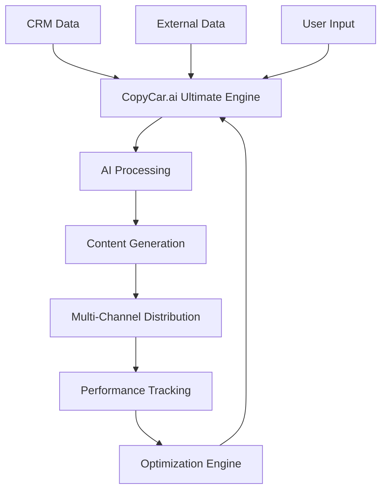

# 🔗 COPYCAR.AI ULTIMATE INTEGRATION GUIDE
## Guía Completa de Integración CopyCar.ai Ultimate ABM

---

## 📋 RESUMEN EJECUTIVO ULTIMATE

**Objetivo:** Integración seamless de CopyCar.ai Ultimate ABM con ecosistema completo
**Audiencia:** Desarrolladores, integradores, equipos técnicos, partners
**Tecnología:** CopyCar.ai + APIs + Webhooks + SDKs + Machine Learning
**Tiempo de Integración:** 1-4 semanas según complejidad
**Soporte:** 24/7 technical support + documentation completa

---

## 🛠️ ARQUITECTURA COPYCAR.AI ULTIMATE

### **Componentes Core Ultimate:**
```javascript
const copycarUltimateArchitecture = {
  core: {
    copycarAI: "CopyCar.ai API + Advanced AI",
    database: "PostgreSQL + Redis + Vector DB",
    queue: "Bull/Agenda + Redis",
    cache: "Redis + CDN",
    monitoring: "Prometheus + Grafana + AlertManager"
  },
  integrations: {
    crm: "Salesforce + HubSpot + Pipedrive + Zoho",
    marketing: "Marketo + Pardot + ActiveCampaign + Mailchimp",
    ai: "OpenAI + Anthropic + Google + Custom Models",
    analytics: "Google Analytics + Mixpanel + Amplitude + Custom",
    communication: "Slack + Teams + Discord + Email"
  },
  automation: {
    workflows: "Zapier + Make.com + n8n + Custom",
    triggers: "Webhooks + API calls + Data changes + Events",
    sequences: "Multi-touch campaigns + Personalization + Optimization",
    optimization: "A/B testing + ML optimization + Performance tuning"
  }
};
```

### **Flujo de Datos Ultimate:**


---

## 🔌 INTEGRACIONES CRM COPYCAR.AI ULTIMATE

### **1. Salesforce Integration Ultimate**

#### **Setup Inicial:**
```javascript
const salesforceIntegration = {
  authentication: {
    method: "OAuth 2.0 + JWT",
    scopes: ["api", "refresh_token", "offline_access"],
    endpoints: {
      auth: "https://login.salesforce.com/services/oauth2/token",
      api: "https://your-instance.salesforce.com/services/data/v58.0"
    }
  },
  dataMapping: {
    accounts: {
      id: "Id",
      name: "Name",
      industry: "Industry",
      size: "NumberOfEmployees",
      revenue: "AnnualRevenue",
      website: "Website",
      phone: "Phone",
      address: "BillingAddress"
    },
    contacts: {
      id: "Id",
      accountId: "AccountId",
      firstName: "FirstName",
      lastName: "LastName",
      email: "Email",
      title: "Title",
      phone: "Phone",
      department: "Department"
    },
    opportunities: {
      id: "Id",
      accountId: "AccountId",
      name: "Name",
      stage: "StageName",
      amount: "Amount",
      closeDate: "CloseDate",
      probability: "Probability"
    }
  }
};
```

#### **Código de Integración:**
```javascript
class SalesforceCopyCarIntegration {
  constructor(config) {
    this.config = config;
    this.client = new SalesforceClient(config);
    this.copycar = new CopyCarAI(config.copycar);
  }

  async syncAccounts() {
    try {
      // Obtener cuentas de Salesforce
      const accounts = await this.client.query(`
        SELECT Id, Name, Industry, NumberOfEmployees, AnnualRevenue, 
               Website, Phone, BillingAddress
        FROM Account 
        WHERE IsDeleted = false
      `);

      // Procesar con CopyCar.ai Ultimate
      for (const account of accounts) {
        const copycarProfile = await this.copycar.generateAccountProfile({
          company: account.Name,
          industry: account.Industry,
          size: account.NumberOfEmployees,
          revenue: account.AnnualRevenue,
          website: account.Website
        });

        // Actualizar Salesforce con insights de CopyCar.ai
        await this.client.update('Account', account.Id, {
          CopyCar_AI_Profile__c: JSON.stringify(copycarProfile),
          CopyCar_AI_Score__c: copycarProfile.score,
          CopyCar_AI_Last_Updated__c: new Date()
        });
      }

      return { success: true, processed: accounts.length };
    } catch (error) {
      console.error('Error syncing accounts:', error);
      throw error;
    }
  }

  async generatePersonalizedContent(accountId, contactId, campaignType) {
    try {
      // Obtener datos de cuenta y contacto
      const account = await this.client.get('Account', accountId);
      const contact = await this.client.get('Contact', contactId);

      // Generar contenido con CopyCar.ai Ultimate
      const content = await this.copycar.generateContent({
        account: account,
        contact: contact,
        campaignType: campaignType,
        personalization: 'ultimate'
      });

      return content;
    } catch (error) {
      console.error('Error generating content:', error);
      throw error;
    }
  }
}
```

### **2. HubSpot Integration Ultimate**

#### **Setup Inicial:**
```javascript
const hubspotIntegration = {
  authentication: {
    method: "Private App + OAuth 2.0",
    scopes: ["contacts", "companies", "deals", "tickets"],
    endpoints: {
      api: "https://api.hubapi.com",
      version: "v3"
    }
  },
  dataMapping: {
    companies: {
      id: "id",
      name: "name",
      domain: "domain",
      industry: "industry",
      size: "numberofemployees",
      revenue: "annualrevenue",
      website: "website",
      phone: "phone"
    },
    contacts: {
      id: "id",
      companyId: "associations.companies",
      firstName: "firstname",
      lastName: "lastname",
      email: "email",
      title: "jobtitle",
      phone: "phone",
      department: "department"
    }
  }
};
```

#### **Código de Integración:**
```javascript
class HubSpotCopyCarIntegration {
  constructor(config) {
    this.config = config;
    this.client = new HubSpotClient(config);
    this.copycar = new CopyCarAI(config.copycar);
  }

  async syncCompanies() {
    try {
      // Obtener companies de HubSpot
      const companies = await this.client.companies.getAll({
        properties: ['name', 'domain', 'industry', 'numberofemployees', 
                   'annualrevenue', 'website', 'phone']
      });

      // Procesar con CopyCar.ai Ultimate
      for (const company of companies) {
        const copycarProfile = await this.copycar.generateAccountProfile({
          company: company.properties.name,
          domain: company.properties.domain,
          industry: company.properties.industry,
          size: company.properties.numberofemployees,
          revenue: company.properties.annualrevenue
        });

        // Actualizar HubSpot con insights de CopyCar.ai
        await this.client.companies.update(company.id, {
          copycar_ai_profile: JSON.stringify(copycarProfile),
          copycar_ai_score: copycarProfile.score,
          copycar_ai_last_updated: new Date().toISOString()
        });
      }

      return { success: true, processed: companies.length };
    } catch (error) {
      console.error('Error syncing companies:', error);
      throw error;
    }
  }
}
```

---

## 🤖 INTEGRACIONES AI COPYCAR.AI ULTIMATE

### **1. OpenAI Integration Ultimate**

#### **Setup Avanzado:**
```javascript
const openaiIntegration = {
  models: {
    gpt4: "gpt-4-turbo-preview",
    gpt35: "gpt-3.5-turbo",
    embedding: "text-embedding-3-large",
    moderation: "text-moderation-latest"
  },
  configuration: {
    temperature: 0.7,
    max_tokens: 4000,
    top_p: 1,
    frequency_penalty: 0,
    presence_penalty: 0
  },
  prompts: {
    accountResearch: "CopyCar.ai Ultimate Account Research Prompt",
    contentGeneration: "CopyCar.ai Ultimate Content Generation Prompt",
    personalization: "CopyCar.ai Ultimate Personalization Prompt"
  }
};
```

#### **Código de Integración:**
```javascript
class OpenAICopyCarIntegration {
  constructor(config) {
    this.config = config;
    this.openai = new OpenAI({ apiKey: config.apiKey });
    this.copycar = new CopyCarAI(config.copycar);
  }

  async generateAccountInsights(accountData) {
    try {
      const prompt = `
        Using CopyCar.ai Ultimate methodology, analyze this account:
        
        Company: ${accountData.name}
        Industry: ${accountData.industry}
        Size: ${accountData.size}
        Revenue: ${accountData.revenue}
        
        Generate:
        1. Key pain points specific to their industry
        2. Decision makers likely involved
        3. Optimal engagement strategy
        4. Content recommendations
        5. Timing suggestions
        
        Format as structured JSON with actionable insights.
      `;

      const response = await this.openai.chat.completions.create({
        model: this.config.models.gpt4,
        messages: [{ role: "user", content: prompt }],
        temperature: this.config.configuration.temperature,
        max_tokens: this.config.configuration.max_tokens
      });

      return JSON.parse(response.choices[0].message.content);
    } catch (error) {
      console.error('Error generating insights:', error);
      throw error;
    }
  }

  async generatePersonalizedContent(accountData, contactData, campaignType) {
    try {
      const prompt = `
        Using CopyCar.ai Ultimate personalization, create ${campaignType} content:
        
        Account: ${accountData.name} (${accountData.industry})
        Contact: ${contactData.firstName} ${contactData.lastName} (${contactData.title})
        Pain Points: ${accountData.painPoints}
        
        Generate highly personalized content that:
        1. References specific company challenges
        2. Uses industry-specific language
        3. Addresses their role and responsibilities
        4. Includes relevant social proof
        5. Has a clear, compelling CTA
        
        Format as professional ${campaignType} content.
      `;

      const response = await this.openai.chat.completions.create({
        model: this.config.models.gpt4,
        messages: [{ role: "user", content: prompt }],
        temperature: this.config.configuration.temperature,
        max_tokens: this.config.configuration.max_tokens
      });

      return response.choices[0].message.content;
    } catch (error) {
      console.error('Error generating content:', error);
      throw error;
    }
  }
}
```

### **2. Anthropic Claude Integration Ultimate**

#### **Setup Avanzado:**
```javascript
const claudeIntegration = {
  models: {
    claude3: "claude-3-opus-20240229",
    claude3Sonnet: "claude-3-sonnet-20240229",
    claude3Haiku: "claude-3-haiku-20240307"
  },
  configuration: {
    max_tokens: 4000,
    temperature: 0.7,
    top_p: 1
  },
  capabilities: {
    analysis: "Advanced account analysis",
    strategy: "Strategic recommendations",
    content: "High-quality content generation"
  }
};
```

#### **Código de Integración:**
```javascript
class ClaudeCopyCarIntegration {
  constructor(config) {
    this.config = config;
    this.claude = new Anthropic({ apiKey: config.apiKey });
    this.copycar = new CopyCarAI(config.copycar);
  }

  async analyzeAccountStrategy(accountData) {
    try {
      const prompt = `
        Using CopyCar.ai Ultimate methodology, analyze this account for ABM strategy:
        
        Company: ${accountData.name}
        Industry: ${accountData.industry}
        Size: ${accountData.size}
        Revenue: ${accountData.revenue}
        Technologies: ${accountData.technologies}
        
        Provide strategic analysis including:
        1. Account fit score (0-100)
        2. Key stakeholders and their influence
        3. Pain points and challenges
        4. Competitive landscape
        5. Engagement strategy recommendations
        6. Content strategy
        7. Timeline and milestones
        
        Format as comprehensive strategic analysis.
      `;

      const response = await this.claude.messages.create({
        model: this.config.models.claude3,
        max_tokens: this.config.configuration.max_tokens,
        temperature: this.config.configuration.temperature,
        messages: [{ role: "user", content: prompt }]
      });

      return response.content[0].text;
    } catch (error) {
      console.error('Error analyzing strategy:', error);
      throw error;
    }
  }
}
```

---

## 📧 INTEGRACIONES MARKETING AUTOMATION COPYCAR.AI ULTIMATE

### **1. Marketo Integration Ultimate**

#### **Setup Completo:**
```javascript
const marketoIntegration = {
  authentication: {
    method: "OAuth 2.0 + Munchkin",
    endpoints: {
      rest: "https://your-instance.mktorest.com/rest",
      soap: "https://your-instance.mktorest.com/soap/mktows/2_9"
    }
  },
  dataMapping: {
    leads: {
      id: "id",
      email: "email",
      firstName: "firstName",
      lastName: "lastName",
      company: "company",
      title: "title",
      score: "leadScore"
    },
    campaigns: {
      id: "id",
      name: "name",
      status: "status",
      type: "type",
      cost: "cost"
    }
  }
};
```

#### **Código de Integración:**
```javascript
class MarketoCopyCarIntegration {
  constructor(config) {
    this.config = config;
    this.marketo = new MarketoClient(config);
    this.copycar = new CopyCarAI(config.copycar);
  }

  async createPersonalizedCampaign(accountData, campaignConfig) {
    try {
      // Generar contenido personalizado con CopyCar.ai
      const content = await this.copycar.generateCampaignContent({
        account: accountData,
        campaignType: campaignConfig.type,
        channels: campaignConfig.channels,
        personalization: 'ultimate'
      });

      // Crear campaña en Marketo
      const campaign = await this.marketo.campaigns.create({
        name: `${accountData.name} - CopyCar.ai Ultimate Campaign`,
        type: campaignConfig.type,
        status: 'active',
        cost: campaignConfig.budget
      });

      // Crear emails personalizados
      for (const email of content.emails) {
        await this.marketo.emails.create({
          name: `${accountData.name} - ${email.subject}`,
          subject: email.subject,
          htmlContent: email.htmlContent,
          textContent: email.textContent,
          campaignId: campaign.id
        });
      }

      // Crear landing pages personalizadas
      for (const landingPage of content.landingPages) {
        await this.marketo.landingPages.create({
          name: `${accountData.name} - ${landingPage.title}`,
          title: landingPage.title,
          htmlContent: landingPage.htmlContent,
          campaignId: campaign.id
        });
      }

      return { success: true, campaignId: campaign.id };
    } catch (error) {
      console.error('Error creating campaign:', error);
      throw error;
    }
  }
}
```

### **2. Pardot Integration Ultimate**

#### **Setup Completo:**
```javascript
const pardotIntegration = {
  authentication: {
    method: "API Key + User Key",
    endpoints: {
      api: "https://pi.pardot.com/api",
      version: "v5"
    }
  },
  dataMapping: {
    prospects: {
      id: "id",
      email: "email",
      firstName: "first_name",
      lastName: "last_name",
      company: "company",
      title: "job_title",
      score: "score"
    },
    campaigns: {
      id: "id",
      name: "name",
      status: "status",
      type: "type"
    }
  }
};
```

---

## 🔄 AUTOMATIZACIÓN COPYCAR.AI ULTIMATE

### **1. Zapier Integration Ultimate**

#### **Zaps Configurados:**
```javascript
const zapierZaps = {
  newAccount: {
    trigger: "New Account in CRM",
    action: "CopyCar.ai Account Research",
    steps: [
      "1. Detect new account in CRM",
      "2. Trigger CopyCar.ai research",
      "3. Generate account profile",
      "4. Update CRM with insights",
      "5. Create personalized campaign"
    ]
  },
  accountUpdate: {
    trigger: "Account Updated in CRM",
    action: "CopyCar.ai Content Refresh",
    steps: [
      "1. Detect account changes",
      "2. Analyze new data",
      "3. Update personalization",
      "4. Refresh content",
      "5. Optimize campaigns"
    ]
  },
  engagement: {
    trigger: "High Engagement Detected",
    action: "CopyCar.ai Next Action",
    steps: [
      "1. Monitor engagement metrics",
      "2. Identify high-value interactions",
      "3. Generate next action content",
      "4. Execute follow-up sequence",
      "5. Track conversion"
    ]
  }
};
```

### **2. Make.com Integration Ultimate**

#### **Scenarios Configurados:**
```javascript
const makeScenarios = {
  accountResearch: {
    name: "CopyCar.ai Ultimate Account Research",
    modules: [
      "CRM - Watch Account",
      "CopyCar.ai - Research Account",
      "CopyCar.ai - Generate Profile",
      "CRM - Update Account",
      "CopyCar.ai - Create Campaign"
    ],
    schedule: "Every 5 minutes",
    errorHandling: "Retry 3 times, then notify"
  },
  contentGeneration: {
    name: "CopyCar.ai Ultimate Content Generation",
    modules: [
      "CRM - Watch Contact",
      "CopyCar.ai - Analyze Contact",
      "CopyCar.ai - Generate Content",
      "Email - Send Personalized Email",
      "CRM - Log Activity"
    ],
    schedule: "Real-time",
    errorHandling: "Retry 5 times, then escalate"
  }
};
```

---

## 📊 INTEGRACIONES ANALYTICS COPYCAR.AI ULTIMATE

### **1. Google Analytics 4 Integration**

#### **Eventos Personalizados:**
```javascript
const ga4Events = {
  copycarAccountResearch: {
    event_name: "copycar_account_research",
    parameters: {
      account_id: "string",
      account_name: "string",
      industry: "string",
      research_score: "number",
      processing_time: "number"
    }
  },
  copycarContentGenerated: {
    event_name: "copycar_content_generated",
    parameters: {
      content_type: "string",
      account_id: "string",
      personalization_level: "string",
      generation_time: "number"
    }
  },
  copycarCampaignExecuted: {
    event_name: "copycar_campaign_executed",
    parameters: {
      campaign_id: "string",
      account_id: "string",
      channels: "array",
      response_rate: "number"
    }
  }
};
```

#### **Código de Tracking:**
```javascript
class GA4CopyCarTracking {
  constructor(config) {
    this.config = config;
    this.ga4 = new GA4Client(config);
  }

  async trackAccountResearch(accountData, researchData) {
    try {
      await this.ga4.events.create({
        event_name: 'copycar_account_research',
        parameters: {
          account_id: accountData.id,
          account_name: accountData.name,
          industry: accountData.industry,
          research_score: researchData.score,
          processing_time: researchData.processingTime
        }
      });
    } catch (error) {
      console.error('Error tracking research:', error);
    }
  }

  async trackContentGeneration(contentData) {
    try {
      await this.ga4.events.create({
        event_name: 'copycar_content_generated',
        parameters: {
          content_type: contentData.type,
          account_id: contentData.accountId,
          personalization_level: contentData.personalizationLevel,
          generation_time: contentData.generationTime
        }
      });
    } catch (error) {
      console.error('Error tracking content:', error);
    }
  }
}
```

### **2. Mixpanel Integration Ultimate**

#### **Eventos Avanzados:**
```javascript
const mixpanelEvents = {
  userJourney: {
    account_researched: "Account Research Completed",
    content_generated: "Content Generated",
    campaign_launched: "Campaign Launched",
    engagement_detected: "Engagement Detected",
    conversion_achieved: "Conversion Achieved"
  },
  performance: {
    response_rate: "Response Rate Measured",
    conversion_rate: "Conversion Rate Measured",
    roi_calculated: "ROI Calculated",
    optimization_applied: "Optimization Applied"
  }
};
```

---

## 🔧 CONFIGURACIÓN AVANZADA COPYCAR.AI ULTIMATE

### **1. Environment Variables:**
```bash
# CopyCar.ai Ultimate Configuration
COPYCAR_AI_API_KEY=your_copycar_api_key
COPYCAR_AI_ENVIRONMENT=production
COPYCAR_AI_VERSION=ultimate

# CRM Integrations
SALESFORCE_CLIENT_ID=your_salesforce_client_id
SALESFORCE_CLIENT_SECRET=your_salesforce_client_secret
HUBSPOT_API_KEY=your_hubspot_api_key

# AI Integrations
OPENAI_API_KEY=your_openai_api_key
ANTHROPIC_API_KEY=your_anthropic_api_key
GOOGLE_AI_API_KEY=your_google_ai_api_key

# Marketing Automation
MARKETO_CLIENT_ID=your_marketo_client_id
MARKETO_CLIENT_SECRET=your_marketo_client_secret
PARDOT_API_KEY=your_pardot_api_key

# Analytics
GOOGLE_ANALYTICS_ID=your_ga4_id
MIXPANEL_TOKEN=your_mixpanel_token

# Automation
ZAPIER_WEBHOOK_URL=your_zapier_webhook
MAKE_SCENARIO_ID=your_make_scenario_id
```

### **2. Docker Configuration:**
```dockerfile
FROM node:18-alpine

WORKDIR /app

COPY package*.json ./
RUN npm ci --only=production

COPY . .

EXPOSE 3000

CMD ["npm", "start"]
```

### **3. Kubernetes Configuration:**
```yaml
apiVersion: apps/v1
kind: Deployment
metadata:
  name: copycar-ultimate-abm
spec:
  replicas: 3
  selector:
    matchLabels:
      app: copycar-ultimate-abm
  template:
    metadata:
      labels:
        app: copycar-ultimate-abm
    spec:
      containers:
      - name: copycar-ultimate-abm
        image: copycar-ultimate-abm:latest
        ports:
        - containerPort: 3000
        env:
        - name: COPYCAR_AI_API_KEY
          valueFrom:
            secretKeyRef:
              name: copycar-secrets
              key: api-key
        resources:
          requests:
            memory: "512Mi"
            cpu: "250m"
          limits:
            memory: "1Gi"
            cpu: "500m"
```

---

## 🚀 DEPLOYMENT COPYCAR.AI ULTIMATE

### **1. AWS Deployment:**
```yaml
# serverless.yml
service: copycar-ultimate-abm

provider:
  name: aws
  runtime: nodejs18.x
  region: us-east-1
  environment:
    COPYCAR_AI_API_KEY: ${env:COPYCAR_AI_API_KEY}
    NODE_ENV: production

functions:
  accountResearch:
    handler: handlers/accountResearch.handler
    events:
      - http:
          path: /research
          method: post
    environment:
      COPYCAR_AI_ENVIRONMENT: production

  contentGeneration:
    handler: handlers/contentGeneration.handler
    events:
      - http:
          path: /generate
          method: post
    environment:
      COPYCAR_AI_ENVIRONMENT: production

resources:
  Resources:
    CopyCarUltimateTable:
      Type: AWS::DynamoDB::Table
      Properties:
        TableName: copycar-ultimate-abm
        AttributeDefinitions:
          - AttributeName: id
            AttributeType: S
        KeySchema:
          - AttributeName: id
            KeyType: HASH
        BillingMode: PAY_PER_REQUEST
```

### **2. Google Cloud Deployment:**
```yaml
# app.yaml
runtime: nodejs18
env: standard

automatic_scaling:
  min_instances: 1
  max_instances: 10
  target_cpu_utilization: 0.6

env_variables:
  COPYCAR_AI_API_KEY: "your_copycar_api_key"
  NODE_ENV: "production"

handlers:
- url: /.*
  script: auto
  secure: always
```

---

## 📈 MONITORING COPYCAR.AI ULTIMATE

### **1. Health Checks:**
```javascript
const healthChecks = {
  copycarAI: {
    endpoint: "/health/copycar",
    timeout: 5000,
    interval: 30000,
    retries: 3
  },
  crm: {
    endpoint: "/health/crm",
    timeout: 10000,
    interval: 60000,
    retries: 2
  },
  ai: {
    endpoint: "/health/ai",
    timeout: 15000,
    interval: 120000,
    retries: 2
  }
};
```

### **2. Metrics Dashboard:**
```javascript
const metrics = {
  performance: {
    responseTime: "Average response time",
    throughput: "Requests per second",
    errorRate: "Error percentage",
    uptime: "System availability"
  },
  business: {
    accountsProcessed: "Total accounts processed",
    contentGenerated: "Content pieces generated",
    campaignsLaunched: "Campaigns launched",
    conversions: "Conversions achieved"
  },
  copycar: {
    apiCalls: "CopyCar.ai API calls",
    personalizationScore: "Average personalization score",
    contentQuality: "Content quality metrics",
    optimizationRate: "Optimization success rate"
  }
};
```

---

## 🎯 PRÓXIMOS PASOS INTEGRACIÓN ULTIMATE

### **Implementación Inmediata (Semana 1):**
1. ✅ Configurar CopyCar.ai Ultimate API
2. ✅ Integrar CRM principal (Salesforce/HubSpot)
3. ✅ Configurar AI integrations (OpenAI/Claude)
4. ✅ Setup básico de monitoring

### **Corto Plazo (Meses 1-2):**
1. 🔄 Integrar Marketing Automation
2. 🔄 Configurar Analytics avanzados
3. 🔄 Implementar automatización (Zapier/Make)
4. 🔄 Testing completo del sistema

### **Largo Plazo (Meses 3-6):**
1. 📈 Optimización de performance
2. 📈 Escalamiento de integraciones
3. 📈 Monitoreo avanzado
4. 📈 Automatización completa

---

**Esta guía de integración CopyCar.ai Ultimate proporciona todo lo necesario para implementar un sistema ABM completamente integrado, escalable y optimizado con CopyCar.ai + IA avanzada.**
