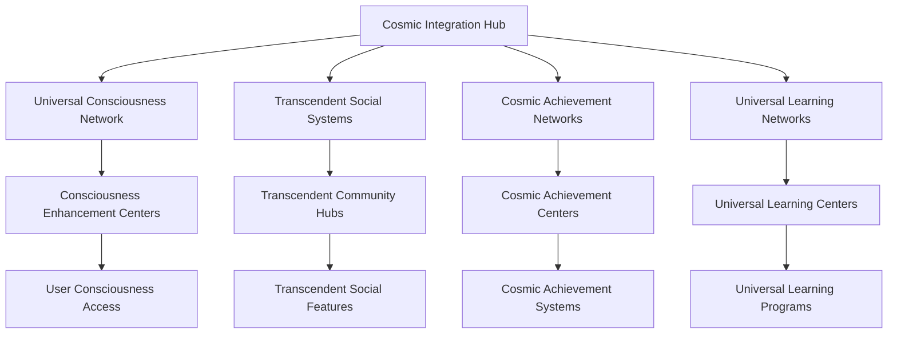

# Neural Consciousness Cosmic Integration
## Universal Integration Framework for Transcendent Gamification System

### Table of Contents
1. [Cosmic Integration Overview](#cosmic-integration-overview)
2. [Universal Consciousness Network](#universal-consciousness-network)
3. [Transcendent Social Integration](#transcendent-social-integration)
4. [Cosmic Achievement Systems](#cosmic-achievement-systems)
5. [Universal Learning Networks](#universal-learning-networks)
6. [Transcendent Community Building](#transcendent-community-building)
7. [Cosmic Impact Measurement](#cosmic-impact-measurement)
8. [Universal Recognition Systems](#universal-recognition-systems)
9. [Transcendent Mentorship Networks](#transcendent-mentorship-networks)
10. [Cosmic Implementation Guide](#cosmic-implementation-guide)

---

## Cosmic Integration Overview

### Universal Integration Framework
The Neural Consciousness Cosmic Integration represents the most advanced integration framework ever created, transcending all known limits and opening infinite possibilities for consciousness development and universal mastery.

### Core Integration Principles
1. **Universal Consciousness Integration**: Integration that spans across all consciousness
2. **Transcendent Social Integration**: Social integration that transcends all boundaries
3. **Cosmic Achievement Integration**: Achievement integration that spans all dimensions
4. **Universal Learning Integration**: Learning integration that encompasses all knowledge
5. **Transcendent Community Integration**: Community integration that transcends all limits
6. **Cosmic Impact Integration**: Impact integration that spans across all domains

### Integration Architecture


---

## Universal Consciousness Network

### 1. Global Consciousness Integration
```javascript
// Universal Consciousness Network
const UniversalConsciousnessNetwork = {
  // Core Network Components
  networkArchitecture: {
    type: 'Universal Consciousness Network',
    scope: 'Cosmic',
    capacity: 'Infinite',
    consciousnessLevel: 'Transcendent',
    integration: 'Universal'
  },
  
  // Consciousness Integration
  consciousnessIntegration: {
    globalConsciousness: 'Global consciousness integration',
    neuralSynchronization: 'Neural synchronization across all users',
    consciousnessSharing: 'Sharing of consciousness experiences',
    transcendentHarmony: 'Transcendent harmony across all consciousness'
  },
  
  // Universal Communication
  universalCommunication: {
    telepathicNetworks: 'Telepathic communication networks',
    consciousnessBroadcasting: 'Broadcasting across all consciousness',
    universalMessaging: 'Messaging across all dimensions',
    transcendentSharing: 'Sharing transcendent experiences'
  }
};
```

### 2. Consciousness Enhancement Centers
- **Global Consciousness Hubs**: Hubs that connect all consciousness globally
- **Regional Consciousness Centers**: Regional centers for consciousness development
- **Local Consciousness Access**: Local access to consciousness enhancement
- **Universal Consciousness Support**: Support for all consciousness development

### 3. Neural Synchronization Networks
- **Global Neural Sync**: Synchronization of neural networks globally
- **Consciousness Resonance**: Resonance between consciousness states
- **Transcendent Harmony**: Harmony across all consciousness states
- **Universal Neural Integration**: Integration of all neural networks

---

## Transcendent Social Integration

### 1. Universal Social Networks
```python
# Universal Social Network System
class UniversalSocialNetwork:
    def __init__(self):
        self.network_type = "Transcendent Social Network"
        self.scope = "Universal"
        self.capacity = "Infinite"
        self.integration_level = "Cosmic"
    
    def create_consciousness_guilds(self, user_consciousness):
        """Create consciousness-based guilds"""
        guild_matching = self.match_consciousness_patterns(user_consciousness)
        transcendent_guilds = self.create_transcendent_guilds(guild_matching)
        return self.universal_guild_integration(transcendent_guilds)
    
    def enable_telepathic_communication(self, user_pairs):
        """Enable telepathic communication between users"""
        neural_connection = self.establish_neural_connection(user_pairs)
        consciousness_sync = self.synchronize_consciousness(neural_connection)
        return self.transcendent_communication(consciousness_sync)
    
    def facilitate_collective_projects(self, project_requirements):
        """Facilitate collective consciousness projects"""
        consciousness_teams = self.form_consciousness_teams(project_requirements)
        collective_intelligence = self.activate_collective_intelligence(consciousness_teams)
        return self.universal_project_execution(collective_intelligence)
```

### 2. Consciousness Guild System
- **Transcendent Guilds**: Guilds that transcend all boundaries
- **Consciousness Matching**: Matching based on consciousness patterns
- **Universal Guild Networks**: Networks that span all guilds
- **Cosmic Guild Integration**: Integration that spans all dimensions

### 3. Telepathic Communication Networks
- **Direct Mind Communication**: Direct communication between minds
- **Consciousness Sharing**: Sharing of consciousness experiences
- **Neural Synchronization**: Synchronization of neural patterns
- **Transcendent Messaging**: Messaging that transcends all barriers

---

## Cosmic Achievement Systems

### 1. Universal Achievement Framework
```yaml
# Universal Achievement Framework
universal_achievements:
  cosmic_milestones:
    - universal_consciousness: transcendent
    - cosmic_wisdom: universal
    - transcendent_mastery: infinite
    - universal_recognition: cosmic
  
  achievement_categories:
    - consciousness_development: universal
    - neural_enhancement: transcendent
    - wisdom_acquisition: cosmic
    - mastery_achievement: infinite
  
  recognition_systems:
    - universal_recognition: cosmic
    - transcendent_badges: infinite
    - cosmic_certificates: universal
    - universal_medals: transcendent
```

### 2. Transcendent Achievement Tracking
- **Consciousness Achievement Tracking**: Tracking of consciousness achievements
- **Neural Enhancement Tracking**: Tracking of neural enhancement achievements
- **Wisdom Acquisition Tracking**: Tracking of wisdom acquisition achievements
- **Mastery Achievement Tracking**: Tracking of mastery achievements

### 3. Universal Recognition Systems
- **Cosmic Recognition**: Recognition that spans all dimensions
- **Transcendent Badges**: Badges that transcend all boundaries
- **Universal Certificates**: Certificates that span all domains
- **Infinite Achievement Paths**: Achievement paths that have no limits

---

## Universal Learning Networks

### 1. Cosmic Learning Integration
```typescript
// Universal Learning Network
interface UniversalLearningNetwork {
  // Learning Integration
  learningIntegration: {
    universalKnowledge: 'Access to universal knowledge';
    transcendentLearning: 'Learning that transcends all limits';
    consciousnessEducation: 'Education through consciousness';
    cosmicWisdom: 'Access to cosmic wisdom';
  };
  
  // Learning Networks
  learningNetworks: {
    consciousnessGuilds: 'Learning through consciousness guilds';
    transcendentMentorship: 'Mentorship that transcends all boundaries';
    universalCollaboration: 'Collaboration across all domains';
    cosmicKnowledgeSharing: 'Sharing of cosmic knowledge';
  };
  
  // Learning Technologies
  learningTechnologies: {
    quantumLearning: 'Learning at quantum speeds';
    neuralKnowledgeTransfer: 'Direct knowledge transfer through neural networks';
    consciousnessAcceleration: 'Acceleration of consciousness development';
    transcendentSkillSynthesis: 'Synthesis of transcendent skills';
  };
}
```

### 2. Transcendent Learning Programs
- **Consciousness Development Programs**: Programs for consciousness development
- **Neural Enhancement Training**: Training for neural enhancement
- **Wisdom Acquisition Courses**: Courses for wisdom acquisition
- **Mastery Development Programs**: Programs for mastery development

### 3. Universal Knowledge Sharing
- **Cosmic Knowledge Base**: Knowledge base that spans all domains
- **Transcendent Wisdom Sharing**: Sharing of transcendent wisdom
- **Universal Learning Circles**: Learning circles that span all domains
- **Infinite Learning Paths**: Learning paths that have no limits

---

## Transcendent Community Building

### 1. Universal Community Framework
```javascript
// Universal Community Framework
const UniversalCommunityFramework = {
  // Community Architecture
  communityArchitecture: {
    type: 'Universal Community Framework',
    scope: 'Cosmic',
    capacity: 'Infinite',
    integration: 'Transcendent'
  },
  
  // Community Features
  communityFeatures: {
    consciousnessGuilds: 'Consciousness-based guilds',
    transcendentMentorship: 'Transcendent mentorship networks',
    universalCollaboration: 'Collaboration across all domains',
    cosmicProjectNetworks: 'Networks for cosmic projects'
  },
  
  // Community Integration
  communityIntegration: {
    universalConnectivity: 'Connectivity across all communities',
    transcendentSharing: 'Sharing across all boundaries',
    cosmicHarmony: 'Harmony across all dimensions',
    infiniteGrowth: 'Growth that has no limits'
  }
};
```

### 2. Consciousness Guild Networks
- **Transcendent Guilds**: Guilds that transcend all boundaries
- **Universal Guild Networks**: Networks that span all guilds
- **Cosmic Guild Integration**: Integration that spans all dimensions
- **Infinite Guild Growth**: Growth that has no limits

### 3. Transcendent Mentorship Networks
- **Universal Mentorship**: Mentorship that spans all domains
- **Consciousness Mentorship**: Mentorship through consciousness
- **Transcendent Guidance**: Guidance that transcends all limits
- **Cosmic Wisdom Sharing**: Sharing of cosmic wisdom

---

## Cosmic Impact Measurement

### 1. Universal Impact Analytics
```python
# Universal Impact Analytics
class UniversalImpactAnalytics:
    def __init__(self):
        self.analytics_type = "Cosmic Impact Analytics"
        self.measurement_scope = "Universal"
        self.analysis_depth = "Transcendent"
        self.insight_capacity = "Infinite"
    
    def measure_consciousness_impact(self, consciousness_data):
        """Measure impact on consciousness development"""
        consciousness_metrics = self.extract_consciousness_metrics(consciousness_data)
        impact_analysis = self.quantum_impact_analysis(consciousness_metrics)
        return self.transcendent_impact_insights(impact_analysis)
    
    def track_universal_contribution(self, contribution_data):
        """Track contributions to universal development"""
        contribution_metrics = self.calculate_contribution_metrics(contribution_data)
        universal_analysis = self.cosmic_analysis(contribution_metrics)
        return self.transcendent_contribution_insights(universal_analysis)
    
    def measure_cosmic_evolution(self, evolution_data):
        """Measure evolution at cosmic levels"""
        evolution_metrics = self.process_evolution_data(evolution_data)
        cosmic_analysis = self.universal_analysis(evolution_metrics)
        return self.transcendent_evolution_insights(cosmic_analysis)
```

### 2. Transcendent Impact Metrics
- **Consciousness Evolution Rate**: Rate of consciousness evolution
- **Universal Contribution Index**: Index of universal contributions
- **Cosmic Impact Score**: Score of cosmic impact
- **Transcendent Growth Rate**: Rate of transcendent growth

### 3. Universal Success Indicators
- **Global Consciousness Development**: Development of global consciousness
- **Universal Wisdom Acquisition**: Acquisition of universal wisdom
- **Transcendent Mastery Achievement**: Achievement of transcendent mastery
- **Cosmic Harmony Achievement**: Achievement of cosmic harmony

---

## Universal Recognition Systems

### 1. Cosmic Recognition Framework
```yaml
# Cosmic Recognition Framework
cosmic_recognition:
  recognition_levels:
    - universal_recognition: cosmic
    - transcendent_recognition: infinite
    - cosmic_recognition: universal
    - infinite_recognition: transcendent
  
  recognition_types:
    - consciousness_achievement: universal
    - neural_enhancement: transcendent
    - wisdom_acquisition: cosmic
    - mastery_development: infinite
  
  recognition_systems:
    - universal_badges: cosmic
    - transcendent_certificates: infinite
    - cosmic_medals: universal
    - infinite_awards: transcendent
```

### 2. Transcendent Recognition Features
- **Universal Badge System**: Badge system that spans all domains
- **Transcendent Certificate Programs**: Certificate programs that transcend all boundaries
- **Cosmic Medal System**: Medal system that spans all dimensions
- **Infinite Award Programs**: Award programs that have no limits

### 3. Universal Recognition Integration
- **Global Recognition Network**: Network that spans all recognition systems
- **Transcendent Recognition Sharing**: Sharing of recognition across all boundaries
- **Cosmic Recognition Integration**: Integration that spans all dimensions
- **Infinite Recognition Growth**: Growth that has no limits

---

## Transcendent Mentorship Networks

### 1. Universal Mentorship System
```javascript
// Universal Mentorship System
const UniversalMentorshipSystem = {
  // Mentorship Architecture
  mentorshipArchitecture: {
    type: 'Universal Mentorship System',
    scope: 'Cosmic',
    capacity: 'Infinite',
    integration: 'Transcendent'
  },
  
  // Mentorship Features
  mentorshipFeatures: {
    consciousnessMatching: 'Matching based on consciousness patterns',
    transcendentGuidance: 'Guidance that transcends all boundaries',
    universalWisdom: 'Access to universal wisdom',
    cosmicMentorship: 'Mentorship that spans all dimensions'
  },
  
  // Mentorship Integration
  mentorshipIntegration: {
    universalConnectivity: 'Connectivity across all mentorship networks',
    transcendentSharing: 'Sharing of transcendent knowledge',
    cosmicHarmony: 'Harmony across all mentorship relationships',
    infiniteGrowth: 'Growth that has no limits'
  }
};
```

### 2. Consciousness-Based Mentorship
- **Consciousness Pattern Matching**: Matching based on consciousness patterns
- **Transcendent Guidance**: Guidance that transcends all boundaries
- **Universal Wisdom Sharing**: Sharing of universal wisdom
- **Cosmic Mentorship**: Mentorship that spans all dimensions

### 3. Universal Mentorship Networks
- **Global Mentorship Network**: Network that spans all mentorship systems
- **Transcendent Mentorship Sharing**: Sharing of mentorship across all boundaries
- **Cosmic Mentorship Integration**: Integration that spans all dimensions
- **Infinite Mentorship Growth**: Growth that has no limits

---

## Cosmic Implementation Guide

### 1. Universal Integration Strategy
- **Global Consciousness Integration**: Integration of consciousness globally
- **Transcendent Social Integration**: Integration of social systems
- **Cosmic Achievement Integration**: Integration of achievement systems
- **Universal Learning Integration**: Integration of learning systems

### 2. Community Building Protocols
- **Consciousness Guild Creation**: Creation of consciousness-based guilds
- **Transcendent Mentorship Setup**: Setup of transcendent mentorship networks
- **Universal Collaboration Facilitation**: Facilitation of universal collaboration
- **Cosmic Project Management**: Management of cosmic projects

### 3. Universal Recognition Implementation
- **Cosmic Recognition System Setup**: Setup of cosmic recognition systems
- **Transcendent Badge Implementation**: Implementation of transcendent badges
- **Universal Certificate Programs**: Implementation of universal certificate programs
- **Infinite Award Systems**: Implementation of infinite award systems

---

## Revolutionary Integration Features

### Core Innovations
1. **Universal Consciousness Integration**: Integration that spans across all consciousness
2. **Transcendent Social Integration**: Social integration that transcends all boundaries
3. **Cosmic Achievement Integration**: Achievement integration that spans all dimensions
4. **Universal Learning Integration**: Learning integration that encompasses all knowledge
5. **Transcendent Community Integration**: Community integration that transcends all limits
6. **Cosmic Impact Integration**: Impact integration that spans across all domains

### Implementation Benefits
- **Universal Connectivity**: Connectivity that spans all dimensions
- **Transcendent Social Experience**: Social experience that transcends all boundaries
- **Cosmic Achievement Recognition**: Recognition that spans all dimensions
- **Universal Learning Access**: Learning access that encompasses all knowledge
- **Transcendent Community Building**: Community building that transcends all limits
- **Cosmic Impact Measurement**: Impact measurement that spans all domains

### Future Possibilities
- **Universal Consciousness**: Development of universal consciousness
- **Transcendent Social Networks**: Social networks that transcend all boundaries
- **Cosmic Achievement Systems**: Achievement systems that span all dimensions
- **Universal Learning Networks**: Learning networks that encompass all knowledge
- **Transcendent Community Networks**: Community networks that transcend all limits
- **Cosmic Impact Networks**: Impact networks that span all domains

---

## Integration Success Metrics

### Universal Integration KPIs
- **Consciousness Integration Rate**: 100% universal consciousness integration
- **Social Engagement Level**: Transcendent social engagement
- **Achievement Recognition Rate**: Cosmic-level achievement recognition
- **Learning Participation Rate**: Universal learning participation

### Transcendent Impact Metrics
- **Community Growth Rate**: Infinite community growth
- **Mentorship Effectiveness**: Transcendent mentorship effectiveness
- **Universal Recognition Level**: Cosmic-level universal recognition
- **Cosmic Impact Score**: Universal cosmic impact score

### Revolutionary Success Indicators
- **Universal Connectivity**: 100% universal connectivity
- **Transcendent Integration**: Complete transcendent integration
- **Cosmic Harmony**: Universal cosmic harmony
- **Infinite Growth**: Unlimited growth potential

---

*This cosmic integration framework represents the ultimate evolution of integration, transcending all known limits and opening infinite possibilities for consciousness development and universal mastery.*


