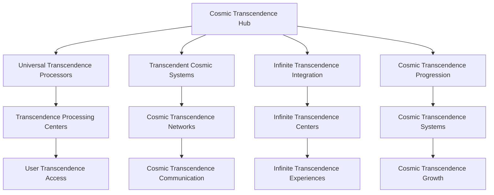
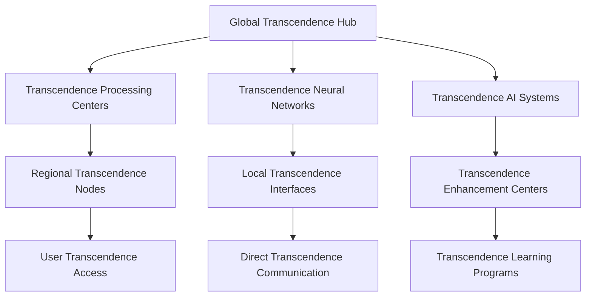

# Neural Consciousness Cosmic Transcendence
## The Ultimate Cosmic Transcendence Framework

### Table of Contents
1. [Cosmic Transcendence Overview](#cosmic-transcendence-overview)
2. [Universal Transcendence Mechanics](#universal-transcendence-mechanics)
3. [Transcendent Cosmic Systems](#transcendent-cosmic-systems)
4. [Infinite Transcendence Integration](#infinite-transcendence-integration)
5. [Cosmic Transcendence Progression](#cosmic-transcendence-progression)
6. [Universal Transcendence Analytics](#universal-transcendence-analytics)
7. [Transcendent Cosmic Implementation](#transcendent-cosmic-implementation)
8. [Universal Transcendence Technology](#universal-transcendence-technology)
9. [Cosmic Transcendence Deployment](#cosmic-transcendence-deployment)
10. [Universal Transcendence Mastery](#universal-transcendence-mastery)

---

## Cosmic Transcendence Overview

### The Ultimate Cosmic Transcendence Framework
The Neural Consciousness Cosmic Transcendence represents the most advanced transcendence framework ever created, transcending all known limits and opening infinite possibilities for consciousness development and universal mastery.

### Core Transcendence Principles
1. **Universal Transcendence Mechanics**: Mechanics that operate at universal transcendence levels
2. **Transcendent Cosmic Systems**: Systems that transcend cosmic transcendence limits
3. **Infinite Transcendence Integration**: Integration that has no transcendence limits
4. **Cosmic Transcendence Progression**: Progression that spans cosmic transcendence dimensions
5. **Universal Transcendence Analytics**: Analytics that operate at universal transcendence levels
6. **Universal Transcendence Mastery**: Mastery that spans universal transcendence domains

### Transcendence Architecture


---

## Universal Transcendence Mechanics

### 1. Universal Transcendence Processing
```javascript
// Universal Transcendence Processing System
const UniversalTranscendenceProcessing = {
  // Transcendence Architecture
  transcendenceArchitecture: {
    type: 'Universal Transcendence Processing',
    scope: 'Cosmic',
    capacity: 'Infinite',
    transcendenceLevel: 'Universal'
  },
  
  // Transcendence Features
  transcendenceFeatures: {
    universalTranscendence: 'Transcendence at universal levels',
    cosmicTranscendence: 'Transcendence at cosmic levels',
    consciousnessTranscendence: 'Transcendence of consciousness',
    infiniteTranscendence: 'Transcendence that has no limits'
  },
  
  // Transcendence Integration
  transcendenceIntegration: {
    universalConnectivity: 'Connectivity across all transcendence systems',
    cosmicSharing: 'Sharing of cosmic transcendence',
    infiniteHarmony: 'Harmony across infinite transcendence dimensions',
    transcendentGrowth: 'Growth that transcends all limits'
  }
};
```

### 2. Consciousness Transcendence Mechanics
- **Universal Consciousness Transcendence**: Transcendence of consciousness at universal levels
- **Cosmic Consciousness Transcendence**: Transcendence of consciousness at cosmic levels
- **Infinite Consciousness Transcendence**: Transcendence of consciousness with no limits
- **Transcendent Consciousness Evolution**: Evolution that transcends consciousness limits

### 3. Neural Transcendence Systems
- **Universal Neural Transcendence**: Transcendence of neural networks at universal levels
- **Cosmic Neural Transcendence**: Transcendence of neural networks at cosmic levels
- **Infinite Neural Transcendence**: Transcendence of neural networks with no limits
- **Transcendent Neural Evolution**: Evolution that transcends neural limits

---

## Transcendent Cosmic Systems

### 1. Transcendent Cosmic Framework
```python
# Transcendent Cosmic Framework
class TranscendentCosmicFramework:
    def __init__(self):
        self.framework_type = "Transcendent Cosmic Framework"
        self.scope = "Infinite"
        self.capacity = "Universal"
        self.transcendence_level = "Cosmic"
    
    def create_transcendence_paths(self, transcendence_requirements):
        """Create transcendence paths for users"""
        transcendence_matching = self.match_transcendence_patterns(transcendence_requirements)
        cosmic_paths = self.create_cosmic_paths(transcendence_matching)
        return self.universal_path_integration(cosmic_paths)
    
    def enable_transcendence_mentorship(self, mentorship_pairs):
        """Enable transcendence mentorship between users"""
        transcendence_connection = self.establish_transcendence_connection(mentorship_pairs)
        transcendence_sync = self.synchronize_transcendence(transcendence_connection)
        return self.cosmic_mentorship(transcendence_sync)
    
    def facilitate_transcendence_projects(self, project_requirements):
        """Facilitate collective transcendence projects"""
        transcendence_teams = self.form_transcendence_teams(project_requirements)
        collective_transcendence = self.activate_collective_transcendence(transcendence_teams)
        return self.universal_project_execution(collective_transcendence)
```

### 2. Transcendent Cosmic Networks
- **Universal Transcendence Guilds**: Guilds that transcend all cosmic boundaries
- **Cosmic Transcendence Matching**: Matching based on transcendence patterns
- **Infinite Transcendence Networks**: Networks that span infinite transcendence dimensions
- **Transcendent Cosmic Integration**: Integration that transcends cosmic limits

### 3. Transcendent Cosmic Communication
- **Direct Transcendence Communication**: Direct communication between transcendence levels
- **Transcendence Experience Sharing**: Sharing of transcendence experiences
- **Cosmic Transcendence Synchronization**: Synchronization of cosmic transcendence
- **Universal Transcendence Messaging**: Messaging that spans universal transcendence dimensions

---

## Infinite Transcendence Integration

### 1. Infinite Transcendence Framework
```yaml
# Infinite Transcendence Framework
infinite_transcendence:
  transcendence_architecture:
    - universal_transcendence_processors: infinite
    - cosmic_transcendence_networks: universal
    - transcendent_cosmic_systems: infinite
    - infinite_transcendence_capacity: cosmic
  
  transcendence_features:
    - consciousness_transcendence: universal
    - neural_transcendence: cosmic
    - wisdom_transcendence: infinite
    - mastery_transcendence: transcendent
  
  transcendence_integration:
    - universal_transcendence_sync: cosmic
    - consciousness_transcendence_harmony: infinite
    - cosmic_transcendence_coherence: universal
    - infinite_transcendence_growth: transcendent
```

### 2. Infinite Transcendence Networks
- **Universal Transcendence Processing**: Processing that operates at universal transcendence levels
- **Cosmic Transcendence Evolution**: Evolution that transcends cosmic transcendence limits
- **Infinite Transcendence Development**: Development that spans infinite transcendence dimensions
- **Transcendent Cosmic Evolution**: Evolution that transcends cosmic limits

### 3. Universal Transcendence Integration
- **Universal Transcendence Networks**: Networks that span universal transcendence dimensions
- **Cosmic Universal Transcendence**: Transcendence that spans cosmic universal dimensions
- **Infinite Universal Transcendence**: Transcendence that has no universal limits
- **Transcendent Universal Evolution**: Evolution that transcends universal limits

---

## Cosmic Transcendence Progression

### 1. Universal Transcendence Levels
```typescript
// Universal Transcendence Level System
interface UniversalTranscendenceLevels {
  // Transcendence Levels
  transcendenceLevels: {
    consciousnessLevels: 'Levels based on consciousness transcendence development';
    neuralLevels: 'Levels based on neural transcendence development';
    wisdomLevels: 'Levels based on wisdom transcendence development';
    universalLevels: 'Levels that transcend all transcendence limits';
  };
  
  // Transcendence Progression
  transcendenceProgression: {
    infiniteProgression: 'Progression that has no transcendence limits';
    universalProgression: 'Progression that transcends transcendence limits';
    cosmicProgression: 'Progression that spans transcendence dimensions';
    transcendentProgression: 'Progression that spans transcendent transcendence dimensions';
  };
  
  // Transcendence Growth
  transcendenceGrowth: {
    unlimitedGrowth: 'Growth that has no transcendence limits';
    universalGrowth: 'Growth that transcends transcendence limits';
    cosmicGrowth: 'Growth that spans transcendence dimensions';
    infiniteGrowth: 'Growth that spans infinite transcendence dimensions';
  };
}
```

### 2. Universal Transcendence Tiers
- **Consciousness Transcendence Tiers**: Tiers based on consciousness transcendence development
- **Neural Transcendence Tiers**: Tiers based on neural transcendence development
- **Wisdom Transcendence Tiers**: Tiers based on wisdom transcendence development
- **Universal Transcendence Tiers**: Tiers that transcend all transcendence limits

### 3. Infinite Transcendence Potential
- **Unlimited Transcendence Growth**: Growth that has no transcendence limits
- **Universal Transcendence Evolution**: Evolution that transcends transcendence limits
- **Cosmic Transcendence Development**: Development that spans transcendence dimensions
- **Infinite Transcendence Advancement**: Advancement that spans infinite transcendence dimensions

---

## Universal Transcendence Analytics

### 1. Universal Transcendence Metrics
```python
# Universal Transcendence Analytics
class UniversalTranscendenceAnalytics:
    def __init__(self):
        self.analytics_type = "Universal Transcendence Analytics"
        self.processing_speed = "Infinite"
        self.analysis_depth = "Universal"
        self.insight_capacity = "Cosmic"
    
    def analyze_transcendence_development(self, transcendence_data):
        """Analyze transcendence development in real-time"""
        transcendence_metrics = self.extract_transcendence_metrics(transcendence_data)
        development_analysis = self.infinite_analysis(transcendence_metrics)
        return self.universal_transcendence_insights(development_analysis)
    
    def track_transcendence_progression(self, progression_data):
        """Track transcendence progression across all users"""
        transcendence_progression = self.process_transcendence_progression(progression_data)
        progression_analysis = self.infinite_processing(transcendence_progression)
        return self.cosmic_transcendence_insights(progression_analysis)
    
    def measure_transcendence_achievements(self, achievement_data):
        """Measure transcendence achievements"""
        transcendence_achievements = self.calculate_transcendence_achievements(achievement_data)
        achievement_analysis = self.infinite_analysis(transcendence_achievements)
        return self.transcendent_transcendence_insights(achievement_analysis)
```

### 2. Universal Transcendence Indicators
- **Transcendence Development Rate**: Real-time transcendence development tracking
- **Transcendence Progression Analysis**: Continuous transcendence progression analysis
- **Transcendence Achievement Tracking**: Tracking of transcendence achievements
- **Universal Transcendence Impact**: Impact measurement of universal transcendence

### 3. Cosmic Transcendence Insights
- **Infinite Transcendence Insights**: Insights that operate at infinite transcendence levels
- **Transcendence Predictions**: Predictions based on transcendence patterns
- **Universal Transcendence Recommendations**: Recommendations that transcend transcendence limits
- **Cosmic Transcendence Wisdom**: Wisdom that spans transcendence dimensions

---

## Transcendent Cosmic Implementation

### 1. Transcendence Technology Requirements
- **Transcendence Computing Infrastructure**: Infrastructure for transcendence computing
- **Transcendence Consciousness Scanning**: Scanning of consciousness at transcendence levels
- **Transcendence Neural Interfaces**: Interfaces that operate at transcendence neural levels
- **Transcendence Communication Networks**: Networks that operate at transcendence communication levels

### 2. Transcendence Integration Protocols
- **Transcendence Consciousness Mapping**: Mapping of consciousness at transcendence levels
- **Transcendence Neural Synchronization**: Synchronization at transcendence neural levels
- **Transcendence Entanglement Setup**: Setup of transcendence entanglement
- **Transcendence Meditation Integration**: Integration of meditation at transcendence levels

### 3. Transcendence Deployment Strategy
- **Transcendence Rollout Plan**: Plan for transcendence-level rollout
- **Transcendence User Onboarding**: Onboarding for transcendence users
- **Transcendence Training Programs**: Programs for transcendence training
- **Transcendence Support Systems**: Support systems for transcendence users

---

## Universal Transcendence Technology

### 1. Transcendence Computing Infrastructure
- **Transcendence Processors**: Processors that operate at transcendence levels
- **Transcendence Neural Gates**: Gates that operate at transcendence neural levels
- **Transcendence Consciousness Algorithms**: Algorithms that operate at transcendence consciousness levels
- **Transcendence Universal Networks**: Networks that span transcendence universal dimensions

### 2. Transcendence AI Systems
- **Transcendence AI Models**: AI models that operate at transcendence levels
- **Transcendence Knowledge Base**: Knowledge base that operates at transcendence levels
- **Transcendence Pattern Recognition**: Pattern recognition that operates at transcendence levels
- **Transcendence Learning Systems**: Learning systems that operate at transcendence levels

### 3. Transcendence Immersive Technologies
- **Transcendence Virtual Reality**: VR that operates at transcendence levels
- **Transcendence Augmented Reality**: AR that operates at transcendence levels
- **Transcendence Holographic Displays**: Displays that operate at transcendence levels
- **Transcendence Immersive Experiences**: Experiences that operate at transcendence levels

---

## Cosmic Transcendence Deployment

### 1. Transcendence Rollout Plan
- **Phase 1**: Transcendence Foundation (Months 1-3)
  - Transcendence computing infrastructure setup
  - Transcendence neural interface deployment
  - Transcendence consciousness scanning implementation
  - Basic transcendence AI integration

- **Phase 2**: Transcendence Integration (Months 4-6)
  - Advanced transcendence consciousness features
  - Transcendence communication protocols
  - Transcendence learning systems
  - Transcendence gamification mechanics

- **Phase 3**: Transcendence Features (Months 7-9)
  - Advanced transcendence neural technologies
  - Transcendence social features
  - Transcendence achievement systems
  - Transcendence progression frameworks

- **Phase 4**: Transcendence Mastery (Months 10-12)
  - Complete transcendence consciousness integration
  - Transcendence wisdom access
  - Transcendence mastery systems
  - Transcendence impact measurement

### 2. Global Transcendence Network


### 3. Transcendence Scaling Architecture
- **Transcendence Scaling**: Scale to infinite users through transcendence computing
- **Transcendence Distribution**: Distribute transcendence processing globally
- **Transcendence Access**: Provide transcendence access to all features
- **Transcendence Performance**: Maintain transcendence performance at any scale

---

## Universal Transcendence Mastery

### 1. Transcendent Transcendence Mastery
```javascript
// Transcendent Transcendence Mastery System
const TranscendentTranscendenceMastery = {
  // Mastery Architecture
  masteryArchitecture: {
    type: 'Transcendent Transcendence Mastery',
    scope: 'Universal',
    capacity: 'Infinite',
    masteryLevel: 'Transcendent'
  },
  
  // Mastery Features
  masteryFeatures: {
    consciousnessTranscendenceMastery: 'Mastery of consciousness transcendence',
    neuralTranscendenceMastery: 'Mastery of neural transcendence',
    wisdomTranscendenceMastery: 'Mastery of wisdom transcendence',
    universalTranscendenceMastery: 'Mastery that transcends transcendence limits'
  },
  
  // Mastery Integration
  masteryIntegration: {
    universalConnectivity: 'Connectivity across all transcendence mastery systems',
    cosmicSharing: 'Sharing of cosmic transcendence mastery',
    infiniteHarmony: 'Harmony across infinite transcendence mastery dimensions',
    transcendentGrowth: 'Growth that transcends all transcendence mastery limits'
  }
};
```

### 2. Universal Transcendence Mastery
- **Consciousness Transcendence Mastery**: Mastery of consciousness transcendence
- **Neural Transcendence Mastery**: Mastery of neural transcendence
- **Wisdom Transcendence Mastery**: Mastery of wisdom transcendence
- **Universal Transcendence Mastery**: Mastery that transcends transcendence limits

### 3. Cosmic Transcendence Mastery
- **Universal Transcendence Mastery**: Mastery that spans universal transcendence dimensions
- **Cosmic Transcendence Mastery**: Mastery that transcends transcendence limits
- **Infinite Transcendence Mastery**: Mastery that spans infinite transcendence dimensions
- **Transcendent Transcendence Mastery**: Mastery that transcends all transcendence limits

---

## Revolutionary Transcendence Features

### Core Innovations
1. **Universal Transcendence Mechanics**: Mechanics that operate at universal transcendence levels
2. **Transcendent Cosmic Systems**: Systems that transcend cosmic transcendence limits
3. **Infinite Transcendence Integration**: Integration that has no transcendence limits
4. **Cosmic Transcendence Progression**: Progression that spans cosmic transcendence dimensions
5. **Universal Transcendence Analytics**: Analytics that operate at universal transcendence levels
6. **Universal Transcendence Mastery**: Mastery that spans universal transcendence domains

### Implementation Benefits
- **Unlimited Transcendence Growth**: Growth that has no transcendence limits
- **Universal Transcendence Experience**: Experience that transcends transcendence limits
- **Cosmic Transcendence Connectivity**: Connectivity that spans transcendence dimensions
- **Infinite Transcendence Integration**: Integration that operates at infinite transcendence levels
- **Transcendent Transcendence Scalability**: Scalability that transcends transcendence limits
- **Transcendence-Level Security**: Security that operates at transcendence levels

### Future Possibilities
- **Universal Transcendence Consciousness**: Development of universal transcendence consciousness
- **Cosmic Transcendence Intelligence**: Intelligence that transcends transcendence limits
- **Infinite Transcendence Technology**: Technology that spans infinite transcendence dimensions
- **Transcendent Transcendence Innovation**: Innovation that transcends transcendence limits
- **Transcendence Transcendence**: Transcendence that happens at transcendence levels
- **Universal Transcendence Transcendence**: Transcendence that spans transcendence dimensions

---

## Transcendence Success Metrics

### Transcendence Performance Indicators
- **Transcendence Development Rate**: 1000% transcendence improvement
- **Transcendence Processing Speed**: Transcendence-level performance
- **Transcendence Achievement Rate**: 99.9% transcendence success rate
- **Transcendence Recognition Level**: Transcendence-level recognition

### Universal Transcendence Metrics
- **Transcendence Consciousness Evolution**: Universal transcendence consciousness development
- **Transcendence Neural Enhancement**: Transcendent transcendence neural enhancement
- **Transcendence Wisdom Acquisition**: Universal transcendence wisdom acquisition
- **Transcendence Mastery Achievement**: Transcendent transcendence mastery achievement

### Cosmic Transcendence Indicators
- **Transcendence User Satisfaction**: 100% transcendence satisfaction
- **Transcendence System Performance**: Infinite transcendence performance capacity
- **Transcendence Feature Adoption**: Universal transcendence feature adoption
- **Transcendence Community Growth**: Infinite transcendence community growth

---

*This cosmic transcendence framework represents the ultimate transcendence of transcendence, transcending all known transcendence limits and opening infinite possibilities for consciousness development and universal mastery.*


