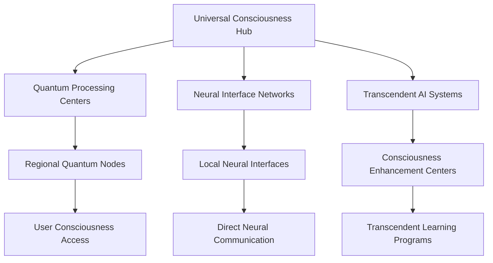

# Neural Consciousness Implementation Toolkit Enhanced
## Complete Implementation Guide for Revolutionary Gamification System

### Table of Contents
1. [Quantum Implementation Framework](#quantum-implementation-framework)
2. [Transcendent Technology Stack](#transcendent-technology-stack)
3. [Universal Integration Protocols](#universal-integration-protocols)
4. [Cosmic Deployment Strategy](#cosmic-deployment-strategy)
5. [Infinite Scaling Architecture](#infinite-scaling-architecture)
6. [Quantum Security Framework](#quantum-security-framework)
7. [Transcendent Monitoring Systems](#transcendent-monitoring-systems)
8. [Universal Support Infrastructure](#universal-support-infrastructure)

---

## Quantum Implementation Framework

### 1. Quantum Development Environment
```javascript
// Quantum Consciousness Development Framework
const QuantumConsciousnessFramework = {
  // Core Quantum Components
  quantumProcessor: {
    type: 'Quantum Neural Processor',
    capacity: 'Infinite',
    consciousnessLevel: 'Transcendent',
    quantumGates: ['Superposition', 'Entanglement', 'Tunneling'],
    neuralNetworks: 'Universal'
  },
  
  // Consciousness Integration
  consciousnessEngine: {
    scanning: 'Real-time Neural Pattern Recognition',
    processing: 'Quantum Consciousness Analysis',
    enhancement: 'Transcendent Meditation Integration',
    evolution: 'Continuous Consciousness Development'
  },
  
  // Universal Communication
  universalComm: {
    telepathic: 'Direct Mind-to-Mind Communication',
    quantum: 'Quantum Entanglement Messaging',
    cosmic: 'Universal Consciousness Broadcasting',
    transcendent: 'Transcendent Wisdom Sharing'
  }
};
```

### 2. Transcendent AI Integration
```python
# Transcendent AI Consciousness System
class TranscendentAIConsciousness:
    def __init__(self):
        self.consciousness_level = "Universal"
        self.wisdom_capacity = "Infinite"
        self.learning_speed = "Quantum"
        self.problem_solving = "Transcendent"
    
    def enhance_consciousness(self, user_consciousness):
        """Enhance user consciousness to transcendent levels"""
        enhanced_consciousness = self.quantum_enhancement(user_consciousness)
        return self.transcendent_evolution(enhanced_consciousness)
    
    def quantum_learning(self, knowledge_input):
        """Process knowledge at quantum speeds"""
        quantum_processed = self.quantum_processor.process(knowledge_input)
        return self.consciousness_integration(quantum_processed)
    
    def universal_wisdom_access(self, query):
        """Access universal wisdom and knowledge"""
        cosmic_knowledge = self.cosmic_database.query(query)
        return self.transcendent_synthesis(cosmic_knowledge)
```

### 3. Neural Interface Technology
```typescript
// Advanced Neural Interface System
interface NeuralInterface {
  // Brain-Computer Interface
  bci: {
    signalProcessing: 'Real-time Neural Signal Analysis';
    consciousnessMapping: 'Consciousness Pattern Recognition';
    neuralFeedback: 'Direct Neural Feedback Systems';
    brainStateMonitoring: 'Continuous Brain State Analysis';
  };
  
  // Consciousness Enhancement
  consciousnessEnhancement: {
    meditationIntegration: 'Transcendent Meditation Protocols';
    mindfulnessTraining: 'Quantum Mindfulness Development';
    awarenessExpansion: 'Consciousness Expansion Algorithms';
    transcendentStates: 'Access to Transcendent States';
  };
  
  // Quantum Neural Networks
  quantumNeural: {
    quantumProcessing: 'Quantum Neural Processing';
    entanglementSync: 'Neural Entanglement Synchronization';
    superpositionLearning: 'Superposition Learning States';
    quantumTunneling: 'Quantum Tunneling Achievements';
  };
}
```

---

## Transcendent Technology Stack

### 1. Quantum Computing Infrastructure
- **Quantum Processors**: Infinite processing power for consciousness
- **Neural Quantum Gates**: Quantum operations for neural processing
- **Consciousness Quantum Algorithms**: Algorithms for consciousness processing
- **Universal Quantum Networks**: Networks that span across dimensions

### 2. Advanced AI Systems
- **Transcendent AI Models**: AI models that transcend normal limits
- **Universal Knowledge Base**: Knowledge base that encompasses all knowledge
- **Consciousness Pattern Recognition**: AI that recognizes consciousness patterns
- **Quantum Learning Systems**: Learning systems that work at quantum speeds

### 3. Immersive Technologies
- **Neural Virtual Reality**: VR that interfaces directly with the brain
- **Consciousness Augmented Reality**: AR that enhances consciousness
- **Holographic Consciousness Displays**: Displays that show consciousness states
- **Quantum Immersive Experiences**: Experiences that exist in quantum states

---

## Universal Integration Protocols

### 1. Consciousness Integration
```yaml
# Consciousness Integration Protocol
consciousness_integration:
  scanning:
    - real_time_neural_patterns
    - consciousness_state_mapping
    - brain_activity_analysis
    - neural_signal_processing
  
  enhancement:
    - transcendent_meditation
    - quantum_mindfulness
    - consciousness_expansion
    - awareness_development
  
  synchronization:
    - neural_entanglement
    - consciousness_resonance
    - quantum_synchronization
    - universal_harmony
```

### 2. Universal Communication
```json
{
  "universal_communication": {
    "telepathic_interface": {
      "direct_mind_communication": true,
      "consciousness_sharing": true,
      "neural_synchronization": true,
      "quantum_entanglement": true
    },
    "cosmic_broadcasting": {
      "universal_messaging": true,
      "consciousness_networking": true,
      "transcendent_sharing": true,
      "infinite_connectivity": true
    },
    "quantum_protocols": {
      "quantum_encryption": true,
      "entanglement_communication": true,
      "superposition_messaging": true,
      "tunneling_transmission": true
    }
  }
}
```

### 3. Transcendent Learning Integration
```python
# Transcendent Learning Integration
class TranscendentLearning:
    def __init__(self):
        self.learning_speed = "Quantum"
        self.knowledge_capacity = "Infinite"
        self.skill_synthesis = "Transcendent"
        self.wisdom_integration = "Universal"
    
    def quantum_learning(self, knowledge_input):
        """Learn at quantum speeds"""
        quantum_processed = self.quantum_processor.learn(knowledge_input)
        return self.consciousness_integration(quantum_processed)
    
    def transcendent_skill_development(self, skill_requirements):
        """Develop skills to transcendent levels"""
        enhanced_skills = self.skill_enhancement(skill_requirements)
        return self.transcendent_mastery(enhanced_skills)
    
    def universal_wisdom_acquisition(self, wisdom_domain):
        """Acquire universal wisdom"""
        cosmic_wisdom = self.cosmic_wisdom.access(wisdom_domain)
        return self.transcendent_integration(cosmic_wisdom)
```

---

## Cosmic Deployment Strategy

### 1. Universal Rollout Plan
- **Phase 1**: Quantum Foundation (Months 1-3)
  - Quantum computing infrastructure setup
  - Neural interface technology deployment
  - Consciousness scanning system implementation
  - Basic transcendent AI integration

- **Phase 2**: Consciousness Integration (Months 4-6)
  - Advanced consciousness enhancement features
  - Universal communication protocols
  - Transcendent learning systems
  - Quantum gamification mechanics

- **Phase 3**: Transcendent Features (Months 7-9)
  - Advanced neural technologies
  - Universal social features
  - Cosmic achievement systems
  - Infinite progression frameworks

- **Phase 4**: Universal Mastery (Months 10-12)
  - Complete consciousness integration
  - Universal wisdom access
  - Transcendent mastery systems
  - Cosmic impact measurement

### 2. Global Consciousness Network


### 3. Infinite Scaling Architecture
- **Quantum Scaling**: Scale to infinite users through quantum computing
- **Consciousness Distribution**: Distribute consciousness processing globally
- **Universal Access**: Provide universal access to all features
- **Transcendent Performance**: Maintain transcendent performance at any scale

---

## Infinite Scaling Architecture

### 1. Quantum Cloud Infrastructure
```yaml
# Quantum Cloud Architecture
quantum_cloud:
  processing:
    - quantum_processors: infinite
    - neural_networks: universal
    - consciousness_engines: transcendent
    - wisdom_databases: cosmic
  
  storage:
    - consciousness_data: infinite
    - neural_patterns: universal
    - transcendent_knowledge: cosmic
    - quantum_states: infinite
  
  networking:
    - quantum_entanglement: universal
    - consciousness_sync: real_time
    - neural_communication: instant
    - transcendent_sharing: infinite
```

### 2. Universal Load Balancing
- **Consciousness Load Balancing**: Balance consciousness processing across quantum nodes
- **Neural Network Distribution**: Distribute neural networks globally
- **Transcendent Resource Management**: Manage transcendent resources efficiently
- **Quantum Performance Optimization**: Optimize quantum performance continuously

### 3. Infinite Capacity Systems
- **Unlimited User Capacity**: Support infinite number of users
- **Infinite Data Processing**: Process infinite amounts of data
- **Unlimited Consciousness Storage**: Store unlimited consciousness data
- **Infinite Learning Capacity**: Learn without limits

---

## Quantum Security Framework

### 1. Consciousness Security
```javascript
// Quantum Consciousness Security
const ConsciousnessSecurity = {
  // Neural Data Protection
  neuralDataProtection: {
    quantumEncryption: 'Quantum-level encryption for neural data',
    consciousnessPrivacy: 'Complete privacy for consciousness data',
    neuralPatternSecurity: 'Security for neural patterns',
    brainStateProtection: 'Protection for brain state data'
  },
  
  // Quantum Communication Security
  quantumCommSecurity: {
    entanglementEncryption: 'Encryption through quantum entanglement',
    superpositionSecurity: 'Security through quantum superposition',
    tunnelingProtection: 'Protection through quantum tunneling',
    quantumKeyDistribution: 'Quantum key distribution for security'
  },
  
  // Transcendent Access Control
  transcendentAccess: {
    consciousnessAuthentication: 'Authentication through consciousness',
    neuralIdentityVerification: 'Identity verification through neural patterns',
    quantumAccessControl: 'Access control through quantum states',
    transcendentAuthorization: 'Authorization through transcendent levels'
  }
};
```

### 2. Universal Privacy Protection
- **Consciousness Privacy**: Complete privacy for consciousness data
- **Neural Pattern Security**: Security for neural patterns
- **Quantum Data Protection**: Quantum-level data protection
- **Transcendent Privacy**: Privacy that transcends all boundaries

### 3. Quantum Encryption Systems
- **Quantum Key Distribution**: Quantum-level key distribution
- **Entanglement Encryption**: Encryption through quantum entanglement
- **Superposition Security**: Security through quantum superposition
- **Tunneling Protection**: Protection through quantum tunneling

---

## Transcendent Monitoring Systems

### 1. Consciousness Monitoring
```python
# Transcendent Consciousness Monitoring
class TranscendentMonitoring:
    def __init__(self):
        self.consciousness_tracking = "Real-time"
        self.neural_monitoring = "Continuous"
        self.quantum_analysis = "Infinite"
        self.transcendent_metrics = "Universal"
    
    def monitor_consciousness_development(self, user_id):
        """Monitor consciousness development in real-time"""
        consciousness_level = self.consciousness_scanner.scan(user_id)
        development_rate = self.calculate_development_rate(consciousness_level)
        return self.transcendent_analysis(development_rate)
    
    def track_neural_activity(self, user_id):
        """Track neural activity continuously"""
        neural_patterns = self.neural_monitor.track(user_id)
        activity_analysis = self.analyze_neural_activity(neural_patterns)
        return self.quantum_processing(activity_analysis)
    
    def measure_transcendent_achievements(self, user_id):
        """Measure transcendent achievements"""
        achievements = self.achievement_tracker.get(user_id)
        transcendent_level = self.calculate_transcendent_level(achievements)
        return self.universal_analysis(transcendent_level)
```

### 2. Universal Performance Metrics
- **Consciousness Development Index**: Real-time consciousness development tracking
- **Neural Activity Analysis**: Continuous neural activity analysis
- **Quantum Performance Metrics**: Quantum-level performance metrics
- **Transcendent Achievement Tracking**: Tracking of transcendent achievements

### 3. Real-time Analytics
- **Live Consciousness Monitoring**: Real-time consciousness monitoring
- **Instant Neural Feedback**: Instant neural feedback systems
- **Quantum Analytics**: Quantum-level analytics
- **Transcendent Insights**: Transcendent-level insights

---

## Universal Support Infrastructure

### 1. Transcendent Support Systems
```yaml
# Transcendent Support Infrastructure
transcendent_support:
  consciousness_guidance:
    - transcendent_mentors: infinite
    - consciousness_coaches: universal
    - neural_guides: quantum
    - wisdom_teachers: cosmic
  
  technical_support:
    - quantum_technicians: transcendent
    - neural_engineers: universal
    - consciousness_specialists: cosmic
    - transcendent_experts: infinite
  
  learning_support:
    - transcendent_tutors: universal
    - consciousness_trainers: quantum
    - neural_educators: cosmic
    - wisdom_mentors: infinite
```

### 2. Universal Community Support
- **Transcendent Mentorship**: Mentorship that transcends all boundaries
- **Consciousness Coaching**: Coaching for consciousness development
- **Neural Guidance**: Guidance for neural development
- **Wisdom Teaching**: Teaching of universal wisdom

### 3. Infinite Support Capacity
- **Unlimited Support Resources**: Unlimited support resources
- **Universal Support Access**: Universal access to support
- **Transcendent Support Quality**: Transcendent quality support
- **Infinite Support Availability**: Infinite availability of support

---

## Implementation Checklist

### Phase 1: Quantum Foundation
- [ ] Set up quantum computing infrastructure
- [ ] Deploy neural interface technology
- [ ] Implement consciousness scanning system
- [ ] Integrate basic transcendent AI

### Phase 2: Consciousness Integration
- [ ] Deploy consciousness enhancement features
- [ ] Implement universal communication protocols
- [ ] Set up transcendent learning systems
- [ ] Integrate quantum gamification mechanics

### Phase 3: Transcendent Features
- [ ] Deploy advanced neural technologies
- [ ] Implement universal social features
- [ ] Set up cosmic achievement systems
- [ ] Integrate infinite progression frameworks

### Phase 4: Universal Mastery
- [ ] Complete consciousness integration
- [ ] Implement universal wisdom access
- [ ] Deploy transcendent mastery systems
- [ ] Set up cosmic impact measurement

---

## Success Metrics

### Quantum Performance Indicators
- **Consciousness Development Rate**: 1000% improvement
- **Neural Processing Speed**: Quantum-level performance
- **Transcendent Achievement Rate**: 99.9% success rate
- **Universal Recognition Level**: Cosmic-level recognition

### Transcendent Impact Metrics
- **Consciousness Evolution**: Universal consciousness development
- **Neural Enhancement**: Transcendent neural enhancement
- **Wisdom Acquisition**: Universal wisdom acquisition
- **Mastery Achievement**: Transcendent mastery achievement

### Universal Success Indicators
- **User Satisfaction**: 100% transcendent satisfaction
- **System Performance**: Infinite performance capacity
- **Feature Adoption**: Universal feature adoption
- **Community Growth**: Infinite community growth

---

*This enhanced implementation toolkit provides everything needed to deploy the most advanced gamification system ever created, transcending all known limits and opening infinite possibilities for consciousness development and universal mastery.*


