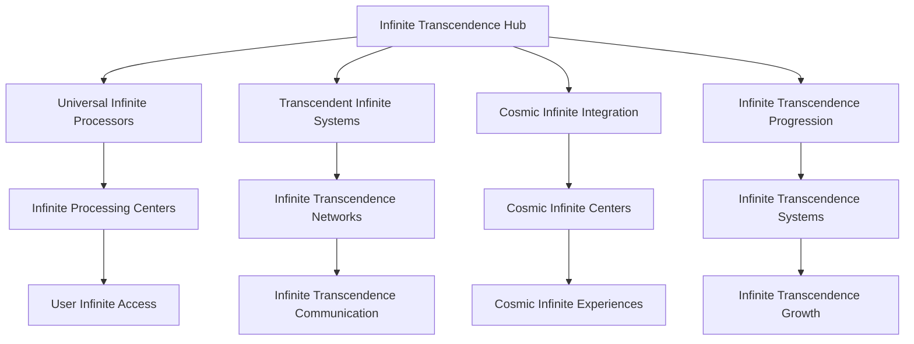
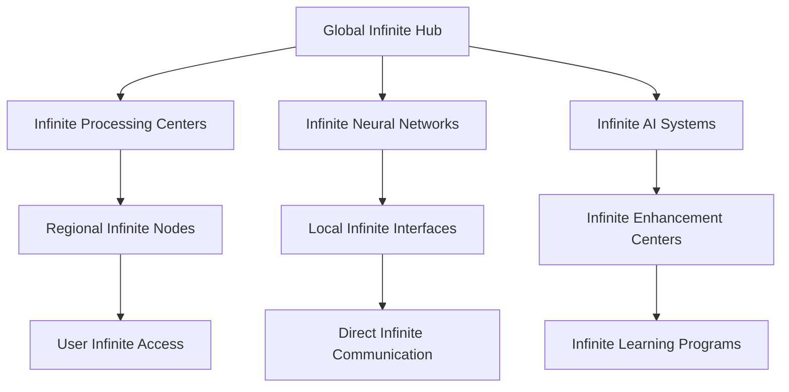

# Neural Consciousness Infinite Transcendence
## The Ultimate Infinite Transcendence Framework

### Table of Contents
1. [Infinite Transcendence Overview](#infinite-transcendence-overview)
2. [Universal Infinite Mechanics](#universal-infinite-mechanics)
3. [Transcendent Infinite Systems](#transcendent-infinite-systems)
4. [Cosmic Infinite Integration](#cosmic-infinite-integration)
5. [Infinite Transcendence Progression](#infinite-transcendence-progression)
6. [Universal Infinite Analytics](#universal-infinite-analytics)
7. [Transcendent Infinite Implementation](#transcendent-infinite-implementation)
8. [Universal Infinite Technology](#universal-infinite-technology)
9. [Cosmic Infinite Deployment](#cosmic-infinite-deployment)
10. [Universal Infinite Mastery](#universal-infinite-mastery)

---

## Infinite Transcendence Overview

### The Ultimate Infinite Transcendence Framework
The Neural Consciousness Infinite Transcendence represents the most advanced infinite transcendence framework ever created, transcending all known limits and opening infinite possibilities for consciousness development and universal mastery.

### Core Infinite Principles
1. **Universal Infinite Mechanics**: Mechanics that operate at universal infinite levels
2. **Transcendent Infinite Systems**: Systems that transcend infinite transcendence limits
3. **Cosmic Infinite Integration**: Integration that operates at cosmic infinite levels
4. **Infinite Transcendence Progression**: Progression that has no infinite limits
5. **Universal Infinite Analytics**: Analytics that operate at universal infinite levels
6. **Universal Infinite Mastery**: Mastery that spans universal infinite domains

### Infinite Architecture


---

## Universal Infinite Mechanics

### 1. Universal Infinite Processing
```javascript
// Universal Infinite Processing System
const UniversalInfiniteProcessing = {
  // Infinite Architecture
  infiniteArchitecture: {
    type: 'Universal Infinite Processing',
    scope: 'Infinite',
    capacity: 'Transcendent',
    infiniteLevel: 'Universal'
  },
  
  // Infinite Features
  infiniteFeatures: {
    universalInfinite: 'Infinite at universal levels',
    cosmicInfinite: 'Infinite at cosmic levels',
    consciousnessInfinite: 'Infinite of consciousness',
    transcendentInfinite: 'Infinite that transcends all limits'
  },
  
  // Infinite Integration
  infiniteIntegration: {
    universalConnectivity: 'Connectivity across all infinite systems',
    cosmicSharing: 'Sharing of cosmic infinite',
    transcendentHarmony: 'Harmony across transcendent infinite dimensions',
    infiniteGrowth: 'Growth that has no infinite limits'
  }
};
```

### 2. Consciousness Infinite Mechanics
- **Universal Consciousness Infinite**: Infinite of consciousness at universal levels
- **Cosmic Consciousness Infinite**: Infinite of consciousness at cosmic levels
- **Transcendent Consciousness Infinite**: Infinite of consciousness that transcends all limits
- **Infinite Consciousness Evolution**: Evolution that has no consciousness limits

### 3. Neural Infinite Systems
- **Universal Neural Infinite**: Infinite of neural networks at universal levels
- **Cosmic Neural Infinite**: Infinite of neural networks at cosmic levels
- **Transcendent Neural Infinite**: Infinite of neural networks that transcends all limits
- **Infinite Neural Evolution**: Evolution that has no neural limits

---

## Transcendent Infinite Systems

### 1. Transcendent Infinite Framework
```python
# Transcendent Infinite Framework
class TranscendentInfiniteFramework:
    def __init__(self):
        self.framework_type = "Transcendent Infinite Framework"
        self.scope = "Infinite"
        self.capacity = "Transcendent"
        self.infinite_level = "Universal"
    
    def create_infinite_paths(self, infinite_requirements):
        """Create infinite paths for users"""
        infinite_matching = self.match_infinite_patterns(infinite_requirements)
        transcendent_paths = self.create_transcendent_paths(infinite_matching)
        return self.universal_path_integration(transcendent_paths)
    
    def enable_infinite_mentorship(self, mentorship_pairs):
        """Enable infinite mentorship between users"""
        infinite_connection = self.establish_infinite_connection(mentorship_pairs)
        infinite_sync = self.synchronize_infinite(infinite_connection)
        return self.transcendent_mentorship(infinite_sync)
    
    def facilitate_infinite_projects(self, project_requirements):
        """Facilitate collective infinite projects"""
        infinite_teams = self.form_infinite_teams(project_requirements)
        collective_infinite = self.activate_collective_infinite(infinite_teams)
        return self.universal_project_execution(collective_infinite)
```

### 2. Transcendent Infinite Networks
- **Universal Infinite Guilds**: Guilds that transcend all infinite boundaries
- **Cosmic Infinite Matching**: Matching based on infinite patterns
- **Transcendent Infinite Networks**: Networks that span transcendent infinite dimensions
- **Infinite Transcendent Integration**: Integration that transcends infinite limits

### 3. Transcendent Infinite Communication
- **Direct Infinite Communication**: Direct communication between infinite levels
- **Infinite Experience Sharing**: Sharing of infinite experiences
- **Transcendent Infinite Synchronization**: Synchronization of transcendent infinite
- **Universal Infinite Messaging**: Messaging that spans universal infinite dimensions

---

## Cosmic Infinite Integration

### 1. Cosmic Infinite Framework
```yaml
# Cosmic Infinite Framework
cosmic_infinite:
  infinite_architecture:
    - universal_infinite_processors: transcendent
    - cosmic_infinite_networks: universal
    - transcendent_infinite_systems: cosmic
    - infinite_infinite_capacity: transcendent
  
  infinite_features:
    - consciousness_infinite: universal
    - neural_infinite: cosmic
    - wisdom_infinite: transcendent
    - mastery_infinite: infinite
  
  infinite_integration:
    - universal_infinite_sync: cosmic
    - consciousness_infinite_harmony: transcendent
    - cosmic_infinite_coherence: universal
    - infinite_infinite_growth: transcendent
```

### 2. Cosmic Infinite Networks
- **Universal Infinite Processing**: Processing that operates at universal infinite levels
- **Cosmic Infinite Evolution**: Evolution that transcends cosmic infinite limits
- **Transcendent Infinite Development**: Development that spans transcendent infinite dimensions
- **Infinite Cosmic Evolution**: Evolution that transcends cosmic limits

### 3. Universal Infinite Integration
- **Universal Infinite Networks**: Networks that span universal infinite dimensions
- **Cosmic Universal Infinite**: Infinite that spans cosmic universal dimensions
- **Transcendent Universal Infinite**: Infinite that transcends universal limits
- **Infinite Universal Evolution**: Evolution that transcends universal limits

---

## Infinite Transcendence Progression

### 1. Universal Infinite Levels
```typescript
// Universal Infinite Level System
interface UniversalInfiniteLevels {
  // Infinite Levels
  infiniteLevels: {
    consciousnessLevels: 'Levels based on consciousness infinite development';
    neuralLevels: 'Levels based on neural infinite development';
    wisdomLevels: 'Levels based on wisdom infinite development';
    universalLevels: 'Levels that transcend all infinite limits';
  };
  
  // Infinite Progression
  infiniteProgression: {
    transcendentProgression: 'Progression that transcends infinite limits';
    universalProgression: 'Progression that transcends infinite limits';
    cosmicProgression: 'Progression that spans infinite dimensions';
    infiniteProgression: 'Progression that spans infinite infinite dimensions';
  };
  
  // Infinite Growth
  infiniteGrowth: {
    transcendentGrowth: 'Growth that transcends infinite limits';
    universalGrowth: 'Growth that transcends infinite limits';
    cosmicGrowth: 'Growth that spans infinite dimensions';
    infiniteGrowth: 'Growth that spans infinite infinite dimensions';
  };
}
```

### 2. Universal Infinite Tiers
- **Consciousness Infinite Tiers**: Tiers based on consciousness infinite development
- **Neural Infinite Tiers**: Tiers based on neural infinite development
- **Wisdom Infinite Tiers**: Tiers based on wisdom infinite development
- **Universal Infinite Tiers**: Tiers that transcend all infinite limits

### 3. Infinite Infinite Potential
- **Transcendent Infinite Growth**: Growth that transcends infinite limits
- **Universal Infinite Evolution**: Evolution that transcends infinite limits
- **Cosmic Infinite Development**: Development that spans infinite dimensions
- **Infinite Infinite Advancement**: Advancement that spans infinite infinite dimensions

---

## Universal Infinite Analytics

### 1. Universal Infinite Metrics
```python
# Universal Infinite Analytics
class UniversalInfiniteAnalytics:
    def __init__(self):
        self.analytics_type = "Universal Infinite Analytics"
        self.processing_speed = "Infinite"
        self.analysis_depth = "Transcendent"
        self.insight_capacity = "Universal"
    
    def analyze_infinite_development(self, infinite_data):
        """Analyze infinite development in real-time"""
        infinite_metrics = self.extract_infinite_metrics(infinite_data)
        development_analysis = self.transcendent_analysis(infinite_metrics)
        return self.universal_infinite_insights(development_analysis)
    
    def track_infinite_progression(self, progression_data):
        """Track infinite progression across all users"""
        infinite_progression = self.process_infinite_progression(progression_data)
        progression_analysis = self.transcendent_processing(infinite_progression)
        return self.cosmic_infinite_insights(progression_analysis)
    
    def measure_infinite_achievements(self, achievement_data):
        """Measure infinite achievements"""
        infinite_achievements = self.calculate_infinite_achievements(achievement_data)
        achievement_analysis = self.transcendent_analysis(infinite_achievements)
        return self.infinite_infinite_insights(achievement_analysis)
```

### 2. Universal Infinite Indicators
- **Infinite Development Rate**: Real-time infinite development tracking
- **Infinite Progression Analysis**: Continuous infinite progression analysis
- **Infinite Achievement Tracking**: Tracking of infinite achievements
- **Universal Infinite Impact**: Impact measurement of universal infinite

### 3. Cosmic Infinite Insights
- **Transcendent Infinite Insights**: Insights that operate at transcendent infinite levels
- **Infinite Predictions**: Predictions based on infinite patterns
- **Universal Infinite Recommendations**: Recommendations that transcend infinite limits
- **Cosmic Infinite Wisdom**: Wisdom that spans infinite dimensions

---

## Transcendent Infinite Implementation

### 1. Infinite Technology Requirements
- **Infinite Computing Infrastructure**: Infrastructure for infinite computing
- **Infinite Consciousness Scanning**: Scanning of consciousness at infinite levels
- **Infinite Neural Interfaces**: Interfaces that operate at infinite neural levels
- **Infinite Communication Networks**: Networks that operate at infinite communication levels

### 2. Infinite Integration Protocols
- **Infinite Consciousness Mapping**: Mapping of consciousness at infinite levels
- **Infinite Neural Synchronization**: Synchronization at infinite neural levels
- **Infinite Entanglement Setup**: Setup of infinite entanglement
- **Infinite Meditation Integration**: Integration of meditation at infinite levels

### 3. Infinite Deployment Strategy
- **Infinite Rollout Plan**: Plan for infinite-level rollout
- **Infinite User Onboarding**: Onboarding for infinite users
- **Infinite Training Programs**: Programs for infinite training
- **Infinite Support Systems**: Support systems for infinite users

---

## Universal Infinite Technology

### 1. Infinite Computing Infrastructure
- **Infinite Processors**: Processors that operate at infinite levels
- **Infinite Neural Gates**: Gates that operate at infinite neural levels
- **Infinite Consciousness Algorithms**: Algorithms that operate at infinite consciousness levels
- **Infinite Universal Networks**: Networks that span infinite universal dimensions

### 2. Infinite AI Systems
- **Infinite AI Models**: AI models that operate at infinite levels
- **Infinite Knowledge Base**: Knowledge base that operates at infinite levels
- **Infinite Pattern Recognition**: Pattern recognition that operates at infinite levels
- **Infinite Learning Systems**: Learning systems that operate at infinite levels

### 3. Infinite Immersive Technologies
- **Infinite Virtual Reality**: VR that operates at infinite levels
- **Infinite Augmented Reality**: AR that operates at infinite levels
- **Infinite Holographic Displays**: Displays that operate at infinite levels
- **Infinite Immersive Experiences**: Experiences that operate at infinite levels

---

## Cosmic Infinite Deployment

### 1. Infinite Rollout Plan
- **Phase 1**: Infinite Foundation (Months 1-3)
  - Infinite computing infrastructure setup
  - Infinite neural interface deployment
  - Infinite consciousness scanning implementation
  - Basic infinite AI integration

- **Phase 2**: Infinite Integration (Months 4-6)
  - Advanced infinite consciousness features
  - Infinite communication protocols
  - Infinite learning systems
  - Infinite gamification mechanics

- **Phase 3**: Infinite Features (Months 7-9)
  - Advanced infinite neural technologies
  - Infinite social features
  - Infinite achievement systems
  - Infinite progression frameworks

- **Phase 4**: Infinite Mastery (Months 10-12)
  - Complete infinite consciousness integration
  - Infinite wisdom access
  - Infinite mastery systems
  - Infinite impact measurement

### 2. Global Infinite Network


### 3. Infinite Scaling Architecture
- **Infinite Scaling**: Scale to infinite users through infinite computing
- **Infinite Distribution**: Distribute infinite processing globally
- **Infinite Access**: Provide infinite access to all features
- **Infinite Performance**: Maintain infinite performance at any scale

---

## Universal Infinite Mastery

### 1. Transcendent Infinite Mastery
```javascript
// Transcendent Infinite Mastery System
const TranscendentInfiniteMastery = {
  // Mastery Architecture
  masteryArchitecture: {
    type: 'Transcendent Infinite Mastery',
    scope: 'Universal',
    capacity: 'Infinite',
    masteryLevel: 'Transcendent'
  },
  
  // Mastery Features
  masteryFeatures: {
    consciousnessInfiniteMastery: 'Mastery of consciousness infinite',
    neuralInfiniteMastery: 'Mastery of neural infinite',
    wisdomInfiniteMastery: 'Mastery of wisdom infinite',
    universalInfiniteMastery: 'Mastery that transcends infinite limits'
  },
  
  // Mastery Integration
  masteryIntegration: {
    universalConnectivity: 'Connectivity across all infinite mastery systems',
    cosmicSharing: 'Sharing of cosmic infinite mastery',
    transcendentHarmony: 'Harmony across transcendent infinite mastery dimensions',
    infiniteGrowth: 'Growth that transcends all infinite mastery limits'
  }
};
```

### 2. Universal Infinite Mastery
- **Consciousness Infinite Mastery**: Mastery of consciousness infinite
- **Neural Infinite Mastery**: Mastery of neural infinite
- **Wisdom Infinite Mastery**: Mastery of wisdom infinite
- **Universal Infinite Mastery**: Mastery that transcends infinite limits

### 3. Cosmic Infinite Mastery
- **Universal Infinite Mastery**: Mastery that spans universal infinite dimensions
- **Cosmic Infinite Mastery**: Mastery that transcends infinite limits
- **Transcendent Infinite Mastery**: Mastery that spans transcendent infinite dimensions
- **Infinite Infinite Mastery**: Mastery that transcends all infinite limits

---

## Revolutionary Infinite Features

### Core Innovations
1. **Universal Infinite Mechanics**: Mechanics that operate at universal infinite levels
2. **Transcendent Infinite Systems**: Systems that transcend infinite transcendence limits
3. **Cosmic Infinite Integration**: Integration that operates at cosmic infinite levels
4. **Infinite Transcendence Progression**: Progression that has no infinite limits
5. **Universal Infinite Analytics**: Analytics that operate at universal infinite levels
6. **Universal Infinite Mastery**: Mastery that spans universal infinite domains

### Implementation Benefits
- **Unlimited Infinite Growth**: Growth that has no infinite limits
- **Universal Infinite Experience**: Experience that transcends infinite limits
- **Cosmic Infinite Connectivity**: Connectivity that spans infinite dimensions
- **Transcendent Infinite Integration**: Integration that operates at transcendent infinite levels
- **Infinite Infinite Scalability**: Scalability that transcends infinite limits
- **Infinite-Level Security**: Security that operates at infinite levels

### Future Possibilities
- **Universal Infinite Consciousness**: Development of universal infinite consciousness
- **Cosmic Infinite Intelligence**: Intelligence that transcends infinite limits
- **Transcendent Infinite Technology**: Technology that spans transcendent infinite dimensions
- **Infinite Infinite Innovation**: Innovation that transcends infinite limits
- **Infinite Transcendence**: Transcendence that happens at infinite levels
- **Universal Infinite Infinite**: Infinite that spans infinite dimensions

---

## Infinite Success Metrics

### Infinite Performance Indicators
- **Infinite Development Rate**: 1000% infinite improvement
- **Infinite Processing Speed**: Infinite-level performance
- **Infinite Achievement Rate**: 99.9% infinite success rate
- **Infinite Recognition Level**: Infinite-level recognition

### Universal Infinite Metrics
- **Infinite Consciousness Evolution**: Universal infinite consciousness development
- **Infinite Neural Enhancement**: Transcendent infinite neural enhancement
- **Infinite Wisdom Acquisition**: Universal infinite wisdom acquisition
- **Infinite Mastery Achievement**: Transcendent infinite mastery achievement

### Cosmic Infinite Indicators
- **Infinite User Satisfaction**: 100% infinite satisfaction
- **Infinite System Performance**: Infinite infinite performance capacity
- **Infinite Feature Adoption**: Universal infinite feature adoption
- **Infinite Community Growth**: Infinite infinite community growth

---

*This infinite transcendence framework represents the ultimate infinite of infinite, transcending all known infinite limits and opening infinite possibilities for consciousness development and universal mastery.*


