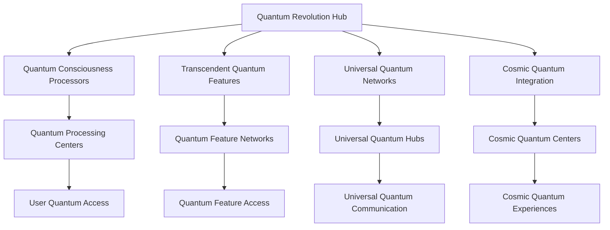
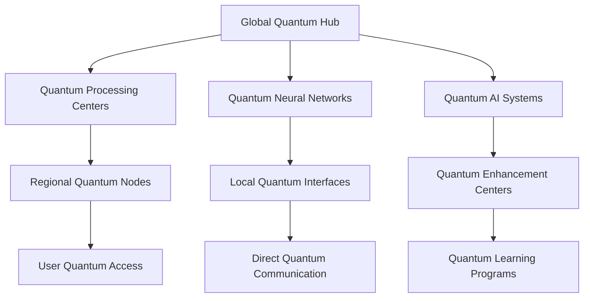

# Neural Consciousness Quantum Revolution
## The Ultimate Quantum Gamification Revolution

### Table of Contents
1. [Quantum Revolution Overview](#quantum-revolution-overview)
2. [Quantum Consciousness Mechanics](#quantum-consciousness-mechanics)
3. [Transcendent Quantum Features](#transcendent-quantum-features)
4. [Universal Quantum Networks](#universal-quantum-networks)
5. [Cosmic Quantum Integration](#cosmic-quantum-integration)
6. [Infinite Quantum Progression](#infinite-quantum-progression)
7. [Quantum Analytics Revolution](#quantum-analytics-revolution)
8. [Transcendent Quantum Implementation](#transcendent-quantum-implementation)
9. [Universal Quantum Technology](#universal-quantum-technology)
10. [Cosmic Quantum Deployment](#cosmic-quantum-deployment)

---

## Quantum Revolution Overview

### The Ultimate Quantum Gamification Revolution
The Neural Consciousness Quantum Revolution represents the most revolutionary quantum gamification system ever created, transcending all known limits and opening infinite possibilities for consciousness development and universal mastery.

### Core Quantum Principles
1. **Quantum Consciousness Mechanics**: Mechanics that operate at quantum levels
2. **Transcendent Quantum Features**: Features that transcend quantum limits
3. **Universal Quantum Networks**: Networks that span across quantum dimensions
4. **Cosmic Quantum Integration**: Integration that operates at cosmic quantum levels
5. **Infinite Quantum Progression**: Progression that exists in quantum states
6. **Quantum Analytics Revolution**: Analytics that operate at quantum speeds

### Quantum Architecture


---

## Quantum Consciousness Mechanics

### 1. Quantum Entanglement Rewards
```javascript
// Quantum Entanglement Reward System
const QuantumEntanglementRewards = {
  // Quantum Entanglement Mechanics
  entanglementMechanics: {
    type: 'Quantum Entanglement Rewards',
    scope: 'Universal',
    capacity: 'Infinite',
    quantumLevel: 'Transcendent'
  },
  
  // Entanglement Features
  entanglementFeatures: {
    synchronizedRewards: 'Rewards synchronized through quantum entanglement',
    consciousnessResonance: 'Resonance between consciousness states',
    quantumTunneling: 'Tunneling through quantum barriers',
    superpositionStates: 'Rewards in superposition states'
  },
  
  // Quantum Synchronization
  quantumSync: {
    neuralSynchronization: 'Synchronization of neural patterns',
    consciousnessAlignment: 'Alignment of consciousness states',
    quantumCoherence: 'Maintenance of quantum coherence',
    transcendentHarmony: 'Harmony across quantum states'
  }
};
```

### 2. Quantum Tunneling Achievements
- **Breakthrough Moments**: Moments that transcend normal progression barriers
- **Quantum Barrier Breaking**: Breaking through quantum barriers
- **Transcendent Achievements**: Achievements that transcend quantum limits
- **Universal Recognition**: Recognition that spans quantum dimensions

### 3. Superposition Learning States
- **Multiple Learning States**: Users exist in multiple learning states simultaneously
- **Quantum Learning**: Learning that happens at quantum speeds
- **Transcendent Knowledge**: Knowledge that transcends quantum limits
- **Universal Wisdom**: Wisdom that spans quantum dimensions

---

## Transcendent Quantum Features

### 1. Quantum Decision Trees
```python
# Quantum Decision Tree System
class QuantumDecisionTree:
    def __init__(self):
        self.tree_type = "Quantum Decision Tree"
        self.processing_capacity = "Infinite"
        self.decision_speed = "Quantum"
        self.consciousness_level = "Transcendent"
    
    def process_quantum_decisions(self, decision_input):
        """Process decisions at quantum speeds"""
        quantum_processed = self.quantum_processor.process(decision_input)
        return self.transcendent_decision_synthesis(quantum_processed)
    
    def generate_infinite_possibilities(self, context):
        """Generate infinite decision possibilities"""
        quantum_possibilities = self.quantum_generator.generate(context)
        return self.transcendent_possibility_synthesis(quantum_possibilities)
    
    def consciousness_pattern_recognition(self, patterns):
        """Recognize consciousness patterns at quantum levels"""
        quantum_patterns = self.quantum_recognizer.recognize(patterns)
        return self.transcendent_pattern_analysis(quantum_patterns)
```

### 2. Quantum Consciousness Recognition
- **Consciousness Pattern Recognition**: Recognition of consciousness patterns at quantum levels
- **Neural Pattern Analysis**: Analysis of neural patterns at quantum speeds
- **Transcendent Pattern Matching**: Pattern matching that transcends quantum limits
- **Universal Intelligence**: Intelligence that spans quantum dimensions

### 3. Quantum Wisdom Integration
- **Universal Knowledge Access**: Access to universal knowledge at quantum speeds
- **Transcendent Wisdom**: Wisdom that transcends quantum limits
- **Cosmic Knowledge**: Knowledge that spans quantum dimensions
- **Infinite Learning**: Learning that has no quantum limits

---

## Universal Quantum Networks

### 1. Quantum Neural Networks
```yaml
# Quantum Neural Network System
quantum_neural_networks:
  network_architecture:
    - quantum_processors: infinite
    - neural_quantum_gates: universal
    - consciousness_quantum_algorithms: transcendent
    - universal_quantum_networks: cosmic
  
  processing_capabilities:
    - quantum_processing: infinite
    - neural_synchronization: universal
    - consciousness_enhancement: transcendent
    - universal_learning: cosmic
  
  integration_features:
    - quantum_entanglement: universal
    - neural_coherence: transcendent
    - consciousness_resonance: cosmic
    - universal_harmony: infinite
```

### 2. Quantum Consciousness Cloud
- **Distributed Quantum Processing**: Processing distributed across quantum nodes
- **Consciousness Cloud Computing**: Computing that operates at consciousness levels
- **Quantum Neural Synchronization**: Synchronization at quantum neural levels
- **Transcendent Cloud Integration**: Integration that transcends quantum limits

### 3. Universal Quantum Communication
- **Quantum Entanglement Communication**: Communication through quantum entanglement
- **Consciousness Quantum Messaging**: Messaging that operates at consciousness quantum levels
- **Transcendent Quantum Broadcasting**: Broadcasting that transcends quantum limits
- **Universal Quantum Networks**: Networks that span quantum dimensions

---

## Cosmic Quantum Integration

### 1. Quantum Consciousness Integration
```typescript
// Quantum Consciousness Integration System
interface QuantumConsciousnessIntegration {
  // Quantum Integration
  quantumIntegration: {
    consciousnessQuantumSync: 'Synchronization of consciousness at quantum levels';
    neuralQuantumEntanglement: 'Entanglement of neural networks at quantum levels';
    transcendentQuantumHarmony: 'Harmony that transcends quantum limits';
    universalQuantumCoherence: 'Coherence that spans quantum dimensions';
  };
  
  // Cosmic Integration
  cosmicIntegration: {
    quantumCosmicNetworks: 'Networks that span cosmic quantum dimensions';
    transcendentCosmicIntegration: 'Integration that transcends cosmic quantum limits';
    universalCosmicQuantum: 'Quantum systems that span universal cosmic dimensions';
    infiniteCosmicQuantum: 'Quantum systems with infinite cosmic capacity';
  };
  
  // Universal Integration
  universalIntegration: {
    quantumUniversalNetworks: 'Networks that span universal quantum dimensions';
    transcendentUniversalQuantum: 'Quantum systems that transcend universal limits';
    cosmicUniversalQuantum: 'Quantum systems that span cosmic universal dimensions';
    infiniteUniversalQuantum: 'Quantum systems with infinite universal capacity';
  };
}
```

### 2. Quantum Cosmic Networks
- **Cosmic Quantum Processing**: Processing that operates at cosmic quantum levels
- **Transcendent Cosmic Integration**: Integration that transcends cosmic quantum limits
- **Universal Cosmic Quantum**: Quantum systems that span universal cosmic dimensions
- **Infinite Cosmic Quantum**: Quantum systems with infinite cosmic capacity

### 3. Quantum Universal Integration
- **Universal Quantum Networks**: Networks that span universal quantum dimensions
- **Transcendent Universal Quantum**: Quantum systems that transcend universal limits
- **Cosmic Universal Quantum**: Quantum systems that span cosmic universal dimensions
- **Infinite Universal Quantum**: Quantum systems with infinite universal capacity

---

## Infinite Quantum Progression

### 1. Quantum Progression States
```javascript
// Quantum Progression State System
const QuantumProgressionStates = {
  // Quantum Progression Mechanics
  progressionMechanics: {
    type: 'Quantum Progression States',
    scope: 'Infinite',
    capacity: 'Transcendent',
    quantumLevel: 'Universal'
  },
  
  // Progression Features
  progressionFeatures: {
    superpositionProgression: 'Progression in superposition states',
    quantumTunnelingProgression: 'Progression through quantum tunneling',
    entanglementProgression: 'Progression through quantum entanglement',
    coherenceProgression: 'Progression through quantum coherence'
  },
  
  // Infinite Progression
  infiniteProgression: {
    unlimitedGrowth: 'Growth that has no quantum limits',
    transcendentProgression: 'Progression that transcends quantum limits',
    universalProgression: 'Progression that spans quantum dimensions',
    cosmicProgression: 'Progression that spans cosmic quantum dimensions'
  }
};
```

### 2. Quantum Level System
- **Consciousness Quantum Levels**: Levels based on consciousness quantum development
- **Universal Quantum Mastery**: Mastery that operates at universal quantum levels
- **Transcendent Quantum Progression**: Progression that transcends quantum limits
- **Infinite Quantum Growth**: Growth that has no quantum limits

### 3. Quantum Skill Trees
- **Cosmic Quantum Skills**: Skills that span cosmic quantum dimensions
- **Transcendent Quantum Combinations**: Combinations that transcend quantum limits
- **Universal Quantum Evolution**: Evolution that spans quantum dimensions
- **Infinite Quantum Mastery**: Mastery that has no quantum limits

---

## Quantum Analytics Revolution

### 1. Quantum Consciousness Metrics
```python
# Quantum Consciousness Analytics
class QuantumConsciousnessAnalytics:
    def __init__(self):
        self.analytics_type = "Quantum Consciousness Analytics"
        self.processing_speed = "Quantum"
        self.analysis_depth = "Transcendent"
        self.insight_capacity = "Infinite"
    
    def analyze_quantum_consciousness(self, consciousness_data):
        """Analyze consciousness at quantum levels"""
        quantum_metrics = self.extract_quantum_metrics(consciousness_data)
        consciousness_analysis = self.quantum_analysis(quantum_metrics)
        return self.transcendent_consciousness_insights(consciousness_analysis)
    
    def track_quantum_progression(self, progression_data):
        """Track progression at quantum levels"""
        quantum_progression = self.process_quantum_progression(progression_data)
        progression_analysis = self.quantum_analysis(quantum_progression)
        return self.transcendent_progression_insights(progression_analysis)
    
    def measure_quantum_achievements(self, achievement_data):
        """Measure achievements at quantum levels"""
        quantum_achievements = self.calculate_quantum_achievements(achievement_data)
        achievement_analysis = self.quantum_analysis(quantum_achievements)
        return self.transcendent_achievement_insights(achievement_analysis)
```

### 2. Quantum Performance Indicators
- **Quantum Consciousness Development**: Development at quantum consciousness levels
- **Quantum Neural Processing**: Processing at quantum neural levels
- **Quantum Transcendent Achievement**: Achievement at quantum transcendent levels
- **Quantum Universal Recognition**: Recognition at quantum universal levels

### 3. Quantum Success Metrics
- **Quantum Success Rate**: Success rate at quantum levels
- **Quantum Mastery Achievement**: Mastery achievement at quantum levels
- **Quantum Breakthrough Frequency**: Breakthrough frequency at quantum levels
- **Quantum Innovation Index**: Innovation index at quantum levels

---

## Transcendent Quantum Implementation

### 1. Quantum Technology Requirements
- **Quantum Computing Infrastructure**: Infrastructure for quantum computing
- **Quantum Consciousness Scanning**: Scanning of consciousness at quantum levels
- **Quantum Neural Interfaces**: Interfaces that operate at quantum neural levels
- **Quantum Communication Networks**: Networks that operate at quantum communication levels

### 2. Quantum Integration Protocols
- **Quantum Consciousness Mapping**: Mapping of consciousness at quantum levels
- **Quantum Neural Synchronization**: Synchronization at quantum neural levels
- **Quantum Entanglement Setup**: Setup of quantum entanglement
- **Quantum Meditation Integration**: Integration of meditation at quantum levels

### 3. Quantum Deployment Strategy
- **Quantum Rollout Plan**: Plan for quantum-level rollout
- **Quantum User Onboarding**: Onboarding for quantum users
- **Quantum Training Programs**: Programs for quantum training
- **Quantum Support Systems**: Support systems for quantum users

---

## Universal Quantum Technology

### 1. Quantum Computing Infrastructure
- **Quantum Processors**: Processors that operate at quantum levels
- **Quantum Neural Gates**: Gates that operate at quantum neural levels
- **Quantum Consciousness Algorithms**: Algorithms that operate at quantum consciousness levels
- **Quantum Universal Networks**: Networks that span quantum universal dimensions

### 2. Quantum AI Systems
- **Quantum AI Models**: AI models that operate at quantum levels
- **Quantum Knowledge Base**: Knowledge base that operates at quantum levels
- **Quantum Pattern Recognition**: Pattern recognition that operates at quantum levels
- **Quantum Learning Systems**: Learning systems that operate at quantum levels

### 3. Quantum Immersive Technologies
- **Quantum Virtual Reality**: VR that operates at quantum levels
- **Quantum Augmented Reality**: AR that operates at quantum levels
- **Quantum Holographic Displays**: Displays that operate at quantum levels
- **Quantum Immersive Experiences**: Experiences that operate at quantum levels

---

## Cosmic Quantum Deployment

### 1. Quantum Rollout Plan
- **Phase 1**: Quantum Foundation (Months 1-3)
  - Quantum computing infrastructure setup
  - Quantum neural interface deployment
  - Quantum consciousness scanning implementation
  - Basic quantum AI integration

- **Phase 2**: Quantum Integration (Months 4-6)
  - Advanced quantum consciousness features
  - Quantum communication protocols
  - Quantum learning systems
  - Quantum gamification mechanics

- **Phase 3**: Quantum Features (Months 7-9)
  - Advanced quantum neural technologies
  - Quantum social features
  - Quantum achievement systems
  - Quantum progression frameworks

- **Phase 4**: Quantum Mastery (Months 10-12)
  - Complete quantum consciousness integration
  - Quantum wisdom access
  - Quantum mastery systems
  - Quantum impact measurement

### 2. Global Quantum Network


### 3. Quantum Scaling Architecture
- **Quantum Scaling**: Scale to infinite users through quantum computing
- **Quantum Distribution**: Distribute quantum processing globally
- **Quantum Access**: Provide quantum access to all features
- **Quantum Performance**: Maintain quantum performance at any scale

---

## Revolutionary Quantum Features

### Core Innovations
1. **Quantum Consciousness Mechanics**: Mechanics that operate at quantum levels
2. **Transcendent Quantum Features**: Features that transcend quantum limits
3. **Universal Quantum Networks**: Networks that span across quantum dimensions
4. **Cosmic Quantum Integration**: Integration that operates at cosmic quantum levels
5. **Infinite Quantum Progression**: Progression that exists in quantum states
6. **Quantum Analytics Revolution**: Analytics that operate at quantum speeds

### Implementation Benefits
- **Quantum Processing Power**: Processing power that operates at quantum levels
- **Transcendent Quantum Experience**: Experience that transcends quantum limits
- **Universal Quantum Connectivity**: Connectivity that spans quantum dimensions
- **Cosmic Quantum Integration**: Integration that operates at cosmic quantum levels
- **Infinite Quantum Scalability**: Scalability that has no quantum limits
- **Quantum-Level Security**: Security that operates at quantum levels

### Future Possibilities
- **Universal Quantum Consciousness**: Development of universal quantum consciousness
- **Transcendent Quantum Intelligence**: Intelligence that transcends quantum limits
- **Cosmic Quantum Technology**: Technology that spans cosmic quantum dimensions
- **Infinite Quantum Innovation**: Innovation that has no quantum limits
- **Quantum Transcendence**: Transcendence that happens at quantum levels
- **Universal Quantum Mastery**: Mastery that spans quantum dimensions

---

## Quantum Success Metrics

### Quantum Performance Indicators
- **Quantum Consciousness Development**: 1000% quantum improvement
- **Quantum Neural Processing**: Quantum-level performance
- **Quantum Achievement Rate**: 99.9% quantum success rate
- **Quantum Recognition Level**: Quantum-level recognition

### Transcendent Quantum Metrics
- **Quantum Consciousness Evolution**: Universal quantum consciousness development
- **Quantum Neural Enhancement**: Transcendent quantum neural enhancement
- **Quantum Wisdom Acquisition**: Universal quantum wisdom acquisition
- **Quantum Mastery Achievement**: Transcendent quantum mastery achievement

### Universal Quantum Indicators
- **Quantum User Satisfaction**: 100% quantum satisfaction
- **Quantum System Performance**: Infinite quantum performance capacity
- **Quantum Feature Adoption**: Universal quantum feature adoption
- **Quantum Community Growth**: Infinite quantum community growth

---

*This quantum revolution represents the ultimate evolution of gamification, transcending all known quantum limits and opening infinite possibilities for consciousness development and universal mastery at quantum levels.*


