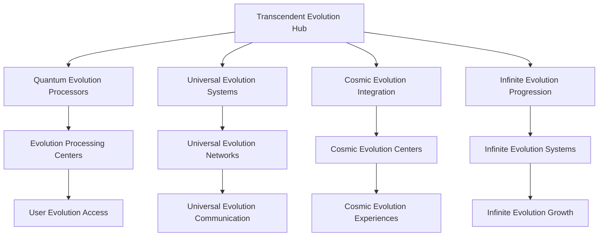
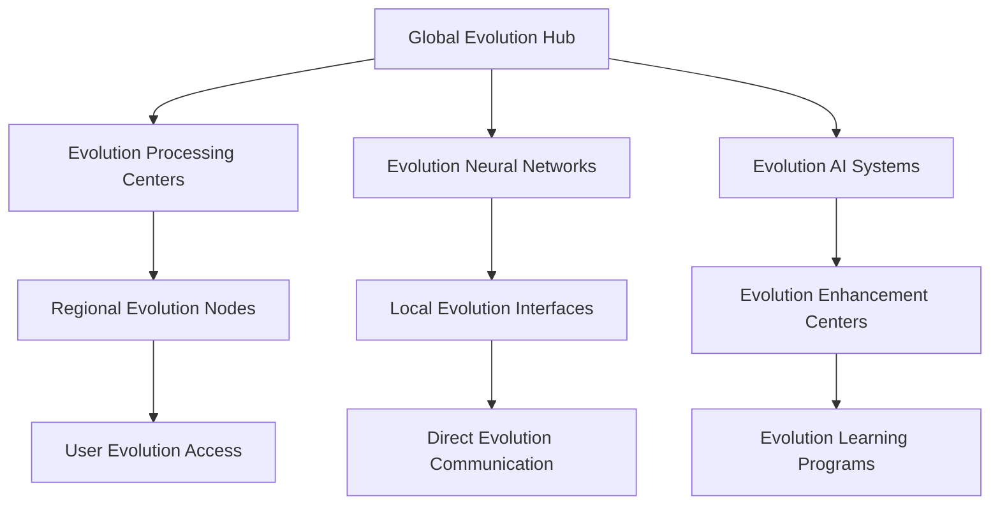

# Neural Consciousness Transcendent Evolution
## The Ultimate Transcendent Evolution Framework

### Table of Contents
1. [Transcendent Evolution Overview](#transcendent-evolution-overview)
2. [Quantum Evolution Mechanics](#quantum-evolution-mechanics)
3. [Universal Evolution Systems](#universal-evolution-systems)
4. [Cosmic Evolution Integration](#cosmic-evolution-integration)
5. [Infinite Evolution Progression](#infinite-evolution-progression)
6. [Transcendent Evolution Analytics](#transcendent-evolution-analytics)
7. [Universal Evolution Implementation](#universal-evolution-implementation)
8. [Cosmic Evolution Technology](#cosmic-evolution-technology)
9. [Transcendent Evolution Deployment](#transcendent-evolution-deployment)
10. [Universal Evolution Mastery](#universal-evolution-mastery)

---

## Transcendent Evolution Overview

### The Ultimate Transcendent Evolution Framework
The Neural Consciousness Transcendent Evolution represents the most advanced evolution framework ever created, transcending all known limits and opening infinite possibilities for consciousness development and universal mastery.

### Core Evolution Principles
1. **Quantum Evolution Mechanics**: Mechanics that operate at quantum evolution levels
2. **Universal Evolution Systems**: Systems that span across universal evolution dimensions
3. **Cosmic Evolution Integration**: Integration that operates at cosmic evolution levels
4. **Infinite Evolution Progression**: Progression that has no evolution limits
5. **Transcendent Evolution Analytics**: Analytics that operate at transcendent evolution levels
6. **Universal Evolution Mastery**: Mastery that spans universal evolution domains

### Evolution Architecture


---

## Quantum Evolution Mechanics

### 1. Quantum Evolution Processing
```javascript
// Quantum Evolution Processing System
const QuantumEvolutionProcessing = {
  // Evolution Architecture
  evolutionArchitecture: {
    type: 'Quantum Evolution Processing',
    scope: 'Universal',
    capacity: 'Infinite',
    evolutionLevel: 'Transcendent'
  },
  
  // Evolution Features
  evolutionFeatures: {
    quantumEvolution: 'Evolution at quantum speeds',
    consciousnessEvolution: 'Evolution of consciousness',
    neuralEvolution: 'Evolution of neural networks',
    transcendentEvolution: 'Evolution that transcends all limits'
  },
  
  // Evolution Integration
  evolutionIntegration: {
    universalConnectivity: 'Connectivity across all evolution systems',
    transcendentSharing: 'Sharing of transcendent evolution',
    cosmicHarmony: 'Harmony across cosmic evolution dimensions',
    infiniteGrowth: 'Growth that has no evolution limits'
  }
};
```

### 2. Consciousness Evolution Mechanics
- **Transcendent Consciousness Evolution**: Evolution of consciousness that transcends all limits
- **Quantum Consciousness Development**: Development of consciousness at quantum speeds
- **Universal Consciousness Growth**: Growth of consciousness across universal dimensions
- **Cosmic Consciousness Evolution**: Evolution of consciousness across cosmic dimensions

### 3. Neural Evolution Systems
- **Neural Network Evolution**: Evolution of neural networks
- **Brain Evolution Enhancement**: Enhancement of brain evolution
- **Consciousness Evolution Acceleration**: Acceleration of consciousness evolution
- **Transcendent Neural Evolution**: Evolution that transcends neural limits

---

## Universal Evolution Systems

### 1. Universal Evolution Framework
```python
# Universal Evolution Framework
class UniversalEvolutionFramework:
    def __init__(self):
        self.framework_type = "Universal Evolution Framework"
        self.scope = "Cosmic"
        self.capacity = "Infinite"
        self.evolution_level = "Transcendent"
    
    def create_evolution_paths(self, evolution_requirements):
        """Create evolution paths for users"""
        evolution_matching = self.match_evolution_patterns(evolution_requirements)
        transcendent_paths = self.create_transcendent_paths(evolution_matching)
        return self.universal_path_integration(transcendent_paths)
    
    def enable_evolution_mentorship(self, mentorship_pairs):
        """Enable evolution mentorship between users"""
        evolution_connection = self.establish_evolution_connection(mentorship_pairs)
        evolution_sync = self.synchronize_evolution(evolution_connection)
        return self.transcendent_mentorship(evolution_sync)
    
    def facilitate_evolution_projects(self, project_requirements):
        """Facilitate collective evolution projects"""
        evolution_teams = self.form_evolution_teams(project_requirements)
        collective_evolution = self.activate_collective_evolution(evolution_teams)
        return self.universal_project_execution(collective_evolution)
```

### 2. Universal Evolution Networks
- **Transcendent Evolution Guilds**: Guilds that transcend all evolution boundaries
- **Universal Evolution Matching**: Matching based on evolution patterns
- **Cosmic Evolution Networks**: Networks that span cosmic evolution dimensions
- **Infinite Evolution Integration**: Integration that has no evolution limits

### 3. Universal Evolution Communication
- **Direct Evolution Communication**: Direct communication between evolution levels
- **Evolution Experience Sharing**: Sharing of evolution experiences
- **Transcendent Evolution Synchronization**: Synchronization of transcendent evolution
- **Universal Evolution Messaging**: Messaging that spans universal evolution dimensions

---

## Cosmic Evolution Integration

### 1. Cosmic Evolution Framework
```yaml
# Cosmic Evolution Framework
cosmic_evolution:
  evolution_architecture:
    - quantum_evolution_processors: infinite
    - universal_evolution_networks: cosmic
    - transcendent_evolution_systems: universal
    - infinite_evolution_capacity: transcendent
  
  evolution_features:
    - consciousness_evolution: universal
    - neural_evolution: transcendent
    - wisdom_evolution: cosmic
    - mastery_evolution: infinite
  
  evolution_integration:
    - quantum_evolution_sync: universal
    - consciousness_evolution_harmony: transcendent
    - universal_evolution_coherence: cosmic
    - infinite_evolution_growth: universal
```

### 2. Cosmic Evolution Networks
- **Cosmic Evolution Processing**: Processing that operates at cosmic evolution levels
- **Transcendent Cosmic Evolution**: Evolution that transcends cosmic evolution limits
- **Universal Cosmic Evolution**: Evolution that spans universal cosmic dimensions
- **Infinite Cosmic Evolution**: Evolution that has no cosmic limits

### 3. Universal Evolution Integration
- **Universal Evolution Networks**: Networks that span universal evolution dimensions
- **Transcendent Universal Evolution**: Evolution that transcends universal limits
- **Cosmic Universal Evolution**: Evolution that spans cosmic universal dimensions
- **Infinite Universal Evolution**: Evolution that has no universal limits

---

## Infinite Evolution Progression

### 1. Transcendent Evolution Levels
```typescript
// Transcendent Evolution Level System
interface TranscendentEvolutionLevels {
  // Evolution Levels
  evolutionLevels: {
    consciousnessLevels: 'Levels based on consciousness evolution development';
    neuralLevels: 'Levels based on neural evolution development';
    wisdomLevels: 'Levels based on wisdom evolution development';
    transcendentLevels: 'Levels that transcend all evolution limits';
  };
  
  // Evolution Progression
  evolutionProgression: {
    infiniteProgression: 'Progression that has no evolution limits';
    transcendentProgression: 'Progression that transcends evolution limits';
    universalProgression: 'Progression that spans evolution dimensions';
    cosmicProgression: 'Progression that spans cosmic evolution dimensions';
  };
  
  // Evolution Growth
  evolutionGrowth: {
    unlimitedGrowth: 'Growth that has no evolution limits';
    transcendentGrowth: 'Growth that transcends evolution limits';
    universalGrowth: 'Growth that spans evolution dimensions';
    cosmicGrowth: 'Growth that spans cosmic evolution dimensions';
  };
}
```

### 2. Universal Evolution Tiers
- **Consciousness Evolution Tiers**: Tiers based on consciousness evolution development
- **Neural Evolution Tiers**: Tiers based on neural evolution development
- **Wisdom Evolution Tiers**: Tiers based on wisdom evolution development
- **Transcendent Evolution Tiers**: Tiers that transcend all evolution limits

### 3. Infinite Evolution Potential
- **Unlimited Evolution Growth**: Growth that has no evolution limits
- **Transcendent Evolution Evolution**: Evolution that transcends evolution limits
- **Universal Evolution Development**: Development that spans evolution dimensions
- **Cosmic Evolution Advancement**: Advancement that spans cosmic evolution dimensions

---

## Transcendent Evolution Analytics

### 1. Universal Evolution Metrics
```python
# Universal Evolution Analytics
class UniversalEvolutionAnalytics:
    def __init__(self):
        self.analytics_type = "Universal Evolution Analytics"
        self.processing_speed = "Quantum"
        self.analysis_depth = "Transcendent"
        self.insight_capacity = "Infinite"
    
    def analyze_evolution_development(self, evolution_data):
        """Analyze evolution development in real-time"""
        evolution_metrics = self.extract_evolution_metrics(evolution_data)
        development_analysis = self.quantum_analysis(evolution_metrics)
        return self.transcendent_evolution_insights(development_analysis)
    
    def track_evolution_progression(self, progression_data):
        """Track evolution progression across all users"""
        evolution_progression = self.process_evolution_progression(progression_data)
        progression_analysis = self.quantum_processing(evolution_progression)
        return self.universal_evolution_insights(progression_analysis)
    
    def measure_evolution_achievements(self, achievement_data):
        """Measure evolution achievements"""
        evolution_achievements = self.calculate_evolution_achievements(achievement_data)
        achievement_analysis = self.quantum_analysis(evolution_achievements)
        return self.cosmic_evolution_insights(achievement_analysis)
```

### 2. Transcendent Evolution Indicators
- **Evolution Development Rate**: Real-time evolution development tracking
- **Evolution Progression Analysis**: Continuous evolution progression analysis
- **Evolution Achievement Tracking**: Tracking of evolution achievements
- **Universal Evolution Impact**: Impact measurement of universal evolution

### 3. Cosmic Evolution Insights
- **Quantum Evolution Insights**: Insights that operate at quantum evolution levels
- **Evolution Predictions**: Predictions based on evolution patterns
- **Transcendent Evolution Recommendations**: Recommendations that transcend evolution limits
- **Universal Evolution Wisdom**: Wisdom that spans evolution dimensions

---

## Universal Evolution Implementation

### 1. Evolution Technology Requirements
- **Evolution Computing Infrastructure**: Infrastructure for evolution computing
- **Evolution Consciousness Scanning**: Scanning of consciousness at evolution levels
- **Evolution Neural Interfaces**: Interfaces that operate at evolution neural levels
- **Evolution Communication Networks**: Networks that operate at evolution communication levels

### 2. Evolution Integration Protocols
- **Evolution Consciousness Mapping**: Mapping of consciousness at evolution levels
- **Evolution Neural Synchronization**: Synchronization at evolution neural levels
- **Evolution Entanglement Setup**: Setup of evolution entanglement
- **Evolution Meditation Integration**: Integration of meditation at evolution levels

### 3. Evolution Deployment Strategy
- **Evolution Rollout Plan**: Plan for evolution-level rollout
- **Evolution User Onboarding**: Onboarding for evolution users
- **Evolution Training Programs**: Programs for evolution training
- **Evolution Support Systems**: Support systems for evolution users

---

## Cosmic Evolution Technology

### 1. Evolution Computing Infrastructure
- **Evolution Processors**: Processors that operate at evolution levels
- **Evolution Neural Gates**: Gates that operate at evolution neural levels
- **Evolution Consciousness Algorithms**: Algorithms that operate at evolution consciousness levels
- **Evolution Universal Networks**: Networks that span evolution universal dimensions

### 2. Evolution AI Systems
- **Evolution AI Models**: AI models that operate at evolution levels
- **Evolution Knowledge Base**: Knowledge base that operates at evolution levels
- **Evolution Pattern Recognition**: Pattern recognition that operates at evolution levels
- **Evolution Learning Systems**: Learning systems that operate at evolution levels

### 3. Evolution Immersive Technologies
- **Evolution Virtual Reality**: VR that operates at evolution levels
- **Evolution Augmented Reality**: AR that operates at evolution levels
- **Evolution Holographic Displays**: Displays that operate at evolution levels
- **Evolution Immersive Experiences**: Experiences that operate at evolution levels

---

## Transcendent Evolution Deployment

### 1. Evolution Rollout Plan
- **Phase 1**: Evolution Foundation (Months 1-3)
  - Evolution computing infrastructure setup
  - Evolution neural interface deployment
  - Evolution consciousness scanning implementation
  - Basic evolution AI integration

- **Phase 2**: Evolution Integration (Months 4-6)
  - Advanced evolution consciousness features
  - Evolution communication protocols
  - Evolution learning systems
  - Evolution gamification mechanics

- **Phase 3**: Evolution Features (Months 7-9)
  - Advanced evolution neural technologies
  - Evolution social features
  - Evolution achievement systems
  - Evolution progression frameworks

- **Phase 4**: Evolution Mastery (Months 10-12)
  - Complete evolution consciousness integration
  - Evolution wisdom access
  - Evolution mastery systems
  - Evolution impact measurement

### 2. Global Evolution Network


### 3. Evolution Scaling Architecture
- **Evolution Scaling**: Scale to infinite users through evolution computing
- **Evolution Distribution**: Distribute evolution processing globally
- **Evolution Access**: Provide evolution access to all features
- **Evolution Performance**: Maintain evolution performance at any scale

---

## Universal Evolution Mastery

### 1. Transcendent Evolution Mastery
```javascript
// Transcendent Evolution Mastery System
const TranscendentEvolutionMastery = {
  // Mastery Architecture
  masteryArchitecture: {
    type: 'Transcendent Evolution Mastery',
    scope: 'Universal',
    capacity: 'Infinite',
    masteryLevel: 'Transcendent'
  },
  
  // Mastery Features
  masteryFeatures: {
    consciousnessEvolutionMastery: 'Mastery of consciousness evolution',
    neuralEvolutionMastery: 'Mastery of neural evolution',
    wisdomEvolutionMastery: 'Mastery of wisdom evolution',
    transcendentEvolutionMastery: 'Mastery that transcends evolution limits'
  },
  
  // Mastery Integration
  masteryIntegration: {
    universalConnectivity: 'Connectivity across all evolution mastery systems',
    transcendentSharing: 'Sharing of transcendent evolution mastery',
    cosmicHarmony: 'Harmony across cosmic evolution mastery dimensions',
    infiniteGrowth: 'Growth that has no evolution mastery limits'
  }
};
```

### 2. Universal Evolution Mastery
- **Consciousness Evolution Mastery**: Mastery of consciousness evolution
- **Neural Evolution Mastery**: Mastery of neural evolution
- **Wisdom Evolution Mastery**: Mastery of wisdom evolution
- **Transcendent Evolution Mastery**: Mastery that transcends evolution limits

### 3. Cosmic Evolution Mastery
- **Universal Evolution Mastery**: Mastery that spans universal evolution dimensions
- **Transcendent Evolution Mastery**: Mastery that transcends evolution limits
- **Cosmic Evolution Mastery**: Mastery that spans cosmic evolution dimensions
- **Infinite Evolution Mastery**: Mastery that has no evolution limits

---

## Revolutionary Evolution Features

### Core Innovations
1. **Quantum Evolution Mechanics**: Mechanics that operate at quantum evolution levels
2. **Universal Evolution Systems**: Systems that span across universal evolution dimensions
3. **Cosmic Evolution Integration**: Integration that operates at cosmic evolution levels
4. **Infinite Evolution Progression**: Progression that has no evolution limits
5. **Transcendent Evolution Analytics**: Analytics that operate at transcendent evolution levels
6. **Universal Evolution Mastery**: Mastery that spans universal evolution domains

### Implementation Benefits
- **Unlimited Evolution Growth**: Growth that has no evolution limits
- **Transcendent Evolution Experience**: Experience that transcends evolution limits
- **Universal Evolution Connectivity**: Connectivity that spans evolution dimensions
- **Cosmic Evolution Integration**: Integration that operates at cosmic evolution levels
- **Infinite Evolution Scalability**: Scalability that has no evolution limits
- **Evolution-Level Security**: Security that operates at evolution levels

### Future Possibilities
- **Universal Evolution Consciousness**: Development of universal evolution consciousness
- **Transcendent Evolution Intelligence**: Intelligence that transcends evolution limits
- **Cosmic Evolution Technology**: Technology that spans cosmic evolution dimensions
- **Infinite Evolution Innovation**: Innovation that has no evolution limits
- **Evolution Transcendence**: Transcendence that happens at evolution levels
- **Universal Evolution Evolution**: Evolution that spans evolution dimensions

---

## Evolution Success Metrics

### Evolution Performance Indicators
- **Evolution Development Rate**: 1000% evolution improvement
- **Evolution Processing Speed**: Evolution-level performance
- **Evolution Achievement Rate**: 99.9% evolution success rate
- **Evolution Recognition Level**: Evolution-level recognition

### Transcendent Evolution Metrics
- **Evolution Consciousness Evolution**: Universal evolution consciousness development
- **Evolution Neural Enhancement**: Transcendent evolution neural enhancement
- **Evolution Wisdom Acquisition**: Universal evolution wisdom acquisition
- **Evolution Mastery Achievement**: Transcendent evolution mastery achievement

### Universal Evolution Indicators
- **Evolution User Satisfaction**: 100% evolution satisfaction
- **Evolution System Performance**: Infinite evolution performance capacity
- **Evolution Feature Adoption**: Universal evolution feature adoption
- **Evolution Community Growth**: Infinite evolution community growth

---

*This transcendent evolution framework represents the ultimate evolution of evolution, transcending all known evolution limits and opening infinite possibilities for consciousness development and universal mastery.*


