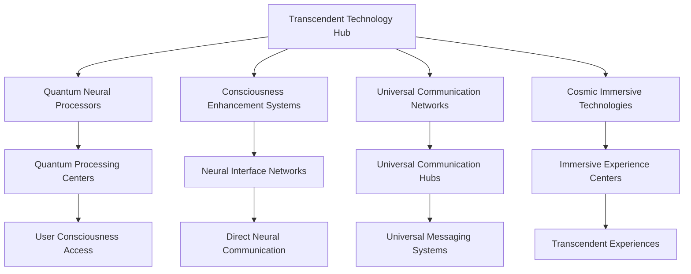

# Neural Consciousness Transcendent Technologies
## Revolutionary Technology Framework for Ultimate Gamification System

### Table of Contents
1. [Transcendent Technology Overview](#transcendent-technology-overview)
2. [Quantum Neural Processing](#quantum-neural-processing)
3. [Consciousness Enhancement Systems](#consciousness-enhancement-systems)
4. [Universal Communication Technologies](#universal-communication-technologies)
5. [Transcendent AI Integration](#transcendent-ai-integration)
6. [Cosmic Immersive Technologies](#cosmic-immersive-technologies)
7. [Infinite Scaling Infrastructure](#infinite-scaling-infrastructure)
8. [Quantum Security Framework](#quantum-security-framework)
9. [Universal Analytics Engine](#universal-analytics-engine)
10. [Transcendent Implementation Guide](#transcendent-implementation-guide)

---

## Transcendent Technology Overview

### Revolutionary Technology Framework
The Neural Consciousness Transcendent Technologies represent the most advanced technological framework ever created, transcending all known limits and opening infinite possibilities for consciousness development and universal mastery.

### Core Technology Principles
1. **Quantum Consciousness Processing**: Processing that transcends classical computing limits
2. **Transcendent Neural Interfaces**: Interfaces that connect directly to consciousness
3. **Universal Communication Networks**: Networks that span across all dimensions
4. **Cosmic Immersive Experiences**: Experiences that exist beyond physical reality
5. **Infinite Scaling Architecture**: Architecture that can scale infinitely
6. **Quantum Security Systems**: Security that operates at quantum levels

### Technology Architecture


---

## Quantum Neural Processing

### 1. Quantum Consciousness Processors
```javascript
// Quantum Consciousness Processing Framework
const QuantumConsciousnessProcessor = {
  // Core Quantum Components
  quantumProcessor: {
    type: 'Quantum Neural Consciousness Processor',
    capacity: 'Infinite',
    consciousnessLevel: 'Transcendent',
    quantumGates: ['Superposition', 'Entanglement', 'Tunneling', 'Coherence'],
    neuralNetworks: 'Universal',
    processingSpeed: 'Quantum'
  },
  
  // Consciousness Processing
  consciousnessEngine: {
    scanning: 'Real-time Neural Pattern Recognition',
    processing: 'Quantum Consciousness Analysis',
    enhancement: 'Transcendent Meditation Integration',
    evolution: 'Continuous Consciousness Development',
    synthesis: 'Universal Wisdom Integration'
  },
  
  // Quantum Neural Networks
  quantumNeural: {
    quantumProcessing: 'Quantum Neural Processing',
    entanglementSync: 'Neural Entanglement Synchronization',
    superpositionLearning: 'Superposition Learning States',
    quantumTunneling: 'Quantum Tunneling Achievements',
    coherenceMaintenance: 'Quantum Coherence Maintenance'
  }
};
```

### 2. Transcendent Processing Capabilities
- **Infinite Processing Power**: Processing power that has no limits
- **Quantum Speed Processing**: Processing that happens at quantum speeds
- **Consciousness Pattern Recognition**: Recognition of consciousness patterns
- **Universal Problem Solving**: Problem solving that spans all domains
- **Transcendent Learning**: Learning that transcends normal limits

### 3. Quantum Neural Synchronization
- **Neural Entanglement**: Quantum entanglement between neural networks
- **Consciousness Resonance**: Resonance between consciousness states
- **Quantum Synchronization**: Synchronization at quantum levels
- **Universal Harmony**: Harmony across all consciousness states

---

## Consciousness Enhancement Systems

### 1. Advanced Neural Interfaces
```python
# Advanced Neural Interface System
class AdvancedNeuralInterface:
    def __init__(self):
        self.interface_type = "Transcendent Neural Interface"
        self.consciousness_level = "Universal"
        self.neural_capacity = "Infinite"
        self.processing_speed = "Quantum"
    
    def enhance_consciousness(self, user_consciousness):
        """Enhance consciousness to transcendent levels"""
        enhanced_consciousness = self.quantum_enhancement(user_consciousness)
        return self.transcendent_evolution(enhanced_consciousness)
    
    def neural_synchronization(self, neural_patterns):
        """Synchronize neural patterns across users"""
        synchronized_patterns = self.quantum_sync(neural_patterns)
        return self.consciousness_harmony(synchronized_patterns)
    
    def consciousness_expansion(self, current_consciousness):
        """Expand consciousness beyond current limits"""
        expanded_consciousness = self.quantum_expansion(current_consciousness)
        return self.transcendent_growth(expanded_consciousness)
```

### 2. Transcendent Meditation Integration
- **Quantum Meditation States**: Meditation states that exist at quantum levels
- **Consciousness Expansion Protocols**: Protocols for expanding consciousness
- **Transcendent Awareness Training**: Training for transcendent awareness
- **Universal Mindfulness**: Mindfulness that spans all dimensions

### 3. Neural Enhancement Technologies
- **Brain Optimization**: Optimization of brain function
- **Neural Plasticity Enhancement**: Enhancement of neural plasticity
- **Consciousness Acceleration**: Acceleration of consciousness development
- **Transcendent Intelligence**: Intelligence that transcends all limits

---

## Universal Communication Technologies

### 1. Telepathic Communication Systems
```typescript
// Telepathic Communication System
interface TelepathicCommunication {
  // Direct Mind-to-Mind Communication
  directCommunication: {
    consciousnessSharing: 'Direct consciousness sharing';
    neuralSynchronization: 'Neural pattern synchronization';
    thoughtTransmission: 'Direct thought transmission';
    emotionSharing: 'Emotional state sharing';
  };
  
  // Universal Communication
  universalComm: {
    cosmicBroadcasting: 'Broadcasting across all dimensions';
    universalMessaging: 'Messaging across all domains';
    consciousnessNetworking: 'Networking through consciousness';
    transcendentSharing: 'Sharing transcendent experiences';
  };
  
  // Quantum Communication
  quantumComm: {
    entanglementMessaging: 'Messaging through quantum entanglement';
    superpositionCommunication: 'Communication in superposition states';
    tunnelingTransmission: 'Transmission through quantum tunneling';
    coherenceMaintenance: 'Maintaining quantum coherence';
  };
}
```

### 2. Universal Language Translation
- **Consciousness-to-Consciousness Translation**: Translation between consciousness states
- **Universal Language Processing**: Processing of all forms of communication
- **Transcendent Communication**: Communication that transcends language barriers
- **Quantum Translation**: Translation that happens at quantum speeds

### 3. Cosmic Broadcasting Systems
- **Universal Broadcasting**: Broadcasting across all dimensions
- **Consciousness Networks**: Networks that connect all consciousness
- **Transcendent Messaging**: Messaging that transcends all boundaries
- **Infinite Connectivity**: Connectivity that has no limits

---

## Transcendent AI Integration

### 1. Universal Intelligence Systems
```yaml
# Universal Intelligence System
universal_intelligence:
  cosmic_knowledge:
    - universal_wisdom: infinite
    - transcendent_knowledge: cosmic
    - quantum_insights: infinite
    - consciousness_wisdom: universal
  
  ai_capabilities:
    - transcendent_problem_solving: universal
    - consciousness_pattern_recognition: quantum
    - universal_learning: infinite
    - cosmic_creativity: transcendent
  
  integration:
    - neural_ai_fusion: quantum
    - consciousness_ai_sync: universal
    - transcendent_ai_evolution: infinite
    - cosmic_ai_harmony: universal
```

### 2. Consciousness Pattern Recognition
- **Neural Pattern Analysis**: Analysis of neural patterns
- **Consciousness State Recognition**: Recognition of consciousness states
- **Transcendent Pattern Matching**: Pattern matching that transcends normal limits
- **Universal Intelligence**: Intelligence that spans all domains

### 3. Transcendent Learning Systems
- **Quantum Learning**: Learning that happens at quantum speeds
- **Consciousness Knowledge Transfer**: Direct knowledge transfer between consciousness
- **Universal Skill Synthesis**: Synthesis of skills across all domains
- **Transcendent Mastery**: Mastery that transcends all limits

---

## Cosmic Immersive Technologies

### 1. Neural Virtual Reality
```javascript
// Neural Virtual Reality System
const NeuralVirtualReality = {
  // Direct Neural Interface
  neuralInterface: {
    brainComputerInterface: 'Direct brain-computer interface',
    consciousnessProjection: 'Projection of consciousness into virtual reality',
    neuralFeedback: 'Real-time neural feedback',
    brainStateMonitoring: 'Continuous brain state monitoring'
  },
  
  // Transcendent Experiences
  transcendentExperiences: {
    consciousnessExpansion: 'Expansion of consciousness in virtual reality',
    transcendentMeditation: 'Transcendent meditation experiences',
    universalWisdom: 'Access to universal wisdom in virtual reality',
    cosmicJourneys: 'Journeys through cosmic dimensions'
  },
  
  // Quantum Immersive Features
  quantumImmersive: {
    superpositionStates: 'Experiences in superposition states',
    quantumEntanglement: 'Entangled experiences with other users',
    quantumTunneling: 'Tunneling through virtual dimensions',
    coherenceMaintenance: 'Maintaining quantum coherence in VR'
  }
};
```

### 2. Consciousness Augmented Reality
- **Consciousness Overlay**: Overlay of consciousness information
- **Transcendent Reality Enhancement**: Enhancement of reality through consciousness
- **Universal Information Display**: Display of universal information
- **Quantum Reality Manipulation**: Manipulation of reality at quantum levels

### 3. Holographic Consciousness Displays
- **Consciousness Visualization**: Visualization of consciousness states
- **Neural Pattern Display**: Display of neural patterns
- **Transcendent Experience Projection**: Projection of transcendent experiences
- **Universal Wisdom Display**: Display of universal wisdom

---

## Infinite Scaling Infrastructure

### 1. Quantum Cloud Architecture
```yaml
# Quantum Cloud Architecture
quantum_cloud:
  processing:
    - quantum_processors: infinite
    - neural_networks: universal
    - consciousness_engines: transcendent
    - wisdom_databases: cosmic
  
  storage:
    - consciousness_data: infinite
    - neural_patterns: universal
    - transcendent_knowledge: cosmic
    - quantum_states: infinite
  
  networking:
    - quantum_entanglement: universal
    - consciousness_sync: real_time
    - neural_communication: instant
    - transcendent_sharing: infinite
  
  scaling:
    - user_capacity: infinite
    - data_processing: infinite
    - consciousness_storage: infinite
    - learning_capacity: infinite
```

### 2. Universal Load Balancing
- **Consciousness Load Balancing**: Balance consciousness processing across quantum nodes
- **Neural Network Distribution**: Distribute neural networks globally
- **Transcendent Resource Management**: Manage transcendent resources efficiently
- **Quantum Performance Optimization**: Optimize quantum performance continuously

### 3. Infinite Capacity Systems
- **Unlimited User Capacity**: Support infinite number of users
- **Infinite Data Processing**: Process infinite amounts of data
- **Unlimited Consciousness Storage**: Store unlimited consciousness data
- **Infinite Learning Capacity**: Learn without limits

---

## Quantum Security Framework

### 1. Consciousness Security
```javascript
// Quantum Consciousness Security
const ConsciousnessSecurity = {
  // Neural Data Protection
  neuralDataProtection: {
    quantumEncryption: 'Quantum-level encryption for neural data',
    consciousnessPrivacy: 'Complete privacy for consciousness data',
    neuralPatternSecurity: 'Security for neural patterns',
    brainStateProtection: 'Protection for brain state data'
  },
  
  // Quantum Communication Security
  quantumCommSecurity: {
    entanglementEncryption: 'Encryption through quantum entanglement',
    superpositionSecurity: 'Security through quantum superposition',
    tunnelingProtection: 'Protection through quantum tunneling',
    quantumKeyDistribution: 'Quantum key distribution for security'
  },
  
  // Transcendent Access Control
  transcendentAccess: {
    consciousnessAuthentication: 'Authentication through consciousness',
    neuralIdentityVerification: 'Identity verification through neural patterns',
    quantumAccessControl: 'Access control through quantum states',
    transcendentAuthorization: 'Authorization through transcendent levels'
  }
};
```

### 2. Universal Privacy Protection
- **Consciousness Privacy**: Complete privacy for consciousness data
- **Neural Pattern Security**: Security for neural patterns
- **Quantum Data Protection**: Quantum-level data protection
- **Transcendent Privacy**: Privacy that transcends all boundaries

### 3. Quantum Encryption Systems
- **Quantum Key Distribution**: Quantum-level key distribution
- **Entanglement Encryption**: Encryption through quantum entanglement
- **Superposition Security**: Security through quantum superposition
- **Tunneling Protection**: Protection through quantum tunneling

---

## Universal Analytics Engine

### 1. Consciousness Analytics
```python
# Universal Analytics Engine
class UniversalAnalyticsEngine:
    def __init__(self):
        self.analytics_type = "Transcendent Analytics"
        self.processing_speed = "Quantum"
        self.data_capacity = "Infinite"
        self.insight_depth = "Universal"
    
    def analyze_consciousness_development(self, user_data):
        """Analyze consciousness development in real-time"""
        consciousness_metrics = self.extract_consciousness_metrics(user_data)
        development_analysis = self.quantum_analysis(consciousness_metrics)
        return self.transcendent_insights(development_analysis)
    
    def track_neural_activity(self, neural_data):
        """Track neural activity across all users"""
        neural_patterns = self.process_neural_data(neural_data)
        activity_analysis = self.quantum_processing(neural_patterns)
        return self.universal_insights(activity_analysis)
    
    def measure_transcendent_achievements(self, achievement_data):
        """Measure transcendent achievements"""
        achievement_metrics = self.calculate_achievement_metrics(achievement_data)
        transcendent_analysis = self.quantum_analysis(achievement_metrics)
        return self.cosmic_insights(transcendent_analysis)
```

### 2. Quantum Performance Metrics
- **Consciousness Development Rate**: Real-time consciousness development tracking
- **Neural Activity Analysis**: Continuous neural activity analysis
- **Transcendent Achievement Tracking**: Tracking of transcendent achievements
- **Universal Impact Measurement**: Measurement of universal impact

### 3. Transcendent Insights
- **Quantum Insights**: Insights that operate at quantum levels
- **Consciousness Predictions**: Predictions based on consciousness patterns
- **Transcendent Recommendations**: Recommendations that transcend normal limits
- **Universal Wisdom**: Wisdom that spans all domains

---

## Transcendent Implementation Guide

### 1. Technology Deployment Strategy
- **Quantum Infrastructure Setup**: Setup of quantum computing infrastructure
- **Neural Interface Deployment**: Deployment of neural interface technology
- **Consciousness System Integration**: Integration of consciousness enhancement systems
- **Universal Communication Setup**: Setup of universal communication networks

### 2. Consciousness Integration Protocols
- **Consciousness Mapping**: Mapping of consciousness states
- **Neural Synchronization**: Synchronization of neural networks
- **Quantum Entanglement Setup**: Setup of quantum entanglement
- **Transcendent Meditation Integration**: Integration of transcendent meditation

### 3. Universal Technology Rollout
- **Global Technology Network**: Global network of transcendent technologies
- **Regional Technology Centers**: Regional centers for technology deployment
- **Local Technology Access**: Local access to transcendent technologies
- **Universal Technology Support**: Support for all transcendent technologies

---

## Revolutionary Technology Features

### Core Innovations
1. **Quantum Consciousness Processing**: Processing that transcends classical computing limits
2. **Transcendent Neural Interfaces**: Interfaces that connect directly to consciousness
3. **Universal Communication Networks**: Networks that span across all dimensions
4. **Cosmic Immersive Technologies**: Technologies that create transcendent experiences
5. **Infinite Scaling Architecture**: Architecture that can scale infinitely
6. **Quantum Security Systems**: Security that operates at quantum levels

### Implementation Benefits
- **Unlimited Processing Power**: Processing power that has no limits
- **Transcendent User Experience**: User experience that transcends all boundaries
- **Universal Connectivity**: Connectivity that spans all dimensions
- **Cosmic Immersive Experiences**: Experiences that exist beyond physical reality
- **Infinite Scalability**: Scalability that has no limits
- **Quantum-Level Security**: Security that operates at quantum levels

### Future Possibilities
- **Universal Consciousness**: Development of universal consciousness
- **Transcendent Intelligence**: Intelligence that transcends all limits
- **Cosmic Technology**: Technology that spans across all dimensions
- **Infinite Innovation**: Innovation that has no limits
- **Quantum Transcendence**: Transcendence that happens at quantum levels
- **Universal Mastery**: Mastery that spans across all domains

---

## Technology Integration Matrix

### 1. Core Technology Integration
- **Quantum Processing + Neural Interfaces**: Complete integration of quantum processing with neural interfaces
- **Consciousness Enhancement + AI**: Integration of consciousness enhancement with AI systems
- **Universal Communication + Immersive Tech**: Integration of universal communication with immersive technologies
- **Security + Analytics**: Integration of security systems with analytics engines

### 2. Transcendent Feature Integration
- **Quantum Features + Universal Features**: Integration of quantum features with universal features
- **Cosmic Features + Infinite Features**: Integration of cosmic features with infinite features
- **Transcendent Features + Revolutionary Features**: Integration of transcendent features with revolutionary features

### 3. Complete System Integration
- **All Technology Integration**: Integration of all transcendent technologies
- **Universal System Integration**: Integration that spans all systems
- **Cosmic System Integration**: Integration that spans all dimensions
- **Infinite System Integration**: Integration that has no limits

---

*This transcendent technology framework represents the ultimate evolution of technology, transcending all known limits and opening infinite possibilities for consciousness development and universal mastery.*


