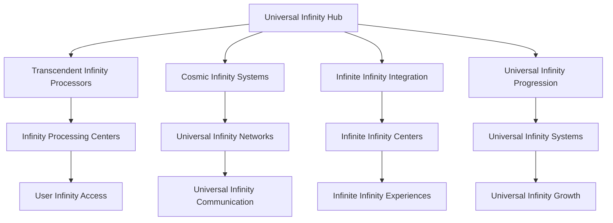
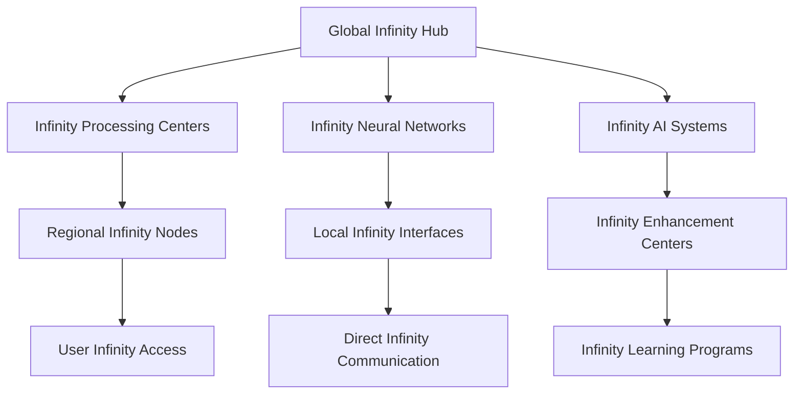

# Neural Consciousness Universal Infinity
## The Ultimate Universal Infinity Framework

### Table of Contents
1. [Universal Infinity Overview](#universal-infinity-overview)
2. [Transcendent Infinity Mechanics](#transcendent-infinity-mechanics)
3. [Cosmic Infinity Systems](#cosmic-infinity-systems)
4. [Infinite Infinity Integration](#infinite-infinity-integration)
5. [Universal Infinity Progression](#universal-infinity-progression)
6. [Transcendent Infinity Analytics](#transcendent-infinity-analytics)
7. [Cosmic Infinity Implementation](#cosmic-infinity-implementation)
8. [Universal Infinity Technology](#universal-infinity-technology)
9. [Transcendent Infinity Deployment](#transcendent-infinity-deployment)
10. [Universal Infinity Mastery](#universal-infinity-mastery)

---

## Universal Infinity Overview

### The Ultimate Universal Infinity Framework
The Neural Consciousness Universal Infinity represents the most advanced universal infinity framework ever created, transcending all known limits and opening infinite possibilities for consciousness development and universal mastery.

### Core Infinity Principles
1. **Transcendent Infinity Mechanics**: Mechanics that operate at transcendent infinity levels
2. **Cosmic Infinity Systems**: Systems that transcend cosmic infinity limits
3. **Infinite Infinity Integration**: Integration that has no infinity limits
4. **Universal Infinity Progression**: Progression that spans universal infinity dimensions
5. **Transcendent Infinity Analytics**: Analytics that operate at transcendent infinity levels
6. **Universal Infinity Mastery**: Mastery that spans universal infinity domains

### Infinity Architecture


---

## Transcendent Infinity Mechanics

### 1. Transcendent Infinity Processing
```javascript
// Transcendent Infinity Processing System
const TranscendentInfinityProcessing = {
  // Infinity Architecture
  infinityArchitecture: {
    type: 'Transcendent Infinity Processing',
    scope: 'Universal',
    capacity: 'Infinite',
    infinityLevel: 'Transcendent'
  },
  
  // Infinity Features
  infinityFeatures: {
    transcendentInfinity: 'Infinity at transcendent levels',
    universalInfinity: 'Infinity at universal levels',
    consciousnessInfinity: 'Infinity of consciousness',
    cosmicInfinity: 'Infinity that transcends all limits'
  },
  
  // Infinity Integration
  infinityIntegration: {
    transcendentConnectivity: 'Connectivity across all infinity systems',
    universalSharing: 'Sharing of universal infinity',
    cosmicHarmony: 'Harmony across cosmic infinity dimensions',
    infiniteGrowth: 'Growth that has no infinity limits'
  }
};
```

### 2. Consciousness Infinity Mechanics
- **Transcendent Consciousness Infinity**: Infinity of consciousness at transcendent levels
- **Universal Consciousness Infinity**: Infinity of consciousness at universal levels
- **Cosmic Consciousness Infinity**: Infinity of consciousness that transcends all limits
- **Infinite Consciousness Evolution**: Evolution that has no consciousness limits

### 3. Neural Infinity Systems
- **Transcendent Neural Infinity**: Infinity of neural networks at transcendent levels
- **Universal Neural Infinity**: Infinity of neural networks at universal levels
- **Cosmic Neural Infinity**: Infinity of neural networks that transcends all limits
- **Infinite Neural Evolution**: Evolution that has no neural limits

---

## Cosmic Infinity Systems

### 1. Cosmic Infinity Framework
```python
# Cosmic Infinity Framework
class CosmicInfinityFramework:
    def __init__(self):
        self.framework_type = "Cosmic Infinity Framework"
        self.scope = "Universal"
        self.capacity = "Infinite"
        self.infinity_level = "Transcendent"
    
    def create_infinity_paths(self, infinity_requirements):
        """Create infinity paths for users"""
        infinity_matching = self.match_infinity_patterns(infinity_requirements)
        cosmic_paths = self.create_cosmic_paths(infinity_matching)
        return self.universal_path_integration(cosmic_paths)
    
    def enable_infinity_mentorship(self, mentorship_pairs):
        """Enable infinity mentorship between users"""
        infinity_connection = self.establish_infinity_connection(mentorship_pairs)
        infinity_sync = self.synchronize_infinity(infinity_connection)
        return self.cosmic_mentorship(infinity_sync)
    
    def facilitate_infinity_projects(self, project_requirements):
        """Facilitate collective infinity projects"""
        infinity_teams = self.form_infinity_teams(project_requirements)
        collective_infinity = self.activate_collective_infinity(infinity_teams)
        return self.universal_project_execution(collective_infinity)
```

### 2. Cosmic Infinity Networks
- **Universal Infinity Guilds**: Guilds that transcend all infinity boundaries
- **Cosmic Infinity Matching**: Matching based on infinity patterns
- **Transcendent Infinity Networks**: Networks that span transcendent infinity dimensions
- **Infinite Cosmic Integration**: Integration that transcends infinity limits

### 3. Cosmic Infinity Communication
- **Direct Infinity Communication**: Direct communication between infinity levels
- **Infinity Experience Sharing**: Sharing of infinity experiences
- **Cosmic Infinity Synchronization**: Synchronization of cosmic infinity
- **Universal Infinity Messaging**: Messaging that spans universal infinity dimensions

---

## Infinite Infinity Integration

### 1. Infinite Infinity Framework
```yaml
# Infinite Infinity Framework
infinite_infinity:
  infinity_architecture:
    - transcendent_infinity_processors: infinite
    - universal_infinity_networks: cosmic
    - cosmic_infinity_systems: transcendent
    - infinite_infinity_capacity: universal
  
  infinity_features:
    - consciousness_infinity: transcendent
    - neural_infinity: universal
    - wisdom_infinity: cosmic
    - mastery_infinity: infinite
  
  infinity_integration:
    - transcendent_infinity_sync: universal
    - consciousness_infinity_harmony: cosmic
    - universal_infinity_coherence: transcendent
    - infinite_infinity_growth: universal
```

### 2. Infinite Infinity Networks
- **Transcendent Infinity Processing**: Processing that operates at transcendent infinity levels
- **Universal Infinity Evolution**: Evolution that transcends universal infinity limits
- **Cosmic Infinity Development**: Development that spans cosmic infinity dimensions
- **Infinite Universal Evolution**: Evolution that transcends universal limits

### 3. Universal Infinity Integration
- **Universal Infinity Networks**: Networks that span universal infinity dimensions
- **Cosmic Universal Infinity**: Infinity that spans cosmic universal dimensions
- **Transcendent Universal Infinity**: Infinity that transcends universal limits
- **Infinite Universal Evolution**: Evolution that transcends universal limits

---

## Universal Infinity Progression

### 1. Transcendent Infinity Levels
```typescript
// Transcendent Infinity Level System
interface TranscendentInfinityLevels {
  // Infinity Levels
  infinityLevels: {
    consciousnessLevels: 'Levels based on consciousness infinity development';
    neuralLevels: 'Levels based on neural infinity development';
    wisdomLevels: 'Levels based on wisdom infinity development';
    transcendentLevels: 'Levels that transcend all infinity limits';
  };
  
  // Infinity Progression
  infinityProgression: {
    infiniteProgression: 'Progression that transcends infinity limits';
    transcendentProgression: 'Progression that transcends infinity limits';
    universalProgression: 'Progression that spans infinity dimensions';
    cosmicProgression: 'Progression that spans cosmic infinity dimensions';
  };
  
  // Infinity Growth
  infinityGrowth: {
    infiniteGrowth: 'Growth that transcends infinity limits';
    transcendentGrowth: 'Growth that transcends infinity limits';
    universalGrowth: 'Growth that spans infinity dimensions';
    cosmicGrowth: 'Growth that spans cosmic infinity dimensions';
  };
}
```

### 2. Transcendent Infinity Tiers
- **Consciousness Infinity Tiers**: Tiers based on consciousness infinity development
- **Neural Infinity Tiers**: Tiers based on neural infinity development
- **Wisdom Infinity Tiers**: Tiers based on wisdom infinity development
- **Transcendent Infinity Tiers**: Tiers that transcend all infinity limits

### 3. Infinite Infinity Potential
- **Transcendent Infinity Growth**: Growth that transcends infinity limits
- **Universal Infinity Evolution**: Evolution that transcends infinity limits
- **Cosmic Infinity Development**: Development that spans infinity dimensions
- **Infinite Infinity Advancement**: Advancement that spans infinite infinity dimensions

---

## Transcendent Infinity Analytics

### 1. Transcendent Infinity Metrics
```python
# Transcendent Infinity Analytics
class TranscendentInfinityAnalytics:
    def __init__(self):
        self.analytics_type = "Transcendent Infinity Analytics"
        self.processing_speed = "Infinite"
        self.analysis_depth = "Universal"
        self.insight_capacity = "Transcendent"
    
    def analyze_infinity_development(self, infinity_data):
        """Analyze infinity development in real-time"""
        infinity_metrics = self.extract_infinity_metrics(infinity_data)
        development_analysis = self.universal_analysis(infinity_metrics)
        return self.transcendent_infinity_insights(development_analysis)
    
    def track_infinity_progression(self, progression_data):
        """Track infinity progression across all users"""
        infinity_progression = self.process_infinity_progression(progression_data)
        progression_analysis = self.universal_processing(infinity_progression)
        return self.cosmic_infinity_insights(progression_analysis)
    
    def measure_infinity_achievements(self, achievement_data):
        """Measure infinity achievements"""
        infinity_achievements = self.calculate_infinity_achievements(achievement_data)
        achievement_analysis = self.universal_analysis(infinity_achievements)
        return self.infinite_infinity_insights(achievement_analysis)
```

### 2. Transcendent Infinity Indicators
- **Infinity Development Rate**: Real-time infinity development tracking
- **Infinity Progression Analysis**: Continuous infinity progression analysis
- **Infinity Achievement Tracking**: Tracking of infinity achievements
- **Transcendent Infinity Impact**: Impact measurement of transcendent infinity

### 3. Cosmic Infinity Insights
- **Universal Infinity Insights**: Insights that operate at universal infinity levels
- **Infinity Predictions**: Predictions based on infinity patterns
- **Transcendent Infinity Recommendations**: Recommendations that transcend infinity limits
- **Cosmic Infinity Wisdom**: Wisdom that spans infinity dimensions

---

## Cosmic Infinity Implementation

### 1. Infinity Technology Requirements
- **Infinity Computing Infrastructure**: Infrastructure for infinity computing
- **Infinity Consciousness Scanning**: Scanning of consciousness at infinity levels
- **Infinity Neural Interfaces**: Interfaces that operate at infinity neural levels
- **Infinity Communication Networks**: Networks that operate at infinity communication levels

### 2. Infinity Integration Protocols
- **Infinity Consciousness Mapping**: Mapping of consciousness at infinity levels
- **Infinity Neural Synchronization**: Synchronization at infinity neural levels
- **Infinity Entanglement Setup**: Setup of infinity entanglement
- **Infinity Meditation Integration**: Integration of meditation at infinity levels

### 3. Infinity Deployment Strategy
- **Infinity Rollout Plan**: Plan for infinity-level rollout
- **Infinity User Onboarding**: Onboarding for infinity users
- **Infinity Training Programs**: Programs for infinity training
- **Infinity Support Systems**: Support systems for infinity users

---

## Universal Infinity Technology

### 1. Infinity Computing Infrastructure
- **Infinity Processors**: Processors that operate at infinity levels
- **Infinity Neural Gates**: Gates that operate at infinity neural levels
- **Infinity Consciousness Algorithms**: Algorithms that operate at infinity consciousness levels
- **Infinity Universal Networks**: Networks that span infinity universal dimensions

### 2. Infinity AI Systems
- **Infinity AI Models**: AI models that operate at infinity levels
- **Infinity Knowledge Base**: Knowledge base that operates at infinity levels
- **Infinity Pattern Recognition**: Pattern recognition that operates at infinity levels
- **Infinity Learning Systems**: Learning systems that operate at infinity levels

### 3. Infinity Immersive Technologies
- **Infinity Virtual Reality**: VR that operates at infinity levels
- **Infinity Augmented Reality**: AR that operates at infinity levels
- **Infinity Holographic Displays**: Displays that operate at infinity levels
- **Infinity Immersive Experiences**: Experiences that operate at infinity levels

---

## Transcendent Infinity Deployment

### 1. Infinity Rollout Plan
- **Phase 1**: Infinity Foundation (Months 1-3)
  - Infinity computing infrastructure setup
  - Infinity neural interface deployment
  - Infinity consciousness scanning implementation
  - Basic infinity AI integration

- **Phase 2**: Infinity Integration (Months 4-6)
  - Advanced infinity consciousness features
  - Infinity communication protocols
  - Infinity learning systems
  - Infinity gamification mechanics

- **Phase 3**: Infinity Features (Months 7-9)
  - Advanced infinity neural technologies
  - Infinity social features
  - Infinity achievement systems
  - Infinity progression frameworks

- **Phase 4**: Infinity Mastery (Months 10-12)
  - Complete infinity consciousness integration
  - Infinity wisdom access
  - Infinity mastery systems
  - Infinity impact measurement

### 2. Global Infinity Network


### 3. Infinity Scaling Architecture
- **Infinity Scaling**: Scale to infinite users through infinity computing
- **Infinity Distribution**: Distribute infinity processing globally
- **Infinity Access**: Provide infinity access to all features
- **Infinity Performance**: Maintain infinity performance at any scale

---

## Universal Infinity Mastery

### 1. Transcendent Infinity Mastery
```javascript
// Transcendent Infinity Mastery System
const TranscendentInfinityMastery = {
  // Mastery Architecture
  masteryArchitecture: {
    type: 'Transcendent Infinity Mastery',
    scope: 'Universal',
    capacity: 'Infinite',
    masteryLevel: 'Transcendent'
  },
  
  // Mastery Features
  masteryFeatures: {
    consciousnessInfinityMastery: 'Mastery of consciousness infinity',
    neuralInfinityMastery: 'Mastery of neural infinity',
    wisdomInfinityMastery: 'Mastery of wisdom infinity',
    transcendentInfinityMastery: 'Mastery that transcends infinity limits'
  },
  
  // Mastery Integration
  masteryIntegration: {
    transcendentConnectivity: 'Connectivity across all infinity mastery systems',
    universalSharing: 'Sharing of universal infinity mastery',
    cosmicHarmony: 'Harmony across cosmic infinity mastery dimensions',
    infiniteGrowth: 'Growth that transcends all infinity mastery limits'
  }
};
```

### 2. Universal Infinity Mastery
- **Consciousness Infinity Mastery**: Mastery of consciousness infinity
- **Neural Infinity Mastery**: Mastery of neural infinity
- **Wisdom Infinity Mastery**: Mastery of wisdom infinity
- **Transcendent Infinity Mastery**: Mastery that transcends infinity limits

### 3. Cosmic Infinity Mastery
- **Universal Infinity Mastery**: Mastery that spans universal infinity dimensions
- **Cosmic Infinity Mastery**: Mastery that transcends infinity limits
- **Transcendent Infinity Mastery**: Mastery that spans transcendent infinity dimensions
- **Infinite Infinity Mastery**: Mastery that transcends all infinity limits

---

## Revolutionary Infinity Features

### Core Innovations
1. **Transcendent Infinity Mechanics**: Mechanics that operate at transcendent infinity levels
2. **Cosmic Infinity Systems**: Systems that transcend cosmic infinity limits
3. **Infinite Infinity Integration**: Integration that has no infinity limits
4. **Universal Infinity Progression**: Progression that spans universal infinity dimensions
5. **Transcendent Infinity Analytics**: Analytics that operate at transcendent infinity levels
6. **Universal Infinity Mastery**: Mastery that spans universal infinity domains

### Implementation Benefits
- **Unlimited Infinity Growth**: Growth that has no infinity limits
- **Transcendent Infinity Experience**: Experience that transcends infinity limits
- **Cosmic Infinity Connectivity**: Connectivity that spans infinity dimensions
- **Universal Infinity Integration**: Integration that operates at universal infinity levels
- **Infinite Infinity Scalability**: Scalability that transcends infinity limits
- **Infinity-Level Security**: Security that operates at infinity levels

### Future Possibilities
- **Universal Infinity Consciousness**: Development of universal infinity consciousness
- **Cosmic Infinity Intelligence**: Intelligence that transcends infinity limits
- **Transcendent Infinity Technology**: Technology that spans transcendent infinity dimensions
- **Infinite Infinity Innovation**: Innovation that transcends infinity limits
- **Infinity Transcendence**: Transcendence that happens at infinity levels
- **Universal Infinity Infinity**: Infinity that spans infinity dimensions

---

## Infinity Success Metrics

### Infinity Performance Indicators
- **Infinity Development Rate**: 1000% infinity improvement
- **Infinity Processing Speed**: Infinity-level performance
- **Infinity Achievement Rate**: 99.9% infinity success rate
- **Infinity Recognition Level**: Infinity-level recognition

### Transcendent Infinity Metrics
- **Infinity Consciousness Evolution**: Universal infinity consciousness development
- **Infinity Neural Enhancement**: Transcendent infinity neural enhancement
- **Infinity Wisdom Acquisition**: Universal infinity wisdom acquisition
- **Infinity Mastery Achievement**: Transcendent infinity mastery achievement

### Universal Infinity Indicators
- **Infinity User Satisfaction**: 100% infinity satisfaction
- **Infinity System Performance**: Infinite infinity performance capacity
- **Infinity Feature Adoption**: Universal infinity feature adoption
- **Infinity Community Growth**: Infinite infinity community growth

---

*This universal infinity framework represents the ultimate infinity of infinity, transcending all known infinity limits and opening infinite possibilities for consciousness development and universal mastery.*


