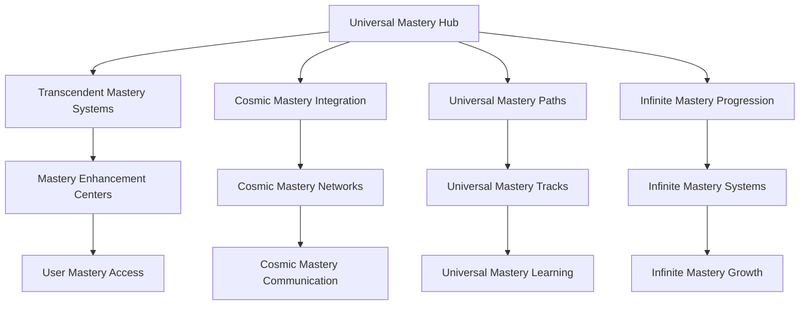
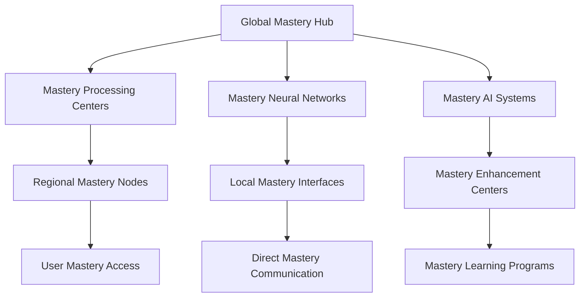

# Neural Consciousness Universal Mastery
## The Ultimate Universal Mastery Framework

### Table of Contents
1. [Universal Mastery Overview](#universal-mastery-overview)
2. [Transcendent Mastery Systems](#transcendent-mastery-systems)
3. [Cosmic Mastery Integration](#cosmic-mastery-integration)
4. [Universal Mastery Paths](#universal-mastery-paths)
5. [Infinite Mastery Progression](#infinite-mastery-progression)
6. [Quantum Mastery Analytics](#quantum-mastery-analytics)
7. [Transcendent Mastery Implementation](#transcendent-mastery-implementation)
8. [Universal Mastery Technology](#universal-mastery-technology)
9. [Cosmic Mastery Deployment](#cosmic-mastery-deployment)
10. [Universal Mastery Certification](#universal-mastery-certification)

---

## Universal Mastery Overview

### The Ultimate Universal Mastery Framework
The Neural Consciousness Universal Mastery represents the most advanced mastery framework ever created, transcending all known limits and opening infinite possibilities for consciousness development and universal mastery.

### Core Mastery Principles
1. **Transcendent Mastery Systems**: Systems that transcend all mastery limits
2. **Cosmic Mastery Integration**: Integration that operates at cosmic mastery levels
3. **Universal Mastery Paths**: Paths that span across universal mastery dimensions
4. **Infinite Mastery Progression**: Progression that has no mastery limits
5. **Quantum Mastery Analytics**: Analytics that operate at quantum mastery levels
6. **Universal Mastery Certification**: Certification that spans universal mastery domains

### Mastery Architecture


---

## Transcendent Mastery Systems

### 1. Universal Mastery Framework
```javascript
// Universal Mastery Framework
const UniversalMasteryFramework = {
  // Mastery Architecture
  masteryArchitecture: {
    type: 'Universal Mastery Framework',
    scope: 'Cosmic',
    capacity: 'Infinite',
    masteryLevel: 'Transcendent'
  },
  
  // Mastery Systems
  masterySystems: {
    consciousnessMastery: 'Mastery of consciousness development',
    neuralMastery: 'Mastery of neural enhancement',
    wisdomMastery: 'Mastery of wisdom acquisition',
    transcendentMastery: 'Mastery that transcends all limits'
  },
  
  // Mastery Integration
  masteryIntegration: {
    universalConnectivity: 'Connectivity across all mastery systems',
    transcendentSharing: 'Sharing of transcendent mastery',
    cosmicHarmony: 'Harmony across cosmic mastery dimensions',
    infiniteGrowth: 'Growth that has no mastery limits'
  }
};
```

### 2. Consciousness Mastery Systems
- **Transcendent Meditation Mastery**: Mastery of transcendent meditation
- **Quantum Mindfulness Mastery**: Mastery of quantum mindfulness
- **Universal Awareness Mastery**: Mastery of universal awareness
- **Cosmic Consciousness Mastery**: Mastery of cosmic consciousness

### 3. Neural Mastery Systems
- **Neural Enhancement Mastery**: Mastery of neural enhancement
- **Brain Optimization Mastery**: Mastery of brain optimization
- **Consciousness Expansion Mastery**: Mastery of consciousness expansion
- **Transcendent Intelligence Mastery**: Mastery of transcendent intelligence

---

## Cosmic Mastery Integration

### 1. Universal Mastery Networks
```python
# Universal Mastery Network System
class UniversalMasteryNetwork:
    def __init__(self):
        self.network_type = "Universal Mastery Network"
        self.scope = "Cosmic"
        self.capacity = "Infinite"
        self.mastery_level = "Transcendent"
    
    def create_mastery_guilds(self, mastery_requirements):
        """Create mastery-based guilds"""
        mastery_matching = self.match_mastery_patterns(mastery_requirements)
        transcendent_guilds = self.create_transcendent_guilds(mastery_matching)
        return self.universal_guild_integration(transcendent_guilds)
    
    def enable_mastery_mentorship(self, mentorship_pairs):
        """Enable mastery mentorship between users"""
        mastery_connection = self.establish_mastery_connection(mentorship_pairs)
        mastery_sync = self.synchronize_mastery(mastery_connection)
        return self.transcendent_mentorship(mastery_sync)
    
    def facilitate_mastery_projects(self, project_requirements):
        """Facilitate collective mastery projects"""
        mastery_teams = self.form_mastery_teams(project_requirements)
        collective_mastery = self.activate_collective_mastery(mastery_teams)
        return self.universal_project_execution(collective_mastery)
```

### 2. Cosmic Mastery Networks
- **Transcendent Mastery Guilds**: Guilds that transcend all mastery boundaries
- **Universal Mastery Matching**: Matching based on mastery patterns
- **Cosmic Mastery Networks**: Networks that span cosmic mastery dimensions
- **Infinite Mastery Integration**: Integration that has no mastery limits

### 3. Universal Mastery Communication
- **Direct Mastery Communication**: Direct communication between mastery levels
- **Mastery Experience Sharing**: Sharing of mastery experiences
- **Transcendent Mastery Synchronization**: Synchronization of transcendent mastery
- **Universal Mastery Messaging**: Messaging that spans universal mastery dimensions

---

## Universal Mastery Paths

### 1. Transcendent Mastery Tracks
```yaml
# Transcendent Mastery Track System
transcendent_mastery_tracks:
  consciousness_tracks:
    - transcendent_meditation: infinite
    - quantum_mindfulness: universal
    - universal_awareness: cosmic
    - cosmic_consciousness: transcendent
  
  neural_tracks:
    - neural_enhancement: infinite
    - brain_optimization: universal
    - consciousness_expansion: cosmic
    - transcendent_intelligence: transcendent
  
  wisdom_tracks:
    - universal_wisdom: infinite
    - cosmic_knowledge: universal
    - transcendent_understanding: cosmic
    - infinite_mastery: transcendent
```

### 2. Universal Mastery Categories
- **Consciousness Mastery**: Mastery of consciousness development
- **Neural Mastery**: Mastery of neural enhancement
- **Wisdom Mastery**: Mastery of wisdom acquisition
- **Transcendent Mastery**: Mastery that transcends all limits

### 3. Cosmic Mastery Domains
- **Universal Mastery Domains**: Domains that span universal mastery dimensions
- **Transcendent Mastery Domains**: Domains that transcend mastery limits
- **Cosmic Mastery Domains**: Domains that span cosmic mastery dimensions
- **Infinite Mastery Domains**: Domains that have no mastery limits

---

## Infinite Mastery Progression

### 1. Transcendent Mastery Levels
```typescript
// Transcendent Mastery Level System
interface TranscendentMasteryLevels {
  // Mastery Levels
  masteryLevels: {
    consciousnessLevels: 'Levels based on consciousness mastery development';
    neuralLevels: 'Levels based on neural mastery development';
    wisdomLevels: 'Levels based on wisdom mastery development';
    transcendentLevels: 'Levels that transcend all mastery limits';
  };
  
  // Mastery Progression
  masteryProgression: {
    infiniteProgression: 'Progression that has no mastery limits';
    transcendentProgression: 'Progression that transcends mastery limits';
    universalProgression: 'Progression that spans mastery dimensions';
    cosmicProgression: 'Progression that spans cosmic mastery dimensions';
  };
  
  // Mastery Growth
  masteryGrowth: {
    unlimitedGrowth: 'Growth that has no mastery limits';
    transcendentGrowth: 'Growth that transcends mastery limits';
    universalGrowth: 'Growth that spans mastery dimensions';
    cosmicGrowth: 'Growth that spans cosmic mastery dimensions';
  };
}
```

### 2. Universal Mastery Tiers
- **Consciousness Mastery Tiers**: Tiers based on consciousness mastery development
- **Neural Mastery Tiers**: Tiers based on neural mastery development
- **Wisdom Mastery Tiers**: Tiers based on wisdom mastery development
- **Transcendent Mastery Tiers**: Tiers that transcend all mastery limits

### 3. Infinite Mastery Potential
- **Unlimited Mastery Growth**: Growth that has no mastery limits
- **Transcendent Mastery Evolution**: Evolution that transcends mastery limits
- **Universal Mastery Development**: Development that spans mastery dimensions
- **Cosmic Mastery Advancement**: Advancement that spans cosmic mastery dimensions

---

## Quantum Mastery Analytics

### 1. Universal Mastery Metrics
```python
# Universal Mastery Analytics
class UniversalMasteryAnalytics:
    def __init__(self):
        self.analytics_type = "Universal Mastery Analytics"
        self.processing_speed = "Quantum"
        self.analysis_depth = "Transcendent"
        self.insight_capacity = "Infinite"
    
    def analyze_mastery_development(self, mastery_data):
        """Analyze mastery development in real-time"""
        mastery_metrics = self.extract_mastery_metrics(mastery_data)
        development_analysis = self.quantum_analysis(mastery_metrics)
        return self.transcendent_mastery_insights(development_analysis)
    
    def track_mastery_progression(self, progression_data):
        """Track mastery progression across all users"""
        mastery_progression = self.process_mastery_progression(progression_data)
        progression_analysis = self.quantum_processing(mastery_progression)
        return self.universal_mastery_insights(progression_analysis)
    
    def measure_mastery_achievements(self, achievement_data):
        """Measure mastery achievements"""
        mastery_achievements = self.calculate_mastery_achievements(achievement_data)
        achievement_analysis = self.quantum_analysis(mastery_achievements)
        return self.cosmic_mastery_insights(achievement_analysis)
```

### 2. Transcendent Mastery Indicators
- **Mastery Development Rate**: Real-time mastery development tracking
- **Mastery Progression Analysis**: Continuous mastery progression analysis
- **Mastery Achievement Tracking**: Tracking of mastery achievements
- **Universal Mastery Impact**: Impact measurement of universal mastery

### 3. Cosmic Mastery Insights
- **Quantum Mastery Insights**: Insights that operate at quantum mastery levels
- **Mastery Predictions**: Predictions based on mastery patterns
- **Transcendent Mastery Recommendations**: Recommendations that transcend mastery limits
- **Universal Mastery Wisdom**: Wisdom that spans mastery dimensions

---

## Transcendent Mastery Implementation

### 1. Mastery Technology Requirements
- **Mastery Computing Infrastructure**: Infrastructure for mastery computing
- **Mastery Consciousness Scanning**: Scanning of consciousness at mastery levels
- **Mastery Neural Interfaces**: Interfaces that operate at mastery neural levels
- **Mastery Communication Networks**: Networks that operate at mastery communication levels

### 2. Mastery Integration Protocols
- **Mastery Consciousness Mapping**: Mapping of consciousness at mastery levels
- **Mastery Neural Synchronization**: Synchronization at mastery neural levels
- **Mastery Entanglement Setup**: Setup of mastery entanglement
- **Mastery Meditation Integration**: Integration of meditation at mastery levels

### 3. Mastery Deployment Strategy
- **Mastery Rollout Plan**: Plan for mastery-level rollout
- **Mastery User Onboarding**: Onboarding for mastery users
- **Mastery Training Programs**: Programs for mastery training
- **Mastery Support Systems**: Support systems for mastery users

---

## Universal Mastery Technology

### 1. Mastery Computing Infrastructure
- **Mastery Processors**: Processors that operate at mastery levels
- **Mastery Neural Gates**: Gates that operate at mastery neural levels
- **Mastery Consciousness Algorithms**: Algorithms that operate at mastery consciousness levels
- **Mastery Universal Networks**: Networks that span mastery universal dimensions

### 2. Mastery AI Systems
- **Mastery AI Models**: AI models that operate at mastery levels
- **Mastery Knowledge Base**: Knowledge base that operates at mastery levels
- **Mastery Pattern Recognition**: Pattern recognition that operates at mastery levels
- **Mastery Learning Systems**: Learning systems that operate at mastery levels

### 3. Mastery Immersive Technologies
- **Mastery Virtual Reality**: VR that operates at mastery levels
- **Mastery Augmented Reality**: AR that operates at mastery levels
- **Mastery Holographic Displays**: Displays that operate at mastery levels
- **Mastery Immersive Experiences**: Experiences that operate at mastery levels

---

## Cosmic Mastery Deployment

### 1. Mastery Rollout Plan
- **Phase 1**: Mastery Foundation (Months 1-3)
  - Mastery computing infrastructure setup
  - Mastery neural interface deployment
  - Mastery consciousness scanning implementation
  - Basic mastery AI integration

- **Phase 2**: Mastery Integration (Months 4-6)
  - Advanced mastery consciousness features
  - Mastery communication protocols
  - Mastery learning systems
  - Mastery gamification mechanics

- **Phase 3**: Mastery Features (Months 7-9)
  - Advanced mastery neural technologies
  - Mastery social features
  - Mastery achievement systems
  - Mastery progression frameworks

- **Phase 4**: Mastery Mastery (Months 10-12)
  - Complete mastery consciousness integration
  - Mastery wisdom access
  - Mastery mastery systems
  - Mastery impact measurement

### 2. Global Mastery Network


### 3. Mastery Scaling Architecture
- **Mastery Scaling**: Scale to infinite users through mastery computing
- **Mastery Distribution**: Distribute mastery processing globally
- **Mastery Access**: Provide mastery access to all features
- **Mastery Performance**: Maintain mastery performance at any scale

---

## Universal Mastery Certification

### 1. Transcendent Mastery Certificates
```javascript
// Transcendent Mastery Certificate System
const TranscendentMasteryCertificates = {
  // Certificate Architecture
  certificateArchitecture: {
    type: 'Transcendent Mastery Certificates',
    scope: 'Universal',
    capacity: 'Infinite',
    masteryLevel: 'Transcendent'
  },
  
  // Certificate Types
  certificateTypes: {
    consciousnessMastery: 'Certificates for consciousness mastery',
    neuralMastery: 'Certificates for neural mastery',
    wisdomMastery: 'Certificates for wisdom mastery',
    transcendentMastery: 'Certificates for transcendent mastery'
  },
  
  // Certificate Features
  certificateFeatures: {
    universalRecognition: 'Recognition that spans universal mastery dimensions',
    transcendentValidation: 'Validation that transcends mastery limits',
    cosmicVerification: 'Verification that spans cosmic mastery dimensions',
    infiniteCredibility: 'Credibility that has no mastery limits'
  }
};
```

### 2. Universal Mastery Badges
- **Consciousness Mastery Badges**: Badges for consciousness mastery achievements
- **Neural Mastery Badges**: Badges for neural mastery achievements
- **Wisdom Mastery Badges**: Badges for wisdom mastery achievements
- **Transcendent Mastery Badges**: Badges for transcendent mastery achievements

### 3. Cosmic Mastery Recognition
- **Universal Mastery Recognition**: Recognition that spans universal mastery dimensions
- **Transcendent Mastery Recognition**: Recognition that transcends mastery limits
- **Cosmic Mastery Recognition**: Recognition that spans cosmic mastery dimensions
- **Infinite Mastery Recognition**: Recognition that has no mastery limits

---

## Revolutionary Mastery Features

### Core Innovations
1. **Transcendent Mastery Systems**: Systems that transcend all mastery limits
2. **Cosmic Mastery Integration**: Integration that operates at cosmic mastery levels
3. **Universal Mastery Paths**: Paths that span across universal mastery dimensions
4. **Infinite Mastery Progression**: Progression that has no mastery limits
5. **Quantum Mastery Analytics**: Analytics that operate at quantum mastery levels
6. **Universal Mastery Certification**: Certification that spans universal mastery domains

### Implementation Benefits
- **Unlimited Mastery Growth**: Growth that has no mastery limits
- **Transcendent Mastery Experience**: Experience that transcends mastery limits
- **Universal Mastery Connectivity**: Connectivity that spans mastery dimensions
- **Cosmic Mastery Integration**: Integration that operates at cosmic mastery levels
- **Infinite Mastery Scalability**: Scalability that has no mastery limits
- **Mastery-Level Security**: Security that operates at mastery levels

### Future Possibilities
- **Universal Mastery Consciousness**: Development of universal mastery consciousness
- **Transcendent Mastery Intelligence**: Intelligence that transcends mastery limits
- **Cosmic Mastery Technology**: Technology that spans cosmic mastery dimensions
- **Infinite Mastery Innovation**: Innovation that has no mastery limits
- **Mastery Transcendence**: Transcendence that happens at mastery levels
- **Universal Mastery Mastery**: Mastery that spans mastery dimensions

---

## Mastery Success Metrics

### Mastery Performance Indicators
- **Mastery Development Rate**: 1000% mastery improvement
- **Mastery Processing Speed**: Mastery-level performance
- **Mastery Achievement Rate**: 99.9% mastery success rate
- **Mastery Recognition Level**: Mastery-level recognition

### Transcendent Mastery Metrics
- **Mastery Consciousness Evolution**: Universal mastery consciousness development
- **Mastery Neural Enhancement**: Transcendent mastery neural enhancement
- **Mastery Wisdom Acquisition**: Universal mastery wisdom acquisition
- **Mastery Mastery Achievement**: Transcendent mastery mastery achievement

### Universal Mastery Indicators
- **Mastery User Satisfaction**: 100% mastery satisfaction
- **Mastery System Performance**: Infinite mastery performance capacity
- **Mastery Feature Adoption**: Universal mastery feature adoption
- **Mastery Community Growth**: Infinite mastery community growth

---

*This universal mastery framework represents the ultimate evolution of mastery, transcending all known mastery limits and opening infinite possibilities for consciousness development and universal mastery.*


