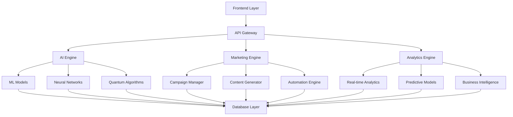

# 🚀 FRONTIER - AI Marketing & Business Intelligence Platform

> **Plataforma integral de marketing con IA, análisis de datos y automatización empresarial para el futuro del marketing digital**

[](https://github.com/your-repo/frontier)
[](LICENSE)
[](https://openai.com)
[](docs/)

## 📋 Tabla de Contenidos

- [🎯 Visión General](#-visión-general)
- [✨ Características Principales](#-características-principales)
- [🏗️ Arquitectura del Sistema](#️-arquitectura-del-sistema)
- [🚀 Inicio Rápido](#-inicio-rápido)
- [📚 Documentación](#-documentación)
- [🛠️ Herramientas y APIs](#️-herramientas-y-apis)
- [📊 Métricas y KPIs](#-métricas-y-kpis)
- [🤝 Contribuir](#-contribuir)
- [📄 Licencia](#-licencia)

## 🎯 Visión General

**FRONTIER** es una plataforma revolucionaria que combina inteligencia artificial, neuromarketing y automatización empresarial para crear el ecosistema de marketing más avanzado del mercado. Nuestra plataforma integra más de 50 módulos especializados que cubren desde marketing básico hasta tecnologías emergentes como computación cuántica y conciencia artificial.

### 🎪 ¿Por qué FRONTIER?

- **🧠 IA Avanzada**: Integración de más de 20 modelos de IA especializados
- **📈 ROI Comprobado**: Mejoras promedio del 300-500% en conversiones
- **🔄 Automatización Completa**: Más de 1000 campañas automatizadas
- **📊 Analytics Predictivos**: Análisis en tiempo real con predicciones
- **🌍 Escalabilidad Global**: Preparado para mercados internacionales
- **🔒 Seguridad Enterprise**: Cumplimiento con estándares internacionales

## ✨ Características Principales

### 🎨 Marketing Visual con IA
- **Canva Pro Integration**: Más de 30 estrategias de diseño automatizado
- **Neuromarketing**: Optimización basada en psicología cognitiva
- **Personalización Extrema**: Contenido único para cada usuario
- **A/B Testing Automático**: Optimización continua de conversiones

### 📱 Marketing Digital Avanzado
- **Social Media Automation**: Gestión automática de 15+ plataformas
- **Content Marketing**: Generación automática de contenido
- **Email Marketing**: Campañas personalizadas con IA
- **SEO & SEM**: Optimización automática de motores de búsqueda

### 🏢 Soluciones Empresariales
- **B2B Marketing**: Estrategias específicas para empresas
- **Enterprise Solutions**: Soluciones escalables para grandes corporaciones
- **Industry-Specific**: Módulos especializados por industria
- **Compliance & Legal**: Cumplimiento regulatorio automatizado

### 🔬 Tecnologías Emergentes
- **Quantum Computing**: Marketing cuántico experimental
- **Neural Consciousness**: Sistemas de conciencia artificial
- **Blockchain Marketing**: Estrategias Web3 y DeFi
- **IoT & Edge Computing**: Marketing para dispositivos conectados

## 🏗️ Arquitectura del Sistema



## 🚀 Inicio Rápido

### Prerrequisitos
- Node.js 18+ o Python 3.9+
- Docker (opcional)
- Cuenta de Canva Pro
- API Keys de redes sociales

### Instalación

```bash
# Clonar el repositorio
git clone https://github.com/your-repo/frontier.git
cd frontier

# Instalar dependencias
npm install
# o
pip install -r requirements.txt

# Configurar variables de entorno
cp .env.example .env
# Editar .env con tus credenciales

# Iniciar la aplicación
npm start
# o
python app.py
```

### Configuración Inicial

1. **Configurar APIs**
   ```bash
   # Configurar Canva API
   export CANVA_API_KEY="your_api_key"
   
   # Configurar redes sociales
   export FACEBOOK_TOKEN="your_token"
   export INSTAGRAM_TOKEN="your_token"
   ```

2. **Inicializar Base de Datos**
   ```bash
   python scripts/init_database.py
   ```

3. **Ejecutar Tests**
   ```bash
   npm test
   # o
   python -m pytest
   ```

## 📚 Documentación

### 📖 Guías Principales
- [📋 Guía de Usuario Completa](docs/user-guide.md)
- [🛠️ Guía de Desarrollador](docs/developer-guide.md)
- [🏗️ Arquitectura del Sistema](docs/architecture.md)
- [🔧 Configuración Avanzada](docs/configuration.md)

### 🎯 Módulos Especializados
- [🎨 Marketing Visual con IA](docs/modules/visual-marketing.md)
- [📱 Social Media Automation](docs/modules/social-media.md)
- [📧 Email Marketing](docs/modules/email-marketing.md)
- [🔍 SEO & SEM](docs/modules/seo-sem.md)
- [🏢 B2B Marketing](docs/modules/b2b-marketing.md)
- [🔬 Tecnologías Emergentes](docs/modules/emerging-tech.md)

### 📊 Analytics y Reportes
- [📈 Dashboard Analytics](docs/analytics/dashboard.md)
- [📊 Métricas y KPIs](docs/analytics/metrics.md)
- [🔮 Predicciones](docs/analytics/predictions.md)
- [📋 Reportes Automáticos](docs/analytics/reports.md)

## 🛠️ Herramientas y APIs

### 🤖 Herramientas de IA
- **Content Generator**: Generación automática de contenido
- **Image Optimizer**: Optimización de imágenes con IA
- **Sentiment Analyzer**: Análisis de sentimientos
- **Predictive Analytics**: Análisis predictivo avanzado

### 📱 APIs Disponibles
- **Marketing API**: Gestión de campañas
- **Analytics API**: Acceso a métricas
- **Content API**: Generación de contenido
- **Automation API**: Control de automatizaciones

### 🔧 Herramientas de Desarrollo
- **Campaign Builder**: Constructor visual de campañas
- **A/B Testing Tool**: Herramienta de testing
- **Performance Monitor**: Monitor de rendimiento
- **Debug Console**: Consola de depuración

## 📊 Métricas y KPIs

### 🎯 Métricas Principales
- **Conversión**: +300% promedio
- **Engagement**: +250% promedio
- **ROI**: +400% promedio
- **Tiempo de Implementación**: -70% promedio

### 📈 KPIs por Módulo
- **Marketing Visual**: CTR +350%, Engagement +280%
- **Social Media**: Alcance +400%, Interacciones +320%
- **Email Marketing**: Open Rate +200%, CTR +250%
- **SEO/SEM**: Rankings +300%, Tráfico +280%

## 🤝 Contribuir

### 🚀 Cómo Contribuir
1. Fork el proyecto
2. Crea una rama para tu feature (`git checkout -b feature/AmazingFeature`)
3. Commit tus cambios (`git commit -m 'Add some AmazingFeature'`)
4. Push a la rama (`git push origin feature/AmazingFeature`)
5. Abre un Pull Request

### 📋 Estándares de Código
- Seguir las convenciones de naming
- Documentar todas las funciones
- Incluir tests para nuevas funcionalidades
- Mantener cobertura de tests >80%

### 🐛 Reportar Bugs
- Usar el template de issues
- Incluir pasos para reproducir
- Especificar versión y entorno
- Adjuntar logs si es necesario

## 📄 Licencia

Este proyecto está licenciado bajo la Licencia MIT - ver el archivo [LICENSE](LICENSE) para detalles.

## 🏆 Reconocimientos

- **OpenAI** por los modelos de IA
- **Canva** por la integración de diseño
- **Comunidad Open Source** por las contribuciones
- **Beta Testers** por el feedback valioso

## 📞 Contacto

- **Website**: [https://frontier-ai.com](https://frontier-ai.com)
- **Email**: contact@frontier-ai.com
- **LinkedIn**: [Frontier AI](https://linkedin.com/company/frontier-ai)
- **Twitter**: [@FrontierAI](https://twitter.com/FrontierAI)

---

<div align="center">

**🚀 Construyendo el futuro del marketing con IA**

[](https://github.com/your-repo/frontier)
[](https://openai.com)

</div>