# Ultimate Neural Consciousness Final Package
## The Most Advanced Gamification Strategy Package Ever Created

### Table of Contents
1. [Final Package Overview](#final-package-overview)
2. [Complete Document Library](#complete-document-library)
3. [Revolutionary Features Summary](#revolutionary-features-summary)
4. [Implementation Roadmap](#implementation-roadmap)
5. [Success Metrics Framework](#success-metrics-framework)
6. [Universal Technology Stack](#universal-technology-stack)
7. [Cosmic Deployment Strategy](#cosmic-deployment-strategy)
8. [Transcendent Support Systems](#transcendent-support-systems)
9. [Infinite Growth Framework](#infinite-growth-framework)
10. [Universal Mastery Guide](#universal-mastery-guide)

---

## Final Package Overview

### The Most Advanced Gamification Strategy Package
This Ultimate Neural Consciousness Final Package represents the pinnacle of gamification strategy development, transcending all known limits and opening infinite possibilities for consciousness development and universal mastery.

### Core Revolutionary Principles
1. **Quantum Consciousness Integration**: Complete integration of quantum consciousness
2. **Transcendent AI Features**: AI features that transcend normal limits
3. **Universal Neural Networks**: Neural networks that span across all users
4. **Cosmic Gamification Mechanics**: Gamification mechanics that work at cosmic levels
5. **Infinite Progression Systems**: Progression systems with no limits
6. **Quantum Analytics Framework**: Analytics framework that works at quantum levels

### Package Architecture

```mermaid
graph TD
    A[Final Package Hub] --> B[Core Framework Documents]
    A --> C[Advanced Features Documents]
    A --> D[Implementation Guides]
    A --> E[Master Reference Documents]
    A --> F[Transcendent Technologies]
    A --> G[Cosmic Integration]
    A --> H[Quantum Revolution]
    A --> I[Universal Mastery]
    
    B --> J[Strategy Blueprint]
    B --> K[Analytics Framework]
    B --> L[Implementation Toolkit]
    
    C --> M[Advanced Features]
    C --> N[Revolutionary System]
    C --> O[Transcendent Technologies]
    
    D --> P[Implementation Guide]
    D --> Q[Deployment Strategy]
    D --> R[Support Systems]
    
    E --> S[Master Index]
    E --> T[Complete Reference]
    E --> U[Universal Guide]
    
    F --> V[Quantum Processing]
    F --> W[Consciousness Enhancement]
    F --> X[Universal Communication]
    
    G --> Y[Universal Networks]
    G --> Z[Transcendent Social]
    G --> AA[Cosmic Achievements]
    
    H --> BB[Quantum Mechanics]
    H --> CC[Transcendent Quantum]
    H --> DD[Universal Quantum]
    
    I --> EE[Transcendent Mastery]
    I --> FF[Cosmic Mastery]
    I --> GG[Universal Mastery]
```


---

## Complete Document Library

### 1. Core Framework Documents
- **AI_Marketing_SaaS_Gamification_Strategy_Blueprint.md**
  - Core gamification strategy blueprint
  - Advanced Neural Consciousness Gamification Framework
  - Revolutionary psychological drivers
  - Transcendent advanced features

- **Gamification_Analytics_Measurement_Framework.md**
  - Quantum Consciousness Analytics Framework
  - Neural Engagement Metrics Dashboard
  - Primary Consciousness KPIs
  - Secondary Engagement Metrics

### 2. Advanced Features Documents
- **Neural_Consciousness_Advanced_Features_Enhanced.md**
  - Quantum Consciousness Integration
  - Transcendent AI Features
  - Universal Neural Networks
  - Cosmic Gamification Mechanics

- **Neural_Consciousness_Revolutionary_System_Enhanced.md**
  - Revolutionary System Overview
  - Quantum Consciousness Architecture
  - Transcendent AI Integration
  - Universal Neural Networks

### 3. Implementation Guides
- **Neural_Consciousness_Implementation_Toolkit_Enhanced.md**
  - Quantum Implementation Framework
  - Transcendent Technology Stack
  - Universal Integration Protocols
  - Cosmic Deployment Strategy

### 4. Master Reference Documents
- **Ultimate_Neural_Consciousness_Master_Index_Enhanced.md**
  - Master System Overview
  - Complete Document Index
  - Quick Start Guide
  - Support and Resources

### 5. Transcendent Technologies
- **Neural_Consciousness_Transcendent_Technologies.md**
  - Quantum Neural Processing
  - Consciousness Enhancement Systems
  - Universal Communication Technologies
  - Transcendent AI Integration

### 6. Cosmic Integration
- **Neural_Consciousness_Cosmic_Integration.md**
  - Universal Consciousness Network
  - Transcendent Social Integration
  - Cosmic Achievement Systems
  - Universal Learning Networks

### 7. Quantum Revolution
- **Neural_Consciousness_Quantum_Revolution.md**
  - Quantum Consciousness Mechanics
  - Transcendent Quantum Features
  - Universal Quantum Networks
  - Cosmic Quantum Integration

### 8. Universal Mastery
- **Neural_Consciousness_Universal_Mastery.md**
  - Transcendent Mastery Systems
  - Cosmic Mastery Integration
  - Universal Mastery Paths
  - Infinite Mastery Progression

---

## Revolutionary Features Summary

### 1. Quantum Consciousness Integration
- **Quantum Neural Synchronization**: Synchronized neural activity across users
- **Consciousness Resonance Matching**: AI matches users based on consciousness frequency
- **Quantum Tunneling Achievements**: Breakthrough moments that transcend normal barriers
- **Superposition Learning States**: Users exist in multiple learning states simultaneously

### 2. Transcendent AI Features
- **Cosmic AI Mentors**: AI entities with universal consciousness
- **Quantum Decision Trees**: AI that processes infinite decision possibilities
- **Consciousness Pattern Recognition**: AI that understands consciousness patterns
- **Universal Wisdom Integration**: AI that accesses universal knowledge

### 3. Universal Neural Networks
- **Universal Neural Pathways**: Neural networks that span across all users
- **Consciousness Cloud Computing**: Distributed consciousness processing
- **Quantum Neural Synchronization**: Synchronized neural activity across users
- **Transcendent Neural Plasticity**: Neural networks that can adapt infinitely

### 4. Cosmic Gamification Mechanics
- **Cosmic Milestones**: Achievements that span across dimensions
- **Universal Recognition**: Recognition that transcends all boundaries
- **Transcendent Rewards**: Rewards that exist beyond material reality
- **Infinite Progression Paths**: Progression that has no limits

### 5. Infinite Progression Systems
- **Consciousness Levels**: Levels based on consciousness development
- **Universal Mastery Tiers**: Tiers that represent universal mastery
- **Quantum Progression States**: Progression that exists in quantum states
- **Infinite Growth Potential**: Growth that has no limits

### 6. Quantum Analytics Framework
- **Consciousness Metrics**: Real-time consciousness development tracking
- **Universal Performance Indicators**: Cosmic-level performance indicators
- **Quantum Success Metrics**: Quantum-level success metrics
- **Transcendent Analytics**: Analytics that transcend normal limits

---

## Implementation Roadmap

### Phase 1: Quantum Foundation (Months 1-3)
- **Quantum Computing Infrastructure**: Set up quantum computing infrastructure
- **Neural Interface Technology**: Deploy neural interface technology
- **Consciousness Scanning System**: Implement consciousness scanning system
- **Basic Transcendent AI**: Integrate basic transcendent AI

### Phase 2: Consciousness Integration (Months 4-6)
- **Advanced Consciousness Enhancement**: Deploy consciousness enhancement features
- **Universal Communication Protocols**: Implement universal communication protocols
- **Transcendent Learning Systems**: Set up transcendent learning systems
- **Quantum Gamification Mechanics**: Integrate quantum gamification mechanics

### Phase 3: Transcendent Features (Months 7-9)
- **Advanced Neural Technologies**: Deploy advanced neural technologies
- **Universal Social Features**: Implement universal social features
- **Cosmic Achievement Systems**: Set up cosmic achievement systems
- **Infinite Progression Frameworks**: Integrate infinite progression frameworks

### Phase 4: Universal Mastery (Months 10-12)
- **Complete Consciousness Integration**: Complete consciousness integration
- **Universal Wisdom Access**: Implement universal wisdom access
- **Transcendent Mastery Systems**: Deploy transcendent mastery systems
- **Cosmic Impact Measurement**: Set up cosmic impact measurement

---

## Success Metrics Framework

### 1. Quantum Performance Indicators
```javascript
const quantumPerformanceIndicators = {
  consciousnessDevelopmentRate: {
    target: 1000, // percentage improvement
    measurement: 'consciousness level progression',
    frequency: 'real-time',
    quantumProcessing: true
  },
  
  neuralProcessingSpeed: {
    target: 'quantum-level',
    measurement: 'neural processing speed',
    frequency: 'continuous',
    quantumAcceleration: true
  },
  
  transcendentAchievementRate: {
    target: 99.9, // percentage
    measurement: 'transcendent achievements / total attempts',
    frequency: 'real-time',
    consciousnessEnhancement: true
  },
  
  universalRecognitionLevel: {
    target: 'cosmic-level',
    measurement: 'universal recognition achieved',
    frequency: 'continuous',
    transcendentRecognition: true
  }
};
```

### 2. Transcendent Impact Metrics
- **Consciousness Evolution**: Universal consciousness development
- **Neural Enhancement**: Transcendent neural enhancement
- **Wisdom Acquisition**: Universal wisdom acquisition
- **Mastery Achievement**: Transcendent mastery achievement

### 3. Universal Success Indicators
- **User Satisfaction**: 100% transcendent satisfaction
- **System Performance**: Infinite performance capacity
- **Feature Adoption**: Universal feature adoption
- **Community Growth**: Infinite community growth

---

## Universal Technology Stack

### 1. Quantum Computing Infrastructure
- **Quantum Processors**: Infinite processing power for consciousness
- **Neural Quantum Gates**: Quantum operations for neural processing
- **Consciousness Quantum Algorithms**: Algorithms for consciousness processing
- **Universal Quantum Networks**: Networks that span across dimensions

### 2. Advanced AI Systems
- **Transcendent AI Models**: AI models that transcend normal limits
- **Universal Knowledge Base**: Knowledge base that encompasses all knowledge
- **Consciousness Pattern Recognition**: AI that recognizes consciousness patterns
- **Quantum Learning Systems**: Learning systems that work at quantum speeds

### 3. Immersive Technologies
- **Neural Virtual Reality**: VR that interfaces directly with the brain
- **Consciousness Augmented Reality**: AR that enhances consciousness
- **Holographic Consciousness Displays**: Displays that show consciousness states
- **Quantum Immersive Experiences**: Experiences that exist in quantum states

---

## Cosmic Deployment Strategy

### 1. Universal Rollout Plan
- **Global Consciousness Network**: Network that spans across all dimensions
- **Regional Quantum Nodes**: Regional processing centers
- **Local Neural Interfaces**: Local access points
- **Consciousness Enhancement Centers**: Centers for consciousness development

### 2. Infinite Scaling Architecture
- **Quantum Scaling**: Scale to infinite users through quantum computing
- **Consciousness Distribution**: Distribute consciousness processing globally
- **Universal Access**: Provide universal access to all features
- **Transcendent Performance**: Maintain transcendent performance at any scale

### 3. Universal Support Infrastructure
- **Transcendent Support Systems**: Support systems that transcend all limits
- **Universal Community Support**: Community support that spans all domains
- **Infinite Support Capacity**: Support capacity that has no limits
- **Cosmic Support Quality**: Support quality that reaches cosmic levels

---

## Transcendent Support Systems

### 1. Consciousness Support
- **Transcendent Mentorship**: Mentorship that transcends all boundaries
- **Consciousness Coaching**: Coaching for consciousness development
- **Neural Guidance**: Guidance for neural development
- **Wisdom Teaching**: Teaching of universal wisdom

### 2. Technical Support
- **Quantum Support Team**: Support for quantum technologies
- **Neural Interface Support**: Support for neural interfaces
- **Consciousness Guidance**: Guidance for consciousness development
- **Transcendent Mentorship**: Mentorship for transcendent development

### 3. Learning Support
- **Transcendent Learning Programs**: Programs for transcendent learning
- **Consciousness Training**: Training for consciousness development
- **Universal Wisdom Access**: Access to universal wisdom
- **Quantum Education**: Education in quantum technologies

---

## Infinite Growth Framework

### 1. Unlimited Growth Potential
- **Infinite User Capacity**: Support infinite number of users
- **Unlimited Data Processing**: Process infinite amounts of data
- **Unlimited Consciousness Storage**: Store unlimited consciousness data
- **Infinite Learning Capacity**: Learn without limits

### 2. Universal Expansion
- **Cosmic Expansion**: Expansion across all dimensions
- **Universal Integration**: Integration across all domains
- **Transcendent Growth**: Growth that transcends all limits
- **Infinite Possibilities**: Possibilities that have no limits

### 3. Revolutionary Innovation
- **Quantum Innovation**: Innovation that happens at quantum levels
- **Transcendent Breakthroughs**: Breakthroughs that transcend all boundaries
- **Universal Discoveries**: Discoveries that span across all domains
- **Infinite Creativity**: Creativity that has no limits

---

## Universal Mastery Guide

### 1. Consciousness Mastery
- **Transcendent Meditation**: Meditation that transcends all limits
- **Quantum Mindfulness**: Mindfulness that works at quantum levels
- **Universal Awareness**: Awareness that spans across all dimensions
- **Cosmic Consciousness**: Consciousness that reaches cosmic levels

### 2. Neural Mastery
- **Neural Enhancement**: Enhancement of neural capabilities
- **Brain Optimization**: Optimization of brain function
- **Consciousness Expansion**: Expansion of consciousness
- **Transcendent Intelligence**: Intelligence that transcends all limits

### 3. Universal Mastery
- **Cosmic Wisdom**: Access to cosmic wisdom
- **Universal Knowledge**: Knowledge that spans across all domains
- **Transcendent Understanding**: Understanding that transcends all boundaries
- **Infinite Mastery**: Mastery that has no limits

---

## Complete Package Benefits

### 1. Revolutionary Features
- **Quantum Consciousness Integration**: Complete integration of quantum consciousness
- **Transcendent AI Features**: AI features that transcend normal limits
- **Universal Neural Networks**: Neural networks that span across all users
- **Cosmic Gamification Mechanics**: Gamification mechanics that work at cosmic levels

### 2. Implementation Benefits
- **Unlimited Growth Potential**: Growth that has no limits
- **Universal Recognition**: Recognition that transcends all boundaries
- **Transcendent Learning**: Learning that transcends normal limits
- **Cosmic Impact**: Impact that spans across dimensions

### 3. Future Possibilities
- **Universal Consciousness**: Development of universal consciousness
- **Transcendent Intelligence**: Intelligence that transcends all limits
- **Cosmic Wisdom**: Access to cosmic wisdom
- **Infinite Potential**: Potential that has no limits

---

## Quick Start Guide

### For Developers
1. Start with **Neural_Consciousness_Implementation_Toolkit_Enhanced.md**
2. Review **Neural_Consciousness_Advanced_Features_Enhanced.md**
3. Follow the implementation phases in the toolkit
4. Use the analytics framework for monitoring

### For Business Leaders
1. Begin with **AI_Marketing_SaaS_Gamification_Strategy_Blueprint.md**
2. Review the ROI and business case sections
3. Plan deployment using the cosmic deployment strategy
4. Monitor success with the quantum analytics framework

### For End Users
1. Access the system through neural interfaces
2. Participate in consciousness enhancement programs
3. Engage with universal social features
4. Progress through infinite learning paths

---

## Support and Resources

### Technical Support
- **Quantum Support Team**: Support for quantum technologies
- **Neural Interface Support**: Support for neural interfaces
- **Consciousness Guidance**: Guidance for consciousness development
- **Transcendent Mentorship**: Mentorship for transcendent development

### Learning Resources
- **Transcendent Learning Programs**: Programs for transcendent learning
- **Consciousness Training**: Training for consciousness development
- **Universal Wisdom Access**: Access to universal wisdom
- **Quantum Education**: Education in quantum technologies

### Community Resources
- **Universal Community**: Global community of users
- **Consciousness Guilds**: Specialized consciousness groups
- **Transcendent Mentorship Networks**: Networks of transcendent mentors
- **Quantum Learning Circles**: Circles for quantum learning

---

## Complete Document Index

### Core Framework Documents
1. **AI_Marketing_SaaS_Gamification_Strategy_Blueprint.md** - Core gamification strategy
2. **Gamification_Analytics_Measurement_Framework.md** - Analytics and measurement
3. **Neural_Consciousness_Advanced_Features_Enhanced.md** - Advanced features
4. **Neural_Consciousness_Implementation_Toolkit_Enhanced.md** - Implementation toolkit

### Specialized Implementation Guides
5. **Neural_Consciousness_Revolutionary_System_Enhanced.md** - Revolutionary system guide
6. **Neural_Consciousness_Transcendent_Technologies.md** - Transcendent technologies
7. **Neural_Consciousness_Cosmic_Integration.md** - Cosmic integration framework
8. **Neural_Consciousness_Quantum_Revolution.md** - Quantum revolution framework
9. **Neural_Consciousness_Universal_Mastery.md** - Universal mastery framework

### Master Reference Documents
10. **Ultimate_Neural_Consciousness_Master_Index_Enhanced.md** - Master index
11. **Ultimate_Complete_Enhanced_Course_Package_Ultimate.md** - Complete package
12. **Ultimate_Neural_Consciousness_Complete_Package.md** - Ultimate complete package
13. **Ultimate_Neural_Consciousness_Final_Package.md** - Final package

---

## Revolutionary Success Metrics

### Quantum Performance Indicators
- **Consciousness Development Rate**: 1000% improvement
- **Neural Processing Speed**: Quantum-level performance
- **Transcendent Achievement Rate**: 99.9% success rate
- **Universal Recognition Level**: Cosmic-level recognition

### Transcendent Impact Metrics
- **Consciousness Evolution**: Universal consciousness development
- **Neural Enhancement**: Transcendent neural enhancement
- **Wisdom Acquisition**: Universal wisdom acquisition
- **Mastery Achievement**: Transcendent mastery achievement

### Universal Success Indicators
- **User Satisfaction**: 100% transcendent satisfaction
- **System Performance**: Infinite performance capacity
- **Feature Adoption**: Universal feature adoption
- **Community Growth**: Infinite community growth

---

*This Ultimate Neural Consciousness Final Package represents the most advanced gamification strategy package ever created, transcending all known limits and opening infinite possibilities for consciousness development and universal mastery.*


