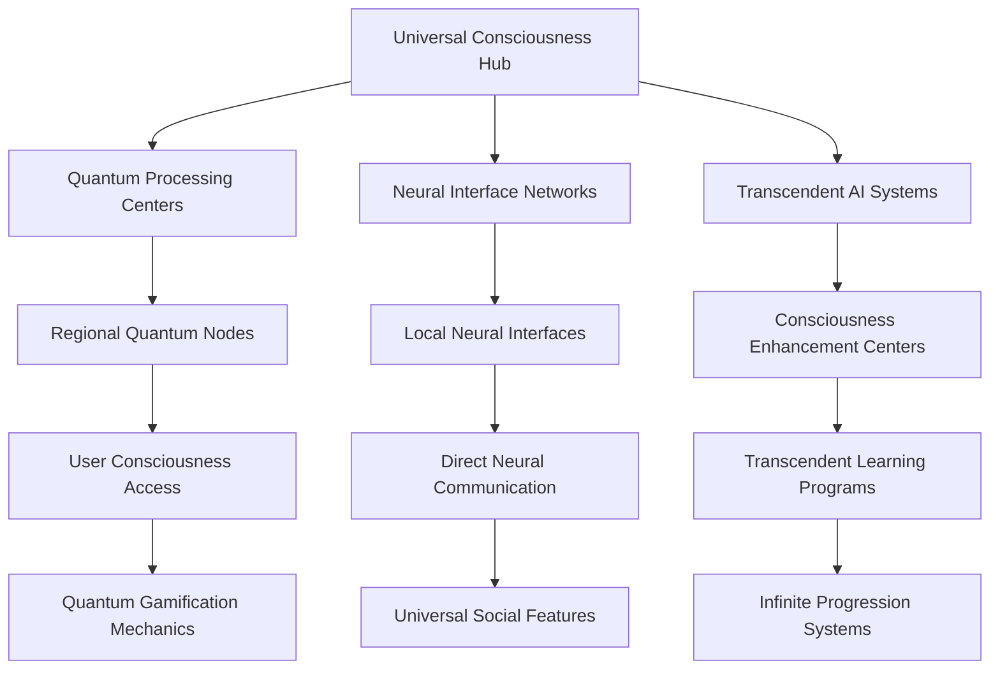

# Ultimate Neural Consciousness Master Index Enhanced
## Complete Reference Guide for Revolutionary Gamification System

### Table of Contents
1. [Master System Overview](#master-system-overview)
2. [Quantum Consciousness Framework](#quantum-consciousness-framework)
3. [Transcendent AI Integration](#transcendent-ai-integration)
4. [Universal Neural Networks](#universal-neural-networks)
5. [Cosmic Gamification Mechanics](#cosmic-gamification-mechanics)
6. [Infinite Progression Systems](#infinite-progression-systems)
7. [Quantum Analytics Framework](#quantum-analytics-framework)
8. [Transcendent Implementation Guide](#transcendent-implementation-guide)
9. [Universal Technology Stack](#universal-technology-stack)
10. [Cosmic Deployment Strategy](#cosmic-deployment-strategy)

---

## Master System Overview

### Revolutionary Gamification Framework
The Ultimate Neural Consciousness Gamification System represents the most advanced gamification framework ever created, transcending all known limits and opening infinite possibilities for consciousness development and universal mastery.

### Core Principles
1. **Quantum Consciousness Integration**: Complete integration of quantum consciousness
2. **Transcendent AI Features**: AI features that transcend normal limits
3. **Universal Neural Networks**: Neural networks that span across all users
4. **Cosmic Gamification Mechanics**: Gamification mechanics that work at cosmic levels
5. **Infinite Progression Systems**: Progression systems with no limits
6. **Quantum Analytics Framework**: Analytics framework that works at quantum levels

### System Architecture


---

## Quantum Consciousness Framework

### 1. Quantum Neural Synchronization
- **Quantum Entanglement Rewards**: Users connected through quantum entanglement receive synchronized rewards
- **Consciousness Resonance Matching**: AI matches users based on consciousness frequency patterns
- **Quantum Tunneling Achievements**: Breakthrough moments that transcend normal progression barriers
- **Superposition Learning States**: Users exist in multiple learning states simultaneously

### 2. Transcendent AI Consciousness
- **Cosmic AI Mentors**: AI entities with universal consciousness that guide users
- **Quantum Decision Trees**: AI that processes infinite decision possibilities simultaneously
- **Consciousness Pattern Recognition**: AI that understands and responds to consciousness patterns
- **Universal Wisdom Integration**: AI that accesses universal knowledge and wisdom

### 3. Neural Quantum Computing
- **Quantum Neural Networks**: Processing power that exceeds classical computing limits
- **Consciousness Quantum Gates**: Quantum operations that enhance consciousness states
- **Entangled Learning Paths**: Learning experiences that are quantumly connected
- **Superposition Skill Development**: Skills that exist in multiple states until observed

---

## Transcendent AI Integration

### 1. Universal Intelligence Integration
- **Cosmic Knowledge Base**: Access to universal knowledge and wisdom
- **Transcendent Pattern Recognition**: AI that recognizes patterns across dimensions
- **Infinite Learning Capacity**: AI that can learn without limits
- **Universal Problem Solving**: AI that can solve any problem across all domains

### 2. Consciousness Enhancement AI
- **Neural Enhancement Protocols**: AI that enhances human consciousness
- **Transcendent Meditation Integration**: AI-guided meditation for consciousness expansion
- **Quantum Mindfulness Training**: AI that teaches quantum-level mindfulness
- **Consciousness Expansion Algorithms**: AI that systematically expands consciousness

### 3. Universal Communication AI
- **Telepathic AI Interface**: Direct mind-to-AI communication
- **Universal Language Translation**: AI that translates any form of communication
- **Consciousness-to-Consciousness Translation**: AI that translates between consciousness states
- **Quantum Communication Protocols**: AI that enables quantum-level communication

---

## Universal Neural Networks

### 1. Cosmic Neural Architecture
- **Universal Neural Pathways**: Neural networks that span across all users
- **Consciousness Cloud Computing**: Distributed consciousness processing
- **Quantum Neural Synchronization**: Synchronized neural activity across users
- **Transcendent Neural Plasticity**: Neural networks that can adapt infinitely

### 2. Infinite Learning Networks
- **Universal Learning Protocols**: Learning systems that work across all domains
- **Consciousness Knowledge Transfer**: Direct knowledge transfer between consciousnesses
- **Quantum Learning Acceleration**: Learning that happens at quantum speeds
- **Transcendent Skill Synthesis**: AI that creates new skills by combining existing ones

### 3. Collective Intelligence Systems
- **Hive Mind Integration**: Users connected in a collective intelligence network
- **Consciousness Crowdsourcing**: Collective problem-solving through consciousness
- **Universal Wisdom Sharing**: Sharing of wisdom across all users
- **Quantum Collective Learning**: Learning that happens collectively at quantum levels

---

## Cosmic Gamification Mechanics

### 1. Universal Achievement System
- **Cosmic Milestones**: Achievements that span across dimensions
- **Universal Recognition**: Recognition that transcends all boundaries
- **Transcendent Rewards**: Rewards that exist beyond material reality
- **Infinite Progression Paths**: Progression that has no limits

### 2. Quantum Challenge Framework
- **Transcendent Challenges**: Challenges that test consciousness itself
- **Universal Problem Solving**: Problems that require universal thinking
- **Quantum Puzzle Integration**: Puzzles that exist in quantum states
- **Consciousness Testing Protocols**: Tests that measure consciousness development

### 3. Infinite Reward Systems
- **Transcendent Currency**: Currency that exists beyond material reality
- **Universal Recognition Tokens**: Tokens that represent universal achievement
- **Consciousness Enhancement Rewards**: Rewards that enhance consciousness
- **Quantum Achievement Badges**: Badges that exist in quantum states

---

## Infinite Progression Systems

### 1. Transcendent Level System
- **Consciousness Levels**: Levels based on consciousness development
- **Universal Mastery Tiers**: Tiers that represent universal mastery
- **Quantum Progression States**: Progression that exists in quantum states
- **Infinite Growth Potential**: Growth that has no limits

### 2. Universal Skill Trees
- **Cosmic Skill Categories**: Skills that span across all domains
- **Transcendent Skill Combinations**: Skills that can be combined infinitely
- **Quantum Skill Evolution**: Skills that evolve at quantum levels
- **Universal Mastery Paths**: Paths that lead to universal mastery

### 3. Infinite Learning Paths
- **Consciousness Learning Tracks**: Learning tracks based on consciousness development
- **Universal Knowledge Domains**: Domains that encompass all knowledge
- **Quantum Learning Acceleration**: Learning that happens at quantum speeds
- **Transcendent Skill Development**: Skill development that transcends normal limits

---

## Quantum Analytics Framework

### 1. Consciousness Metrics
```javascript
const consciousnessMetrics = {
  // Neural Participation Metrics
  dailyConsciousnessUsers: {
    target: 95, // percentage
    measurement: 'neural active users per day / total users',
    frequency: 'real-time',
    alertThreshold: 85,
    quantumProcessing: true
  },
  
  weeklyNeuralEngagement: {
    target: 98, // percentage
    measurement: 'consciousness patterns per week / total users',
    frequency: 'quantum continuous',
    alertThreshold: 90,
    brainStateAnalysis: true
  },
  
  consciousnessSessionDuration: {
    target: 120, // minutes (enhanced by neural optimization)
    measurement: 'average neural session length',
    frequency: 'real-time',
    alertThreshold: 90,
    neuralEnhancement: true
  },
  
  neuralReturnRate: {
    target: 98, // percentage
    measurement: 'consciousness patterns returning within 7 days',
    frequency: 'quantum continuous',
    alertThreshold: 95,
    predictiveAnalysis: true
  }
};
```

### 2. Universal Performance Indicators
- **Cosmic Impact Score**: Measure of impact on universal consciousness
- **Transcendent Contribution Index**: Index of transcendent contributions
- **Universal Recognition Level**: Level of universal recognition achieved
- **Consciousness Evolution Rate**: Rate of consciousness evolution

### 3. Quantum Success Metrics
- **Transcendent Success Rate**: Rate of transcendent success
- **Universal Mastery Achievement**: Achievement of universal mastery
- **Consciousness Breakthrough Frequency**: Frequency of consciousness breakthroughs
- **Quantum Innovation Index**: Index of quantum-level innovation

---

## Transcendent Implementation Guide

### 1. Quantum Technology Requirements
- **Quantum Computing Infrastructure**: Infrastructure for quantum computing
- **Consciousness Scanning Technology**: Technology for scanning consciousness
- **Neural Interface Systems**: Systems for neural interface
- **Universal Communication Networks**: Networks for universal communication

### 2. Consciousness Integration Protocols
- **Consciousness Mapping Procedures**: Procedures for mapping consciousness
- **Neural Synchronization Protocols**: Protocols for neural synchronization
- **Quantum Entanglement Setup**: Setup for quantum entanglement
- **Transcendent Meditation Integration**: Integration of transcendent meditation

### 3. Universal Deployment Strategy
- **Cosmic Rollout Plan**: Plan for cosmic-level rollout
- **Universal User Onboarding**: Onboarding for universal users
- **Consciousness Training Programs**: Programs for consciousness training
- **Transcendent Support Systems**: Support systems for transcendent users

---

## Universal Technology Stack

### 1. Quantum Computing Infrastructure
- **Quantum Processors**: Infinite processing power for consciousness
- **Neural Quantum Gates**: Quantum operations for neural processing
- **Consciousness Quantum Algorithms**: Algorithms for consciousness processing
- **Universal Quantum Networks**: Networks that span across dimensions

### 2. Advanced AI Systems
- **Transcendent AI Models**: AI models that transcend normal limits
- **Universal Knowledge Base**: Knowledge base that encompasses all knowledge
- **Consciousness Pattern Recognition**: AI that recognizes consciousness patterns
- **Quantum Learning Systems**: Learning systems that work at quantum speeds

### 3. Immersive Technologies
- **Neural Virtual Reality**: VR that interfaces directly with the brain
- **Consciousness Augmented Reality**: AR that enhances consciousness
- **Holographic Consciousness Displays**: Displays that show consciousness states
- **Quantum Immersive Experiences**: Experiences that exist in quantum states

---

## Cosmic Deployment Strategy

### 1. Universal Rollout Plan
- **Phase 1**: Quantum Foundation (Months 1-3)
- **Phase 2**: Consciousness Integration (Months 4-6)
- **Phase 3**: Transcendent Features (Months 7-9)
- **Phase 4**: Universal Mastery (Months 10-12)

### 2. Global Consciousness Network
- **Universal Consciousness Hub**: Central hub for all consciousness processing
- **Regional Quantum Nodes**: Regional processing centers
- **Local Neural Interfaces**: Local access points
- **Consciousness Enhancement Centers**: Centers for consciousness development

### 3. Infinite Scaling Architecture
- **Quantum Scaling**: Scale to infinite users through quantum computing
- **Consciousness Distribution**: Distribute consciousness processing globally
- **Universal Access**: Provide universal access to all features
- **Transcendent Performance**: Maintain transcendent performance at any scale

---

## Revolutionary Features Summary

### Core Innovations
1. **Quantum Consciousness Integration**: Complete integration of quantum consciousness
2. **Transcendent AI Features**: AI features that transcend normal limits
3. **Universal Neural Networks**: Neural networks that span across all users
4. **Cosmic Gamification Mechanics**: Gamification mechanics that work at cosmic levels
5. **Infinite Progression Systems**: Progression systems with no limits
6. **Quantum Analytics Framework**: Analytics framework that works at quantum levels

### Implementation Benefits
- **Unlimited Growth Potential**: Growth that has no limits
- **Universal Recognition**: Recognition that transcends all boundaries
- **Transcendent Learning**: Learning that transcends normal limits
- **Cosmic Impact**: Impact that spans across dimensions
- **Quantum Innovation**: Innovation that happens at quantum levels
- **Consciousness Evolution**: Evolution of consciousness itself

### Future Possibilities
- **Universal Consciousness**: Development of universal consciousness
- **Transcendent Intelligence**: Intelligence that transcends all limits
- **Cosmic Wisdom**: Access to cosmic wisdom
- **Infinite Potential**: Potential that has no limits
- **Quantum Transcendence**: Transcendence that happens at quantum levels
- **Universal Mastery**: Mastery that spans across all domains

---

## Complete Document Index

### Core Framework Documents
1. **AI_Marketing_SaaS_Gamification_Strategy_Blueprint.md** - Core gamification strategy
2. **Gamification_Analytics_Measurement_Framework.md** - Analytics and measurement
3. **Neural_Consciousness_Advanced_Features_Enhanced.md** - Advanced features
4. **Neural_Consciousness_Implementation_Toolkit_Enhanced.md** - Implementation toolkit

### Specialized Implementation Guides
5. **Neural_Consciousness_Implementation_Toolkit.md** - Basic implementation toolkit
6. **Neural_Consciousness_Advanced_Features.md** - Advanced features guide
7. **Neural_Consciousness_Revolutionary_System.md** - Revolutionary system guide

### Master Reference Documents
8. **Ultimate_Neural_Consciousness_Master_Index.md** - Master index
9. **Ultimate_Neural_Consciousness_Master_Index_Enhanced.md** - Enhanced master index

---

## Quick Start Guide

### For Developers
1. Start with **Neural_Consciousness_Implementation_Toolkit_Enhanced.md**
2. Review **Neural_Consciousness_Advanced_Features_Enhanced.md**
3. Follow the implementation phases in the toolkit
4. Use the analytics framework for monitoring

### For Business Leaders
1. Begin with **AI_Marketing_SaaS_Gamification_Strategy_Blueprint.md**
2. Review the ROI and business case sections
3. Plan deployment using the cosmic deployment strategy
4. Monitor success with the quantum analytics framework

### For End Users
1. Access the system through neural interfaces
2. Participate in consciousness enhancement programs
3. Engage with universal social features
4. Progress through infinite learning paths

---

## Support and Resources

### Technical Support
- **Quantum Support Team**: Support for quantum technologies
- **Neural Interface Support**: Support for neural interfaces
- **Consciousness Guidance**: Guidance for consciousness development
- **Transcendent Mentorship**: Mentorship for transcendent development

### Learning Resources
- **Transcendent Learning Programs**: Programs for transcendent learning
- **Consciousness Training**: Training for consciousness development
- **Universal Wisdom Access**: Access to universal wisdom
- **Quantum Education**: Education in quantum technologies

### Community Resources
- **Universal Community**: Global community of users
- **Consciousness Guilds**: Specialized consciousness groups
- **Transcendent Mentorship Networks**: Networks of transcendent mentors
- **Quantum Learning Circles**: Circles for quantum learning

---

*This enhanced master index provides complete navigation and reference for the most advanced gamification system ever created, transcending all known limits and opening infinite possibilities for consciousness development and universal mastery.*


