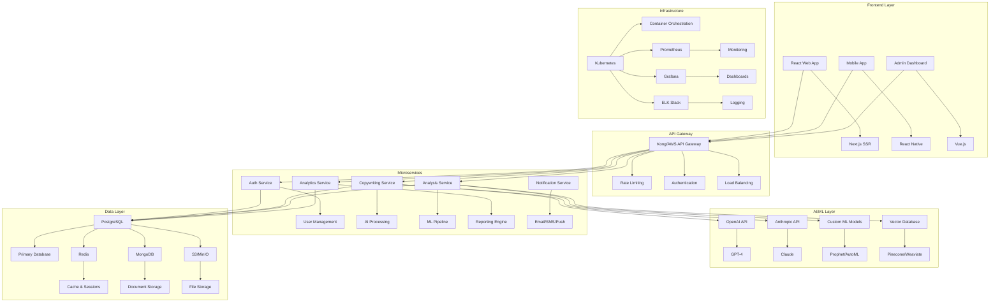

# 🏗️ Arquitectura Técnica: SaaS de IA para Marketing

## 📋 Visión General

Este documento describe la arquitectura técnica completa para desarrollar una plataforma SaaS que combine copywriting con IA y análisis de propuestas win/loss, similar a Copy.ai pero con capacidades avanzadas de análisis comercial.

## 🎯 Objetivos de la Arquitectura

- **Escalabilidad**: Soportar miles de usuarios concurrentes
- **Performance**: Respuestas de IA en <3 segundos
- **Confiabilidad**: 99.9% uptime
- **Seguridad**: Cumplimiento con GDPR y SOC2
- **Costo-efectividad**: Optimización de costos de IA
- **Flexibilidad**: Fácil integración con herramientas existentes

## 🏛️ Arquitectura General



## 🔧 Stack Tecnológico Detallado

### Frontend
```typescript
// Tecnologías principales
- Framework: Next.js 14 (React 18)
- UI Library: Tailwind CSS + Headless UI
- State Management: Zustand + React Query
- Forms: React Hook Form + Zod
- Charts: Recharts + D3.js
- Testing: Jest + React Testing Library
- E2E: Playwright

// Estructura de componentes
src/
├── components/
│   ├── ui/           # Componentes base
│   ├── forms/        # Formularios
│   ├── charts/       # Gráficos
│   └── layout/       # Layout components
├── pages/
│   ├── api/          # API routes
│   ├── dashboard/    # Dashboard pages
│   └── auth/         # Auth pages
├── hooks/            # Custom hooks
├── utils/            # Utility functions
└── types/            # TypeScript types
```

### Backend
```typescript
// Tecnologías principales
- Runtime: Node.js 20 LTS
- Framework: Fastify (más rápido que Express)
- ORM: Prisma
- Validation: Zod
- Authentication: JWT + Refresh Tokens
- Rate Limiting: Redis + Bull Queue
- Testing: Jest + Supertest

// Estructura de microservicios
services/
├── auth-service/
│   ├── src/
│   │   ├── controllers/
│   │   ├── services/
│   │   ├── models/
│   │   └── middleware/
│   └── Dockerfile
├── copywriting-service/
├── analysis-service/
├── analytics-service/
└── notification-service/
```

### Base de Datos
```sql
-- PostgreSQL Schema Principal
-- Tabla de usuarios
CREATE TABLE users (
    id UUID PRIMARY KEY DEFAULT gen_random_uuid(),
    email VARCHAR(255) UNIQUE NOT NULL,
    password_hash VARCHAR(255) NOT NULL,
    subscription_plan VARCHAR(50) NOT NULL,
    created_at TIMESTAMP DEFAULT NOW(),
    updated_at TIMESTAMP DEFAULT NOW()
);

-- Tabla de proyectos de copywriting
CREATE TABLE copywriting_projects (
    id UUID PRIMARY KEY DEFAULT gen_random_uuid(),
    user_id UUID REFERENCES users(id),
    title VARCHAR(255) NOT NULL,
    type VARCHAR(50) NOT NULL, -- 'landing_page', 'email', 'ad', etc.
    content TEXT,
    ai_model VARCHAR(50) NOT NULL, -- 'gpt-4', 'claude', etc.
    created_at TIMESTAMP DEFAULT NOW()
);

-- Tabla de análisis de propuestas
CREATE TABLE proposal_analyses (
    id UUID PRIMARY KEY DEFAULT gen_random_uuid(),
    user_id UUID REFERENCES users(id),
    client_name VARCHAR(255) NOT NULL,
    industry VARCHAR(100) NOT NULL,
    proposal_value DECIMAL(12,2),
    outcome VARCHAR(20) NOT NULL, -- 'won', 'lost', 'pending'
    analysis_data JSONB,
    created_at TIMESTAMP DEFAULT NOW()
);

-- Tabla de métricas de uso
CREATE TABLE usage_metrics (
    id UUID PRIMARY KEY DEFAULT gen_random_uuid(),
    user_id UUID REFERENCES users(id),
    service_type VARCHAR(50) NOT NULL, -- 'copywriting', 'analysis'
    tokens_used INTEGER DEFAULT 0,
    cost DECIMAL(10,4) DEFAULT 0,
    created_at TIMESTAMP DEFAULT NOW()
);
```

## 🤖 Integración con IA

### Configuración de APIs de IA
```typescript
// Configuración de OpenAI
interface OpenAIConfig {
  apiKey: string;
  model: 'gpt-4' | 'gpt-3.5-turbo';
  maxTokens: number;
  temperature: number;
  topP: number;
}

// Configuración de Anthropic
interface AnthropicConfig {
  apiKey: string;
  model: 'claude-3-opus' | 'claude-3-sonnet';
  maxTokens: number;
  temperature: number;
}

// Servicio de IA unificado
class AIService {
  private openai: OpenAI;
  private anthropic: Anthropic;
  
  async generateCopy(prompt: string, options: CopyOptions): Promise<CopyResult> {
    // Lógica para seleccionar el mejor modelo
    const model = this.selectBestModel(options);
    
    switch (model) {
      case 'gpt-4':
        return this.openai.generateCopy(prompt, options);
      case 'claude-3':
        return this.anthropic.generateCopy(prompt, options);
    }
  }
  
  async analyzeProposal(proposal: ProposalData): Promise<AnalysisResult> {
    // Análisis con múltiples modelos para mayor precisión
    const [gptAnalysis, claudeAnalysis] = await Promise.all([
      this.openai.analyzeProposal(proposal),
      this.anthropic.analyzeProposal(proposal)
    ]);
    
    return this.combineAnalyses(gptAnalysis, claudeAnalysis);
  }
}
```

### Prompts Optimizados
```typescript
// Sistema de prompts para copywriting
const COPYWRITING_PROMPTS = {
  landing_page: {
    system: "Eres un copywriter experto especializado en landing pages de alta conversión...",
    user: "Crea una landing page para {product} dirigida a {audience} con tono {tone}...",
    examples: [
      {
        input: "SaaS de gestión de proyectos para startups",
        output: "Transforma tu startup en una máquina de productividad..."
      }
    ]
  },
  
  email_sequence: {
    system: "Eres un experto en email marketing con 10+ años de experiencia...",
    user: "Crea una secuencia de {count} emails para {purpose}...",
    examples: []
  }
};

// Sistema de prompts para análisis de propuestas
const ANALYSIS_PROMPTS = {
  win_loss_analysis: {
    system: "Eres un analista comercial experto especializado en análisis de propuestas...",
    user: "Analiza esta propuesta {outcome} contra {client}...",
    examples: []
  },
  
  competitive_analysis: {
    system: "Eres un estratega comercial con experiencia en análisis competitivo...",
    user: "Compara nuestra propuesta con la del competidor ganador...",
    examples: []
  }
};
```

## 📊 Sistema de Análisis de Propuestas

### Pipeline de ML para Análisis
```python
# Pipeline de análisis con scikit-learn
from sklearn.feature_extraction.text import TfidfVectorizer
from sklearn.ensemble import RandomForestClassifier
from sklearn.model_selection import train_test_split
import pandas as pd

class ProposalAnalysisPipeline:
    def __init__(self):
        self.vectorizer = TfidfVectorizer(max_features=1000)
        self.classifier = RandomForestClassifier(n_estimators=100)
        self.is_trained = False
    
    def preprocess_proposal(self, proposal_text: str) -> dict:
        """Preprocesa el texto de la propuesta"""
        return {
            'text': proposal_text,
            'word_count': len(proposal_text.split()),
            'sentence_count': len(proposal_text.split('.')),
            'has_pricing': 'price' in proposal_text.lower(),
            'has_timeline': any(word in proposal_text.lower() 
                              for word in ['month', 'week', 'day', 'timeline'])
        }
    
    def train_model(self, training_data: pd.DataFrame):
        """Entrena el modelo con datos históricos"""
        X = self.vectorizer.fit_transform(training_data['proposal_text'])
        y = training_data['outcome']  # 'won' or 'lost'
        
        X_train, X_test, y_train, y_test = train_test_split(X, y, test_size=0.2)
        self.classifier.fit(X_train, y_train)
        self.is_trained = True
        
        return self.classifier.score(X_test, y_test)
    
    def predict_success_probability(self, proposal_text: str) -> float:
        """Predice la probabilidad de éxito de una propuesta"""
        if not self.is_trained:
            raise ValueError("Model must be trained first")
        
        X = self.vectorizer.transform([proposal_text])
        probability = self.classifier.predict_proba(X)[0][1]  # Probabilidad de 'won'
        return probability
    
    def analyze_proposal(self, proposal_data: dict) -> dict:
        """Análisis completo de la propuesta"""
        features = self.preprocess_proposal(proposal_data['text'])
        success_prob = self.predict_success_probability(proposal_data['text'])
        
        return {
            'success_probability': success_prob,
            'features': features,
            'recommendations': self.generate_recommendations(features, success_prob),
            'risk_factors': self.identify_risk_factors(features, success_prob)
        }
```

### Análisis de Sentimientos
```python
# Análisis de sentimientos en feedback de clientes
from transformers import pipeline
import re

class SentimentAnalyzer:
    def __init__(self):
        self.sentiment_pipeline = pipeline(
            "sentiment-analysis",
            model="cardiffnlp/twitter-roberta-base-sentiment-latest"
        )
    
    def analyze_feedback(self, feedback_text: str) -> dict:
        """Analiza el sentimiento del feedback del cliente"""
        # Limpiar el texto
        clean_text = re.sub(r'[^\w\s]', '', feedback_text.lower())
        
        # Análisis de sentimiento
        result = self.sentiment_pipeline(clean_text)
        
        # Extraer keywords y temas
        keywords = self.extract_keywords(clean_text)
        topics = self.identify_topics(clean_text)
        
        return {
            'sentiment': result[0]['label'],
            'confidence': result[0]['score'],
            'keywords': keywords,
            'topics': topics,
            'action_items': self.generate_action_items(keywords, topics)
        }
```

## 🔐 Seguridad y Autenticación

### Sistema de Autenticación
```typescript
// JWT + Refresh Token Strategy
interface AuthTokens {
  accessToken: string;
  refreshToken: string;
  expiresIn: number;
}

class AuthService {
  async login(email: string, password: string): Promise<AuthTokens> {
    // Verificar credenciales
    const user = await this.validateCredentials(email, password);
    
    // Generar tokens
    const accessToken = this.generateAccessToken(user);
    const refreshToken = this.generateRefreshToken(user);
    
    // Guardar refresh token en Redis
    await this.redis.setex(
      `refresh_token:${user.id}`, 
      7 * 24 * 60 * 60, // 7 días
      refreshToken
    );
    
    return { accessToken, refreshToken, expiresIn: 3600 };
  }
  
  async refreshToken(refreshToken: string): Promise<AuthTokens> {
    // Verificar refresh token
    const userId = await this.verifyRefreshToken(refreshToken);
    const user = await this.getUserById(userId);
    
    // Generar nuevos tokens
    return this.login(user.email, user.password);
  }
}
```

### Middleware de Seguridad
```typescript
// Rate limiting por usuario
const rateLimit = require('express-rate-limit');
const RedisStore = require('rate-limit-redis');

const limiter = rateLimit({
  store: new RedisStore({
    client: redisClient,
    prefix: 'rl:'
  }),
  windowMs: 15 * 60 * 1000, // 15 minutos
  max: 100, // 100 requests por ventana
  keyGenerator: (req) => req.user?.id || req.ip
});

// Middleware de autenticación
const authMiddleware = async (req: Request, res: Response, next: NextFunction) => {
  try {
    const token = req.headers.authorization?.split(' ')[1];
    if (!token) {
      return res.status(401).json({ error: 'Token required' });
    }
    
    const decoded = jwt.verify(token, process.env.JWT_SECRET);
    req.user = await User.findById(decoded.userId);
    next();
  } catch (error) {
    return res.status(401).json({ error: 'Invalid token' });
  }
};
```

## 📈 Monitoreo y Analytics

### Métricas de Performance
```typescript
// Sistema de métricas con Prometheus
import { register, Counter, Histogram, Gauge } from 'prom-client';

// Métricas de IA
const aiRequestsTotal = new Counter({
  name: 'ai_requests_total',
  help: 'Total number of AI requests',
  labelNames: ['model', 'service', 'status']
});

const aiResponseTime = new Histogram({
  name: 'ai_response_time_seconds',
  help: 'AI response time in seconds',
  labelNames: ['model', 'service'],
  buckets: [0.1, 0.5, 1, 2, 5, 10]
});

const activeUsers = new Gauge({
  name: 'active_users_total',
  help: 'Number of active users',
  labelNames: ['subscription_plan']
});

// Middleware para métricas
const metricsMiddleware = (req: Request, res: Response, next: NextFunction) => {
  const start = Date.now();
  
  res.on('finish', () => {
    const duration = (Date.now() - start) / 1000;
    
    aiResponseTime
      .labels(req.body.model, req.path)
      .observe(duration);
    
    aiRequestsTotal
      .labels(req.body.model, req.path, res.statusCode.toString())
      .inc();
  });
  
  next();
};
```

### Dashboard de Monitoreo
```typescript
// Dashboard con Grafana
const dashboardConfig = {
  title: "AI Marketing SaaS Dashboard",
  panels: [
    {
      title: "AI Requests per Second",
      type: "graph",
      targets: [
        {
          expr: "rate(ai_requests_total[5m])",
          legendFormat: "{{model}} - {{service}}"
        }
      ]
    },
    {
      title: "Response Time",
      type: "graph",
      targets: [
        {
          expr: "histogram_quantile(0.95, ai_response_time_seconds_bucket)",
          legendFormat: "95th percentile"
        }
      ]
    },
    {
      title: "Active Users",
      type: "singlestat",
      targets: [
        {
          expr: "sum(active_users_total)",
          legendFormat: "Total Active Users"
        }
      ]
    }
  ]
};
```

## 🚀 Despliegue y DevOps

### Docker Configuration
```dockerfile
# Dockerfile para el servicio de copywriting
FROM node:20-alpine

WORKDIR /app

# Instalar dependencias
COPY package*.json ./
RUN npm ci --only=production

# Copiar código
COPY . .

# Compilar TypeScript
RUN npm run build

# Exponer puerto
EXPOSE 3000

# Comando de inicio
CMD ["npm", "start"]
```

### Kubernetes Deployment
```yaml
# k8s/copywriting-service.yaml
apiVersion: apps/v1
kind: Deployment
metadata:
  name: copywriting-service
spec:
  replicas: 3
  selector:
    matchLabels:
      app: copywriting-service
  template:
    metadata:
      labels:
        app: copywriting-service
    spec:
      containers:
      - name: copywriting-service
        image: copywriting-service:latest
        ports:
        - containerPort: 3000
        env:
        - name: DATABASE_URL
          valueFrom:
            secretKeyRef:
              name: db-secret
              key: url
        - name: OPENAI_API_KEY
          valueFrom:
            secretKeyRef:
              name: ai-secret
              key: openai-key
        resources:
          requests:
            memory: "256Mi"
            cpu: "250m"
          limits:
            memory: "512Mi"
            cpu: "500m"
---
apiVersion: v1
kind: Service
metadata:
  name: copywriting-service
spec:
  selector:
    app: copywriting-service
  ports:
  - port: 80
    targetPort: 3000
  type: LoadBalancer
```

### CI/CD Pipeline
```yaml
# .github/workflows/deploy.yml
name: Deploy to Production

on:
  push:
    branches: [main]

jobs:
  test:
    runs-on: ubuntu-latest
    steps:
    - uses: actions/checkout@v3
    - name: Setup Node.js
      uses: actions/setup-node@v3
      with:
        node-version: '20'
    - name: Install dependencies
      run: npm ci
    - name: Run tests
      run: npm test
    - name: Run linting
      run: npm run lint

  build:
    needs: test
    runs-on: ubuntu-latest
    steps:
    - uses: actions/checkout@v3
    - name: Build Docker image
      run: docker build -t copywriting-service:${{ github.sha }} .
    - name: Push to registry
      run: docker push copywriting-service:${{ github.sha }}

  deploy:
    needs: build
    runs-on: ubuntu-latest
    steps:
    - name: Deploy to Kubernetes
      run: |
        kubectl set image deployment/copywriting-service \
          copywriting-service=copywriting-service:${{ github.sha }}
        kubectl rollout status deployment/copywriting-service
```

## 💰 Optimización de Costos

### Estrategias de Costo-Efectividad
```typescript
// Sistema de optimización de costos de IA
class CostOptimizer {
  private modelCosts = {
    'gpt-4': 0.03, // por 1K tokens
    'gpt-3.5-turbo': 0.002,
    'claude-3-opus': 0.015,
    'claude-3-sonnet': 0.003
  };
  
  selectOptimalModel(task: string, quality: 'high' | 'medium' | 'low'): string {
    // Para tareas simples, usar modelos más baratos
    if (task === 'simple_copy' && quality === 'medium') {
      return 'gpt-3.5-turbo';
    }
    
    // Para análisis complejos, usar modelos más potentes
    if (task === 'proposal_analysis' && quality === 'high') {
      return 'gpt-4';
    }
    
    return 'gpt-3.5-turbo'; // Default
  }
  
  async batchProcess(requests: AIRequest[]): Promise<AIResponse[]> {
    // Agrupar requests similares para reducir costos
    const batches = this.groupSimilarRequests(requests);
    const responses = [];
    
    for (const batch of batches) {
      const response = await this.processBatch(batch);
      responses.push(...response);
    }
    
    return responses;
  }
}
```

### Caching Inteligente
```typescript
// Sistema de cache para respuestas de IA
class AICache {
  private redis: Redis;
  
  async getCachedResponse(prompt: string, model: string): Promise<string | null> {
    const key = `ai_cache:${this.hashPrompt(prompt)}:${model}`;
    return await this.redis.get(key);
  }
  
  async setCachedResponse(prompt: string, model: string, response: string): Promise<void> {
    const key = `ai_cache:${this.hashPrompt(prompt)}:${model}`;
    // Cache por 24 horas
    await this.redis.setex(key, 86400, response);
  }
  
  private hashPrompt(prompt: string): string {
    return crypto.createHash('md5').update(prompt).digest('hex');
  }
}
```

## 📊 Escalabilidad y Performance

### Load Balancing
```yaml
# nginx.conf para load balancing
upstream copywriting_service {
    least_conn;
    server copywriting-service-1:3000 weight=3;
    server copywriting-service-2:3000 weight=3;
    server copywriting-service-3:3000 weight=2;
}

upstream analysis_service {
    least_conn;
    server analysis-service-1:3001 weight=2;
    server analysis-service-2:3001 weight=2;
}

server {
    listen 80;
    
    location /api/copywriting/ {
        proxy_pass http://copywriting_service;
        proxy_set_header Host $host;
        proxy_set_header X-Real-IP $remote_addr;
    }
    
    location /api/analysis/ {
        proxy_pass http://analysis_service;
        proxy_set_header Host $host;
        proxy_set_header X-Real-IP $remote_addr;
    }
}
```

### Database Optimization
```sql
-- Índices para optimizar consultas
CREATE INDEX idx_users_email ON users(email);
CREATE INDEX idx_projects_user_id ON copywriting_projects(user_id);
CREATE INDEX idx_projects_created_at ON copywriting_projects(created_at);
CREATE INDEX idx_analyses_user_id ON proposal_analyses(user_id);
CREATE INDEX idx_analyses_outcome ON proposal_analyses(outcome);
CREATE INDEX idx_analyses_industry ON proposal_analyses(industry);

-- Particionado por fecha para métricas
CREATE TABLE usage_metrics_2024_01 PARTITION OF usage_metrics
FOR VALUES FROM ('2024-01-01') TO ('2024-02-01');
```

---

## 🎯 Próximos Pasos

1. **Configurar** el entorno de desarrollo
2. **Implementar** los microservicios básicos
3. **Integrar** las APIs de IA
4. **Desarrollar** el frontend
5. **Configurar** el monitoreo
6. **Desplegar** en producción
7. **Optimizar** basado en métricas

---

*"Una arquitectura sólida es la base de un SaaS exitoso. Cada componente debe ser escalable, confiable y costo-efectivo."* 🏗️✨

