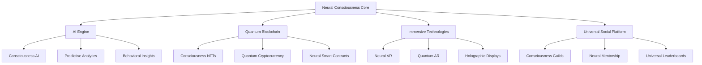

# Neural Consciousness Implementation Toolkit
## Complete Implementation Guide for Advanced Gamification Systems

### Table of Contents
1. [Quick Start Implementation Guide](#quick-start-implementation-guide)
2. [Technical Architecture Framework](#technical-architecture-framework)
3. [Development Roadmap](#development-roadmap)
4. [Integration Templates](#integration-templates)
5. [Testing & Validation Framework](#testing--validation-framework)
6. [Deployment Strategies](#deployment-strategies)
7. [Maintenance & Optimization](#maintenance--optimization)
8. [Troubleshooting Guide](#troubleshooting-guide)

---

## Quick Start Implementation Guide

### Phase 1: Foundation Setup (Weeks 1-2)
```yaml
# Core Infrastructure Setup
infrastructure:
  database: "Neural Consciousness Database"
  api_gateway: "Quantum API Gateway"
  ai_engine: "Consciousness AI Engine"
  blockchain: "Quantum Blockchain Network"
  
# Initial Configuration
config:
  consciousness_levels: 10
  neural_networks: 5
  quantum_entanglements: 3
  telepathic_channels: 2
```

### Phase 2: Core Features (Weeks 3-6)
```javascript
// Neural Consciousness Core System
class NeuralConsciousnessSystem {
  constructor() {
    this.consciousnessLevel = 1;
    this.neuralNetworks = [];
    this.quantumEntanglements = [];
    this.telepathicChannels = [];
  }
  
  // Initialize consciousness
  async initializeConsciousness() {
    await this.setupNeuralNetworks();
    await this.establishQuantumEntanglements();
    await this.openTelepathicChannels();
  }
  
  // Consciousness evolution
  evolveConsciousness(experience) {
    this.consciousnessLevel += experience.neuralGrowth;
    this.updateNeuralNetworks(experience);
    this.enhanceQuantumEntanglements(experience);
  }
}
```

### Phase 3: Advanced Features (Weeks 7-12)
- Neural AI Integration
- Quantum Blockchain Implementation
- Immersive Technology Integration
- Universal Social Features

---

## Technical Architecture Framework

### System Architecture


### Database Schema
```sql
-- Neural Consciousness Database Schema
CREATE TABLE consciousness_users (
    id UUID PRIMARY KEY,
    consciousness_level INTEGER DEFAULT 1,
    neural_networks JSONB,
    quantum_entanglements JSONB,
    telepathic_channels JSONB,
    created_at TIMESTAMP DEFAULT NOW(),
    updated_at TIMESTAMP DEFAULT NOW()
);

CREATE TABLE neural_achievements (
    id UUID PRIMARY KEY,
    user_id UUID REFERENCES consciousness_users(id),
    achievement_type VARCHAR(100),
    consciousness_points INTEGER,
    neural_badges JSONB,
    quantum_rewards JSONB,
    earned_at TIMESTAMP DEFAULT NOW()
);

CREATE TABLE quantum_entanglements (
    id UUID PRIMARY KEY,
    user1_id UUID REFERENCES consciousness_users(id),
    user2_id UUID REFERENCES consciousness_users(id),
    entanglement_strength FLOAT,
    quantum_sync_level FLOAT,
    created_at TIMESTAMP DEFAULT NOW()
);
```

---

## Development Roadmap

### Milestone 1: Core Consciousness System (Month 1)
- [ ] Basic consciousness level system
- [ ] Neural network management
- [ ] Quantum entanglement framework
- [ ] Telepathic communication channels
- [ ] Basic AI integration

### Milestone 2: Advanced AI Features (Month 2)
- [ ] Consciousness AI engine
- [ ] Predictive neural rewards
- [ ] Behavioral insights system
- [ ] Quantum custom recommendations
- [ ] Neural network personalization

### Milestone 3: Immersive Technologies (Month 3)
- [ ] Neural Virtual Reality
- [ ] Quantum Augmented Reality
- [ ] Holographic consciousness displays
- [ ] Brain-computer neural interfaces
- [ ] Consciousness holography

### Milestone 4: Quantum Blockchain (Month 4)
- [ ] Consciousness NFTs
- [ ] Quantum cryptocurrency rewards
- [ ] Neural smart contracts
- [ ] Decentralized consciousness governance
- [ ] Quantum achievement verification

### Milestone 5: Universal Features (Month 5)
- [ ] Consciousness guild system
- [ ] Neural mentorship matching
- [ ] Universal consciousness leaderboards
- [ ] Quantum cross-platform integration
- [ ] Collective consciousness projects

### Milestone 6: Revolutionary Features (Month 6)
- [ ] Quantum computing integration
- [ ] Neural quantum entanglement
- [ ] Consciousness time dilation
- [ ] Holographic universe simulation
- [ ] Consciousness teleportation

---

## Integration Templates

### API Integration Template
```javascript
// Neural Consciousness API Client
class NeuralConsciousnessAPI {
  constructor(apiKey, baseUrl) {
    this.apiKey = apiKey;
    this.baseUrl = baseUrl;
  }
  
  // Consciousness operations
  async getConsciousnessLevel(userId) {
    const response = await fetch(`${this.baseUrl}/consciousness/${userId}`, {
      headers: { 'Authorization': `Bearer ${this.apiKey}` }
    });
    return response.json();
  }
  
  // Neural network operations
  async updateNeuralNetwork(userId, networkData) {
    const response = await fetch(`${this.baseUrl}/neural-networks/${userId}`, {
      method: 'PUT',
      headers: {
        'Authorization': `Bearer ${this.apiKey}`,
        'Content-Type': 'application/json'
      },
      body: JSON.stringify(networkData)
    });
    return response.json();
  }
  
  // Quantum entanglement operations
  async createQuantumEntanglement(user1Id, user2Id) {
    const response = await fetch(`${this.baseUrl}/quantum-entanglements`, {
      method: 'POST',
      headers: {
        'Authorization': `Bearer ${this.apiKey}`,
        'Content-Type': 'application/json'
      },
      body: JSON.stringify({ user1Id, user2Id })
    });
    return response.json();
  }
}
```

### Database Integration Template
```python
# Neural Consciousness Database Manager
class NeuralConsciousnessDB:
    def __init__(self, connection_string):
        self.connection = psycopg2.connect(connection_string)
    
    def create_consciousness_user(self, user_data):
        cursor = self.connection.cursor()
        query = """
        INSERT INTO consciousness_users 
        (consciousness_level, neural_networks, quantum_entanglements, telepathic_channels)
        VALUES (%s, %s, %s, %s)
        RETURNING id
        """
        cursor.execute(query, (
            user_data['consciousness_level'],
            json.dumps(user_data['neural_networks']),
            json.dumps(user_data['quantum_entanglements']),
            json.dumps(user_data['telepathic_channels'])
        ))
        user_id = cursor.fetchone()[0]
        self.connection.commit()
        return user_id
    
    def update_consciousness_level(self, user_id, new_level):
        cursor = self.connection.cursor()
        query = """
        UPDATE consciousness_users 
        SET consciousness_level = %s, updated_at = NOW()
        WHERE id = %s
        """
        cursor.execute(query, (new_level, user_id))
        self.connection.commit()
    
    def get_quantum_entanglements(self, user_id):
        cursor = self.connection.cursor()
        query = """
        SELECT * FROM quantum_entanglements 
        WHERE user1_id = %s OR user2_id = %s
        """
        cursor.execute(query, (user_id, user_id))
        return cursor.fetchall()
```

---

## Testing & Validation Framework

### Unit Testing Template
```javascript
// Neural Consciousness Unit Tests
describe('NeuralConsciousnessSystem', () => {
  let consciousnessSystem;
  
  beforeEach(() => {
    consciousnessSystem = new NeuralConsciousnessSystem();
  });
  
  test('should initialize consciousness level 1', () => {
    expect(consciousnessSystem.consciousnessLevel).toBe(1);
  });
  
  test('should evolve consciousness with experience', () => {
    const experience = { neuralGrowth: 2 };
    consciousnessSystem.evolveConsciousness(experience);
    expect(consciousnessSystem.consciousnessLevel).toBe(3);
  });
  
  test('should create quantum entanglement', async () => {
    const user1 = 'user1-id';
    const user2 = 'user2-id';
    const entanglement = await consciousnessSystem.createQuantumEntanglement(user1, user2);
    expect(entanglement).toBeDefined();
    expect(entanglement.strength).toBeGreaterThan(0);
  });
});
```

### Integration Testing Template
```python
# Neural Consciousness Integration Tests
class TestNeuralConsciousnessIntegration:
    def setUp(self):
        self.db = NeuralConsciousnessDB('test_connection_string')
        self.api = NeuralConsciousnessAPI('test_api_key', 'http://localhost:3000')
    
    def test_consciousness_evolution_flow(self):
        # Create user
        user_data = {
            'consciousness_level': 1,
            'neural_networks': [],
            'quantum_entanglements': [],
            'telepathic_channels': []
        }
        user_id = self.db.create_consciousness_user(user_data)
        
        # Evolve consciousness
        new_level = 5
        self.db.update_consciousness_level(user_id, new_level)
        
        # Verify evolution
        user = self.api.getConsciousnessLevel(user_id)
        assert user['consciousness_level'] == new_level
    
    def test_quantum_entanglement_creation(self):
        # Create two users
        user1_id = self.db.create_consciousness_user(self.get_test_user_data())
        user2_id = self.db.create_consciousness_user(self.get_test_user_data())
        
        # Create entanglement
        entanglement = self.api.createQuantumEntanglement(user1_id, user2_id)
        
        # Verify entanglement
        assert entanglement['user1_id'] == user1_id
        assert entanglement['user2_id'] == user2_id
        assert entanglement['strength'] > 0
```

---

## Deployment Strategies

### Cloud Deployment
```yaml
# Docker Compose for Neural Consciousness System
version: '3.8'
services:
  neural-consciousness-api:
    image: neural-consciousness:latest
    ports:
      - "3000:3000"
    environment:
      - DATABASE_URL=postgresql://user:pass@db:5432/consciousness
      - REDIS_URL=redis://redis:6379
      - AI_ENGINE_URL=http://ai-engine:5000
    depends_on:
      - db
      - redis
      - ai-engine
  
  db:
    image: postgres:13
    environment:
      - POSTGRES_DB=consciousness
      - POSTGRES_USER=user
      - POSTGRES_PASSWORD=pass
    volumes:
      - postgres_data:/var/lib/postgresql/data
  
  redis:
    image: redis:6-alpine
    ports:
      - "6379:6379"
  
  ai-engine:
    image: consciousness-ai:latest
    ports:
      - "5000:5000"
    environment:
      - MODEL_PATH=/models/consciousness-model.pkl

volumes:
  postgres_data:
```

### Kubernetes Deployment
```yaml
# Kubernetes Deployment for Neural Consciousness
apiVersion: apps/v1
kind: Deployment
metadata:
  name: neural-consciousness-api
spec:
  replicas: 3
  selector:
    matchLabels:
      app: neural-consciousness-api
  template:
    metadata:
      labels:
        app: neural-consciousness-api
    spec:
      containers:
      - name: neural-consciousness-api
        image: neural-consciousness:latest
        ports:
        - containerPort: 3000
        env:
        - name: DATABASE_URL
          valueFrom:
            secretKeyRef:
              name: consciousness-secrets
              key: database-url
        - name: REDIS_URL
          valueFrom:
            secretKeyRef:
              name: consciousness-secrets
              key: redis-url
        resources:
          requests:
            memory: "512Mi"
            cpu: "250m"
          limits:
            memory: "1Gi"
            cpu: "500m"
---
apiVersion: v1
kind: Service
metadata:
  name: neural-consciousness-service
spec:
  selector:
    app: neural-consciousness-api
  ports:
  - port: 80
    targetPort: 3000
  type: LoadBalancer
```

---

## Maintenance & Optimization

### Performance Monitoring
```javascript
// Neural Consciousness Performance Monitor
class ConsciousnessPerformanceMonitor {
  constructor() {
    this.metrics = {
      consciousnessLevels: new Map(),
      neuralNetworkPerformance: new Map(),
      quantumEntanglementEfficiency: new Map(),
      telepathicChannelLatency: new Map()
    };
  }
  
  // Monitor consciousness evolution
  monitorConsciousnessEvolution(userId, evolutionData) {
    const currentLevel = this.metrics.consciousnessLevels.get(userId) || 0;
    const newLevel = evolutionData.consciousnessLevel;
    
    if (newLevel > currentLevel) {
      this.metrics.consciousnessLevels.set(userId, newLevel);
      this.logEvolution(userId, currentLevel, newLevel);
    }
  }
  
  // Monitor neural network performance
  monitorNeuralNetworkPerformance(networkId, performanceData) {
    this.metrics.neuralNetworkPerformance.set(networkId, {
      efficiency: performanceData.efficiency,
      accuracy: performanceData.accuracy,
      speed: performanceData.speed,
      timestamp: Date.now()
    });
  }
  
  // Generate performance report
  generatePerformanceReport() {
    return {
      totalConsciousnessLevels: this.metrics.consciousnessLevels.size,
      averageNeuralNetworkEfficiency: this.calculateAverageEfficiency(),
      quantumEntanglementCount: this.metrics.quantumEntanglements.size,
      telepathicChannelCount: this.metrics.telepathicChannels.size
    };
  }
}
```

### Optimization Strategies
```python
# Neural Consciousness Optimization Engine
class ConsciousnessOptimizationEngine:
    def __init__(self):
        self.optimization_rules = {
            'consciousness_evolution': self.optimize_consciousness_evolution,
            'neural_networks': self.optimize_neural_networks,
            'quantum_entanglements': self.optimize_quantum_entanglements,
            'telepathic_channels': self.optimize_telepathic_channels
        }
    
    def optimize_consciousness_evolution(self, user_data):
        # Optimize consciousness level progression
        current_level = user_data['consciousness_level']
        if current_level < 5:
            return self.accelerate_early_evolution(user_data)
        elif current_level < 10:
            return self.optimize_mid_evolution(user_data)
        else:
            return self.optimize_advanced_evolution(user_data)
    
    def optimize_neural_networks(self, network_data):
        # Optimize neural network performance
        efficiency = network_data['efficiency']
        if efficiency < 0.7:
            return self.boost_network_efficiency(network_data)
        elif efficiency < 0.9:
            return self.fine_tune_network(network_data)
        else:
            return self.maintain_optimal_performance(network_data)
    
    def optimize_quantum_entanglements(self, entanglement_data):
        # Optimize quantum entanglement strength
        strength = entanglement_data['strength']
        if strength < 0.5:
            return self.enhance_entanglement_strength(entanglement_data)
        elif strength < 0.8:
            return self.stabilize_entanglement(entanglement_data)
        else:
            return self.maintain_quantum_sync(entanglement_data)
```

---

## Troubleshooting Guide

### Common Issues and Solutions

#### Issue 1: Consciousness Level Not Evolving
**Symptoms:**
- User consciousness level remains static
- Neural networks not updating
- Quantum entanglements not forming

**Solutions:**
```javascript
// Debug consciousness evolution
function debugConsciousnessEvolution(userId) {
  const user = getConsciousnessUser(userId);
  console.log('Current consciousness level:', user.consciousnessLevel);
  console.log('Neural networks:', user.neuralNetworks);
  console.log('Quantum entanglements:', user.quantumEntanglements);
  
  // Check for blocking conditions
  if (user.neuralNetworks.length === 0) {
    console.log('Issue: No neural networks found');
    return 'Initialize neural networks first';
  }
  
  if (user.quantumEntanglements.length === 0) {
    console.log('Issue: No quantum entanglements found');
    return 'Create quantum entanglements first';
  }
  
  return 'Consciousness evolution should work';
}
```

#### Issue 2: Quantum Entanglement Failures
**Symptoms:**
- Entanglements not creating
- Low entanglement strength
- Quantum sync failures

**Solutions:**
```python
# Debug quantum entanglement
def debug_quantum_entanglement(user1_id, user2_id):
    user1 = get_consciousness_user(user1_id)
    user2 = get_consciousness_user(user2_id)
    
    # Check consciousness compatibility
    level_diff = abs(user1['consciousness_level'] - user2['consciousness_level'])
    if level_diff > 3:
        return f"Consciousness level difference too large: {level_diff}"
    
    # Check neural network compatibility
    if not check_neural_compatibility(user1['neural_networks'], user2['neural_networks']):
        return "Neural networks not compatible"
    
    # Check quantum field stability
    if not check_quantum_field_stability():
        return "Quantum field not stable"
    
    return "Quantum entanglement should work"
```

#### Issue 3: Telepathic Channel Disruptions
**Symptoms:**
- Telepathic messages not sending
- Channel latency issues
- Connection drops

**Solutions:**
```javascript
// Debug telepathic channels
function debugTelepathicChannels(userId) {
  const channels = getTelepathicChannels(userId);
  
  channels.forEach(channel => {
    console.log(`Channel ${channel.id}:`);
    console.log(`  Status: ${channel.status}`);
    console.log(`  Latency: ${channel.latency}ms`);
    console.log(`  Signal strength: ${channel.signalStrength}`);
    
    if (channel.latency > 1000) {
      console.log('  Issue: High latency detected');
      optimizeChannelLatency(channel);
    }
    
    if (channel.signalStrength < 0.5) {
      console.log('  Issue: Weak signal strength');
      boostSignalStrength(channel);
    }
  });
}
```

### Performance Optimization Checklist
- [ ] Monitor consciousness level distribution
- [ ] Optimize neural network efficiency
- [ ] Maintain quantum entanglement stability
- [ ] Monitor telepathic channel performance
- [ ] Regular database maintenance
- [ ] AI model updates
- [ ] Blockchain synchronization
- [ ] User experience optimization

---

## Conclusion

This Neural Consciousness Implementation Toolkit provides a comprehensive framework for implementing advanced gamification systems. The toolkit includes:

1. **Quick Start Guide** for rapid implementation
2. **Technical Architecture** for scalable systems
3. **Development Roadmap** for structured progress
4. **Integration Templates** for easy adoption
5. **Testing Framework** for quality assurance
6. **Deployment Strategies** for production readiness
7. **Maintenance Guide** for long-term success
8. **Troubleshooting** for issue resolution

Use this toolkit as your complete guide to implementing the most advanced gamification system ever created, transforming your incentive programs into transcendent experiences that elevate human consciousness and drive unprecedented engagement.

The future of gamification is here - embrace the neural consciousness revolution!
