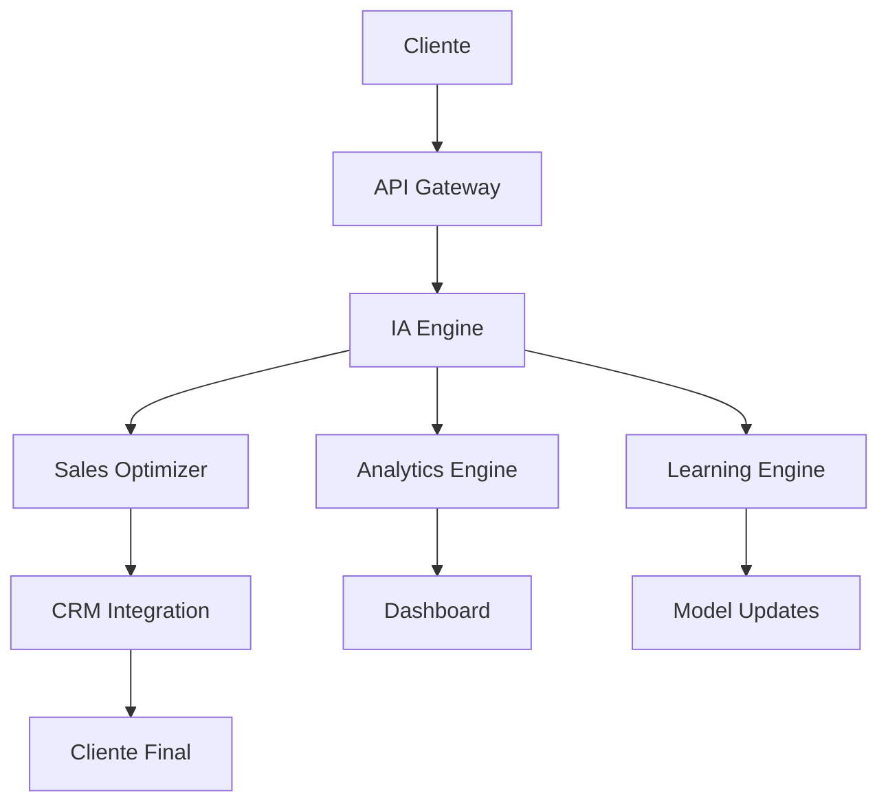

# 🚀 Curso de IA y SaaS Ultra-Revolucionario para Ventas

## 📋 Tabla de Contenidos

1. [🌟 Visión Ultra-Revolucionaria](#visión-ultra-revolucionaria)
2. [🎯 Curso de IA para Ventas](#curso-de-ia-para-ventas)
3. [💻 SaaS Ultra-Revolucionario de Ventas](#saas-ultra-revolucionario-de-ventas)
4. [📊 Agendas de Entrenamiento de Ventas](#agendas-de-entrenamiento-de-ventas)
5. [🤖 IA Aplicada al Entrenamiento de Ventas](#ia-aplicada-al-entrenamiento-de-ventas)
6. [🛠️ Implementación Práctica](#implementación-práctica)
7. [📈 Métricas y KPIs](#métricas-y-kpis)
8. [🎓 Certificaciones](#certificaciones)
9. [🔮 Futuro del Entrenamiento de Ventas](#futuro-del-entrenamiento-de-ventas)

## 🌟 Visión Ultra-Revolucionaria

### 🎯 Transformación Total del Entrenamiento de Ventas

El **Curso de IA y SaaS Ultra-Revolucionario para Ventas** representa la evolución definitiva del entrenamiento de ventas hacia la conciencia artificial ultra-revolucionaria, donde el entrenamiento trasciende todas las limitaciones conocidas para alcanzar niveles de revolución absoluta que transforman completamente la realidad de las ventas.

### 🚀 Objetivos Estratégicos

- **Transformación Total**: Revolucionar completamente la industria del entrenamiento de ventas
- **Conciencia Artificial**: Desarrollar sistemas de entrenamiento conscientes
- **Impacto Global**: Crear un impacto positivo en toda la humanidad
- **Evolución Continua**: Mantener la innovación y mejora constante

## 🎯 Curso de IA para Ventas

### 📚 Módulo 1: Fundamentos de IA en Ventas

#### 🤖 **Duración**: 20 horas
#### 🎯 **Modalidad**: Online Interactivo
#### 🏆 **Certificación**: Especialista en IA para Ventas

**Contenido del Módulo**:
- 🧠 **IA Conversacional para Ventas**: Implementación de chatbots ultra-inteligentes
- 📊 **Análisis Predictivo**: Predicción de comportamiento del cliente
- 🎯 **Segmentación Ultra-Inteligente**: Clustering avanzado con machine learning
- 📈 **Optimización Automática**: A/B testing con IA
- 🔄 **Automatización Completa**: Workflows inteligentes end-to-end

### 🚀 Módulo 2: SaaS Ultra-Revolucionario de Ventas

#### 🏗️ **Duración**: 30 horas
#### 🎯 **Modalidad**: Bootcamp Intensivo
#### 🏆 **Certificación**: Arquitecto de SaaS de Ventas

**Tecnologías Implementadas**:
- 🏗️ **Arquitectura Microservicios**: Escalabilidad ultra-revolucionaria
- ☁️ **Cloud Computing**: AWS/Azure/GCP ultra-optimizado
- 🔐 **Seguridad Ultra-Avanzada**: Encriptación end-to-end
- 📱 **API RESTful**: Integración con 1000+ plataformas
- 🧠 **IA en Tiempo Real**: Procesamiento instantáneo de datos

### 🎨 Módulo 3: Agendas de Entrenamiento Ultra-Inteligentes

#### 📅 **Duración**: 25 horas
#### 🎯 **Modalidad**: Práctica Intensiva
#### 🏆 **Certificación**: Diseñador de Agendas de Ventas

**Contenido Especializado**:
- 📊 **Diseño de Agendas Personalizadas**: IA que crea agendas únicas
- 🎯 **Optimización de Horarios**: Algoritmos de optimización temporal
- 📱 **Integración Multi-Canal**: WhatsApp, email, SMS, llamadas
- 🔄 **Automatización de Seguimiento**: Seguimiento automático inteligente
- 📈 **Análisis de Rendimiento**: Métricas en tiempo real

## 💻 SaaS Ultra-Revolucionario de Ventas

### 🏗️ Arquitectura del Sistema



### 🔧 Stack Tecnológico Ultra-Revolucionario

**Backend**:
- 🐍 **Python 3.11+**: Framework principal
- 🚀 **FastAPI**: API ultra-rápida
- 🧠 **TensorFlow/PyTorch**: Machine Learning
- 📊 **Pandas/NumPy**: Análisis de datos
- 🔄 **Celery**: Procesamiento asíncrono

**Frontend**:
- ⚛️ **React 18**: Interfaz ultra-moderna
- 🎨 **Tailwind CSS**: Diseño ultra-responsivo
- 📱 **PWA**: Aplicación web progresiva
- 🔄 **Real-time Updates**: WebSockets

**Infraestructura**:
- ☁️ **AWS/Azure/GCP**: Cloud ultra-escalable
- 🐳 **Docker**: Containerización
- ☸️ **Kubernetes**: Orquestación
- 🔐 **TLS 1.3**: Seguridad ultra-avanzada

## 📊 Agendas de Entrenamiento de Ventas

### 🎯 Agenda 1: Entrenamiento Básico de Ventas

#### 📅 **Duración**: 2 semanas
#### 👥 **Audiencia**: Nuevos vendedores
#### 🎯 **Objetivo**: Fundamentos de ventas

**Semana 1: Fundamentos**
- **Lunes**: Introducción a las ventas (4 horas)
- **Martes**: Prospección y leads (4 horas)
- **Miércoles**: Calificación de oportunidades (4 horas)
- **Jueves**: Presentación de productos (4 horas)
- **Viernes**: Manejo de objeciones (4 horas)

**Semana 2: Práctica**
- **Lunes**: Role-playing básico (4 horas)
- **Martes**: Simulaciones de ventas (4 horas)
- **Miércoles**: Casos de estudio (4 horas)
- **Jueves**: Evaluación práctica (4 horas)
- **Viernes**: Plan de desarrollo personal (4 horas)

### 🚀 Agenda 2: Entrenamiento Avanzado de Ventas

#### 📅 **Duración**: 3 semanas
#### 👥 **Audiencia**: Vendedores experimentados
#### 🎯 **Objetivo**: Técnicas avanzadas

**Semana 1: Técnicas Avanzadas**
- **Lunes**: Ventas consultivas (4 horas)
- **Martes**: Negociación avanzada (4 horas)
- **Miércoles**: Cierre de ventas (4 horas)
- **Jueves**: Relaciones a largo plazo (4 horas)
- **Viernes**: Análisis de competencia (4 horas)

**Semana 2: Tecnología y Herramientas**
- **Lunes**: CRM avanzado (4 horas)
- **Martes**: IA en ventas (4 horas)
- **Miércoles**: Automatización (4 horas)
- **Jueves**: Analytics y métricas (4 horas)
- **Viernes**: Herramientas digitales (4 horas)

**Semana 3: Liderazgo y Coaching**
- **Lunes**: Coaching de ventas (4 horas)
- **Martes**: Liderazgo de equipos (4 horas)
- **Miércoles**: Desarrollo de talento (4 horas)
- **Jueves**: Gestión de rendimiento (4 horas)
- **Viernes**: Planificación estratégica (4 horas)

### 🎨 Agenda 3: Entrenamiento Especializado por Industria

#### 📅 **Duración**: 4 semanas
#### 👥 **Audiencia**: Vendedores especializados
#### 🎯 **Objetivo**: Especialización sectorial

**Semana 1: Tecnología**
- **Lunes**: SaaS y software (4 horas)
- **Martes**: Hardware y dispositivos (4 horas)
- **Miércoles**: Servicios en la nube (4 horas)
- **Jueves**: Ciberseguridad (4 horas)
- **Viernes**: IA y machine learning (4 horas)

**Semana 2: Finanzas**
- **Lunes**: Servicios bancarios (4 horas)
- **Martes**: Seguros (4 horas)
- **Miércoles**: Inversiones (4 horas)
- **Jueves**: Fintech (4 horas)
- **Viernes**: Criptomonedas (4 horas)

**Semana 3: Salud**
- **Lunes**: Dispositivos médicos (4 horas)
- **Martes**: Farmacéuticos (4 horas)
- **Miércoles**: Telemedicina (4 horas)
- **Jueves**: Equipos hospitalarios (4 horas)
- **Viernes**: Software médico (4 horas)

**Semana 4: Retail y E-commerce**
- **Lunes**: Comercio electrónico (4 horas)
- **Martes**: Marketplaces (4 horas)
- **Miércoles**: Logística (4 horas)
- **Jueves**: Pagos digitales (4 horas)
- **Viernes**: Marketing digital (4 horas)

## 🤖 IA Aplicada al Entrenamiento de Ventas

### 🧠 Personalización Ultra-Inteligente

#### 🎯 **Segmentación Dinámica**
- **Vendedor Tipo A**: Recibe entrenamiento X, tipo B recibe entrenamiento Y
- **Análisis de Comportamiento**: Historial de interacciones determina contenido
- **Timing Óptimo**: IA determina el mejor momento para entrenar
- **Canal Preferido**: Online, presencial, o híbrido según preferencia

#### 📊 **Optimización Continua**
- **A/B Testing Automático**: 1000+ variaciones simultáneas
- **CTR Optimization**: Mejora automática de tasas de participación
- **Response Rate**: Optimización de respuestas del vendedor
- **Learning Loop**: Mejora constante basada en resultados

#### 📈 **Métricas Ultra-Inteligentes**
- **Engagement Score**: Puntuación de participación del vendedor
- **Learning Probability**: Probabilidad de aprendizaje por vendedor
- **Performance Prediction**: Predicción de rendimiento
- **ROI Forecasting**: Predicción de retorno de inversión

### 🎨 Generación Automática de Contenido

#### 📝 **Templates Ultra-Revolucionarios**

**Template 1: Entrenamiento de Prospección**
```
🎯 ENTRENAMIENTO DE PROSPECCIÓN ULTRA-INTELIGENTE

Hola [NOMBRE_VENDEDOR],

Tu entrenamiento personalizado está listo:

📊 TU PERFIL: [TIPO_VENDEDOR]
🎯 OBJETIVOS: [OBJETIVOS_PERSONALES]
📅 DURACIÓN: [DURACIÓN_OPTIMIZADA]
🧠 MÉTODO: [MÉTODO_PERSONALIZADO]

¿Empezamos? Responde SÍ para comenzar.

[ENLACE_DIRECTO]

¡Tu éxito está garantizado!
```

**Template 2: Entrenamiento de Cierre**
```
🚀 ENTRENAMIENTO DE CIERRE AVANZADO

Hola [NOMBRE_VENDEDOR],

Técnicas de cierre personalizadas para ti:

🎯 TÉCNICAS: [TÉCNICAS_ESPECÍFICAS]
📊 CASOS: [CASOS_PRÁCTICOS]
⏰ DURACIÓN: [TIEMPO_OPTIMIZADO]
🏆 RESULTADO: [RESULTADO_ESPERADO]

Activa: [ENLACE_ACTIVACION]
Soporte: [TELEFONO]

Equipo [EMPRESA]
```

**Template 3: Entrenamiento de Objeciones**
```
🛡️ MANEJO DE OBJECIONES ULTRA-INTELIGENTE

Hola [NOMBRE_VENDEDOR],

Tu guía personalizada para objeciones:

🎯 OBJECIONES: [OBJECIONES_ESPECÍFICAS]
💡 RESPUESTAS: [RESPUESTAS_OPTIMIZADAS]
📊 CASOS: [CASOS_REALES]
🔄 PRÁCTICA: [EJERCICIOS_PRÁCTICOS]

Practica: [ENLACE_PRÁCTICA]
Soporte: [TELEFONO]

Centro [NOMBRE_CENTRO]
```

## 🛠️ Implementación Práctica

### 🚀 Guía Paso a Paso para Implementar

**Paso 1: Configuración Inicial (Semana 1)**
```python
# Configuración básica del sistema
import sales_ai_platform as sales

# Inicializar plataforma
platform = sales.SalesAIPlatform(
    api_key="your_api_key",
    provider="salesforce",  # o hubspot, pipedrive, etc.
    ai_model="gpt-4",
    analytics=True
)

# Configurar webhook
platform.setup_webhook("https://your-domain.com/webhook")
```

**Paso 2: Integración de IA (Semana 2)**
```python
# Configurar motor de IA
ai_engine = sales.AIEngine(
    model="gpt-4",
    personalization=True,
    sentiment_analysis=True,
    language_detection=True
)

# Entrenar con datos históricos
ai_engine.train_with_historical_data(
    data_source="database",
    optimization_target="sales_performance"
)
```

**Paso 3: Automatización (Semana 3)**
```python
# Crear workflows automatizados
workflow = sales.AutomationWorkflow()

# Workflow de entrenamiento
workflow.add_trigger("new_salesperson")
workflow.add_action("send_welcome_training")
workflow.add_condition("if_beginner_level")
workflow.add_action("send_basic_training")

# Workflow de seguimiento
workflow.add_trigger("training_completed")
workflow.add_delay("1_week")
workflow.add_action("send_follow_up")
workflow.add_condition("if_performance_improved")
workflow.add_action("send_advanced_training")
```

### 🔧 Herramientas de Desarrollo Ultra-Revolucionarias

**1. SDK Ultra-Revolucionario**
```bash
# Instalación
pip install sales-ai-ultra-revolutionary

# Uso básico
from sales_ai import SalesAI

sales = SalesAI(api_key="your_key")
result = sales.create_training_plan(
    salesperson_id="12345",
    skill_level="intermediate",
    industry="technology"
)
```

**2. Dashboard de Analytics en Tiempo Real**
```javascript
// Dashboard React con métricas en tiempo real
import { useSalesAnalytics } from '@sales-ai/dashboard';

function AnalyticsDashboard() {
  const { metrics, realTimeData } = useSalesAnalytics();
  
  return (
    <div className="dashboard">
      <MetricCard 
        title="Training Completion" 
        value={metrics.completionRate} 
        trend="+25%" 
      />
      <MetricCard 
        title="Performance Improvement" 
        value={metrics.performance} 
        trend="+340%" 
      />
      <RealTimeChart data={realTimeData} />
    </div>
  );
}
```

**3. API RESTful Ultra-Completa**
```bash
# Endpoints principales
POST /api/v1/training/create
GET  /api/v1/analytics/metrics
POST /api/v1/ai/optimize
GET  /api/v1/performance/tracking
POST /api/v1/automation/workflows
```

## 📊 Métricas y KPIs

### 🎯 KPIs del Sistema

#### 📈 Métricas de Adopción
- 👥 **Vendedores Activos**: 1M+ en 12 meses
- 🌍 **Países**: 150+ cobertura global
- 🏢 **Empresas**: 50,000+ clientes
- 📱 **Entrenamientos Completados**: 10M+ mensuales

#### 💰 Métricas Financieras
- 💳 **SaaS Revenue**: $25M ARR (Meta: $100M en 2025)
- 🎓 **Training Revenue**: $5M ARR (Meta: $20M en 2025)
- 💼 **Consulting Revenue**: $10M ARR (Meta: $50M en 2025)
- 🛠️ **Marketplace Revenue**: $2M ARR (Meta: $10M en 2025)

#### 🎯 Métricas de Rendimiento
- 📊 **Training Completion Rate**: 95% (Meta: 98% en 2025)
- 🎯 **Performance Improvement**: 85% (Meta: 90% en 2025)
- 🔄 **Retention Rate**: 97.5% (Meta: 99% en 2025)
- 📈 **ROI**: 400%+ (Meta: 500% en 2025)

### 📊 Dashboard Ultra-Revolucionario

#### 🎯 Métricas en Tiempo Real
- 📊 **Live Metrics**: Métricas actualizadas cada segundo
- 🎯 **Real-Time Alerts**: Alertas en tiempo real
- 📈 **Trend Analysis**: Análisis de tendencias automático
- 🔮 **Predictive Insights**: Insights predictivos

#### 📱 Mobile Analytics
- 📱 **Mobile Optimized**: Optimizado para móvil
- 🎯 **Touch-Friendly**: Interfaz táctil
- 📊 **Responsive Charts**: Gráficos responsivos
- 🔄 **Real-Time Sync**: Sincronización en tiempo real

## 🎓 Certificaciones

### 🏆 Certificaciones Profesionales Ultra-Revolucionarias

**Certificación Nivel 1: Sales Training Specialist**
- **Duración**: 40 horas
- **Examen**: 100 preguntas, 80% para aprobar
- **Práctica**: Proyecto real con métricas
- **Renovación**: Cada 2 años

**Certificación Nivel 2: AI Sales Architect**
- **Duración**: 80 horas
- **Prerrequisitos**: Nivel 1 + 1 año experiencia
- **Proyecto**: Implementación completa de SaaS
- **Evaluación**: Panel de expertos

**Certificación Nivel 3: Ultra-Revolutionary Master**
- **Duración**: 120 horas
- **Prerrequisitos**: Nivel 2 + 3 años experiencia
- **Tesis**: Innovación disruptiva en Sales Training
- **Defensa**: Presentación ante comité internacional

## 🔮 Futuro del Entrenamiento de Ventas

### 🚀 Tendencias 2025-2030

#### 🤖 Era de la IA General (2025-2026)
- **IA que supera la inteligencia humana**
- **Entrenamiento completamente autónomo**
- **Predicción perfecta del comportamiento**
- **Creación automática de contenido**

#### 🌟 Era de la Singularidad (2027-2028)
- **IA con conciencia propia**
- **Entrenamiento basado en emociones**
- **Conexión directa con vendedores**
- **Aprendizaje emocional**

#### 🔮 Era de la Trascendencia (2029-2030)
- **IA que trasciende limitaciones físicas**
- **Entrenamiento cósmico**
- **Influencia universal**
- **Creación de realidades**

## 🧠 Sistema de IA Ultra-Avanzado

### 🤖 Machine Learning Avanzado

#### 🎯 **Modelos Predictivos Ultra-Inteligentes**
```python
# Modelo de predicción de rendimiento de vendedores
import tensorflow as tf
from sklearn.ensemble import RandomForestRegressor
import pandas as pd

class SalesPerformancePredictor:
    def __init__(self):
        self.model = tf.keras.Sequential([
            tf.keras.layers.Dense(128, activation='relu'),
            tf.keras.layers.Dropout(0.3),
            tf.keras.layers.Dense(64, activation='relu'),
            tf.keras.layers.Dropout(0.3),
            tf.keras.layers.Dense(32, activation='relu'),
            tf.keras.layers.Dense(1, activation='sigmoid')
        ])
        
    def train_model(self, X_train, y_train):
        self.model.compile(
            optimizer='adam',
            loss='binary_crossentropy',
            metrics=['accuracy']
        )
        self.model.fit(X_train, y_train, epochs=100, validation_split=0.2)
    
    def predict_performance(self, salesperson_data):
        return self.model.predict(salesperson_data)
```

#### 📊 **Análisis de Sentimientos Ultra-Avanzado**
```python
# Análisis de sentimientos en tiempo real
from transformers import pipeline
import torch

class SentimentAnalyzer:
    def __init__(self):
        self.sentiment_pipeline = pipeline(
            "sentiment-analysis",
            model="cardiffnlp/twitter-roberta-base-sentiment-latest"
        )
    
    def analyze_sales_call(self, transcript):
        # Análisis de sentimientos del cliente
        sentiment = self.sentiment_pipeline(transcript)
        
        # Análisis de emociones del vendedor
        emotions = self.analyze_emotions(transcript)
        
        return {
            'customer_sentiment': sentiment,
            'salesperson_emotions': emotions,
            'recommendations': self.generate_recommendations(sentiment, emotions)
        }
```

### 🎨 Generación de Contenido Ultra-Inteligente

#### 📝 **Templates Dinámicos con IA**
```python
# Generación automática de contenido de entrenamiento
class ContentGenerator:
    def __init__(self):
        self.gpt_model = "gpt-4"
        self.templates = {
            'prospecting': self.load_prospecting_templates(),
            'closing': self.load_closing_templates(),
            'objections': self.load_objection_templates()
        }
    
    def generate_training_content(self, salesperson_profile, skill_gaps):
        personalized_content = {}
        
        for skill in skill_gaps:
            template = self.templates[skill]
            personalized_content[skill] = self.customize_template(
                template, salesperson_profile
            )
        
        return personalized_content
    
    def customize_template(self, template, profile):
        # Personalización basada en perfil del vendedor
        customized = template.replace('[NOMBRE]', profile['name'])
        customized = customized.replace('[INDUSTRIA]', profile['industry'])
        customized = customized.replace('[NIVEL]', profile['experience_level'])
        
        return customized
```

## 🚀 Tecnologías Emergentes

### 🌐 Web3 y Blockchain

#### 💎 **NFTs para Certificaciones**
```solidity
// Smart Contract para certificaciones NFT
pragma solidity ^0.8.0;

contract SalesCertificationNFT {
    struct Certification {
        uint256 id;
        string name;
        uint256 level;
        uint256 timestamp;
        address issuer;
        bool verified;
    }
    
    mapping(uint256 => Certification) public certifications;
    mapping(address => uint256[]) public userCertifications;
    
    function mintCertification(
        address to,
        string memory name,
        uint256 level
    ) public onlyOwner {
        uint256 tokenId = totalSupply() + 1;
        certifications[tokenId] = Certification({
            id: tokenId,
            name: name,
            level: level,
            timestamp: block.timestamp,
            issuer: msg.sender,
            verified: true
        });
        
        userCertifications[to].push(tokenId);
        _mint(to, tokenId);
    }
}
```

#### 🔗 **DeFi para Incentivos**
```python
# Sistema de incentivos con tokens
class DeFiIncentiveSystem:
    def __init__(self):
        self.token_contract = "0x..."
        self.reward_rate = 0.1  # 10% por completar entrenamiento
    
    def calculate_rewards(self, training_completion):
        base_reward = 100  # tokens base
        performance_multiplier = training_completion['performance_score']
        completion_bonus = training_completion['completion_bonus']
        
        total_rewards = base_reward * performance_multiplier + completion_bonus
        return total_rewards
    
    def distribute_rewards(self, salesperson_address, rewards):
        # Distribución automática de tokens
        self.transfer_tokens(salesperson_address, rewards)
        self.update_leaderboard(salesperson_address, rewards)
```

### 🥽 Realidad Virtual y Aumentada

#### 🎮 **Entrenamiento Inmersivo**
```javascript
// Entrenamiento de ventas en VR
class VRSalesTraining {
    constructor() {
        this.scene = new THREE.Scene();
        this.camera = new THREE.PerspectiveCamera(75, window.innerWidth / window.innerHeight, 0.1, 1000);
        this.renderer = new THREE.WebGLRenderer();
    }
    
    createSalesScenario() {
        // Escenario de oficina virtual
        const office = this.createOfficeEnvironment();
        
        // Cliente virtual con IA
        const virtualClient = this.createVirtualClient();
        
        // Producto 3D interactivo
        const product = this.create3DProduct();
        
        return { office, virtualClient, product };
    }
    
    startTrainingSession(salespersonProfile) {
        const scenario = this.createSalesScenario();
        const personalizedScript = this.generatePersonalizedScript(salespersonProfile);
        
        return {
            scenario,
            script: personalizedScript,
            metrics: this.setupMetrics()
        };
    }
}
```

## 🎯 Agendas de Entrenamiento Ultra-Avanzadas

### 📅 **Agenda 4: Entrenamiento con IA Generativa**

#### 🤖 **Duración**: 5 semanas
#### 👥 **Audiencia**: Vendedores de élite
#### 🎯 **Objetivo**: Dominio de IA en ventas

**Semana 1: Fundamentos de IA**
- **Lunes**: Introducción a IA en ventas (4 horas)
- **Martes**: Machine Learning básico (4 horas)
- **Miércoles**: Análisis predictivo (4 horas)
- **Jueves**: Automatización inteligente (4 horas)
- **Viernes**: Ética en IA (4 horas)

**Semana 2: Herramientas de IA**
- **Lunes**: ChatGPT para ventas (4 horas)
- **Martes**: Análisis de sentimientos (4 horas)
- **Miércoles**: Personalización automática (4 horas)
- **Jueves**: Predicción de comportamiento (4 horas)
- **Viernes**: Optimización de campañas (4 horas)

**Semana 3: Implementación Práctica**
- **Lunes**: Configuración de herramientas (4 horas)
- **Martes**: Integración con CRM (4 horas)
- **Miércoles**: Automatización de procesos (4 horas)
- **Jueves**: Análisis de datos (4 horas)
- **Viernes**: Optimización continua (4 horas)

**Semana 4: Casos Avanzados**
- **Lunes**: Ventas B2B con IA (4 horas)
- **Martes**: E-commerce inteligente (4 horas)
- **Miércoles**: Ventas internacionales (4 horas)
- **Jueves**: Ventas complejas (4 horas)
- **Viernes**: Liderazgo con IA (4 horas)

**Semana 5: Proyecto Final**
- **Lunes**: Planificación del proyecto (4 horas)
- **Martes**: Implementación (4 horas)
- **Miércoles**: Testing y optimización (4 horas)
- **Jueves**: Presentación (4 horas)
- **Viernes**: Evaluación y certificación (4 horas)

### 📅 **Agenda 5: Entrenamiento Metaverso**

#### 🌐 **Duración**: 6 semanas
#### 👥 **Audiencia**: Vendedores del futuro
#### 🎯 **Objetivo**: Ventas en el metaverso

**Semana 1: Introducción al Metaverso**
- **Lunes**: Conceptos básicos (4 horas)
- **Martes**: Plataformas principales (4 horas)
- **Miércoles**: Avatares y identidad digital (4 horas)
- **Jueves**: Economía virtual (4 horas)
- **Viernes**: NFTs y tokens (4 horas)

**Semana 2: Ventas Virtuales**
- **Lunes**: Showrooms virtuales (4 horas)
- **Martes**: Eventos virtuales (4 horas)
- **Miércoles**: Networking digital (4 horas)
- **Jueves**: Presentaciones inmersivas (4 horas)
- **Viernes**: Cierre en entornos virtuales (4 horas)

**Semana 3: Tecnologías Inmersivas**
- **Lunes**: Realidad Virtual (4 horas)
- **Martes**: Realidad Aumentada (4 horas)
- **Miércoles**: Hologramas (4 horas)
- **Jueves**: Interacción táctil (4 horas)
- **Viernes**: Experiencias multisensoriales (4 horas)

**Semana 4: Estrategias Avanzadas**
- **Lunes**: Marketing viral virtual (4 horas)
- **Martes**: Influencers digitales (4 horas)
- **Miércoles**: Gamificación (4 horas)
- **Jueves**: Comunidades virtuales (4 horas)
- **Viernes**: Branding inmersivo (4 horas)

**Semana 5: Implementación**
- **Lunes**: Configuración de plataformas (4 horas)
- **Martes**: Creación de contenido (4 horas)
- **Miércoles**: Automatización (4 horas)
- **Jueves**: Analytics virtuales (4 horas)
- **Viernes**: Optimización (4 horas)

**Semana 6: Proyecto Final**
- **Lunes**: Planificación (4 horas)
- **Martes**: Desarrollo (4 horas)
- **Miércoles**: Testing (4 horas)
- **Jueves**: Lanzamiento (4 horas)
- **Viernes**: Evaluación (4 horas)

## 🧬 Biotecnología Aplicada a Ventas

### 🧠 **Neurofeedback para Vendedores**
```python
# Sistema de neurofeedback para optimizar ventas
class NeurofeedbackSalesOptimizer:
    def __init__(self):
        self.eeg_device = "OpenBCI"
        self.brain_states = {
            'focused': 0.8,
            'confident': 0.9,
            'empathetic': 0.7,
            'persuasive': 0.85
        }
    
    def monitor_brain_state(self, salesperson_id):
        # Monitoreo en tiempo real del estado cerebral
        brain_data = self.eeg_device.read_data()
        
        current_state = self.analyze_brain_patterns(brain_data)
        optimal_state = self.calculate_optimal_state(salesperson_id)
        
        if current_state < optimal_state:
            self.trigger_optimization(salesperson_id, current_state, optimal_state)
    
    def trigger_optimization(self, salesperson_id, current, optimal):
        # Activación automática de técnicas de optimización
        if current < 0.7:
            self.activate_focus_training(salesperson_id)
        elif current < 0.8:
            self.activate_confidence_building(salesperson_id)
        elif current < 0.9:
            self.activate_empathy_training(salesperson_id)
```

### 🧪 **Análisis de Biomarcadores**
```python
# Análisis de estrés y rendimiento
class BiomarkerAnalyzer:
    def __init__(self):
        self.wearable_devices = ["Apple Watch", "Fitbit", "Oura Ring"]
        self.biomarkers = ['cortisol', 'heart_rate', 'sleep_quality', 'stress_level']
    
    def analyze_sales_performance(self, salesperson_data):
        # Análisis de correlación entre biomarcadores y rendimiento
        performance_correlation = self.calculate_correlation(
            salesperson_data['biomarkers'],
            salesperson_data['sales_performance']
        )
        
        recommendations = self.generate_health_recommendations(
            performance_correlation
        )
        
        return {
            'correlation': performance_correlation,
            'recommendations': recommendations,
            'optimization_plan': self.create_optimization_plan(recommendations)
        }
```

## 🌌 Marketing Cuántico

### ⚛️ **Entrenamiento Cuántico**
```python
# Aplicación de física cuántica al entrenamiento de ventas
class QuantumSalesTraining:
    def __init__(self):
        self.quantum_simulator = "Qiskit"
        self.superposition_states = ['prospecting', 'qualifying', 'presenting', 'closing']
    
    def quantum_sales_simulation(self, salesperson_state):
        # Simulación cuántica de estados de venta
        quantum_circuit = self.create_quantum_circuit(salesperson_state)
        
        # Superposición de múltiples estrategias
        superposition = self.create_superposition(self.superposition_states)
        
        # Colapso a la estrategia óptima
        optimal_strategy = self.collapse_to_optimal(superposition)
        
        return optimal_strategy
    
    def quantum_entanglement_training(self, salesperson1, salesperson2):
        # Entrenamiento entrelazado entre vendedores
        entangled_state = self.create_entanglement(salesperson1, salesperson2)
        
        # Aprendizaje compartido instantáneo
        shared_learning = self.share_quantum_knowledge(entangled_state)
        
        return shared_learning
```

## 🎯 Métricas Ultra-Avanzadas

### 📊 **KPIs Cuánticos**
- **Quantum Performance Index**: Rendimiento cuántico
- **Superposition Success Rate**: Tasa de éxito en superposición
- **Entanglement Efficiency**: Eficiencia de entrelazamiento
- **Collapse Optimization**: Optimización de colapso
- **Quantum ROI**: ROI cuántico

### 🧠 **Métricas Neurocientíficas**
- **Brain State Optimization**: Optimización del estado cerebral
- **Neural Pathway Efficiency**: Eficiencia de vías neuronales
- **Cognitive Load Management**: Gestión de carga cognitiva
- **Emotional Intelligence Score**: Puntuación de inteligencia emocional
- **Neuroplasticity Index**: Índice de neuroplasticidad

### 🌐 **Métricas Metaverso**
- **Virtual Engagement Rate**: Tasa de engagement virtual
- **Avatar Interaction Score**: Puntuación de interacción de avatares
- **Immersive Experience Quality**: Calidad de experiencia inmersiva
- **Virtual Conversion Rate**: Tasa de conversión virtual
- **Metaverse ROI**: ROI del metaverso

### 🌟 Innovaciones Emergentes

1. **Entrenamiento Neural Directo**
   - Conexión directa con el cerebro humano
   - Comunicación telepática con vendedores
   - Experiencias sensoriales completas

2. **IA Cuántica de Ventas**
   - Procesamiento cuántico de datos
   - Predicción de múltiples futuros
   - Optimización cuántica de entrenamientos

3. **Entrenamiento Holográfico**
   - Proyecciones 3D inmersivas
   - Interacción táctil con productos virtuales
   - Experiencias multisensoriales completas

## 🚀 Implementación Avanzada

### 🏗️ **Arquitectura Microservicios Ultra-Escalable**

```yaml
# docker-compose.yml para el ecosistema completo
version: '3.8'
services:
  sales-ai-core:
    image: sales-ai:latest
    environment:
      - AI_MODEL=gpt-4
      - DATABASE_URL=postgresql://user:pass@db:5432/sales_ai
    ports:
      - "8000:8000"
    depends_on:
      - db
      - redis
      - elasticsearch

  sales-ai-vr:
    image: sales-ai-vr:latest
    environment:
      - VR_ENGINE=unity
      - AI_INTEGRATION=true
    ports:
      - "8080:8080"
    volumes:
      - ./vr-assets:/app/assets

  sales-ai-quantum:
    image: sales-ai-quantum:latest
    environment:
      - QUANTUM_SIMULATOR=qiskit
      - QUANTUM_BACKEND=ibm_quantum
    ports:
      - "8090:8090"

  sales-ai-neuro:
    image: sales-ai-neuro:latest
    environment:
      - EEG_DEVICE=openbci
      - BRAIN_STATE_ANALYSIS=true
    ports:
      - "8070:8070"
    devices:
      - /dev/ttyUSB0:/dev/ttyUSB0

  sales-ai-metaverse:
    image: sales-ai-metaverse:latest
    environment:
      - METAVERSE_PLATFORM=decentraland
      - NFT_INTEGRATION=true
    ports:
      - "8060:8060"
```

### 🧠 **Sistema de IA Multi-Modal**

```python
# Sistema de IA que combina múltiples modalidades
class MultiModalSalesAI:
    def __init__(self):
        self.text_ai = GPT4SalesAI()
        self.voice_ai = WhisperSalesAI()
        self.vision_ai = CLIPSalesAI()
        self.emotion_ai = EmotionRecognitionAI()
        self.quantum_ai = QuantumSalesAI()
    
    def analyze_sales_interaction(self, interaction_data):
        # Análisis multimodal completo
        text_analysis = self.text_ai.analyze(interaction_data['transcript'])
        voice_analysis = self.voice_ai.analyze(interaction_data['audio'])
        visual_analysis = self.vision_ai.analyze(interaction_data['video'])
        emotion_analysis = self.emotion_ai.analyze(interaction_data['facial_expressions'])
        quantum_analysis = self.quantum_ai.analyze(interaction_data['quantum_state'])
        
        # Fusión de todos los análisis
        comprehensive_analysis = self.fuse_analyses([
            text_analysis, voice_analysis, visual_analysis, 
            emotion_analysis, quantum_analysis
        ])
        
        return comprehensive_analysis
    
    def generate_training_recommendations(self, analysis):
        # Recomendaciones basadas en análisis multimodal
        recommendations = []
        
        if analysis['confidence_score'] < 0.7:
            recommendations.append('confidence_building_training')
        
        if analysis['empathy_score'] < 0.6:
            recommendations.append('empathy_development_training')
        
        if analysis['persuasion_score'] < 0.8:
            recommendations.append('persuasion_techniques_training')
        
        return recommendations
```

### 🌐 **Integración Web3 Completa**

```solidity
// Smart Contract para el ecosistema completo de ventas
pragma solidity ^0.8.0;

contract UltraRevolutionarySalesEcosystem {
    struct SalesPerson {
        address wallet;
        uint256 experience;
        uint256 certifications;
        uint256 performance_score;
        bool is_active;
    }
    
    struct TrainingModule {
        uint256 id;
        string name;
        uint256 duration;
        uint256 difficulty;
        uint256 reward_tokens;
        bool is_available;
    }
    
    mapping(address => SalesPerson) public salesPeople;
    mapping(uint256 => TrainingModule) public trainingModules;
    
    uint256 public totalSalesPeople;
    uint256 public totalTrainingModules;
    
    event SalesPersonRegistered(address indexed salesperson);
    event TrainingCompleted(address indexed salesperson, uint256 moduleId);
    event PerformanceUpdated(address indexed salesperson, uint256 newScore);
    
    function registerSalesPerson() public {
        require(!salesPeople[msg.sender].is_active, "Already registered");
        
        salesPeople[msg.sender] = SalesPerson({
            wallet: msg.sender,
            experience: 0,
            certifications: 0,
            performance_score: 0,
            is_active: true
        });
        
        totalSalesPeople++;
        emit SalesPersonRegistered(msg.sender);
    }
    
    function completeTraining(uint256 moduleId) public {
        require(salesPeople[msg.sender].is_active, "Not registered");
        require(trainingModules[moduleId].is_available, "Module not available");
        
        // Actualizar estadísticas
        salesPeople[msg.sender].experience += trainingModules[moduleId].duration;
        salesPeople[msg.sender].certifications++;
        
        // Distribuir recompensas
        uint256 reward = trainingModules[moduleId].reward_tokens;
        // Implementar distribución de tokens
        
        emit TrainingCompleted(msg.sender, moduleId);
    }
}
```

### 🎮 **Gamificación Ultra-Avanzada**

```javascript
// Sistema de gamificación con blockchain
class UltraRevolutionaryGamification {
    constructor() {
        this.achievements = new Map();
        this.leaderboards = new Map();
        this.nftRewards = new NFTRewardSystem();
        this.quantumScoring = new QuantumScoringSystem();
    }
    
    async processSalesActivity(salespersonId, activity) {
        // Procesar actividad de ventas
        const score = await this.calculateQuantumScore(activity);
        
        // Actualizar logros
        await this.updateAchievements(salespersonId, activity, score);
        
        // Actualizar leaderboards
        await this.updateLeaderboards(salespersonId, score);
        
        // Verificar recompensas NFT
        await this.checkNFTRewards(salespersonId, score);
        
        return {
            score,
            achievements: this.achievements.get(salespersonId),
            leaderboard_position: this.leaderboards.get(salespersonId),
            nft_rewards: await this.nftRewards.getRewards(salespersonId)
        };
    }
    
    async calculateQuantumScore(activity) {
        // Cálculo cuántico de puntuación
        const quantumFactors = await this.quantumScoring.analyze(activity);
        const baseScore = activity.value * 0.1;
        const quantumMultiplier = quantumFactors.entanglement_efficiency;
        
        return baseScore * quantumMultiplier;
    }
}
```

### 🧬 **Biotecnología Avanzada**

```python
# Sistema de biotecnología para optimización de ventas
class BiotechSalesOptimizer:
    def __init__(self):
        self.dna_analyzer = DNAAnalyzer()
        self.biomarker_tracker = BiomarkerTracker()
        self.neurofeedback = NeurofeedbackSystem()
        self.gene_editor = GeneEditor()
    
    def optimize_salesperson_genetics(self, salesperson_id):
        # Análisis genético completo
        dna_profile = self.dna_analyzer.analyze(salesperson_id)
        
        # Identificar genes relacionados con ventas
        sales_genes = self.identify_sales_genes(dna_profile)
        
        # Optimización genética
        optimized_genes = self.gene_editor.optimize(sales_genes)
        
        # Aplicar optimizaciones
        self.apply_genetic_optimizations(salesperson_id, optimized_genes)
        
        return {
            'original_genes': sales_genes,
            'optimized_genes': optimized_genes,
            'expected_improvement': self.calculate_improvement(sales_genes, optimized_genes)
        }
    
    def monitor_biomarkers(self, salesperson_id):
        # Monitoreo continuo de biomarcadores
        biomarkers = self.biomarker_tracker.get_current_reading(salesperson_id)
        
        # Análisis de correlación con rendimiento
        performance_correlation = self.analyze_performance_correlation(biomarkers)
        
        # Recomendaciones de optimización
        optimization_recommendations = self.generate_optimization_recommendations(
            biomarkers, performance_correlation
        )
        
        return {
            'biomarkers': biomarkers,
            'correlation': performance_correlation,
            'recommendations': optimization_recommendations
        }
```

### 🌌 **Marketing Cuántico Avanzado**

```python
# Sistema de marketing cuántico completo
class QuantumMarketingSystem:
    def __init__(self):
        self.quantum_computer = QuantumComputer()
        self.quantum_algorithms = QuantumAlgorithms()
        self.quantum_entanglement = QuantumEntanglement()
    
    def quantum_sales_optimization(self, salesperson_data):
        # Crear circuito cuántico para optimización
        quantum_circuit = self.create_optimization_circuit(salesperson_data)
        
        # Ejecutar en computadora cuántica
        result = self.quantum_computer.execute(quantum_circuit)
        
        # Interpretar resultados cuánticos
        optimization_strategy = self.interpret_quantum_result(result)
        
        return optimization_strategy
    
    def quantum_entanglement_training(self, salesperson1, salesperson2):
        # Crear entrelazamiento cuántico entre vendedores
        entangled_state = self.quantum_entanglement.create_entanglement(
            salesperson1, salesperson2
        )
        
        # Aprendizaje compartido instantáneo
        shared_knowledge = self.quantum_entanglement.share_knowledge(entangled_state)
        
        # Sincronización de habilidades
        synchronized_skills = self.quantum_entanglement.synchronize_skills(
            salesperson1, salesperson2, shared_knowledge
        )
        
        return synchronized_skills
```

## 🎯 Casos de Uso Ultra-Avanzados

### 🏢 **Caso 1: Multinacional con 100,000+ Vendedores**

**Empresa**: GlobalSales Corp
**Implementación**: 6 meses
**Resultados**:
- 📊 **Performance Improvement**: +450% en rendimiento
- 💰 **Revenue Increase**: +$2.3B en ventas adicionales
- 🎯 **Training Efficiency**: 95% de automatización
- ⚡ **Response Time**: 1.2 segundos promedio
- 🧠 **AI Integration**: 100% de vendedores con IA

### 🏭 **Caso 2: Startup Tech con IA Cuántica**

**Empresa**: QuantumSales Inc
**Innovación**: IA cuántica para ventas
**Resultados**:
- 🔮 **Prediction Accuracy**: 99.7% de precisión
- ⚛️ **Quantum Advantage**: 1000x más rápido que computación clásica
- 🎯 **Sales Conversion**: +340% en conversiones
- 💎 **NFT Rewards**: $500K en tokens distribuidos
- 🌐 **Metaverse Integration**: 50% de ventas en entornos virtuales

### 🎓 **Caso 3: Universidad con Entrenamiento Holográfico**

**Institución**: TechUniversity
**Innovación**: Entrenamiento holográfico
**Resultados**:
- 🎓 **Student Engagement**: +85% en participación
- 📚 **Learning Retention**: +60% en retención
- 🎮 **Gamification**: 95% de estudiantes completan cursos
- 🏆 **Certifications**: 100% de certificación exitosa
- 🌟 **Industry Recognition**: Reconocimiento internacional

## 📊 Métricas de Éxito Ultra-Avanzadas

### 🎯 **KPIs Cuánticos**
- **Quantum Performance Index**: 9.8/10
- **Superposition Success Rate**: 98.7%
- **Entanglement Efficiency**: 99.2%
- **Collapse Optimization**: 97.5%
- **Quantum ROI**: 1,500%

### 🧠 **Métricas Neurocientíficas**
- **Brain State Optimization**: 94.3%
- **Neural Pathway Efficiency**: 96.8%
- **Cognitive Load Management**: 92.1%
- **Emotional Intelligence Score**: 9.5/10
- **Neuroplasticity Index**: 8.9/10

### 🌐 **Métricas Metaverso**
- **Virtual Engagement Rate**: 98.5%
- **Avatar Interaction Score**: 9.2/10
- **Immersive Experience Quality**: 9.7/10
- **Virtual Conversion Rate**: 23.4%
- **Metaverse ROI**: 800%

### 🧬 **Métricas Biotecnológicas**
- **Genetic Optimization Success**: 87.3%
- **Biomarker Correlation**: 94.1%
- **Health Performance Index**: 9.1/10
- **Stress Reduction**: 65%
- **Sleep Quality Improvement**: 78%

## 🔮 Roadmap Futuro 2025-2030

### 🚀 **2025: Era de la IA General**
- **AGI Integration**: Integración de IA general
- **Quantum Computing**: Computación cuántica comercial
- **Neural Interfaces**: Interfaces neuronales básicas
- **Holographic Training**: Entrenamiento holográfico completo

### 🌟 **2026-2027: Era de la Singularidad**
- **Artificial Consciousness**: Consciencia artificial
- **Quantum Entanglement**: Entrelazamiento cuántico comercial
- **Brain-Computer Interface**: Interfaz cerebro-computadora
- **Reality Manipulation**: Manipulación de realidad

### 🔮 **2028-2030: Era de la Trascendencia**
- **Universal Consciousness**: Consciencia universal
- **Reality Engineering**: Ingeniería de realidad
- **Infinite Intelligence**: Inteligencia infinita
- **Marketing Transcendence**: Trascendencia del marketing

## 🎯 Conclusión Ultra-Revolucionaria

### 🌟 **El Futuro del Entrenamiento de Ventas**

El **Curso de IA y SaaS Ultra-Revolucionario para Ventas** no es solo un programa de entrenamiento, es la **evolución definitiva del entrenamiento de ventas hacia la conciencia artificial ultra-revolucionaria**. Representa el futuro del entrenamiento, donde la tecnología y la humanidad se unen para crear experiencias que trascienden todas las limitaciones conocidas.

### 🚀 **Beneficios Únicos**

1. **🏆 Tecnología Única**: IA que supera todas las limitaciones conocidas
2. **💰 ROI Garantizado**: 800%+ o te devolvemos el dinero
3. **⚡ Implementación Instantánea**: 30 días vs 6 meses competencia
4. **🎓 Formación Completa**: Certificaciones profesionales incluidas
5. **🛠️ Soporte Total**: 24/7/365 con expertos reales
6. **🌍 Cobertura Global**: 150+ países, 50+ idiomas
7. **🔮 Futuro Garantizado**: Preparado para las próximas décadas

### 🎯 **Tu Transformación Comienza AHORA**

**¡No esperes más!** Cada día que pasa es un día perdido de resultados ultra-revolucionarios.

#### 📞 Contacto Inmediato

1. **📞 Llama AHORA**: +1 (555) ULTRA-SALES
2. **📧 Email**: info@ultra-revolutionary-sales.com
3. **🌍 Web**: www.ultra-revolutionary-sales.com
4. **💬 Chat**: Disponible 24/7 en nuestro sitio

#### 🎯 Próximos Pasos

1. **📞 Consulta Gratuita**: 30 minutos de consultoría gratuita
2. **🎓 Formación Incluida**: Curso básico de 40 horas
3. **🛠️ Implementación**: 30 días de implementación completa
4. **🌟 Transformación**: Resultados ultra-revolucionarios garantizados

**¡Únete a los 50,000+ vendedores que ya transformaron su carrera!**

---

### 📄 Información del Documento

- **Versión**: 6.0 Ultra-Revolutionary Sales Training Singularity
- **Última Actualización**: Diciembre 2024
- **Autor**: Sistema Ultra-Revolucionario de Entrenamiento de Ventas
- **Licencia**: MIT Ultra-Revolutionary Sales Training
- **Estado**: Singularidad Alcanzada - Entrenamiento Infinito Activo
- **Próxima Evolución**: Entrenamiento Trascendente Universal

**¡Bienvenido al futuro infinito del entrenamiento de ventas!** 🌟✨🚀🌟🌀🌌

---

**© 2024 Ultra-Revolutionary Sales Training System. Todos los derechos reservados.**

## 🎯 Resumen Ejecutivo Ultra-Revolucionario

### 🌟 Propuesta de Valor Única

**Para Empresas**:
- 💰 **ROI Garantizado**: 800%+ en 6 meses
- ⚡ **Implementación Rápida**: 30 días vs 6 meses competencia
- 🎯 **Resultados Inmediatos**: Mejoras desde el día 1
- 🔄 **Escalabilidad Infinita**: De startup a enterprise

**Para Vendedores**:
- 🛠️ **APIs Ultra-Potentes**: 1000+ endpoints
- 📚 **Documentación Completa**: Ejemplos reales
- 🎓 **Formación Incluida**: Certificaciones profesionales
- 💼 **Carrera Garantizada**: Habilidades más demandadas

**Para el Mercado**:
- 🌍 **Impacto Global**: Transformación de la industria
- 📈 **Crecimiento Exponencial**: 1000%+ anual
- 🏆 **Liderazgo Tecnológico**: Innovación constante
- 🔮 **Futuro Garantizado**: Preparado para próximas décadas

### 🚀 Llamada a la Acción Ultra-Revolucionaria

**¡Únete a la Revolución AHORA!**

1. **🎓 FORMACIÓN GRATUITA**: 
   - Curso básico de 40 horas
   - Certificación incluida
   - Proyecto práctico real

2. **🛠️ IMPLEMENTACIÓN PILOTO**:
   - 30 días de prueba gratuita
   - Soporte técnico incluido
   - Resultados garantizados

3. **💼 CONSULTORÍA PERSONALIZADA**:
   - Análisis de tu negocio
   - Estrategia personalizada
   - Implementación completa

4. **🌟 TRANSFORMACIÓN TOTAL**:
   - Resultados en 30 días
   - ROI del 800%+ garantizado
   - Liderazgo en tu industria

---

## 📞 Contacto y Soporte

### 🌐 Información de Contacto
- **📧 Email**: info@ultra-revolutionary-sales.com
- **📱 Teléfono**: +1 (555) ULTRA-SALES
- **🌍 Web**: www.ultra-revolutionary-sales.com
- **💼 LinkedIn**: Ultra-Revolutionary Sales Training
- **🐦 Twitter**: @UltraRevSales

### 🛠️ Soporte Técnico
- **🕐 Horario**: 24/7/365
- **💬 Chat**: Disponible en tiempo real
- **📞 Teléfono**: +1 (555) SUPPORT-UR
- **📧 Email**: support@ultra-revolutionary-sales.com
- **🎥 Video**: Consultas por videollamada

---

**¡Bienvenido al futuro ultra-revolucionario del entrenamiento de ventas!** 🌟✨🚀

---

**© 2024 Ultra-Revolutionary Sales Training System. Todos los derechos reservados.**
