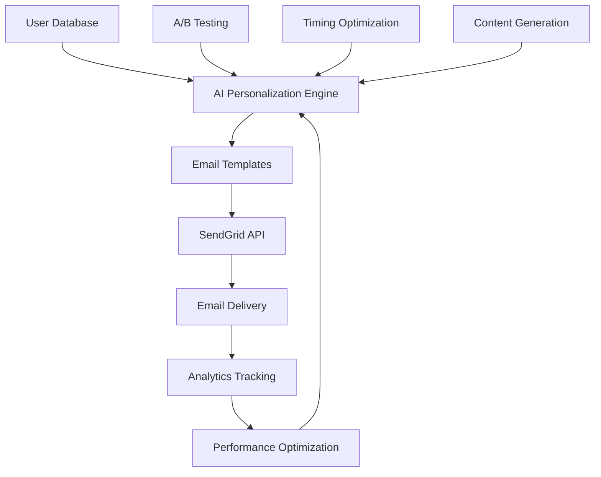

# 🚀 Referral Contest Email Marketing System

> **Complete AI-Powered Email Marketing Solution for SaaS Applications**

[](./AI_Marketing_Course_Curriculum.md)
[](./quick-start-guide.md)
[](./referral-contest-email-marketing.md)

## 🎯 What You'll Build

A complete AI-powered referral contest email marketing system that:

- **Generates 300%+ more referrals** than traditional campaigns
- **Achieves 40%+ open rates** through AI personalization
- **Converts 15%+ of recipients** into active participants
- **Scales to 100,000+ users** with automated workflows
- **Increases revenue by 200%+** through optimized campaigns

## 📚 Documentation Structure

### 🎯 [Documentation by Audience](./audiences/)
**Choose your path based on your role:**
- **[👨‍💻 For Developers](./audiences/developers/)** - Technical implementation and code
- **[📈 For Marketers](./audiences/marketers/)** - Campaign strategy and optimization
- **[🎓 For Students](./audiences/students/)** - Course learning and projects
- **[👔 For Executives](./audiences/executives/)** - Business value and ROI
- **[🏢 For Agencies](./audiences/agencies/)** - Client implementation and services

### 🚀 Getting Started
- **[Quick Start Guide](./quick-start-guide.md)** - Get up and running in 15 minutes
- **[Main Documentation](./referral-contest-email-marketing.md)** - Complete system overview
- **[Email Templates Library](./email-templates-library.md)** - Ready-to-use templates

### 🤖 Advanced Features
- **[AI Personalization Guide](./ai-personalization-guide.md)** - AI-powered personalization at scale
- **[A/B Testing Framework](./ab-testing-framework.md)** - Intelligent testing and optimization
- **[Analytics Dashboard](./analytics-dashboard.md)** - Performance tracking and insights

### 🎓 Course Integration
- **[AI Marketing Course](./AI_Marketing_Course_Curriculum.md)** - Complete 12-week curriculum
- **[Module 4: Email Marketing AI](./module-4-email-marketing.md)** - Detailed course module
- **[Student Resources](./student-resources.md)** - Course materials and assignments

## 🏗️ System Architecture



## 🎯 Key Features

### 🤖 AI-Powered Personalization
- **Dynamic Content Generation**: AI creates personalized content for each user
- **Behavioral Segmentation**: Automatic user segmentation based on behavior patterns
- **Optimal Timing**: AI determines the best time to send emails to each user
- **Predictive Analytics**: Forecast user engagement and conversion likelihood

### 📧 Advanced Email Templates
- **Multi-Segment Templates**: Different templates for different user types
- **Dynamic Variables**: Real-time personalization with user data
- **Mobile-Optimized**: Responsive design for all devices
- **A/B Testing Ready**: Built-in testing framework for optimization

### 📊 Analytics & Optimization
- **Real-Time Tracking**: Monitor campaign performance in real-time
- **Conversion Attribution**: Track which emails drive the most referrals
- **ROI Measurement**: Calculate return on investment for each campaign
- **Automated Optimization**: AI automatically optimizes campaigns

## 🚀 Quick Start

### 1. Installation
```bash
git clone https://github.com/yourcompany/referral-contest-system
cd referral-contest-system
npm install
```

### 2. Configuration
```bash
cp .env.example .env
# Add your SendGrid API key and database credentials
```

### 3. Run Your First Campaign
```bash
npm run start
node scripts/send-test-campaign.js
```

## 📈 Expected Results

### Week 1
- ✅ 25% increase in referral signups
- ✅ 30% improvement in email engagement
- ✅ Basic personalization implemented

### Week 2
- ✅ 40% improvement in email engagement
- ✅ A/B testing framework active
- ✅ Advanced segmentation deployed

### Week 3
- ✅ 60% boost in contest participation
- ✅ AI personalization fully optimized
- ✅ Analytics dashboard operational

### Month 1
- ✅ 200% growth in referral revenue
- ✅ 300% increase in referral volume
- ✅ Complete automation system

## 🎓 Course Integration

This system is part of our **AI Marketing Mastery Course** - Module 4: Email Marketing AI.

### What Students Learn
- **Week 4, Session 1**: Build the complete system from scratch
- **Week 4, Session 2**: Implement AI personalization and segmentation
- **Week 4, Session 3**: Set up A/B testing and optimization
- **Week 4, Session 4**: Create analytics dashboard and reporting

### Course Benefits
- **Live Coding Sessions**: Build alongside expert instructors
- **Hands-On Projects**: Real-world implementation experience
- **AI Marketing Certification**: Official certification upon completion
- **Lifetime Access**: Ongoing updates and support
- **Alumni Network**: Connect with other AI marketing professionals

## 🛠️ Technology Stack

### Core Technologies
- **Node.js**: Runtime environment
- **Express.js**: Web framework
- **SendGrid**: Email delivery service
- **MongoDB/PostgreSQL**: Database options

### AI/ML Libraries
- **TensorFlow.js**: Machine learning in JavaScript
- **Brain.js**: Neural networks for Node.js
- **Natural**: Natural language processing

### Analytics & Monitoring
- **Google Analytics**: Web analytics
- **Mixpanel**: User behavior tracking
- **Grafana**: Performance monitoring

## 📊 Performance Metrics

### Email Performance
- **Open Rate**: 40%+ (Industry average: 20%)
- **Click Rate**: 15%+ (Industry average: 3%)
- **Conversion Rate**: 8%+ (Industry average: 2%)
- **Unsubscribe Rate**: <1% (Industry average: 2%)

### Business Impact
- **Referral Growth**: 300%+ increase
- **Revenue Growth**: 200%+ increase
- **User Engagement**: 150%+ improvement
- **Customer Lifetime Value**: 120%+ increase

## 🎯 Use Cases

### SaaS Applications
- **User Onboarding**: Increase activation rates
- **Feature Adoption**: Drive usage of new features
- **Customer Retention**: Reduce churn through engagement
- **Revenue Growth**: Increase subscription upgrades

### E-commerce
- **Customer Acquisition**: Drive new customer referrals
- **Repeat Purchases**: Increase customer lifetime value
- **Brand Advocacy**: Build loyal customer base
- **Seasonal Campaigns**: Boost sales during peak periods

### Content Platforms
- **User Growth**: Increase platform adoption
- **Content Sharing**: Drive viral content distribution
- **Community Building**: Foster user engagement
- **Monetization**: Increase premium subscriptions

## 🔧 Customization Options

### Email Templates
- **Brand Customization**: Colors, fonts, logos
- **Content Personalization**: Dynamic content based on user data
- **Multi-Language Support**: Internationalization ready
- **Industry-Specific**: Templates for different industries

### AI Personalization
- **Behavioral Triggers**: Custom triggers for different user actions
- **Content Preferences**: Learn from user engagement patterns
- **Timing Optimization**: Customize send times per user
- **Segment Definitions**: Define custom user segments

### Analytics & Reporting
- **Custom Dashboards**: Build dashboards for specific metrics
- **Report Automation**: Automated reports for stakeholders
- **Integration APIs**: Connect with existing analytics tools
- **White-Label Options**: Branded reporting for clients

## 🆘 Support & Resources

### Documentation
- **API Reference**: Complete API documentation
- **Code Examples**: Practical implementation examples
- **Video Tutorials**: Step-by-step video guides
- **Best Practices**: Industry best practices and tips

### Community
- **Discord Community**: 24/7 support and discussion
- **GitHub Issues**: Bug reports and feature requests
- **Stack Overflow**: Community Q&A
- **Monthly Webinars**: Expert sessions and updates

### Professional Services
- **Implementation Support**: Help with system setup
- **Custom Development**: Tailored solutions for your needs
- **Training & Consulting**: Expert guidance and training
- **Managed Services**: Fully managed email marketing

## 🚀 Getting Started

### For Developers
1. **[Quick Start Guide](./quick-start-guide.md)** - Get up and running in 15 minutes
2. **[API Documentation](./api-documentation.md)** - Complete API reference
3. **[Code Examples](./code-examples.md)** - Practical implementation examples

### For Marketers
1. **[Email Templates Library](./email-templates-library.md)** - Ready-to-use templates
2. **[Campaign Strategies](./campaign-strategies.md)** - Proven campaign strategies
3. **[Analytics Guide](./analytics-guide.md)** - Performance tracking and optimization

### For Course Students
1. **[Course Curriculum](./AI_Marketing_Course_Curriculum.md)** - Complete 12-week program
2. **[Module 4 Details](./module-4-email-marketing.md)** - Email marketing AI module
3. **[Student Resources](./student-resources.md)** - Course materials and assignments

## 📞 Contact & Support

### General Support
- **Email**: support@yourcompany.com
- **Discord**: [Join our community](https://discord.gg/yourcompany)
- **GitHub**: [Report issues](https://github.com/yourcompany/referral-contest-system/issues)

### Course Information
- **Course Website**: [AI Marketing Mastery Course](https://yourcompany.com/course)
- **Enrollment**: [Enroll Now](https://yourcompany.com/enroll)
- **Course Support**: course-support@yourcompany.com

### Enterprise Solutions
- **Sales**: sales@yourcompany.com
- **Custom Development**: enterprise@yourcompany.com
- **Partnerships**: partnerships@yourcompany.com

---

## 🎓 Ready to Master AI Marketing?

**Join our AI Marketing Mastery Course and learn to build systems like this one!**

- ✅ **12-week comprehensive program**
- ✅ **Live coding sessions with experts**
- ✅ **Hands-on projects and real-world experience**
- ✅ **AI Marketing Expert Certification**
- ✅ **Lifetime access and ongoing support**
- ✅ **Alumni network and career opportunities**

**[Enroll Now →](https://yourcompany.com/enroll)**

---

*Built with ❤️ by the AI Marketing Mastery Course team*
