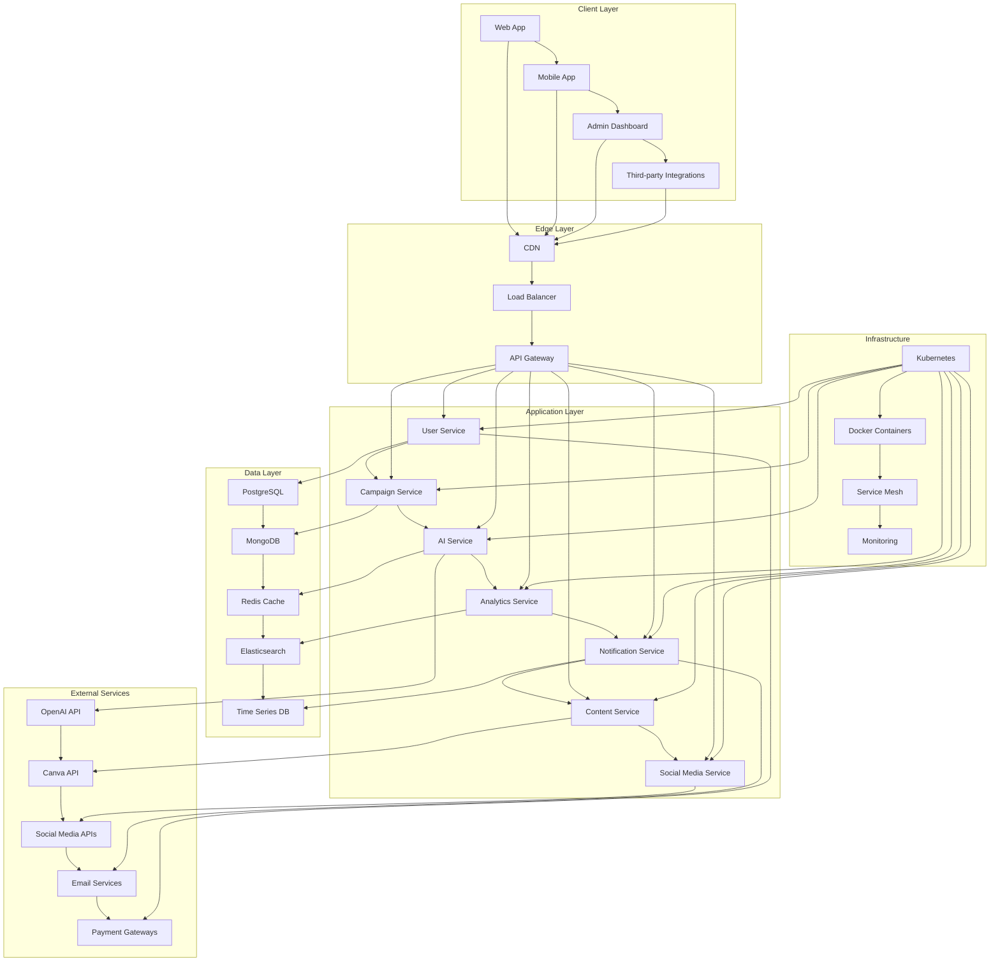
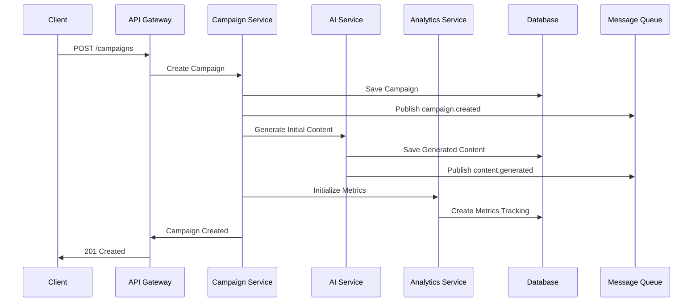
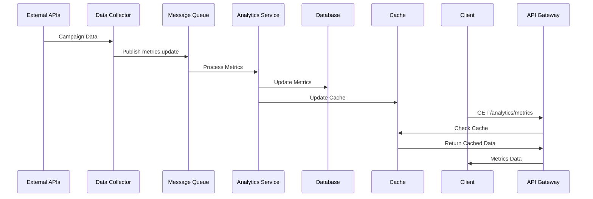
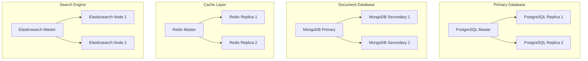
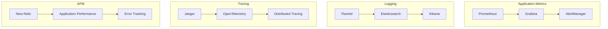

# 🏗️ Arquitectura del Sistema - FRONTIER

> **Documentación técnica completa de la arquitectura, diseño y componentes del sistema FRONTIER**

## 📋 Tabla de Contenidos

- [🎯 Visión General](#-visión-general)
- [🏗️ Arquitectura de Alto Nivel](#️-arquitectura-de-alto-nivel)
- [🔧 Componentes del Sistema](#-componentes-del-sistema)
- [📊 Flujo de Datos](#-flujo-de-datos)
- [🔒 Seguridad](#-seguridad)
- [📈 Escalabilidad](#-escalabilidad)
- [🔄 Microservicios](#-microservicios)
- [🗄️ Base de Datos](#️-base-de-datos)
- [☁️ Infraestructura](#️-infraestructura)
- [🔍 Monitoreo](#-monitoreo)

## 🎯 Visión General

FRONTIER está construido con una arquitectura de microservicios moderna, diseñada para ser altamente escalable, resiliente y mantenible. El sistema utiliza tecnologías de vanguardia y sigue las mejores prácticas de la industria.

### 🎪 Principios de Diseño

- **Microservicios**: Arquitectura distribuida y desacoplada
- **Cloud-Native**: Diseñado para la nube desde el inicio
- **API-First**: Todas las funcionalidades expuestas vía APIs
- **Event-Driven**: Comunicación asíncrona entre servicios
- **Resiliente**: Tolerante a fallos y auto-recuperable
- **Escalable**: Escalabilidad horizontal automática

## 🏗️ Arquitectura de Alto Nivel

### Diagrama de Arquitectura



### Capas del Sistema

#### 1. **Client Layer** (Capa de Cliente)
- **Web Application**: Aplicación React/Vue.js
- **Mobile App**: Aplicación nativa iOS/Android
- **Admin Dashboard**: Panel de administración
- **Third-party Integrations**: Integraciones externas

#### 2. **Edge Layer** (Capa de Borde)
- **CDN**: Distribución de contenido estático
- **Load Balancer**: Distribución de carga
- **API Gateway**: Punto de entrada único

#### 3. **Application Layer** (Capa de Aplicación)
- **Microservicios**: Servicios especializados
- **Service Mesh**: Comunicación entre servicios
- **Message Queue**: Cola de mensajes asíncronos

#### 4. **Data Layer** (Capa de Datos)
- **Databases**: Bases de datos especializadas
- **Cache**: Sistema de caché distribuido
- **Search**: Motor de búsqueda
- **Analytics**: Base de datos de analytics

#### 5. **Infrastructure Layer** (Capa de Infraestructura)
- **Kubernetes**: Orquestación de contenedores
- **Docker**: Contenedores de aplicación
- **Monitoring**: Monitoreo y observabilidad

## 🔧 Componentes del Sistema

### API Gateway

#### Funcionalidades
- **Routing**: Enrutamiento de requests
- **Authentication**: Autenticación centralizada
- **Rate Limiting**: Limitación de velocidad
- **Load Balancing**: Balanceamiento de carga
- **Monitoring**: Monitoreo de APIs
- **Caching**: Caché de respuestas

#### Implementación
```yaml
# Kong API Gateway Configuration
apiVersion: configuration.konghq.com/v1
kind: KongIngress
metadata:
  name: frontier-api
spec:
  upstream:
    healthchecks:
      active:
        healthy:
          interval: 30
        unhealthy:
          interval: 30
  proxy:
    connect_timeout: 10000
    read_timeout: 10000
    write_timeout: 10000
```

### Microservicios

#### 1. User Service
```javascript
// user-service/src/app.js
const express = require('express');
const { UserController } = require('./controllers');
const { AuthMiddleware } = require('./middleware');

const app = express();

// Middleware
app.use(express.json());
app.use(AuthMiddleware);

// Routes
app.post('/users', UserController.create);
app.get('/users/:id', UserController.getById);
app.put('/users/:id', UserController.update);
app.delete('/users/:id', UserController.delete);

// Health check
app.get('/health', (req, res) => {
  res.json({ status: 'healthy', timestamp: new Date().toISOString() });
});

module.exports = app;
```

#### 2. Campaign Service
```javascript
// campaign-service/src/app.js
const express = require('express');
const { CampaignController } = require('./controllers');
const { ValidationMiddleware } = require('./middleware');

const app = express();

// Middleware
app.use(express.json());
app.use(ValidationMiddleware);

// Routes
app.post('/campaigns', CampaignController.create);
app.get('/campaigns', CampaignController.list);
app.get('/campaigns/:id', CampaignController.getById);
app.put('/campaigns/:id', CampaignController.update);
app.delete('/campaigns/:id', CampaignController.delete);

// Campaign-specific routes
app.post('/campaigns/:id/start', CampaignController.start);
app.post('/campaigns/:id/pause', CampaignController.pause);
app.post('/campaigns/:id/duplicate', CampaignController.duplicate);

module.exports = app;
```

#### 3. AI Service
```python
# ai-service/app.py
from flask import Flask, request, jsonify
from services.content_generator import ContentGenerator
from services.sentiment_analyzer import SentimentAnalyzer
from services.image_optimizer import ImageOptimizer

app = Flask(__name__)

@app.route('/ai/generate-content', methods=['POST'])
def generate_content():
    data = request.get_json()
    generator = ContentGenerator()
    
    content = generator.generate(
        type=data['type'],
        topic=data['topic'],
        tone=data.get('tone', 'neutral'),
        platform=data.get('platform', 'general')
    )
    
    return jsonify({
        'success': True,
        'data': content
    })

@app.route('/ai/sentiment-analysis', methods=['POST'])
def analyze_sentiment():
    data = request.get_json()
    analyzer = SentimentAnalyzer()
    
    result = analyzer.analyze(data['text'])
    
    return jsonify({
        'success': True,
        'data': result
    })

@app.route('/ai/optimize-image', methods=['POST'])
def optimize_image():
    if 'image' not in request.files:
        return jsonify({'error': 'No image provided'}), 400
    
    image = request.files['image']
    optimizer = ImageOptimizer()
    
    optimized_image = optimizer.optimize(
        image,
        platform=request.form.get('platform', 'general'),
        format=request.form.get('format', 'original')
    )
    
    return jsonify({
        'success': True,
        'data': {
            'optimized_image_url': optimized_image.url,
            'optimization_metrics': optimized_image.metrics
        }
    })

if __name__ == '__main__':
    app.run(host='0.0.0.0', port=5000)
```

#### 4. Analytics Service
```python
# analytics-service/app.py
from flask import Flask, request, jsonify
from services.metrics_calculator import MetricsCalculator
from services.report_generator import ReportGenerator
from services.predictive_analytics import PredictiveAnalytics

app = Flask(__name__)

@app.route('/analytics/campaigns/<campaign_id>/metrics', methods=['GET'])
def get_campaign_metrics(campaign_id):
    start_date = request.args.get('start_date')
    end_date = request.args.get('end_date')
    granularity = request.args.get('granularity', 'daily')
    
    calculator = MetricsCalculator()
    metrics = calculator.calculate_campaign_metrics(
        campaign_id=campaign_id,
        start_date=start_date,
        end_date=end_date,
        granularity=granularity
    )
    
    return jsonify({
        'success': True,
        'data': metrics
    })

@app.route('/analytics/predictions', methods=['POST'])
def generate_predictions():
    data = request.get_json()
    predictor = PredictiveAnalytics()
    
    predictions = predictor.predict(
        campaign_id=data['campaign_id'],
        prediction_type=data['prediction_type'],
        forecast_period=data.get('forecast_period', '30_days')
    )
    
    return jsonify({
        'success': True,
        'data': predictions
    })

@app.route('/analytics/reports', methods=['POST'])
def create_report():
    data = request.get_json()
    generator = ReportGenerator()
    
    report = generator.create_report(
        name=data['name'],
        type=data['type'],
        date_range=data['date_range'],
        filters=data.get('filters', {}),
        metrics=data['metrics']
    )
    
    return jsonify({
        'success': True,
        'data': report
    })

if __name__ == '__main__':
    app.run(host='0.0.0.0', port=5001)
```

### Message Queue System

#### Redis Streams Implementation
```javascript
// message-queue/redis-streams.js
const Redis = require('ioredis');

class MessageQueue {
  constructor() {
    this.redis = new Redis({
      host: process.env.REDIS_HOST,
      port: process.env.REDIS_PORT,
      password: process.env.REDIS_PASSWORD
    });
  }

  async publish(stream, message) {
    const messageId = await this.redis.xadd(
      stream,
      '*',
      'data', JSON.stringify(message),
      'timestamp', Date.now()
    );
    
    return messageId;
  }

  async subscribe(stream, consumerGroup, consumerName, handler) {
    // Create consumer group if it doesn't exist
    try {
      await this.redis.xgroup('CREATE', stream, consumerGroup, '0', 'MKSTREAM');
    } catch (error) {
      // Group already exists
    }

    // Read messages
    while (true) {
      const messages = await this.redis.xreadgroup(
        'GROUP', consumerGroup, consumerName,
        'COUNT', 10,
        'BLOCK', 1000,
        'STREAMS', stream, '>'
      );

      if (messages && messages.length > 0) {
        for (const [streamName, streamMessages] of messages) {
          for (const [messageId, fields] of streamMessages) {
            try {
              const message = JSON.parse(fields[1]);
              await handler(message);
              
              // Acknowledge message
              await this.redis.xack(stream, consumerGroup, messageId);
            } catch (error) {
              console.error('Error processing message:', error);
            }
          }
        }
      }
    }
  }
}

module.exports = MessageQueue;
```

## 📊 Flujo de Datos

### Flujo de Creación de Campaña



### Flujo de Análisis en Tiempo Real



## 🔒 Seguridad

### Arquitectura de Seguridad

```mermaid
graph TB
    subgraph "Security Layers"
        A[WAF] --> B[DDoS Protection]
        B --> C[API Gateway Auth]
        C --> D[Service Auth]
        D --> E[Database Encryption]
    end
    
    subgraph "Authentication"
        F[JWT Tokens] --> G[OAuth 2.0]
        G --> H[Multi-Factor Auth]
        H --> I[Role-Based Access]
    end
    
    subgraph "Data Protection"
        J[Encryption at Rest] --> K[Encryption in Transit]
        K --> L[Data Masking]
        L --> M[Audit Logging]
    end
```



### Implementación de Seguridad

#### 1. JWT Authentication
```javascript
// auth/jwt-service.js
const jwt = require('jsonwebtoken');
const crypto = require('crypto');

class JWTService {
  constructor() {
    this.secret = process.env.JWT_SECRET;
    this.refreshSecret = process.env.JWT_REFRESH_SECRET;
  }

  generateTokens(user) {
    const payload = {
      id: user.id,
      email: user.email,
      role: user.role,
      permissions: user.permissions
    };

    const accessToken = jwt.sign(payload, this.secret, {
      expiresIn: '15m',
      issuer: 'frontier-api',
      audience: 'frontier-client'
    });

    const refreshToken = jwt.sign(payload, this.refreshSecret, {
      expiresIn: '7d',
      issuer: 'frontier-api',
      audience: 'frontier-client'
    });

    return { accessToken, refreshToken };
  }

  verifyToken(token, isRefresh = false) {
    const secret = isRefresh ? this.refreshSecret : this.secret;
    
    try {
      return jwt.verify(token, secret, {
        issuer: 'frontier-api',
        audience: 'frontier-client'
      });
    } catch (error) {
      throw new Error('Invalid token');
    }
  }

  generateApiKey(user) {
    const payload = {
      userId: user.id,
      type: 'api_key',
      timestamp: Date.now()
    };

    const token = jwt.sign(payload, this.secret, {
      expiresIn: '1y'
    });

    return `fk_${crypto.randomBytes(16).toString('hex')}_${token}`;
  }
}

module.exports = JWTService;
```

#### 2. Rate Limiting
```javascript
// middleware/rate-limiter.js
const Redis = require('ioredis');
const { RateLimiterRedis } = require('rate-limiter-flexible');

class RateLimiter {
  constructor() {
    this.redis = new Redis({
      host: process.env.REDIS_HOST,
      port: process.env.REDIS_PORT,
      password: process.env.REDIS_PASSWORD
    });

    this.rateLimiter = new RateLimiterRedis({
      storeClient: this.redis,
      keyPrefix: 'rate_limit',
      points: 1000, // Number of requests
      duration: 3600, // Per 1 hour
      blockDuration: 3600, // Block for 1 hour if limit exceeded
    });
  }

  async checkLimit(identifier) {
    try {
      await this.rateLimiter.consume(identifier);
      return { allowed: true };
    } catch (rejRes) {
      return {
        allowed: false,
        remainingPoints: rejRes.remainingPoints,
        msBeforeNext: rejRes.msBeforeNext
      };
    }
  }
}

module.exports = RateLimiter;
```

#### 3. Data Encryption
```javascript
// security/encryption.js
const crypto = require('crypto');

class EncryptionService {
  constructor() {
    this.algorithm = 'aes-256-gcm';
    this.secretKey = process.env.ENCRYPTION_KEY;
  }

  encrypt(text) {
    const iv = crypto.randomBytes(16);
    const cipher = crypto.createCipher(this.algorithm, this.secretKey);
    cipher.setAAD(Buffer.from('frontier-encryption', 'utf8'));

    let encrypted = cipher.update(text, 'utf8', 'hex');
    encrypted += cipher.final('hex');

    const authTag = cipher.getAuthTag();

    return {
      encrypted,
      iv: iv.toString('hex'),
      authTag: authTag.toString('hex')
    };
  }

  decrypt(encryptedData) {
    const decipher = crypto.createDecipher(
      this.algorithm,
      this.secretKey
    );

    decipher.setAAD(Buffer.from('frontier-encryption', 'utf8'));
    decipher.setAuthTag(Buffer.from(encryptedData.authTag, 'hex'));

    let decrypted = decipher.update(encryptedData.encrypted, 'hex', 'utf8');
    decrypted += decipher.final('utf8');

    return decrypted;
  }
}

module.exports = EncryptionService;
```

## 📈 Escalabilidad

### Estrategias de Escalabilidad

#### 1. Horizontal Scaling
```yaml
# kubernetes/horizontal-pod-autoscaler.yaml
apiVersion: autoscaling/v2
kind: HorizontalPodAutoscaler
metadata:
  name: campaign-service-hpa
spec:
  scaleTargetRef:
    apiVersion: apps/v1
    kind: Deployment
    name: campaign-service
  minReplicas: 3
  maxReplicas: 50
  metrics:
  - type: Resource
    resource:
      name: cpu
      target:
        type: Utilization
        averageUtilization: 70
  - type: Resource
    resource:
      name: memory
      target:
        type: Utilization
        averageUtilization: 80
  behavior:
    scaleUp:
      stabilizationWindowSeconds: 60
      policies:
      - type: Percent
        value: 100
        periodSeconds: 15
    scaleDown:
      stabilizationWindowSeconds: 300
      policies:
      - type: Percent
        value: 10
        periodSeconds: 60
```

#### 2. Database Sharding
```javascript
// database/sharding.js
class DatabaseSharding {
  constructor() {
    this.shards = [
      { id: 'shard1', connection: 'postgresql://shard1:5432/frontier' },
      { id: 'shard2', connection: 'postgresql://shard2:5432/frontier' },
      { id: 'shard3', connection: 'postgresql://shard3:5432/frontier' }
    ];
  }

  getShard(key) {
    const hash = this.hash(key);
    const shardIndex = hash % this.shards.length;
    return this.shards[shardIndex];
  }

  hash(key) {
    let hash = 0;
    for (let i = 0; i < key.length; i++) {
      const char = key.charCodeAt(i);
      hash = ((hash << 5) - hash) + char;
      hash = hash & hash; // Convert to 32-bit integer
    }
    return Math.abs(hash);
  }

  async query(shardId, query, params) {
    const shard = this.shards.find(s => s.id === shardId);
    const client = new Client(shard.connection);
    
    try {
      await client.connect();
      const result = await client.query(query, params);
      return result;
    } finally {
      await client.end();
    }
  }
}

module.exports = DatabaseSharding;
```

#### 3. Caching Strategy
```javascript
// cache/redis-cache.js
const Redis = require('ioredis');

class CacheService {
  constructor() {
    this.redis = new Redis({
      host: process.env.REDIS_HOST,
      port: process.env.REDIS_PORT,
      password: process.env.REDIS_PASSWORD,
      retryDelayOnFailover: 100,
      maxRetriesPerRequest: 3
    });
  }

  async get(key) {
    try {
      const value = await this.redis.get(key);
      return value ? JSON.parse(value) : null;
    } catch (error) {
      console.error('Cache get error:', error);
      return null;
    }
  }

  async set(key, value, ttl = 3600) {
    try {
      await this.redis.setex(key, ttl, JSON.stringify(value));
    } catch (error) {
      console.error('Cache set error:', error);
    }
  }

  async del(key) {
    try {
      await this.redis.del(key);
    } catch (error) {
      console.error('Cache delete error:', error);
    }
  }

  async invalidatePattern(pattern) {
    try {
      const keys = await this.redis.keys(pattern);
      if (keys.length > 0) {
        await this.redis.del(...keys);
      }
    } catch (error) {
      console.error('Cache invalidation error:', error);
    }
  }
}

module.exports = CacheService;
```

## 🔄 Microservicios

### Service Discovery

#### Consul Configuration
```yaml
# consul/config.yaml
datacenter = "frontier-dc"
data_dir = "/opt/consul/data"
log_level = "INFO"
node_name = "frontier-consul"
server = true
bootstrap_expect = 3
retry_join = ["consul-1", "consul-2", "consul-3"]
ui_config {
  enabled = true
}
connect {
  enabled = true
}
```

#### Service Registration
```javascript
// service-discovery/consul-registry.js
const consul = require('consul');

class ServiceRegistry {
  constructor() {
    this.consul = consul({
      host: process.env.CONSUL_HOST,
      port: process.env.CONSUL_PORT
    });
  }

  async registerService(serviceConfig) {
    const service = {
      name: serviceConfig.name,
      id: `${serviceConfig.name}-${process.env.HOSTNAME}`,
      address: process.env.SERVICE_HOST,
      port: parseInt(process.env.SERVICE_PORT),
      check: {
        http: `http://${process.env.SERVICE_HOST}:${process.env.SERVICE_PORT}/health`,
        interval: '10s',
        timeout: '5s'
      },
      tags: serviceConfig.tags || []
    };

    await this.consul.agent.service.register(service);
    console.log(`Service ${service.name} registered`);
  }

  async discoverService(serviceName) {
    const services = await this.consul.health.service({
      service: serviceName,
      passing: true
    });

    return services[0].Service;
  }
}

module.exports = ServiceRegistry;
```

### Circuit Breaker Pattern
```javascript
// resilience/circuit-breaker.js
class CircuitBreaker {
  constructor(options = {}) {
    this.failureThreshold = options.failureThreshold || 5;
    this.timeout = options.timeout || 60000;
    this.resetTimeout = options.resetTimeout || 30000;
    
    this.state = 'CLOSED'; // CLOSED, OPEN, HALF_OPEN
    this.failureCount = 0;
    this.lastFailureTime = null;
  }

  async execute(operation) {
    if (this.state === 'OPEN') {
      if (Date.now() - this.lastFailureTime > this.resetTimeout) {
        this.state = 'HALF_OPEN';
      } else {
        throw new Error('Circuit breaker is OPEN');
      }
    }

    try {
      const result = await Promise.race([
        operation(),
        new Promise((_, reject) => 
          setTimeout(() => reject(new Error('Operation timeout')), this.timeout)
        )
      ]);

      this.onSuccess();
      return result;
    } catch (error) {
      this.onFailure();
      throw error;
    }
  }

  onSuccess() {
    this.failureCount = 0;
    this.state = 'CLOSED';
  }

  onFailure() {
    this.failureCount++;
    this.lastFailureTime = Date.now();

    if (this.failureCount >= this.failureThreshold) {
      this.state = 'OPEN';
    }
  }
}

module.exports = CircuitBreaker;
```

## 🗄️ Base de Datos

### Database Architecture



### Database Schema Design

#### PostgreSQL Schema
```sql
-- Users table
CREATE TABLE users (
    id UUID PRIMARY KEY DEFAULT gen_random_uuid(),
    email VARCHAR(255) UNIQUE NOT NULL,
    password_hash VARCHAR(255) NOT NULL,
    name VARCHAR(255) NOT NULL,
    company VARCHAR(255),
    role VARCHAR(50) DEFAULT 'user',
    subscription_plan VARCHAR(50) DEFAULT 'free',
    subscription_status VARCHAR(50) DEFAULT 'active',
    created_at TIMESTAMP DEFAULT CURRENT_TIMESTAMP,
    updated_at TIMESTAMP DEFAULT CURRENT_TIMESTAMP,
    last_login_at TIMESTAMP
);

-- Campaigns table
CREATE TABLE campaigns (
    id UUID PRIMARY KEY DEFAULT gen_random_uuid(),
    user_id UUID REFERENCES users(id) ON DELETE CASCADE,
    name VARCHAR(255) NOT NULL,
    type VARCHAR(50) NOT NULL,
    status VARCHAR(50) DEFAULT 'draft',
    budget DECIMAL(10,2),
    spent DECIMAL(10,2) DEFAULT 0,
    start_date DATE,
    end_date DATE,
    target_audience JSONB,
    settings JSONB,
    created_at TIMESTAMP DEFAULT CURRENT_TIMESTAMP,
    updated_at TIMESTAMP DEFAULT CURRENT_TIMESTAMP
);

-- Metrics table
CREATE TABLE metrics (
    id UUID PRIMARY KEY DEFAULT gen_random_uuid(),
    campaign_id UUID REFERENCES campaigns(id) ON DELETE CASCADE,
    metric_type VARCHAR(50) NOT NULL,
    value DECIMAL(15,4) NOT NULL,
    date DATE NOT NULL,
    platform VARCHAR(50),
    created_at TIMESTAMP DEFAULT CURRENT_TIMESTAMP
);

-- Indexes
CREATE INDEX idx_users_email ON users(email);
CREATE INDEX idx_users_company ON users(company);
CREATE INDEX idx_campaigns_user_id ON campaigns(user_id);
CREATE INDEX idx_campaigns_status ON campaigns(status);
CREATE INDEX idx_campaigns_dates ON campaigns(start_date, end_date);
CREATE INDEX idx_metrics_campaign_id ON metrics(campaign_id);
CREATE INDEX idx_metrics_date ON metrics(date);
CREATE INDEX idx_metrics_type ON metrics(metric_type);

-- Partitioning for metrics table
CREATE TABLE metrics_y2024m01 PARTITION OF metrics
    FOR VALUES FROM ('2024-01-01') TO ('2024-02-01');

CREATE TABLE metrics_y2024m02 PARTITION OF metrics
    FOR VALUES FROM ('2024-02-01') TO ('2024-03-01');
```

#### MongoDB Collections
```javascript
// Content collection
{
  _id: ObjectId,
  campaign_id: String,
  type: String, // 'social_media_post', 'email', 'ad'
  platform: String,
  content: {
    text: String,
    images: [String],
    videos: [String],
    hashtags: [String]
  },
  ai_generated: Boolean,
  performance_metrics: {
    impressions: Number,
    clicks: Number,
    conversions: Number,
    engagement_rate: Number
  },
  created_at: Date,
  updated_at: Date
}

// User sessions collection
{
  _id: ObjectId,
  user_id: String,
  session_id: String,
  ip_address: String,
  user_agent: String,
  location: {
    country: String,
    city: String,
    coordinates: [Number, Number]
  },
  activities: [{
    action: String,
    timestamp: Date,
    metadata: Object
  }],
  created_at: Date,
  expires_at: Date
}
```

### Database Optimization

#### Query Optimization
```sql
-- Optimized query with proper indexing
EXPLAIN (ANALYZE, BUFFERS) 
SELECT 
    c.id,
    c.name,
    c.budget,
    c.spent,
    SUM(m.value) as total_impressions
FROM campaigns c
LEFT JOIN metrics m ON c.id = m.campaign_id 
    AND m.metric_type = 'impressions'
    AND m.date >= '2024-01-01'
WHERE c.user_id = $1
    AND c.status = 'active'
GROUP BY c.id, c.name, c.budget, c.spent
ORDER BY total_impressions DESC
LIMIT 10;
```

#### Connection Pooling
```javascript
// database/connection-pool.js
const { Pool } = require('pg');

class DatabasePool {
  constructor() {
    this.pool = new Pool({
      host: process.env.DB_HOST,
      port: process.env.DB_PORT,
      database: process.env.DB_NAME,
      user: process.env.DB_USER,
      password: process.env.DB_PASSWORD,
      max: 20, // Maximum number of clients in the pool
      idleTimeoutMillis: 30000, // Close idle clients after 30 seconds
      connectionTimeoutMillis: 2000, // Return an error after 2 seconds if connection could not be established
      ssl: process.env.NODE_ENV === 'production' ? { rejectUnauthorized: false } : false
    });

    this.pool.on('error', (err) => {
      console.error('Unexpected error on idle client', err);
    });
  }

  async query(text, params) {
    const start = Date.now();
    try {
      const res = await this.pool.query(text, params);
      const duration = Date.now() - start;
      console.log('Executed query', { text, duration, rows: res.rowCount });
      return res;
    } catch (error) {
      console.error('Database query error:', error);
      throw error;
    }
  }

  async getClient() {
    return await this.pool.connect();
  }
}

module.exports = DatabasePool;
```

## ☁️ Infraestructura

### Kubernetes Deployment

#### Namespace Configuration
```yaml
# k8s/namespace.yaml
apiVersion: v1
kind: Namespace
metadata:
  name: frontier
  labels:
    name: frontier
    environment: production
```

#### ConfigMap
```yaml
# k8s/configmap.yaml
apiVersion: v1
kind: ConfigMap
metadata:
  name: frontier-config
  namespace: frontier
data:
  NODE_ENV: "production"
  LOG_LEVEL: "info"
  API_VERSION: "v1"
  CORS_ORIGIN: "https://frontier-ai.com"
  RATE_LIMIT_WINDOW: "3600"
  RATE_LIMIT_MAX: "1000"
```

#### Secret
```yaml
# k8s/secret.yaml
apiVersion: v1
kind: Secret
metadata:
  name: frontier-secrets
  namespace: frontier
type: Opaque
data:
  DATABASE_URL: <base64-encoded-database-url>
  REDIS_URL: <base64-encoded-redis-url>
  JWT_SECRET: <base64-encoded-jwt-secret>
  OPENAI_API_KEY: <base64-encoded-openai-key>
```

#### Deployment
```yaml
# k8s/deployment.yaml
apiVersion: apps/v1
kind: Deployment
metadata:
  name: frontier-backend
  namespace: frontier
  labels:
    app: frontier-backend
spec:
  replicas: 3
  selector:
    matchLabels:
      app: frontier-backend
  template:
    metadata:
      labels:
        app: frontier-backend
    spec:
      containers:
      - name: backend
        image: frontier/backend:latest
        ports:
        - containerPort: 3000
        env:
        - name: NODE_ENV
          valueFrom:
            configMapKeyRef:
              name: frontier-config
              key: NODE_ENV
        - name: DATABASE_URL
          valueFrom:
            secretKeyRef:
              name: frontier-secrets
              key: DATABASE_URL
        resources:
          requests:
            memory: "256Mi"
            cpu: "250m"
          limits:
            memory: "512Mi"
            cpu: "500m"
        livenessProbe:
          httpGet:
            path: /health
            port: 3000
          initialDelaySeconds: 30
          periodSeconds: 10
        readinessProbe:
          httpGet:
            path: /ready
            port: 3000
          initialDelaySeconds: 5
          periodSeconds: 5
```

#### Service
```yaml
# k8s/service.yaml
apiVersion: v1
kind: Service
metadata:
  name: frontier-backend-service
  namespace: frontier
spec:
  selector:
    app: frontier-backend
  ports:
  - protocol: TCP
    port: 80
    targetPort: 3000
  type: ClusterIP
```

#### Ingress
```yaml
# k8s/ingress.yaml
apiVersion: networking.k8s.io/v1
kind: Ingress
metadata:
  name: frontier-ingress
  namespace: frontier
  annotations:
    kubernetes.io/ingress.class: nginx
    cert-manager.io/cluster-issuer: letsencrypt-prod
    nginx.ingress.kubernetes.io/ssl-redirect: "true"
    nginx.ingress.kubernetes.io/rate-limit: "1000"
spec:
  tls:
  - hosts:
    - api.frontier-ai.com
    secretName: frontier-tls
  rules:
  - host: api.frontier-ai.com
    http:
      paths:
      - path: /
        pathType: Prefix
        backend:
          service:
            name: frontier-backend-service
            port:
              number: 80
```

### Infrastructure as Code

#### Terraform Configuration
```hcl
# terraform/main.tf
provider "aws" {
  region = var.aws_region
}

# VPC
resource "aws_vpc" "frontier_vpc" {
  cidr_block           = "10.0.0.0/16"
  enable_dns_hostnames = true
  enable_dns_support   = true

  tags = {
    Name = "frontier-vpc"
  }
}

# Internet Gateway
resource "aws_internet_gateway" "frontier_igw" {
  vpc_id = aws_vpc.frontier_vpc.id

  tags = {
    Name = "frontier-igw"
  }
}

# Public Subnets
resource "aws_subnet" "frontier_public_subnets" {
  count             = 2
  vpc_id            = aws_vpc.frontier_vpc.id
  cidr_block        = "10.0.${count.index + 1}.0/24"
  availability_zone = data.aws_availability_zones.available.names[count.index]

  map_public_ip_on_launch = true

  tags = {
    Name = "frontier-public-subnet-${count.index + 1}"
  }
}

# Private Subnets
resource "aws_subnet" "frontier_private_subnets" {
  count             = 2
  vpc_id            = aws_vpc.frontier_vpc.id
  cidr_block        = "10.0.${count.index + 10}.0/24"
  availability_zone = data.aws_availability_zones.available.names[count.index]

  tags = {
    Name = "frontier-private-subnet-${count.index + 1}"
  }
}

# RDS Instance
resource "aws_db_instance" "frontier_postgres" {
  identifier = "frontier-postgres"
  
  engine         = "postgres"
  engine_version = "14.7"
  instance_class = "db.t3.medium"
  
  allocated_storage     = 100
  max_allocated_storage = 1000
  storage_type          = "gp2"
  storage_encrypted     = true
  
  db_name  = "frontier"
  username = "frontier"
  password = var.db_password
  
  vpc_security_group_ids = [aws_security_group.rds.id]
  db_subnet_group_name   = aws_db_subnet_group.frontier.name
  
  backup_retention_period = 7
  backup_window          = "03:00-04:00"
  maintenance_window     = "sun:04:00-sun:05:00"
  
  skip_final_snapshot = false
  final_snapshot_identifier = "frontier-postgres-final-snapshot"
  
  tags = {
    Name = "frontier-postgres"
  }
}

# ElastiCache Redis
resource "aws_elasticache_replication_group" "frontier_redis" {
  replication_group_id       = "frontier-redis"
  description                = "Frontier Redis cluster"
  
  node_type                  = "cache.t3.micro"
  port                       = 6379
  parameter_group_name       = "default.redis7"
  
  num_cache_clusters         = 2
  automatic_failover_enabled = true
  multi_az_enabled          = true
  
  subnet_group_name = aws_elasticache_subnet_group.frontier.name
  security_group_ids = [aws_security_group.redis.id]
  
  at_rest_encryption_enabled = true
  transit_encryption_enabled = true
  
  tags = {
    Name = "frontier-redis"
  }
}
```

## 🔍 Monitoreo

### Observabilidad Completa



### Prometheus Configuration
```yaml
# monitoring/prometheus.yml
global:
  scrape_interval: 15s
  evaluation_interval: 15s

rule_files:
  - "rules/*.yml"

alerting:
  alertmanagers:
    - static_configs:
        - targets:
          - alertmanager:9093

scrape_configs:
  - job_name: 'frontier-backend'
    static_configs:
      - targets: ['frontier-backend:3000']
    metrics_path: '/metrics'
    scrape_interval: 5s

  - job_name: 'frontier-ai-service'
    static_configs:
      - targets: ['frontier-ai-service:5000']
    metrics_path: '/metrics'
    scrape_interval: 5s

  - job_name: 'postgres'
    static_configs:
      - targets: ['postgres-exporter:9187']

  - job_name: 'redis'
    static_configs:
      - targets: ['redis-exporter:9121']
```

### Grafana Dashboard
```json
{
  "dashboard": {
    "title": "Frontier System Overview",
    "panels": [
      {
        "title": "Request Rate",
        "type": "graph",
        "targets": [
          {
            "expr": "rate(http_requests_total[5m])",
            "legendFormat": "{{method}} {{endpoint}}"
          }
        ]
      },
      {
        "title": "Response Time",
        "type": "graph",
        "targets": [
          {
            "expr": "histogram_quantile(0.95, rate(http_request_duration_seconds_bucket[5m]))",
            "legendFormat": "95th percentile"
          }
        ]
      },
      {
        "title": "Error Rate",
        "type": "graph",
        "targets": [
          {
            "expr": "rate(http_requests_total{status=~\"5..\"}[5m])",
            "legendFormat": "5xx errors"
          }
        ]
      },
      {
        "title": "Database Connections",
        "type": "graph",
        "targets": [
          {
            "expr": "pg_stat_database_numbackends",
            "legendFormat": "Active connections"
          }
        ]
      }
    ]
  }
}
```

### Health Checks
```javascript
// health/health-checker.js
const express = require('express');
const { Pool } = require('pg');
const Redis = require('ioredis');

class HealthChecker {
  constructor() {
    this.dbPool = new Pool({
      connectionString: process.env.DATABASE_URL
    });
    
    this.redis = new Redis({
      host: process.env.REDIS_HOST,
      port: process.env.REDIS_PORT,
      password: process.env.REDIS_PASSWORD
    });
  }

  async checkDatabase() {
    try {
      const client = await this.dbPool.connect();
      await client.query('SELECT 1');
      client.release();
      return { status: 'healthy', responseTime: Date.now() };
    } catch (error) {
      return { status: 'unhealthy', error: error.message };
    }
  }

  async checkRedis() {
    try {
      const start = Date.now();
      await this.redis.ping();
      return { status: 'healthy', responseTime: Date.now() - start };
    } catch (error) {
      return { status: 'unhealthy', error: error.message };
    }
  }

  async checkExternalServices() {
    const services = [
      { name: 'OpenAI API', url: 'https://api.openai.com/v1/models' },
      { name: 'Canva API', url: 'https://api.canva.com/v1/me' }
    ];

    const results = await Promise.allSettled(
      services.map(async (service) => {
        const start = Date.now();
        const response = await fetch(service.url, {
          headers: { 'Authorization': `Bearer ${process.env.API_KEY}` }
        });
        return {
          name: service.name,
          status: response.ok ? 'healthy' : 'unhealthy',
          responseTime: Date.now() - start
        };
      })
    );

    return results.map(result => 
      result.status === 'fulfilled' ? result.value : { 
        name: 'Unknown', 
        status: 'unhealthy', 
        error: result.reason.message 
      }
    );
  }

  async getHealthStatus() {
    const [database, redis, externalServices] = await Promise.all([
      this.checkDatabase(),
      this.checkRedis(),
      this.checkExternalServices()
    ]);

    const overallStatus = [database, redis, ...externalServices]
      .every(service => service.status === 'healthy') ? 'healthy' : 'unhealthy';

    return {
      status: overallStatus,
      timestamp: new Date().toISOString(),
      services: {
        database,
        redis,
        external: externalServices
      },
      uptime: process.uptime(),
      memory: process.memoryUsage(),
      version: process.env.APP_VERSION
    };
  }
}

module.exports = HealthChecker;
```

---

<div align="center">

**🏗️ ¿Necesitas más detalles sobre la arquitectura?**

[Documentación Técnica](https://docs.frontier-ai.com/architecture) | [Diagramas Interactivos](https://architecture.frontier-ai.com) | [Contactar Arquitectos](mailto:architecture@frontier-ai.com)

</div>

