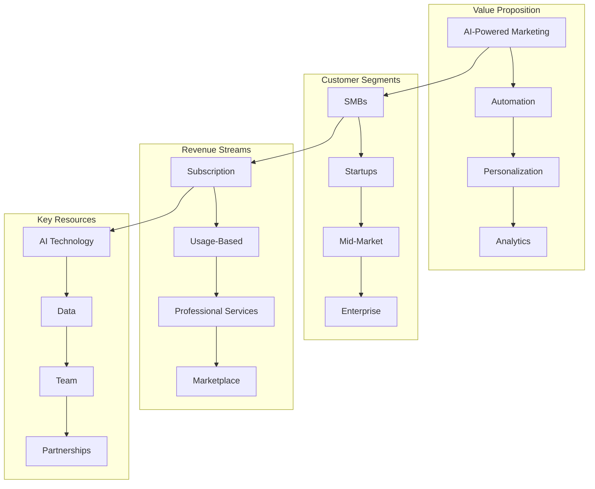

# 💼 Estrategia de Negocio - FRONTIER

> **Documentación completa de la estrategia de negocio, modelo de ingresos, mercado objetivo y plan de crecimiento de FRONTIER**

## 📋 Tabla de Contenidos

- [🎯 Visión y Misión](#-visión-y-misión)
- [📊 Análisis de Mercado](#-análisis-de-mercado)
- [🎪 Modelo de Negocio](#-modelo-de-negocio)
- [👥 Mercado Objetivo](#-mercado-objetivo)
- [💰 Modelo de Ingresos](#-modelo-de-ingresos)
- [🚀 Estrategia de Crecimiento](#-estrategia-de-crecimiento)
- [🏆 Ventaja Competitiva](#-ventaja-competitiva)
- [📈 Métricas de Negocio](#-métricas-de-negocio)
- [🌍 Expansión Internacional](#-expansión-internacional)
- [🔮 Roadmap de Producto](#-roadmap-de-producto)

## 🎯 Visión y Misión

### 🌟 Visión
**"Ser la plataforma de marketing con IA más avanzada del mundo, democratizando el acceso a tecnologías de marketing de nivel enterprise para empresas de todos los tamaños."**

### 🎯 Misión
**"Empoderar a empresas y marketers con herramientas de IA que automatizan, optimizan y maximizan el ROI de sus campañas de marketing, mientras mantienen la creatividad y personalización humana."**

### 🎪 Valores Corporativos
- **Innovación**: Liderar con tecnología de vanguardia
- **Transparencia**: Comunicación clara y honesta
- **Excelencia**: Calidad superior en todo lo que hacemos
- **Colaboración**: Trabajo en equipo y asociaciones estratégicas
- **Sostenibilidad**: Impacto positivo en la sociedad y el medio ambiente

## 📊 Análisis de Mercado

### 📈 Tamaño del Mercado

#### Mercado Total Direccionable (TAM)
- **Marketing Automation**: $6.4B (2024) → $8.42B (2027)
- **AI in Marketing**: $15.84B (2024) → $107.5B (2028)
- **Marketing Analytics**: $4.6B (2024) → $8.2B (2027)
- **Social Media Management**: $15.6B (2024) → $41.6B (2027)

#### Mercado Direccionable (SAM)
- **SaaS Marketing Tools**: $2.1B (2024) → $3.8B (2027)
- **AI-Powered Marketing Platforms**: $1.2B (2024) → $4.5B (2027)
- **Mid-Market Marketing Solutions**: $800M (2024) → $1.5B (2027)

#### Mercado Objetivo (SOM)
- **Nuestro Mercado Inicial**: $50M (2024) → $200M (2027)
- **Penetración Objetivo**: 2-5% del SAM en 3 años

### 🎯 Análisis de la Competencia

#### Competidores Directos
1. **HubSpot**
   - Fortalezas: CRM integrado, ecosistema completo
   - Debilidades: IA limitada, precios altos
   - Market Share: 15%

2. **Marketo (Adobe)**
   - Fortalezas: Enterprise features, integración Adobe
   - Debilidades: Complejidad, curva de aprendizaje
   - Market Share: 12%

3. **Pardot (Salesforce)**
   - Fortalezas: Integración Salesforce, B2B focus
   - Debilidades: Limitado para B2C, precios premium
   - Market Share: 10%

#### Competidores Indirectos
- **Canva**: Diseño visual, pero sin automatización
- **Hootsuite**: Social media, pero sin IA avanzada
- **Mailchimp**: Email marketing, pero limitado en IA

### 📊 Tendencias del Mercado

#### Tendencias Tecnológicas
- **IA Generativa**: Crecimiento del 300% anual
- **Automatización**: 78% de empresas planean aumentar inversión
- **Personalización**: 91% de consumidores prefieren marcas personalizadas
- **Video Marketing**: 85% de empresas usan video en marketing

#### Tendencias de Comportamiento
- **Remote Work**: 42% de la fuerza laboral es remota
- **Mobile-First**: 60% del tráfico web es móvil
- **Sustainability**: 73% de consumidores prefieren marcas sostenibles
- **Privacy**: 87% de consumidores preocupados por privacidad

## 🎪 Modelo de Negocio

### 🏗️ Arquitectura del Modelo



### 🎯 Propuesta de Valor

#### Para SMBs y Startups
- **Costo-Efectivo**: 70% menos costoso que soluciones enterprise
- **Fácil Implementación**: Setup en 24 horas vs. 3-6 meses
- **ROI Rápido**: Resultados en 30 días vs. 6-12 meses
- **Sin Curva de Aprendizaje**: Interfaz intuitiva y AI-guided

#### Para Mid-Market
- **Escalabilidad**: Crece con el negocio sin limitaciones
- **Integración**: Conecta con 200+ herramientas existentes
- **Personalización**: Adaptable a cualquier industria
- **Soporte Dedicado**: Account management y training

#### Para Enterprise
- **Enterprise Features**: SSO, audit logs, compliance
- **White-label**: Solución personalizable para clientes
- **API-First**: Integración profunda con sistemas existentes
- **SLA Garantizado**: 99.9% uptime con soporte 24/7

## 👥 Mercado Objetivo

### 🎯 Segmentación de Clientes

#### Segmento 1: SMBs (Small & Medium Businesses)
- **Tamaño**: 10-500 empleados
- **Ingresos**: $1M - $50M anuales
- **Industrias**: Retail, E-commerce, Services, SaaS
- **Pain Points**: 
  - Presupuestos limitados para marketing
  - Falta de expertise en marketing digital
  - Necesidad de automatización simple
- **Tamaño del Segmento**: 2.5M empresas en US/EU

#### Segmento 2: Startups y Scale-ups
- **Tamaño**: 1-50 empleados
- **Ingresos**: $100K - $10M anuales
- **Industrias**: Tech, Fintech, Healthtech, Edtech
- **Pain Points**:
  - Necesidad de crecimiento rápido
  - Recursos limitados
  - Necesidad de data-driven decisions
- **Tamaño del Segmento**: 500K startups activas

#### Segmento 3: Mid-Market
- **Tamaño**: 500-2000 empleados
- **Ingresos**: $50M - $500M anuales
- **Industrias**: Manufacturing, Healthcare, Financial Services
- **Pain Points**:
  - Necesidad de escalabilidad
  - Integración con sistemas legacy
  - Compliance y seguridad
- **Tamaño del Segmento**: 50K empresas

#### Segmento 4: Enterprise
- **Tamaño**: 2000+ empleados
- **Ingresos**: $500M+ anuales
- **Industrias**: Fortune 500, Government, Non-profit
- **Pain Points**:
  - Complejidad organizacional
  - Necesidad de customización
  - Compliance estricto
- **Tamaño del Segmento**: 5K empresas

### 🎪 Buyer Personas

#### Persona 1: Sarah - Marketing Manager (SMB)
- **Edad**: 32 años
- **Rol**: Marketing Manager en empresa de 50 empleados
- **Desafíos**: 
  - Gestión manual de campañas
  - Falta de tiempo para análisis
  - Presupuesto limitado
- **Objetivos**:
  - Automatizar procesos repetitivos
  - Mejorar ROI de campañas
  - Generar más leads cualificados
- **Influencers**: CEO, Sales Director
- **Budget**: $500-2000/mes

#### Persona 2: David - CMO (Mid-Market)
- **Edad**: 45 años
- **Rol**: CMO en empresa de 500 empleados
- **Desafíos**:
  - Integración de múltiples herramientas
  - Reporting complejo
  - Escalabilidad de procesos
- **Objetivos**:
  - Unificar stack de marketing
  - Mejorar visibilidad de performance
  - Optimizar costos operativos
- **Influencers**: CEO, CFO, IT Director
- **Budget**: $5000-15000/mes

#### Persona 3: Jennifer - VP Marketing (Enterprise)
- **Edad**: 50 años
- **Rol**: VP Marketing en Fortune 500
- **Desafíos**:
  - Compliance y seguridad
  - Integración con sistemas legacy
  - Gestión de equipos distribuidos
- **Objetivos**:
  - Implementar governance
  - Mejorar eficiencia operativa
  - Reducir vendor sprawl
- **Influencers**: CEO, CTO, Legal, Procurement
- **Budget**: $25000+/mes

## 💰 Modelo de Ingresos

### 🎯 Estrategia de Pricing

#### Tier 1: Starter ($99/mes)
- **Target**: SMBs y Startups
- **Features**:
  - 5 campañas simultáneas
  - 10K emails/mes
  - 1 usuario
  - Soporte por email
  - Templates básicos
- **Revenue per Customer**: $1,188/año

#### Tier 2: Professional ($299/mes)
- **Target**: Mid-Market
- **Features**:
  - 25 campañas simultáneas
  - 100K emails/mes
  - 5 usuarios
  - Soporte prioritario
  - AI content generation
  - Analytics avanzados
- **Revenue per Customer**: $3,588/año

#### Tier 3: Enterprise ($999/mes)
- **Target**: Enterprise
- **Features**:
  - Campañas ilimitadas
  - Emails ilimitados
  - Usuarios ilimitados
  - Soporte 24/7
  - Custom integrations
  - White-label options
  - SLA garantizado
- **Revenue per Customer**: $11,988/año

#### Tier 4: Custom (Pricing on request)
- **Target**: Large Enterprise
- **Features**:
  - Custom development
  - On-premise deployment
  - Dedicated support
  - Custom SLA
  - Training programs
- **Revenue per Customer**: $50K-500K/año

### 📊 Proyecciones de Ingresos

#### Año 1 (2024)
- **Customers**: 500
- **ARPU**: $2,500
- **ARR**: $1.25M
- **Growth Rate**: 20% MoM

#### Año 2 (2025)
- **Customers**: 2,000
- **ARPU**: $3,200
- **ARR**: $6.4M
- **Growth Rate**: 15% MoM

#### Año 3 (2026)
- **Customers**: 5,000
- **ARPU**: $4,000
- **ARR**: $20M
- **Growth Rate**: 10% MoM

#### Año 4 (2027)
- **Customers**: 10,000
- **ARPU**: $4,500
- **ARR**: $45M
- **Growth Rate**: 8% MoM

### 💡 Revenue Streams Adicionales

#### 1. Professional Services (20% de revenue)
- **Implementation**: $5K-50K por proyecto
- **Training**: $2K-10K por programa
- **Consulting**: $200-500/hora
- **Custom Development**: $100K-1M por proyecto

#### 2. Marketplace (10% de revenue)
- **Commission**: 30% de transacciones
- **Listing Fees**: $100-1000/mes
- **Premium Listings**: $500-5000/mes
- **API Access**: $0.01-0.10 por request

#### 3. Data & Analytics (5% de revenue)
- **Benchmarking Reports**: $1K-10K
- **Industry Insights**: $5K-50K
- **Custom Analytics**: $10K-100K
- **Data Licensing**: $100K-1M

## 🚀 Estrategia de Crecimiento

### 📈 Go-to-Market Strategy

#### Fase 1: Product-Market Fit (Meses 1-6)
- **Objetivo**: Validar producto con 100 early adopters
- **Estrategia**: 
  - Beta cerrado con 50 empresas
  - Feedback intensivo y iteración rápida
  - Casos de estudio y testimonios
- **Métricas**:
  - NPS > 50
  - Retention > 80%
  - Referral rate > 30%

#### Fase 2: Early Growth (Meses 7-18)
- **Objetivo**: Escalar a 1,000 customers
- **Estrategia**:
  - Inbound marketing intensivo
  - Content marketing y SEO
  - Partnership con consultoras
- **Métricas**:
  - CAC < $500
  - LTV > $5,000
  - LTV/CAC > 10

#### Fase 3: Scale (Meses 19-36)
- **Objetivo**: Llegar a 5,000 customers
- **Estrategia**:
  - Sales team expansion
  - Channel partnerships
  - International expansion
- **Métricas**:
  - CAC < $800
  - LTV > $8,000
  - LTV/CAC > 10

#### Fase 4: Market Leadership (Meses 37+)
- **Objetivo**: Liderar el mercado
- **Estrategia**:
  - M&A estratégico
  - Platform expansion
  - Ecosystem development
- **Métricas**:
  - Market share > 5%
  - Revenue > $100M ARR
  - Profitability > 20%

### 🎯 Canales de Adquisición

#### Canal 1: Inbound Marketing (40% de leads)
- **SEO**: Content marketing, keyword optimization
- **Content**: Blog, webinars, whitepapers, case studies
- **Social Media**: LinkedIn, Twitter, YouTube
- **Email Marketing**: Nurture campaigns, newsletters
- **Webinars**: Educational content, product demos

#### Canal 2: Sales Directo (30% de leads)
- **Inside Sales**: SDRs para prospecting
- **Field Sales**: AEs para enterprise deals
- **Account Management**: Upsell y cross-sell
- **Demo Requests**: Product demonstrations
- **Free Trials**: Self-service onboarding

#### Canal 3: Partnerships (20% de leads)
- **System Integrators**: Accenture, Deloitte, PwC
- **Technology Partners**: Salesforce, HubSpot, Microsoft
- **Channel Partners**: Resellers y distributors
- **Agency Partners**: Marketing agencies
- **Referral Program**: Customer referrals

#### Canal 4: Events (10% de leads)
- **Trade Shows**: Marketing conferences, industry events
- **Webinars**: Educational and product webinars
- **User Conferences**: Annual customer conference
- **Meetups**: Local marketing meetups
- **Speaking**: Industry conferences y podcasts

### 📊 Estrategia de Retención

#### Customer Success Program
- **Onboarding**: 30-day success program
- **Health Scoring**: Predictive churn detection
- **Proactive Outreach**: Regular check-ins
- **Training**: Continuous education programs
- **Community**: User community y forums

#### Product-Led Growth
- **Freemium**: Free tier con upgrade path
- **Viral Features**: Shareable content y reports
- **Self-Service**: Easy setup y configuration
- **In-App Guidance**: Product tours y tips
- **Feature Adoption**: Usage analytics y recommendations

## 🏆 Ventaja Competitiva

### 🎯 Diferenciadores Clave

#### 1. AI-First Architecture
- **Deep Learning**: Modelos entrenados específicamente para marketing
- **Real-time Processing**: Decisiones en tiempo real
- **Continuous Learning**: Mejora automática con más datos
- **Multi-modal AI**: Text, image, video, audio processing

#### 2. Unified Platform
- **Single Source of Truth**: Todos los datos en una plataforma
- **Seamless Integration**: 200+ integraciones nativas
- **Cross-Channel**: Coordinación entre todos los canales
- **Real-time Sync**: Sincronización en tiempo real

#### 3. Industry Expertise
- **Vertical Solutions**: Soluciones específicas por industria
- **Best Practices**: Templates y workflows probados
- **Compliance**: Built-in compliance para regulaciones
- **Localization**: Soporte para mercados locales

#### 4. Developer-Friendly
- **API-First**: APIs completas y bien documentadas
- **Webhooks**: Event-driven architecture
- **SDKs**: SDKs para múltiples lenguajes
- **Custom Extensions**: Marketplace de extensiones

### 🛡️ Barreras de Entrada

#### 1. Data Network Effects
- **More Data = Better AI**: Mejores predicciones con más datos
- **Benchmarking**: Comparaciones con industria
- **Insights**: Insights únicos de datos agregados
- **Switching Costs**: Costo de migración aumenta con el tiempo

#### 2. Technology Moat
- **Proprietary Algorithms**: Algoritmos únicos y patentados
- **Infrastructure**: Infraestructura escalable y confiable
- **Integration Complexity**: Complejidad de integraciones
- **Performance**: Rendimiento superior a competidores

#### 3. Brand and Trust
- **Thought Leadership**: Liderazgo en marketing con IA
- **Customer Success**: Casos de éxito comprobados
- **Industry Recognition**: Premios y reconocimientos
- **Security**: Certificaciones de seguridad y compliance

## 📈 Métricas de Negocio

### 🎯 Métricas Clave (KPIs)

#### Métricas de Crecimiento
- **Monthly Recurring Revenue (MRR)**: $100K → $1M → $10M
- **Annual Recurring Revenue (ARR)**: $1.2M → $12M → $120M
- **Customer Acquisition Cost (CAC)**: $500 → $800 → $1,200
- **Customer Lifetime Value (LTV)**: $5,000 → $8,000 → $12,000
- **LTV/CAC Ratio**: 10:1 → 10:1 → 10:1

#### Métricas de Producto
- **Monthly Active Users (MAU)**: 1K → 10K → 100K
- **Feature Adoption Rate**: 60% → 70% → 80%
- **Time to Value**: 7 días → 3 días → 1 día
- **Net Promoter Score (NPS)**: 50 → 60 → 70
- **Customer Satisfaction (CSAT)**: 4.2 → 4.5 → 4.8

#### Métricas de Operación
- **Gross Revenue Retention**: 95% → 97% → 98%
- **Net Revenue Retention**: 120% → 130% → 140%
- **Churn Rate**: 5% → 3% → 2%
- **Support Ticket Volume**: 100 → 500 → 2,000
- **First Response Time**: 4h → 2h → 1h

### 📊 Dashboard de Métricas

#### Executive Dashboard
```javascript
// Métricas principales para ejecutivos
const executiveMetrics = {
  revenue: {
    mrr: 125000, // Monthly Recurring Revenue
    arr: 1500000, // Annual Recurring Revenue
    growthRate: 0.15 // 15% monthly growth
  },
  customers: {
    total: 1250,
    newThisMonth: 150,
    churnedThisMonth: 25,
    netGrowth: 125
  },
  unitEconomics: {
    cac: 750, // Customer Acquisition Cost
    ltv: 8000, // Customer Lifetime Value
    ltvCacRatio: 10.7,
    paybackPeriod: 8.5 // months
  },
  product: {
    mau: 8500, // Monthly Active Users
    dau: 3200, // Daily Active Users
    nps: 58,
    csat: 4.3
  }
};
```

#### Product Dashboard
```javascript
// Métricas de producto para PMs
const productMetrics = {
  usage: {
    sessionsPerUser: 12.5,
    avgSessionDuration: 18, // minutes
    featureAdoptionRate: 0.68,
    timeToFirstValue: 3.2 // days
  },
  engagement: {
    dailyActiveUsers: 3200,
    weeklyActiveUsers: 6800,
    monthlyActiveUsers: 8500,
    stickiness: 0.38 // DAU/MAU
  },
  retention: {
    day1: 0.85,
    day7: 0.72,
    day30: 0.58,
    day90: 0.42
  }
};
```

#### Sales Dashboard
```javascript
// Métricas de ventas para sales team
const salesMetrics = {
  pipeline: {
    totalValue: 2500000,
    qualifiedLeads: 450,
    conversionRate: 0.22,
    avgDealSize: 5500
  },
  performance: {
    quota: 150000, // monthly
    actual: 125000,
    attainment: 0.83,
    forecast: 140000
  },
  activities: {
    calls: 1200,
    demos: 180,
    proposals: 95,
    closes: 21
  }
};
```

## 🌍 Expansión Internacional

### 🗺️ Estrategia de Expansión

#### Fase 1: English-Speaking Markets (Meses 1-12)
- **Mercados**: UK, Canada, Australia, New Zealand
- **Estrategia**: 
  - Localización de producto
  - Partnerships locales
  - Content marketing local
- **Objetivo**: 20% de revenue internacional

#### Fase 2: European Markets (Meses 13-24)
- **Mercados**: Germany, France, Spain, Italy, Netherlands
- **Estrategia**:
  - Oficinas locales
  - Compliance GDPR
  - Partnerships con consultoras locales
- **Objetivo**: 40% de revenue internacional

#### Fase 3: Asia-Pacific (Meses 25-36)
- **Mercados**: Japan, Singapore, India, South Korea
- **Estrategia**:
  - Joint ventures
  - Local development teams
  - Cultural adaptation
- **Objetivo**: 60% de revenue internacional

#### Fase 4: Emerging Markets (Meses 37+)
- **Mercados**: Brazil, Mexico, Argentina, Chile
- **Estrategia**:
  - Franchise model
  - Local partners
  - Price adaptation
- **Objetivo**: 80% de revenue internacional

### 🌐 Localización

#### Product Localization
- **Languages**: 15+ idiomas principales
- **Currencies**: 25+ monedas locales
- **Time Zones**: Soporte para todos los time zones
- **Cultural Adaptation**: Adaptación cultural de contenido

#### Legal & Compliance
- **GDPR**: Compliance completo en EU
- **CCPA**: Compliance en California
- **Local Regulations**: Compliance por país
- **Data Residency**: Datos almacenados localmente

#### Go-to-Market Local
- **Local Teams**: Equipos locales en cada mercado
- **Partnerships**: Partners locales establecidos
- **Content**: Contenido localizado y relevante
- **Support**: Soporte en idioma local

## 🔮 Roadmap de Producto

### 📅 Roadmap 2024

#### Q1 2024: Foundation
- **Core Platform**: MVP con funcionalidades básicas
- **AI Engine**: Motor de IA básico
- **Integrations**: 50+ integraciones principales
- **Mobile App**: App móvil básica

#### Q2 2024: Growth
- **Advanced AI**: IA avanzada y personalización
- **Analytics**: Dashboard de analytics completo
- **Automation**: Workflows de automatización
- **API**: APIs completas y documentación

#### Q3 2024: Scale
- **Enterprise Features**: SSO, audit logs, compliance
- **Marketplace**: Marketplace de extensiones
- **White-label**: Opciones de white-label
- **International**: Soporte multi-idioma

#### Q4 2024: Innovation
- **AI Studio**: Herramientas de IA para usuarios
- **Predictive Analytics**: Analytics predictivos
- **Voice Interface**: Interfaz de voz
- **AR/VR**: Soporte para realidad aumentada

### 📅 Roadmap 2025

#### Q1 2025: AI Revolution
- **GPT Integration**: Integración con GPT-5
- **Multimodal AI**: IA para texto, imagen, video, audio
- **Real-time AI**: Decisiones de IA en tiempo real
- **AI Agents**: Agentes de IA autónomos

#### Q2 2025: Platform Expansion
- **E-commerce**: Soluciones completas de e-commerce
- **CRM Integration**: CRM nativo integrado
- **Marketing Automation**: Automatización avanzada
- **Customer Experience**: Plataforma de CX

#### Q3 2025: Ecosystem
- **Developer Platform**: Plataforma para desarrolladores
- **App Store**: Tienda de aplicaciones
- **Third-party Apps**: Apps de terceros
- **API Economy**: Economía de APIs

#### Q4 2025: Future Tech
- **Quantum Computing**: Experimentos con computación cuántica
- **Blockchain**: Integración con blockchain
- **IoT**: Soporte para Internet of Things
- **Edge Computing**: Computación en el borde

### 🎯 Innovation Pipeline

#### Short-term (6-12 meses)
- **Voice Marketing**: Marketing por voz
- **Video AI**: IA para creación de video
- **Predictive Customer Journey**: Predicción de customer journey
- **Real-time Personalization**: Personalización en tiempo real

#### Medium-term (1-2 años)
- **AI Marketing Assistant**: Asistente de IA para marketing
- **Autonomous Campaigns**: Campañas completamente autónomas
- **Emotional AI**: IA que detecta emociones
- **Cross-reality Marketing**: Marketing en realidad mixta

#### Long-term (2-5 años)
- **Conscious AI**: IA con conciencia artificial
- **Quantum Marketing**: Marketing cuántico
- **Neural Marketing**: Marketing basado en redes neuronales
- **Transcendent AI**: IA trascendente

---

<div align="center">

**💼 ¿Listo para revolucionar el marketing con IA?**

[Ver Plan de Negocio Completo](https://business.frontier-ai.com) | [Inversión](https://invest.frontier-ai.com) | [Partnerships](mailto:partnerships@frontier-ai.com)

</div>

