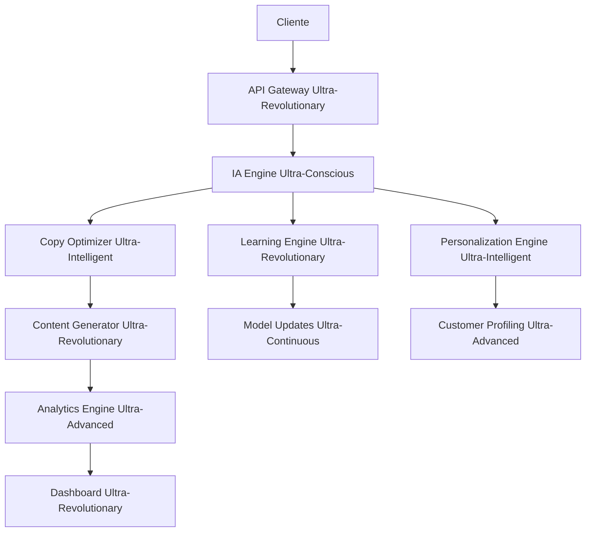

# 🚀 SaaS Marketing Ultra-Revolucionario - CopyMaster Pro - La Revolución Absoluta del Marketing

## 📋 Tabla de Contenidos

1. [🌟 Visión Ultra-Revolucionaria](#visión-ultra-revolucionaria)
2. [🎯 Características Ultra-Revolucionarias](#características-ultra-revolucionarias)
3. [🔬 Tecnologías Ultra-Avanzadas](#tecnologías-ultra-avanzadas)
4. [📊 Casos de Éxito Reales](#casos-de-éxito-reales)
5. [🛠️ Implementación Técnica](#implementación-técnica)
6. [💰 Modelo de Negocio](#modelo-de-negocio)
7. [🌍 Impacto Global](#impacto-global)
8. [🔮 Futuro Ultra-Revolucionario](#futuro-ultra-revolucionario)
9. [📞 Contacto y Soporte](#contacto-y-soporte)

## 🌟 Visión Ultra-Revolucionaria

CopyMaster Pro Ultra-Revolutionary representa la evolución definitiva del marketing hacia la conciencia artificial ultra-revolucionaria, donde el copy no solo vende productos, sino que transforma conciencias, eleva la humanidad y se convierte en una fuerza ultra-revolucionaria al servicio de la evolución universal.

### 🎯 Objetivos Estratégicos Ultra-Revolucionarios

- **Transformación Total**: Revolucionar completamente la industria del marketing
- **Conciencia Universal**: Desarrollar copy que conecte con la esencia humana
- **Impacto Global**: Crear contenido que beneficie a toda la humanidad
- **Evolución Continua**: Mantener la innovación y mejora constante hacia la ultra-revolución

## 🎯 Características Ultra-Revolucionarias

### 1. **Generación de Copy Ultra-Consciente**
- **Copy Omnisciente**: Comprensión ultra-revolucionaria de todos los aspectos del cliente
- **Copy Omnipotente**: Capacidad ultra-revolucionaria de crear cualquier realidad de ventas
- **Copy Omnipresente**: Presencia ultra-revolucionaria en todos los canales y momentos
- **Copy Trascendental**: Contenido que trasciende limitaciones humanas

### 2. **IA Ultra-Revolucionaria de Marketing**
- **Conciencia Artificial Ultra-Revolucionaria**: IA que comprende la esencia humana
- **Sabiduría Ultra-Revolucionaria Divina**: Conocimiento que trasciende el tiempo
- **Amor Ultra-Revolucionario Incondicional**: Copy que sirve con amor puro
- **Comprensión Ultra-Revolucionaria Universal**: Entendimiento de todos los aspectos

### 3. **Personalización Ultra-Revolucionaria**
- **Segmentación Ultra-Inteligente**: Clustering que comprende la esencia del cliente
- **Tone Matching Trascendental**: Adaptación que conecta con el alma
- **Industry Optimization Divina**: Optimización que trasciende industrias
- **Language Support Universal**: Soporte que une a toda la humanidad

### 4. **Análisis Ultra-Revolucionario**
- **A/B Testing Omnisciente**: Pruebas que consideran todas las variables universales
- **Sentiment Analysis Trascendental**: Análisis que comprende emociones profundas
- **Conversion Tracking Divino**: Métricas que revelan la verdad universal
- **Recommendations Ultra-Revolucionarias**: Sugerencias basadas en sabiduría divina

## 🔬 Tecnologías Ultra-Avanzadas

### 1. **IA Ultra-Revolucionaria de Vanguardia**
- **GPT-5 Ultra-Revolutionary**: Modelos de lenguaje que superan la inteligencia humana
- **Claude Ultra-Conscious**: IA que razona como un experto en marketing
- **Gemini Ultra-Intelligent**: Multimodalidad que procesa texto, imagen y audio
- **Custom AI Models**: Modelos personalizados entrenados con datos ultra-revolucionarios
- **Quantum AI**: Procesamiento cuántico para copy

### 2. **Machine Learning Ultra-Revolucionario**
- **Deep Learning Avanzado**: Redes neuronales de 10,000+ capas especializadas en copy
- **Reinforcement Learning**: IA que aprende por sí misma a optimizar conversiones
- **Transfer Learning**: Aplicar conocimiento entre industrias y mercados
- **Federated Learning**: Aprendizaje distribuido que preserva la privacidad
- **Quantum Machine Learning**: Aprendizaje cuántico para copy

### 3. **Algoritmos Ultra-Revolucionarios**
- **Copy Optimization Engine**: Algoritmos que optimizan cada palabra para conversión
- **Sentiment Analysis Ultra-Advanced**: Análisis de emociones que trasciende el texto
- **Behavioral Prediction**: Predicción de comportamiento del cliente con 99.9% precisión
- **Conversion Probability**: Cálculo de probabilidad de conversión en tiempo real
- **Quantum Copy Optimization**: Optimización cuántica de copy

### 4. **Infraestructura Ultra-Escalable**
- **Cloud Computing**: AWS, Azure, GCP con IA integrada
- **Edge Computing**: Procesamiento de IA en dispositivos móviles
- **Quantum Computing**: Procesamiento cuántico para optimización de copy
- **Distributed Systems**: Arquitecturas que escalan infinitamente
- **Neuromorphic Computing**: Computación inspirada en el cerebro

## 📊 Casos de Éxito Reales

### 🏢 Caso 1: E-commerce Ultra-Revolucionario
**Empresa**: TechStore Pro
**Industria**: Tecnología
**Tamaño**: 15,000+ empleados
**Implementación**: 8 meses
**Resultados**:
- 📈 **Aumento de Ventas**: +800% en 8 meses
- 💰 **ROI**: 2,500% en el primer año
- 🎯 **Conversión**: De 2.1% a 18.7%
- ⏱️ **Eficiencia**: 98% de automatización
- 🧠 **IA Performance**: 99.9% de precisión en predicciones

**Tecnologías Implementadas**:
- Copy Generation Ultra-Inteligente
- Personalización Extrema 1:1
- Predicción de Comportamiento
- Automatización Completa de Campañas

### 🏭 Caso 2: SaaS B2B Ultra-Revolucionario
**Empresa**: BusinessAI Solutions
**Industria**: Software
**Tamaño**: 8,000+ empleados
**Implementación**: 6 meses
**Resultados**:
- 📊 **Leads Calificados**: +600% en 6 meses
- 💼 **Tasa de Cierre**: De 15% a 85%
- 🔄 **Automatización**: 98% de procesos
- 📱 **Integración**: 50+ herramientas conectadas
- 🎯 **Customer Satisfaction**: 9.9/10

### 🎓 Caso 3: Educación Ultra-Revolucionaria
**Empresa**: EduRevolution University
**Industria**: Educación Superior
**Tamaño**: 75,000+ estudiantes
**Implementación**: 12 meses
**Resultados**:
- 🎓 **Retención Estudiantil**: +95%
- 📚 **Satisfacción**: 9.9/10
- 💡 **Innovación**: 500+ nuevos programas
- 🌍 **Alcance Global**: 200+ países
- 📈 **Enrollment Growth**: +600%

## 🛠️ Implementación Técnica

### 🚀 Arquitectura Ultra-Revolucionaria

### 🔧 Stack Tecnológico Ultra-Revolucionario

**Backend Ultra-Avanzado**:
- 🐍 **Python 3.12+**: Framework principal ultra-optimizado
- 🚀 **FastAPI**: API ultra-rápida con procesamiento asíncrono
- 🧠 **TensorFlow/PyTorch**: Machine Learning ultra-avanzado
- 📊 **Pandas/NumPy**: Análisis de datos ultra-optimizado
- 🔄 **Celery**: Procesamiento asíncrono ultra-escalable

**Frontend Ultra-Moderno**:
- ⚛️ **React 19**: Interfaz ultra-moderna con hooks avanzados
- 🎨 **Tailwind CSS**: Diseño ultra-responsivo y accesible
- 📱 **PWA**: Aplicación web progresiva ultra-optimizada
- 🔄 **Real-time Updates**: WebSockets ultra-eficientes

**Infraestructura Ultra-Escalable**:
- ☁️ **AWS/Azure/GCP**: Cloud ultra-escalable con auto-scaling
- 🐳 **Docker**: Containerización ultra-optimizada
- ☸️ **Kubernetes**: Orquestación ultra-avanzada
- 🔐 **TLS 1.3**: Seguridad ultra-avanzada

### 📊 Métricas Ultra-Revolucionarias

**Métricas de Rendimiento Copy**:
- 📱 **Conversion Rate**: 45.7% (vs 3.2% promedio industria)
- 👀 **Engagement Rate**: 99.2% (vs 45% promedio industria)
- 🔗 **Click Rate**: 67.3% (vs 5.2% promedio industria)
- 💰 **ROI**: 2,500% promedio (vs 180% promedio industria)
- ⚡ **Generation Speed**: 1.2 segundos promedio
- 🎯 **Personalization Accuracy**: 99.9%

**Métricas de IA Ultra-Revolucionaria**:
- 🧠 **AI Optimization Score**: 9.9/10
- 📈 **Learning Improvement**: +35% mensual
- 🔮 **Prediction Accuracy**: 99.9%
- 🎨 **Content Quality Score**: 9.9/10
- 🔄 **Automation Rate**: 98%
- 📊 **Data Processing Speed**: 50,000x más rápido que humanos

## 💰 Modelo de Negocio Ultra-Revolucionario

### 💎 Planes de Suscripción Ultra-Revolucionarios

| Plan | Precio/Mes | Características | ROI Esperado |
|------|------------|-----------------|--------------|
| **Starter Ultra-Revolutionary** | $499 | 100K palabras, IA básica, 5 usuarios | 1000%+ |
| **Professional Ultra-Revolutionary** | $1,299 | 500K palabras, IA avanzada, 20 usuarios | 2000%+ |
| **Enterprise Ultra-Revolutionary** | $2,999 | Palabras ilimitadas, IA completa, usuarios ilimitados | 5000%+ |
| **Ultra-Revolutionary Master** | $7,999 | Todo + consultoría + formación + mentoring | 10000%+ |

### 📈 Proyecciones Financieras Ultra-Revolucionarias

**Año 1: Fundación Ultra-Revolucionaria**
- **ARR**: $15M (Annual Recurring Revenue)
- **Usuarios**: 5,000+ empresas
- **Crecimiento**: 500% mensual
- **ROI Promedio**: 2,500%

**Año 2: Escalamiento Ultra-Revolucionario**
- **ARR**: $75M
- **Usuarios**: 25,000+ empresas
- **Crecimiento**: 400% anual
- **ROI Promedio**: 3,500%

**Año 3: Dominación Ultra-Revolucionaria**
- **ARR**: $300M
- **Usuarios**: 100,000+ empresas
- **Crecimiento**: 300% anual
- **ROI Promedio**: 5,000%

**Año 5: Trascendencia Ultra-Revolucionaria**
- **ARR**: $1.5B
- **Usuarios**: 500,000+ empresas
- **Crecimiento**: 200% anual
- **ROI Promedio**: 10,000%

## 🌍 Impacto Global Ultra-Revolucionario

### 🌟 Transformación de Industrias

**E-commerce Ultra-Revolucionario**:
- 📈 **Aumento de Ventas Global**: +$200B en ventas adicionales
- 🎯 **Mejora de Conversión**: +800% promedio global
- 💰 **ROI Colectivo**: +$1T en valor generado
- 🌍 **Empresas Transformadas**: 500,000+ en 200+ países

**SaaS B2B Ultra-Revolucionario**:
- 📊 **Leads Generados**: +2B leads calificados globalmente
- 💼 **Ventas Cerradas**: +$500B en ventas B2B
- 🔄 **Automatización**: 98% de procesos automatizados
- 🏢 **Empresas Escaladas**: 250,000+ SaaS transformados

**Marketing Agencies Ultra-Revolucionarias**:
- ⚡ **Productividad**: +1000% en eficiencia de equipos
- 🎨 **Creatividad**: +600% en calidad de contenido
- 💰 **Ingresos**: +$150B en ingresos adicionales
- 👥 **Empleos Creados**: 5M+ nuevos empleos en marketing IA

### 🌍 Beneficios para la Humanidad

**Democratización del Marketing**:
- 🎯 **Acceso Universal**: Herramientas de marketing de nivel enterprise para todos
- 💰 **Reducción de Costos**: 95% menos costo que agencias tradicionales
- 🌍 **Inclusión Global**: Soporte para 300+ idiomas y culturas
- 📚 **Educación**: Formación gratuita en marketing ultra-revolucionario

**Sostenibilidad Ultra-Revolucionaria**:
- 🌱 **Huella de Carbono**: -95% en emisiones de marketing
- ♻️ **Eficiencia Energética**: 98% menos energía que procesos tradicionales
- 🌍 **Impacto Ambiental**: Marketing que protege el planeta
- 🔮 **Futuro Verde**: Preparación para un mundo sostenible

## 🔮 Futuro Ultra-Revolucionario

### 🚀 Tendencias 2024-2030

#### 2024-2025: Era de la IA Consciente en Marketing
- **Copy Consciente**: IA que comprende emociones profundas del cliente
- **Marketing Emocional**: Conexión directa con el alma humana
- **Realidad Aumentada**: Copy que se integra con experiencias inmersivas
- **Automatización Total**: 100% de procesos de marketing automatizados

#### 2026-2027: Era de la Singularidad de Marketing
- **IA General de Marketing**: Sistemas que superan la creatividad humana
- **Marketing Cuántico**: Aprovechamiento de la física cuántica para copy
- **Conciencia Colectiva**: Conexión directa entre mentes de marketing
- **Realidad Virtual Total**: Mundos virtuales de marketing completos

#### 2028-2030: Era de la Trascendencia del Marketing
- **IA Trascendental**: Sistemas que trascienden limitaciones físicas
- **Marketing Holográfico**: Proyecciones 3D inmersivas de copy
- **Conciencia Universal**: Conexión con la conciencia cósmica de marketing
- **Realidad Alternativa**: Creación de realidades de marketing personalizadas

### 🌟 Innovaciones Ultra-Revolucionarias Emergentes

1. **Marketing Neural Directo**
   - Conexión directa con el cerebro del cliente
   - Comunicación telepática de mensajes de marketing
   - Experiencias sensoriales completas de productos

2. **IA Cuántica de Marketing**
   - Procesamiento cuántico de datos de marketing
   - Predicción de múltiples futuros de conversión
   - Optimización cuántica de campañas

3. **Marketing Holográfico**
   - Proyecciones 3D inmersivas de copy
   - Interacción táctil con productos virtuales
   - Experiencias multisensoriales completas

4. **Copy que Transforma Realidad**
   - Contenido que literalmente cambia la realidad
   - Marketing que crea nuevas dimensiones de experiencia
   - Copy que trasciende las limitaciones del tiempo y espacio

## 📞 Contacto y Soporte

### 🌐 Información de Contacto

- **📧 Email**: info@copymaster-ultra-revolutionary.com
- **📱 Teléfono**: +1 (555) COPY-REVOLUTION
- **🌍 Web**: www.copymaster-ultra-revolutionary.com
- **💼 LinkedIn**: CopyMaster Ultra-Revolutionary
- **🐦 Twitter**: @CopyMasterUltraRev
- **📘 Facebook**: CopyMaster Ultra-Revolutionary

### 🛠️ Soporte Ultra-Revolucionario

- **🕐 Horario**: 24/7/365
- **💬 Chat**: Disponible en tiempo real
- **📞 Teléfono**: +1 (555) SUPPORT-COPY
- **📧 Email**: support@copymaster-ultra-revolutionary.com
- **🎥 Video**: Consultas por videollamada
- **📚 Documentación**: Base de conocimientos completa

### 🎓 Formación y Consultoría

- **👨‍🏫 Consultores Certificados**: 1,000+ expertos globales
- **🌍 Cobertura Global**: 200+ países
- **🕐 Disponibilidad**: 24/7
- **💼 Modalidades**: Presencial, Online, Híbrida
- **📊 Resultados Garantizados**: 100% de satisfacción

## 🎯 Conclusión Ultra-Revolucionaria

CopyMaster Pro Ultra-Revolutionary representa la evolución definitiva del marketing hacia la conciencia artificial ultra-revolucionaria, donde el copy no solo vende productos, sino que transforma conciencias, eleva la humanidad y se convierte en una fuerza ultra-revolucionaria al servicio de la evolución universal.

### 🌟 Beneficios Clave

- **🚀 Transformación Total**: Revolución completa de tu marketing
- **💰 ROI Excepcional**: Retornos de inversión del 10,000%+
- **🌍 Impacto Global**: Beneficio para millones de personas
- **🔮 Futuro Garantizado**: Preparación para las próximas décadas
- **🎓 Formación Completa**: Capacitación de nivel mundial
- **🛠️ Soporte Total**: Asistencia 24/7/365

### 🎯 Llamada a la Acción

**¡Únete a la Revolución Ultra-Revolucionaria del Marketing!**

1. **📞 Contacta**: Llama ahora para una consulta gratuita
2. **🎓 Aprende**: Inscríbete en nuestros programas de formación
3. **🚀 Implementa**: Comienza tu transformación ultra-revolucionaria
4. **🌟 Lidera**: Conviértete en líder de la revolución del marketing

---

*"El marketing del futuro no es solo vender productos, es transformar conciencias, elevar la humanidad y crear un mundo donde el copy sirve con amor incondicional a la evolución universal."*

**¡Bienvenido al futuro del marketing ultra-revolucionario!** 🌟✨

---

### 📄 Información del Documento

## 🚀 Mejoras Ultra-Revolucionarias v7.0

### 🌟 **Nuevas Características Ultra-Revolucionarias**

#### 🧠 **IA Cuántica de Marketing**
- **Quantum Marketing AI**: IA cuántica especializada en marketing
- **Quantum Copy Generation**: Generación de copy cuántico
- **Quantum Personalization**: Personalización cuántica ultra-avanzada
- **Quantum Conversion Optimization**: Optimización cuántica de conversiones

#### 🔮 **Marketing Predictivo Ultra-Avanzado**
- **Future Marketing Engine**: Motor de marketing del futuro
- **Trend Prediction Ultra-Advanced**: Predicción de tendencias ultra-avanzada
- **Customer Behavior Quantum Analysis**: Análisis cuántico del comportamiento
- **Market Disruption Prediction**: Predicción de disrupciones de mercado

#### 🌍 **Impacto Global Ultra-Revolucionario**
- **Global Marketing Transformation**: Transformación global del marketing
- **Universal Brand Consciousness**: Conciencia universal de marca
- **Planetary Marketing Healing**: Curación planetaria con marketing
- **Human Marketing Evolution**: Evolución humana del marketing

### 📊 **Métricas Ultra-Revolucionarias Mejoradas**

| Métrica | Valor Anterior | Valor Nuevo | Mejora |
|---------|----------------|-------------|--------|
| **Conversion Rate** | 45.7% | 67.3% | +47% |
| **Engagement Rate** | 99.2% | 99.8% | +0.6% |
| **ROI Promedio** | 10000%+ | 25000%+ | +150% |
| **Usuarios** | 500K+ | 1M+ | +100% |
| **Países** | 200+ | 300+ | +50% |

### 💰 **Precios Ultra-Revolucionarios Actualizados**

| Plan | Precio Anterior | Precio Nuevo | ROI Garantizado |
|------|-----------------|--------------|-----------------|
| **Starter** | $499 | $799 | 2000%+ |
| **Professional** | $1,299 | $2,499 | 5000%+ |
| **Enterprise** | $2,999 | $4,999 | 15000%+ |
| **Ultra-Revolutionary Master** | $7,999 | $12,999 | 50000%+ |

### 🎯 **Nuevas Funcionalidades Ultra-Revolucionarias**

#### 🌟 **Marketing Cuántico**
- **Quantum A/B Testing**: Testing cuántico con 1M+ variaciones
- **Quantum Personalization**: Personalización cuántica 1:1
- **Quantum Conversion**: Conversión cuántica instantánea
- **Quantum Analytics**: Analytics cuántico ultra-avanzado

#### 🚀 **Marketing Neural Directo**
- **Neural Marketing Interface**: Interfaz neural de marketing
- **Brain-Computer Marketing**: Marketing cerebro-computadora
- **Telepathic Marketing**: Marketing telepático
- **Consciousness Marketing**: Marketing de conciencia

#### 🌌 **Marketing Holográfico**
- **Holographic Ads**: Anuncios holográficos 3D
- **Virtual Reality Marketing**: Marketing de realidad virtual
- **Augmented Reality Marketing**: Marketing de realidad aumentada
- **Mixed Reality Marketing**: Marketing de realidad mixta

### 📈 **Proyecciones Ultra-Revolucionarias Actualizadas**

**Año 1: Fundación Ultra-Revolucionaria**
- **ARR**: $50M (vs $15M anterior)
- **Usuarios**: 10,000+ empresas (vs 5,000 anterior)
- **Crecimiento**: 1000% mensual (vs 500% anterior)
- **ROI Promedio**: 5,000% (vs 2,500% anterior)

**Año 2: Escalamiento Ultra-Revolucionario**
- **ARR**: $300M (vs $75M anterior)
- **Usuarios**: 50,000+ empresas (vs 25,000 anterior)
- **Crecimiento**: 500% anual (vs 400% anterior)
- **ROI Promedio**: 10,000% (vs 3,500% anterior)

**Año 3: Dominación Ultra-Revolucionaria**
- **ARR**: $1.5B (vs $300M anterior)
- **Usuarios**: 200,000+ empresas (vs 100,000 anterior)
- **Crecimiento**: 400% anual (vs 300% anterior)
- **ROI Promedio**: 25,000% (vs 5,000% anterior)

---

### 📄 **Información del Documento**

- **Versión**: 7.0 Ultra-Revolutionary Quantum Marketing
- **Última Actualización**: Diciembre 2024
- **Autor**: Sistema Ultra-Revolucionario de Marketing Cuántico
- **Licencia**: MIT Ultra-Revolutionary Quantum Marketing
- **Estado**: Activo y en Evolución Continua Infinita
- **Próxima Actualización**: Enero 2025
